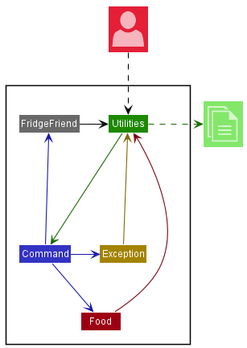
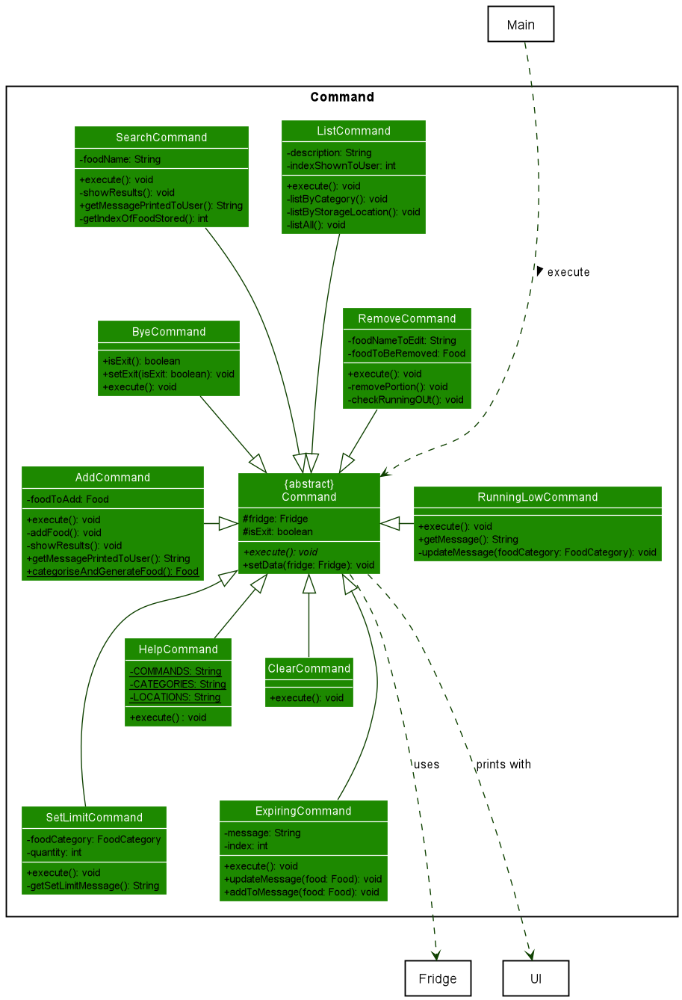
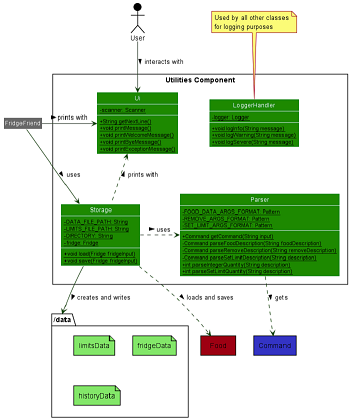

# Developer Guide

## Introduction

`FridgeFriend` is an app for managing food in the fridge, optimised for use via a Command Line Interface (CLI).
If you can type fast, `FridgeFriend` can track your cold or frozen groceries faster and easier than any other apps.
It is written in Java, and has more than 3.2kLoC.

### Architecture

The ***Architecture Diagram*** given above explains the high-level design of the App. 
Given below is a quick overview of each component.

The Main driver class for the FridgeFriend app is
named **[`FridgeFriend`](https://github.com/AY2021S2-CS2113-T10-1/tp/blob/master/src/main/java/seedu/fridgefriend/FridgeFriend.java)**.
It is responsible for,
* At app launch: Initializes the components in the correct sequence, and connects them up with each other.
* At shut down: Shuts down the components and invokes cleanup methods where necessary.

The rest of the App consists of four components.

* [**`Utilities`**](#utilities-component): The main component containing the key driver classes in
  FridgeFriend, such as `Parser`, `UI`, and `Storage`.

* [**`Command`**](#command-component): Executes commands based on the input obtained
  and processed from `Parser` in `Utilities`. The list of executable commands can be found in our
  [User Guide](https://ay2021s2-cs2113-t10-1.github.io/tp/UserGuide.html).

* [**`Food`**](#food-component) represents a collection of classes used by the FridgeFriend application.
  Food objects are instantiated by the `Command` Component. Once a `Food` object is created,
  it may be stored to disk using the `Storage` function in `Utilities`.

* [**`Exception`**](#exception-component) represents a collection of classes that represent potential
  exception events that may occur during the usage of `FridgeFriend`. The `Exception` component
  facilitates the return of exceptions to the `UI` class in `Utilities`, which will display
  the error message to the user.

### Command Component

The Command component contains the sub classes of the features that will be executed.

The command Object is executed by the main method in FridgeFriend.
The execution of the command can affect the fridge.
After the execution, the results of the command object is pass to the UI.
The results of the command instruct the Ui to display the message return to the user.

The ***Command Class Diagram*** given above shows how the Command interact with Fridge. 

The Command Component consist of 10 sub class which each command represents a features. 

* **AddCommand**: Add a food object to the fridge when executed.
* **RemoveCommand**: Remove a portion of food quantity from a particular food in the fridge when executed.
* **ListCommand**: List details of food either by a category, storage location or all off it when executed.
* **SearchCommand**: Search for the details of the food. 
* **ExpiringCommand**: Provide the list of item that is expiring in a week when executed. 
* **ClearCommand**: Clear the list of food objects in the fridge object.
* **HelpCommand**: List the instruction on how to use all the commands in FridgeFriend.
* **RunningLowCommand**: Provide the food category that are running low compare to the limit set in the Food Category.
* **SetLimitCommand**: Change the default quantity limit in that particular Food Category.
* **ByeCommand**: Indicate to the main method to exit the program. 

### Utilities Component

The Utilities component contains the main classes that run the main functions of FridgeFriend.

The ***Utilities Class Diagram*** given above shows how the classes in the Utilities component interact with each other and classes from other component.

The Utilities Component consists for 4 classes.

- **`LoggingHandler`**: Logs information during execution to the console.
- **`Parser`**: Breaks down user input into relevant objects.
- **`Storage`**: Reads data from, and writes data to, the local disk.
- **`Ui`**: Handles the input and output of the application.

### Exception Component

The Exception component represents a collection of classes that represent potential
exception events that may occur during the usage of `FridgeFriend`. 

The `Exception` component facilitates the return of exceptions to the `UI` class 
in `Utilities`, which will display the corresponding error message to the user.

The ***Exception Class Diagram*** given above shows the custom `Exceptions`
created for the FridgeFriend project, and stored inside the `Exceptions` component. 

All exceptions extend from the Java default `Exception` class. They only differ with regard
to the throwable error message.

The `Exceptions` component currently consists of ten (10) custom Exceptions, as of v2.0:

- **`EmptyDescriptionException`**: Is thrown when an empty input string is detected by `Parser`, where
  an input is expected.
  - Error Message: `"Sorry my friend, the description cannot be empty."`
- **`FoodNameNotFoundException`**: Is thrown when the input string contains the name of a Food that is 
  not found in the Fridge, where the name of a food existing in the Fridge is expected.
  - Error Message: `"Food specified not found."`
- **`InvalidDateException`**: Is thrown when user input, where a date is expected, does not
  match the `dd-mm-yy` format.
    - Error Message: `"Sorry my friend, the date must be in the form 'dd-mm-yy'."`
- **`InvalidFoodCategoryException`**: Is thrown when user input is not a valid `FoodCategory`, 
  where a valid `FoodCategory` is expected. Users can check `help` or the 
  [User Guide](https://ay2021s2-cs2113-t10-1.github.io/tp/UserGuide.html).
    - Error Message: `"Sorry my friend, FOOD_CATEGORY is not a valid category."`
- **`InvalidIndexException`**: Is thrown when user input does not translate into a valid integer index that represents
  an existing Food in the Fridge, where
  a valid input index that represents Food that exists in the Fridge is expected.
    - Error Message: `"Please enter a valid index to remove food."`
- **`InvalidInputException`**: Is thrown when an unrecognised command is input into FridgeFriend,
  or when the List Command does not recognise the secondary input string.
    - Error Message: `"Sorry my friend, please give a valid input."`
- **`InvalidQuantityException`**: Is thrown when user input is not an integer where an integer is expected for
  `Quantity` related functions, or when excess quantity of food is removed from the Fridge, where the quantity
  of food in the fridge remaining would be negative.
    - Error Message: `"Sorry my friend, the quantity QUANTITY_INPUT must be a number."`
    - Error Message: `"Not enough in fridge to remove!"`
- **`RepetitiveFoodIdentifierException`**: Is thrown when user attempts to add duplicate Food to the Fridge in a 
  different location or with a different expiry date. This is not allowed as of v2.0.
    - Error Message: `"Sorry my friend, you have added this food before but in a different location or have different expiry dates.
      Please specify another foodname."`
- **`StorageLoadingException`**: Is thrown when an error occurred during loading of the saved data.
    - Error Message: `"There was an error loading the data for FridgeFriend!"`
- **`StorageSavingException`**: Is thrown when an error occurred during saving of the current data.
    - Error Message: `"There was an error saving the data for FridgeFriend!"`

## Product scope

### Target user profile

{Describe the target user profile}

### Value proposition

{Describe the value proposition: what problem does it solve?}

## User Stories

|Version| As a ... | I want to ... | So that I can ...|
|--------|----------|---------------|------------------|
|v1.0|new user|see usage instructions|refer to them when I forget how to use the application|
|v2.0|user|find a to-do item by name|locate a to-do without having to go through the entire list|

## Non-Functional Requirements

{Give non-functional requirements}

## Glossary

* *glossary item* - Definition

## Instructions for manual testing

{Give instructions on how to do a manual product testing e.g., how to load sample data to be used for testing}

# Attribution

The format of this User Guide was adapted from [AddressBook Level 3(AB3) Developer Guide](https://github.com/se-edu/addressbook-level3/blob/master/docs/DeveloperGuide.md).