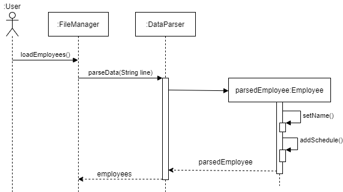
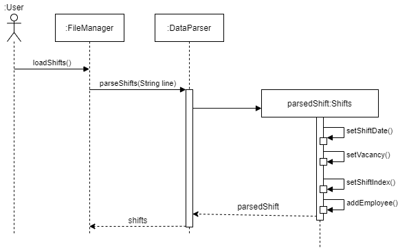

# Developer Guide

## Design

{Describe the design and implementation of the product. Use UML diagrams and short code snippets where applicable.}

## Implementation
This section describes some noteworthy details on how certain features are implemented.

### View One Shift feature
#### Implementation
The current implementation of the View One Shift feature is to call the `App Controller` from `Duke`, and when the user requests to View One Shift, they input "view one shift" as a command.
The `App Controller` then calls the method from its class.

Within the `View One Shift` method, the user is prompted to provide details regarding the date and shift index they are looking for.
The `App Controller` will then call some methods in Shift to verify the shift exists, and returns the employees scheduled if any.

Given below is an example usage scenario and how this method works at each step.
This assumes that the data has already been loaded (`date: `11/04/2021, `shiftIndex:` 1, `vacancy:` 2, `employees` : [Adam, Eve])

|Step Number| System Output| User Input | Remarks|
|-------------|--------------|------------------|------------------|
|1|Enter Command: | view one shift | user can type in `help` for a list of commands|
|2|Enter Shift date (in dd/MM/YYYY):|11/04/2021|date format is specified|
|3|Enter Shift index | 1 | Shift index is from 1-6, each index representing a 4 hr block|
|4|The people assigned to the shift are: [Adam,Eve]|-|Empty array will be returned if no employee is assigned for the shift|

Step 1: The user launches the program, with the data already loaded. The application then prompts the user for their command.

Step 2: The user inputs a date, and the date is processed by a DateTimeFormatter to ensure that it is in the correct format. 
This date will be added into the shift ArrayList. 

Step 3: The user inputs a shift index, which represents which shift the user is looking for. For instance, index 1 refers to 
0000-0400 in the morning, which will be relevant to 24hr fast food chains such as McDonalds!

Given below is what will be shown if wrong/invalid inputs are given

|Step Number| System Output| Wrong User Input | System Output|
|-------------|--------------|------------------|------------------|
|1|Enter Command: | view one Shift | invalid command|
|2|Enter Shift date (in dd/MM/YYYY):|12/05/2021|Date chosen has no shifts|
|3|Enter Shift index | 1 | Shift index selected is not available|

Given below is a sequence diagram of the View One Shift feature

### add schedule to employee feature
#### Implementation

The add schedule feature uses of the `Employee` class in the `employee` package to store the schedules of each employee. 

The class diagram for the `Employee` class is as follows:

Each `Employee` object has an employee name, and an arrayList of schedules, together with the functionality to set/get the employee name, get all of the employee's schedules, add or drop a schedule from the employee object.

The arraylist of schedules contains all of the employee's schedules. Each schedule is a String which follows certain constraints as described below:

A schedule must be in the format: dd/mm/yyyy

dd must be an integer between 1-31 for odd months, 1-30 for even months, 1-28 for Feb

mm must be an integer between 1-12

yyyy must be an integer between 2021-2099

The validation for a schedule is done internally in the `Employee` Class through a method called `isScheduleValid`, which is used in the `addSchedule` method in the `employee` class. Only when `isScheduleValid` returns true, the `addSchedule` method will add the schedule to the employee.

The logic for allowing the user to add a new schedule is in the `EmployeeController` class in the `employee` package and the `Employee` class in the `employee` package. The sequence diagram for the interaction is shown below:

When the user enters “add schedule” in `AppController`, `AppController` calls the `addSchedule` method in `EmployeeController`. 

In the `addSchedule` method in `EmployeeController`, the user is first asked to enter the employee’s name that the user wants to add a schedule to. 

The method will then check if there is a matching employee from the arraylist of employees in the system (from the `employees` variable in `AppController`). 

If no employee with the queried name is found, the method terminates with a feedback to the user. 

If there is a matching employee, the system proceeds to ask the user to enter a schedule to be added for the employee. 

After the user enters a schedule, control is passed to the `Employee` object, where the schedule is added to the employee if the schedule is verified to be valid. 

Control is then passed back to the `addSchedule` method in `EmployeeController`, with feedback from the `Employee` object on whether the schedule is valid or not. 

`addSchedule` in `EmployeeController` will provide feedback to the user on if the schedule is added successfully, and end the method call by passing control back to the `run` method in `AppController`.

### Assign Employee feature
#### Implementation

The proposed Assign Employee feature is facilitated by the `Shift` object in the `shift` package,
where it stores the employees on the shift, its shift date, shift index, and vacancy. It also uses `listAllEmployees` 
method from `EmployeeController` class, which helps user to view the employees that they can assign to the shift.
This method, like its name suggests, assigns an employee who has an available schedule to a shift that has vacancies.
In version 2.0 and 2.1, exceptions and error-handling are added to ensure bugs are fixed and no longer occur.

Given below is an example usage scenario and how the Assign Employee method behaves at each step.

Step 1: The user launches the application and the `Employee` and `Shift` objects are initialised with the saved data.
For this example, we will use the `Employee` object to store all employees and their schedules, where 
`employees: `[Adam, Eve], and `shifts` which is an ArrayList of `Shift` objects. As for `Eve`, the object will be 
initialised such that `Eve` will be available for schedule on `04/04/2021`.  The example will use a `Shift` object 
with attributes `employees: `[Adam], an ArrayList of employees assigned to this shift, meaning `Adam` is 
assigned to this shift, `shiftDate: `04/04/2021, `shiftIndex: `3, meaning that the shift period is 0800 to 1200, 
and `vacancy: `1, meaning that there is 1 vacancy left in this shift.

Step 2: The system calls `App Controller` and prompts "Enter Command: ".

Step 3: The user enters `assign employee`. This command will call `assignEmployee()` in `App Controller`, which then 
calls the `viewAllShifts()` method that will display all the shifts, and their vacancies. `shifts.isEmpty()` is then run
to check whether there is any shift in the database, in which no shift means no employee will be assigned, and the 
method ends here prematurely. Else, the method continues to Step 4.

Step 4: The system outputs "Enter Shift date (in dd/MM/yyyy): " as `getShiftDate()` is called.
The user inputs "04/04/2021" and `getShiftDate()` method returns a temporary `LocalDate` object. This will be stored as
`shiftDate`, following which the system will output "Enter Shift index:" as `getShiftIndex()` is called.

Step 5: The user inputs "3" and `getShiftIndex()` returns an integer which will be stored as `shiftIndex`, and 
the system proceeds to verify that the `Shift` object with this particular `shiftDate` and `shiftIndex` exists when 
`getShift()` returns a non-null value.

Step 6: The system assigns `shift` to a temporary `Shift` object via the `getShift()` method. `EmployeeController` then 
calls the `listAllEmployees()` method that displays all the employees in the database that the user can assign to shift.

Step 7: The system outputs "Enter Employee name to assign: ". The user inputs "Eve", and the `getEmployee` method is 
called, which returns an `Employee` object that is stored under `employee`. 

Step 8: If `employee` is a null object, the system outputs "No employee in database. Please add an employee with a 
schedule first." and ends here. Else, `employeeAvailable()` is called to check whether `Eve` is available to work 
according to the schedule, which will output "Employee Eve is available to work!". If not, the system outputs 
"Employee Eve is unavailable to work!", followed by "Employee Eve is not assigned to this shift. Please assign another 
employee.", where the method ends here prematurely.

Step 9: Continuing from the fact that `Eve` is stored under `employee`, and `employeeAvailable()` yields `true`,
the system then checks if `Eve` is already assigned to this shift by calling `shift.getEmployees().contains()`. Since
`Eve` has not been assigned to this shift yet, the system assigns `Eve` to this shift, where `vacancy` for this shift 
becomes 0 and `Eve` is added to the ArrayList of `employees` stored in this `Shift` object.

Step 10: The system then outputs "Employee Eve is successfully assigned to this shift.", where the method ends with 
a success case.

Given below is a sequence diagram of the Assign Employee feature.
 

### Saving of Data
#### Implementation
The ArrayList of Employee objects is first formatted by adding the '#' symbol as a delimiter between the objects and their attributes.
 For example, `cactus#23/03/2021`, which saves the employee name `cactus` and the employee schedule `23/03/2021`.
 This allows data of objects to be easily written into text files and then loaded.
 The ArrayList of Shift objects is saved using the same method.
 For example, `28/03/2021#5#1#cactus#mario`, which saves a shift on `28/03/2021`, with a vacancy of `5`, and shift index of `1`.
The employees on that shift are`cactus` and `mario`.

Employee and shift details are saved on separate text files "employees.text" and "shifts.text".
A FileWriter is used to write formatted data from the Employee and Shift classes, with "#" as the delimiter.
 The text files are overwritten with the most recent data whenever the user exits the program by inputting the command `quit`.

### Loading of Data
#### Implementation
The FileManager Object is first initialized at the start of the program, and loads both
the "employees.txt" and "shifts.txt" files.
 The FileManager then parses the data from the text files into the Data Parser object.
 The Data Parser then initializes the employee and shift objects, returning an ArrayList of Employees
and ArrayList of Shifts into the program.
  The Sequence Diagram for both `loadEmployees()` and `loadShifts()` is as shown below:
 

## Product scope
### Target user profile

This application is for fast-food restaurant managers who have difficulty in scheduling different employees to the different shift that they have. 

### Value proposition

{Describe the value proposition: what problem does it solve?}

## User Stories

|Version| As a ... | I want to ... | So that I can ...|
|--------|----------|---------------|------------------|
|v1.0|user|view each of my employee’s available schedules|schedule when to put my employee for work.|
|v1.0|user|add new employee’s schedules|keep track of changes in the overall record when a single new schedule needs to be added.|
|v1.0|user|drop any employee’s schedules|manage changes in the employee’s schedule.|
|v1.0|user|add an employee to a particular shift|schedule an available employee to work on that shift.|
|v1.0|user|drop an employee from a particular shift|find a replacement if an employee can no longer make it from that shift.|
|v1.0|user|view all employees working on a particular shift|keep track of the employees working on that shift.|
|v1.0|user|print the status of all the shifts in a week|easily get an overview of the current week and slot in employees that are available for empty shifts.|
|v2.0|new user|see usage instructions|refer to them when I forget how to use the application.|
|v2.0|user|view list of all employees|refer to them while I assign them to shift.|

## Non-Functional Requirements

{Give non-functional requirements}

## Glossary

* *glossary item* - Definition

## Instructions for manual testing

{Give instructions on how to do a manual product testing e.g., how to load sample data to be used for testing}
