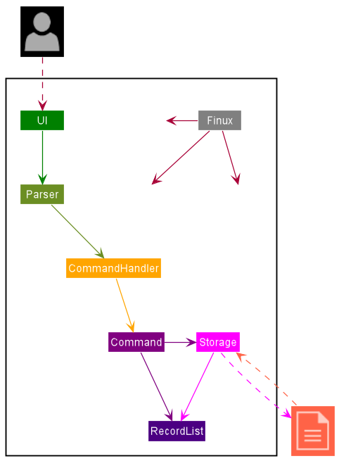
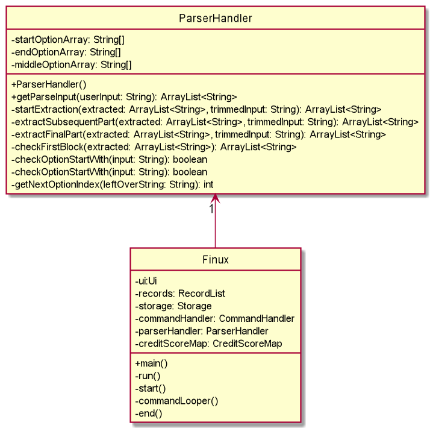

# Developer Guide

# *FINUX*

## Table of Content

---

1. [Introduction](#1-introduction)\
   1.1 [Purpose](#11-purpose)\
   1.2 [Using this Guide](#12-using-this-guide)
2. [Setting Up](#2-setting-up)\
   2.1 [Setting up the project in your computer](#21-setting-up-the-project-in-your-computer)\
   2.2 [Before writing code](#22-before-writing-code)
3. [Design](#3-design)\
   3.1 [Architecture](#31-architecture)\
   3.2 [UI Component](#32-ui-component)\
   3.3 [Parser Component](#33-parser-component)\
   3.4 [CommandHandler Component](#34-commandhandler-component)\
   3.5 [RecordList Component](#35-recordlist-component)\
   3.6 [Storage Component](#36-storage-component)
4. [Implementation](#4-implementation)\
   4.1 [Add Feature](#41-add-feature)\
   4.2 [List Feature](#42-list-feature)\
   4.3 [View Feature](#43-view-feature)\
   4.4 [Return Feature](#44-return-feature)\
   4.5 [Remove Feature](#45-remove-feature)\
   4.6 [Storage Feature](#46-storage-feature)\
   4.7 [Credit Score Feature](#47-credit-score-feature)
5. [Documentation, Logging, Testing, and DevOps](#5-documentation-logging-testing-and-devops)\

[Appendix A: Product Scope](#appendix-a-product-scope)\
\
[Appendix B: User Stories](#appendix-b-user-stories)\
\
[Appendix C: Non-Functional Requirements](#appendix-c-non-functional-requirements)\
\
[Appendix D: Instructions For Manual Testing](#appendix-d-instructions-for-manual-testing)

## 1. Introduction

---

**Greetings from Finux!**

**Finux** is a CLI Style application that allows the user to make better financial
decisions based on the information recorded in the application. If you’re familiar
with the CLI command interface, you will enjoy the benefit of speeding up your
finance management rather than using the traditional management system.

**Finux** is written in Java 11 and uses the Object-Oriented Programming (OOP) paradigm.
OOP enables us to produce organized and reusable codes, allowing efficient improvements
and revisions in the future.

### 1.1 Purpose

This guide is for new and current developers of **Finux**. It describes the overall architecture
design of **Finux** and describes the current implementation details of our main features
with the thought process behind each of them. The current edition of this guide is meant for
the `v2.1` release.

### 1.2 Using this Guide

Throughout the guide, you might encounter several icons, refer to the following consolidate
list of icons:

> 💡 It indicates that this is an important piece of information.\
> ❗  It indicates that this is a warning and you should be aware of it while developing.\
> 📝 It indicates that this is a tip and you may find it useful when using our application or guide.

> 📝 Text that are blue like this [example(jumps to 1.2)](#12-using-this-guide), are clickable links
> that will move you to the relevant section of the guide.

## 2. Setting Up

---

### 2.1 Setting up the project in your computer

### 2.2 Before writing code

## 3. Design

---

### 3.1 Architecture

Note: Not final implementation yet, need refactor Parser and CommandHandler into
CommandLogic.

{Describe the design and implementation of the product. Use UML diagrams and short code snippets where applicable.}

### 3.2 UI Component
...

### 3.3 Parser Component

*Figure X: ParserHandler Class Diagram*

#### Description
The Parser component consist of 1 class called `ParserHandler`.
The role of `ParserHandler` can be interpreted as a "manager" or "middle man" to parse
the user input from the console into an `ArrayList<String>` format.

#### Design
In the main program, `ParserHandler` is instantiated through the constructor `new ParserHandler()`,
finalizing the startOptionArray, endOptionArray, and middleOptionArray. Whenever the program needs
to parse a user input, the ParserHandler calls the method `getParseInput` and returns an `ArrayList<String>`.

1. `getParseInput` will trim the leading white space before calling `startExtraction`.
2. `startExtraction` will check if the trimmed input starts with option. If yes, extract the option and 
   remove the option from the trimmed input before calling `extractSubsequencePart`.
3. `extractSubsequencePart` will check for the next option index and extract whatever is in between the start of the 
   trimmed input to the start of the next option index. This is the argument tagged after the option. 
   * Any leading or trailing white space of the argument field will be removed.
   * If no argument is provided, the argument would be stored an empty string.

   Afterward, the checking mechanism will loop until no valid next options are left in the input before calling
   `extractFinalPart`.
   * Valid next option format: `' <option> '` with 1 leading and trailing whitespace. e.g. `' -e '`
4. `extractFinalPart` will check if the last trimmed input ends with option. If yes, extract the option and 
   add an empty string as the argument, else just add the last trimmed input to the ArrayList. 
5. Finally, after the extraction to ArrayList<String> is complete, `extractFinalPart` will 
   call `checkFirstBlock` for the final check to parse any `help` or `creditscore` in the first argument block.
   
#### Parser Component Design Consideration
1. Leading and trailing whitespace should be considered carefully especially with options involve.
   * Input starting with valid option should consider the possibility of multiple leading whitespaces, 
   thus `stripLeading()` should be applied.
   * Input ending with valid option should also be considered with possibility of multiple trailing whitespaces,
   thus `stripTrailing()` should be applied as well.
2. Checking of options in the start, end, and during the processing should be considered carefully with accordance 
   to consideration 1.
   * Starting option should be in the form of `'<option> '` with no leading whitespace and 1 trailing whitespace. 
     e.g. `'-e '`
   * Ending option should be in the form of `' <option>'` with 1 leading whitespace and no trailing whitespace.
     e.g. `' -e'`
   * During processing, next option should be in the form of `' <option> '` with 1 leading and trailing whitespace.
     e.g. `' -e '`
3. As rearrangement of options is allowed, option detection should cater to non-fixed option order. 
   Apache Commons Lang, 3.11, providing the StringUtils class is used to cater to consideration 2.
   * StringUtils.startsWithAny() - detection of start option with non-fixed order.
   * StringUtils.endsWithAny()   - detection of end option with non-fixed order.
   * StringUtils.indexOfAny()    - detection of during processing option with non-fixed order.
4. As multiple whitespaces is allowed, options and arguments should be fully trimmed (leading and trailing).
5. getParseInput should always return a new ArrayList<String> per new input.

### 3.4 CommandHandler Component
...

### 3.5 RecordList Component
...

### 3.6 Storage Component

#### Description
The Storage component consists of only 1 class called `Storage`. The role of the `Storage` is to translate all
`records` from the `RecordList` into a text format in a text output file and vice versa.

#### Design
In the application, `Storage` is instantiated in classes that requires the use of the save or load function, this
is done through the constructor `new Storage()`. Whenever a new `record` gets added, removed, or marked as returned, the
`saveRecordListData` method will be called and all `record` up to that point will be converted into a text output
and saved into the `finux.txt` file. The `loadFile` method will do the exact opposite, and load the data from the
`finux.txt` file back into the FINUX application.

1. `saveRecordListData` is the method that is called after any `records` are added, deleted, or marked as returned. It 
   will then call the `writeToSaveFile` method.

2. `writeToSaveFile` will add the currently addressed `recordList` and all its stored `records` into the `finux.txt` file 
   after calling the `convertFileFormat` method from the Record class. The `writeToSaveFile` method will also output each 
   individual records in separate lines.
   
3. `loadFile` method does the opposite of the `writeToSaveFile` method. In the `loadFile` method, a new ArrayList of
   `record` is instantiated. It will then call the `saveFileExist` method. If the method returns false, `initSaveFile`
   method will be called and a new `finux.txt` will be created in the same directory of the FINUX application. The
   `loadFile` method will then return a new and empty ArrayList of `record` back to the `start` method in the `Duke` 
   class. Should the `saveFileExist` returns true, for each line of text in the `finux.txt` file will be parsed into
   the `parseRecord` method which will call the individual load methods `loadExpense`, `loadLoan`, `loadSaving` based on
   a REGEX expression of the text data. Should the pattern be unrecognisable, or the file is unable to be read, an 
   exception will be thrown to the `start` method and FINUX will terminate. If all the text data is properly loaded, 
   the `loadFile` method will return the ArrayList of `record` to the `RecordList` object in the `start` method.

4. `parseRecord` method will compare the pattern of the text in the `finux.txt` and call the respective methods 
   `loadExpense`, `loadLoan`, `loadSaving` based on the pattern that matches the `Expense`, `Loan`, or `Saving` in the
   saved file. This method will throw an exception back to the `loadFile` method if any of the REGEX pattern does not 
   match.
   

## 4. Implementation

---

Some Class diagrams, etc...
Some sequence diagrams, etc...

### 4.1 Add Feature
...

### 4.2 List Feature
...

### 4.3 View Feature
...

### 4.4 Return Feature
...

### 4.5 Remove Feature
...

### 4.6 Storage Feature
...

### 4.7 Credit Score Feature
...

## 5. Documentation, Logging, Testing, and DevOps

---

...

## Appendix A: Product Scope

---

### A.1 Target User Profile

* prefers typing in CLI instead of GUI interactions
* ...

### A.2 Value proposition

{Describe the value proposition: what problem does it solve?}

## Appendix B: User Stories

---

|Version| As a ... | I want to ... | So that I can ...|
|--------|----------|---------------|------------------|
|v1.0|user|be able to add a record (expense) with dates|record each expense into the app.|
|v1.0|clumsy user|be able to delete wrong inputs|easily rectify errors in the record list.|
|v1.0|debt collector (Student)|list down a list of people who owes me money with a deadline|make sure that they return their money.|
|v1.0|student|list each and every incurred expense|better manage my daily/weekly expenses.|
|v1.0|SOC student|have a CLI style money management system|accomplish tasks faster typing on a CLI compared to clicking on a GUI.|
|v1.0|user|be able to view the total expenditure, saving and loan credit|know the total amount of each category for planning and viewing.|
|v1.0|debt collector (Student)|mark a loan as returned|know which loans are returned to me.|
|v1.0|new user|know the list of commands|use the app correctly.|
|v2.0|new user|know what function I can use|tell what are the valid inputs for the application.|
|v2.0|lender|know the loanee's punctuality on returning the loan|gauge who to continue lending money the next time.|
|v2.0|student|know how trustworthy a person is according to a score indicator|decide how risk-free it is to lend money to the said person.|

## Appendix C: Non-Functional Requirements

---

1. The application should be responsive.
1. The application should work on most operating systems (OS) such as Windows and Linux with `Java 11` installed.
1. Users who can type fast should be able to complete equivalent tasks faster as compared to using a mouse.
1. Users should be able to use the application with ease with the help of the User Guide (UG) and the Developer's Guide (DG).

## Appendix D: Instructions for manual testing

---

{Give instructions on how to do a manual product testing e.g., how to load sample data to be used for testing}

## Glossary

---

* *glossary item* - Definition
