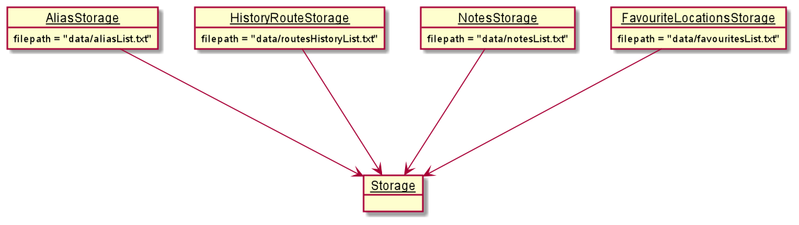

# Developer Guide

## Design & implementation

{Describe the design and implementation of the product. Use UML diagrams and short code snippets where applicable.}

###[Proposed] Save feature for visited routes & favourite locations
####Proposed Implementation
The proposed save mechanism is facilitated by `NotesStorage`,`RoutesStorage` and `FavouriteLocationsStorage` subclasses.  
They extend `Storage` (superclass) with a feature to save the tagged notes, history of visited routes and favourite locations, stored internally as a `notesList` `routesHistoryList` and `favouritesList`.  
Additionally, they implement the following operations:

`NotesStorage#save()` — Saves all notes tagged to a location in its history.  
`NotesStorage#load()` — Restores all notes tagged to a location from its history.  
`RoutesStorage#save()` — Saves the current list of the 10 most recently visited routes in its history.  
`RoutesStorage#load()` — Restores the previous list of the 10 most recently visited routes from its history.  
`FavouriteLocationsStorage#save()` — Saves the current list of all the locations that the users are interested in keeping in its history.  
`FavouriteLocationsStorage#load()` — Restores the previous list of the all the locations that the users are interested in keeping from its history.  

These operations are exposed in the `Storage` class  as `Storage#save()` and `Storage#load()`.  
Given below is an example usage scenario and how the save mechanism behaves at each step.  
Step 1. The user launches the application for the first time. `NotesStorage`, `RoutesStorage` and `FavouriteLocationsStorage` will be initialized by calling `NotesStorage#load()`, `RoutesStorage#load()`, `FavouriteLocationsStorage#load()` with the initial state of the application.   This is done only once for each time the application is launched.  
 
 
Step 2. The user executes `go` command to show the route from starting location to final location.   The `go` command calls `RoutesStorage#save()`, causing the modified state of the `routesHistoryList` in the application after the `go` command executes to be saved in the `routesHistoryList.txt`.  
Step 3. The user executes `add note E4/...` to tag a note to that location.   The `add note` command calls `NotesStorage#save()`, causing  the modified state of the `notesList` to be saved into the `notesList.txt`.  
Step 4. The user executes `delete note E4/1` to remove a note with the given note index from that location, assuming that it exists.   The `delete note` command also calls `NotesStorage#save()`, causing  the modified state of the `notesList` to be saved into the `notesList.txt`.  
Step 5. The user executes `like E4` command to add a location to favourites.   The `like` command calls `FavouriteLocationsStorage#save()`, causing the modified state of the `favouritesList` to be saved into the `favouritesList.txt`.  
Step 6. For all other commands, they do not modify the state of any of the lists `notesList` `routesHistoryList` and `favouritesList`. These other commands do not call `NotesStorage#save()`, `NotesStorage#load()`, `RoutesStorage#save()`, `RoutesStorage#load()`, `FavouriteLocationsStorage#save()` or `FavouriteLocationsStorage#load()`. Thus, the `notesList.txt` `routesHistoryList.txt` and `favouritesList.txt` remains unchanged.  
#### Design Consideration
Alternative 1 (current choice): Saves the entire list of notes tagged, routing history and favourite locations.  
Pros: Easy to implement.  
Cons: Only highly effective when limited to use of one user.  

### Target user profile

{Describe the target user profile}

### Value proposition

{Describe the value proposition: what problem does it solve?}

## User Stories

|Version| As a ... | I want to ... | So that I can ...|
|--------|----------|---------------|------------------|
|v1.0|new user|see usage instructions|refer to them when I forget how to use the application|
|v2.0|user|find a to-do item by name|locate a to-do without having to go through the entire list|

## Non-Functional Requirements

{Give non-functional requirements}

## Glossary

* *glossary item* - Definition

## Instructions for manual testing

{Give instructions on how to do a manual product testing e.g., how to load sample data to be used for testing}
