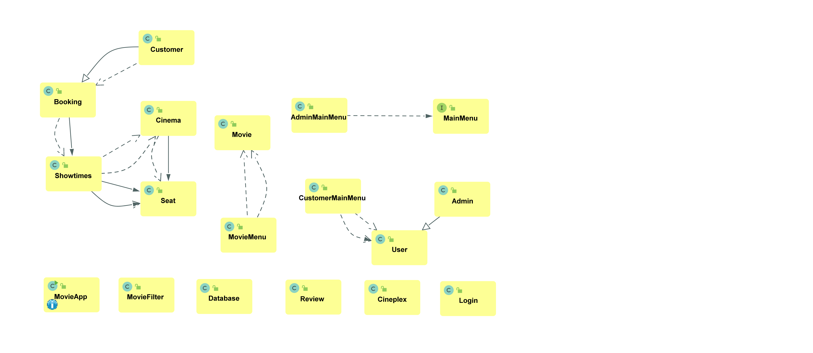
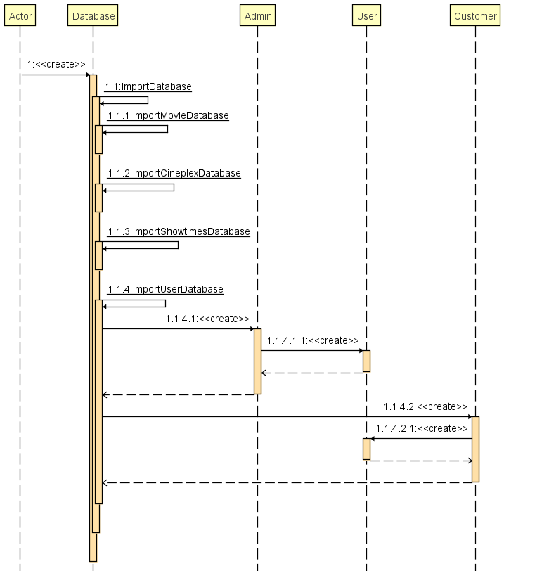
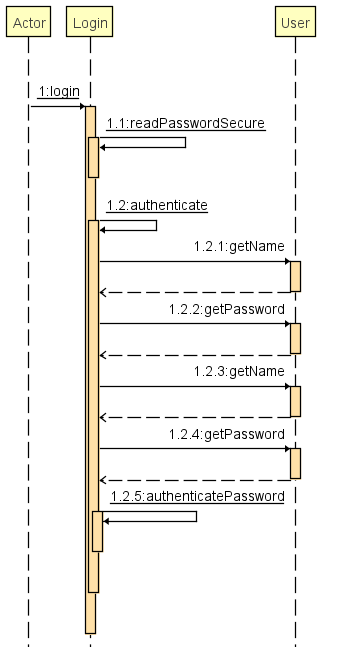
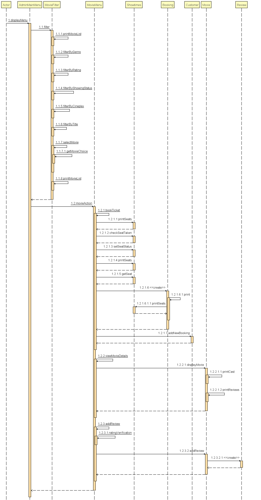
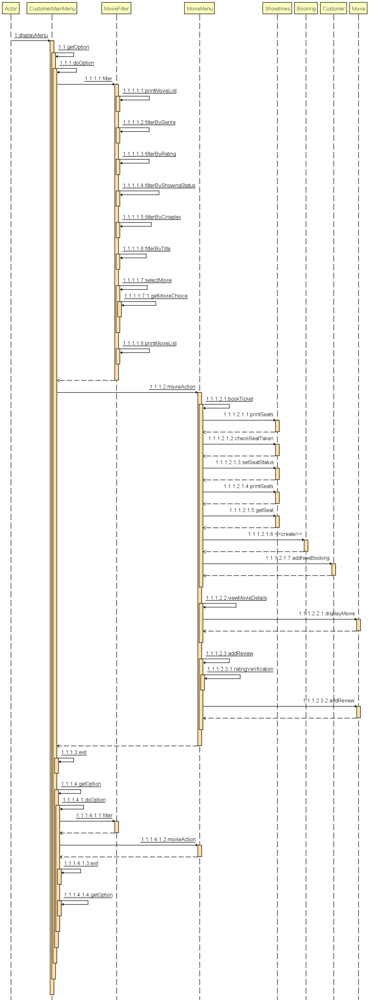

# Developer Guide

## Design & implementation

### Class Diagram

### Sequence Diagrams
1. Database Sequence Diagram
    
 
2. Login Sequence Diagram
   
   
 
3. Admin Main Menu Sequence Diagram
   

4. Customer Main Menu Sequence Diagram
   

Our team is going to use breadth-first iterative approach as it allows us to focus on all features in parallel throughout the version 1.0, 2.0 and 2.1.

## Product scope
### Target user profile

This app is for movie lovers who want to know movie details, make online booking, and are in need of a user-friendly interface.

### Value proposition

The app is a single-user application that can computerize the processes of making online booking and purchase of movie tickets, and listing of movie details and reviews.
The app will help customers to make a movie schedule ahead of time, and enable a fast and intuitive ticket purchasing procedure.
The app will help cinema administrators to update the movie information regularly through an intuitive interface.

## User Stories

|Version| As a ... | I want to ... | So that I can ...|
|--------|----------|---------------|------------------|
|v1.0|new customer|follow through with the steps provided|make a booking.|
|v1.0|indecisive customer|display summaries of several movies|decide which I want to book for.|
|v1.0|customer|I can have a “quit” command|close the application easily.|
|v1.0|customer|load the application without any errors|use the other functions.|
|v1.0|customer|see the location of the cinemas of the particular movie|go to the nearest cinema.|
|v1.0|customer|see the list of the movie and timing|make plans ahead.|
|v1.0|customer|book as many seats as it can hold|help my friends book too.|
|v1.0|customer|book as many movies available|make plans ahead without being restricted.|
|v2.0|customer|cancel any of my bookings|don't waste my money for being unable to attend.|
|v2.0|admin|add new movies|make the application is continuously updated.|
|v2.0|admin|edit new movies|make the application is continuously updated.|
|v2.0|admin|delete new movies|make the application is continuously updated.|
|v2.0|customer|filter movies by their rating.|make my decision to either watch them or not.|
|v2.0|customer|add a few reviews of the movies|convey my opinions about the movie to other watchers.|
|v2.0|customer|view the reviews of the movies|make my decision to either watch them or not.|
|v2.0|customer|filter the movies by type, director, actors...|quickly find the movie I like.|

## Non-Functional Requirements

1. Usability Requirements
    1. All text in the system must be consistently written in English.
    2. The wording used in system text must be intuitive for user to understand easily.   
    3. The layout of the application must be consistent throughout all the pages.
    4. The system will provide a list of options for the user to choose.
2. Performance Requirements
    1. Database must be regularly updated according to user inputs.
    2. Exceptions must be performed in cases of undesirable incidents.
3. Security Requirements
    1. All passwords must be hashed before it is stored.

## Implementation
This section describes some noteworthy details on how certain features are implemented.

### On startup
Upon launching the application, the application will first initialize an empty Database object. The constructor will
call importDatabase for movies, cineplex and showtimes, to read in all saved objects into an ArrayList.

### Login feature

### Delete/ Edit movie feature
This feature is implemented by methods from the ui component, and database component.

For Delete movie, the ui uses displayDeleteMovieMenu(ArrayList<Movie> movieDatabase) to print out a list of movies,
and prompts the user to enter the index they would like to delete. The database then uses
deleteMovie(int choice) to delete that movie. It updates the database by wiping it clean and write remaining objects
to the .txt file.

Like wise for Edit movie, except the ui uses displayEditMovieMenu(ArrayList<Movie> movieDatabase) and 
displayEditMovieSectionMenu(ArrayList<Movie> movieDatabase), and the database uses editMovie(int choice, int type).

## Glossary

| Word | Definition |
|------|------------|
|Admin|Authorized users of the movie application that have the ability to modify the movie details|
|Customer|Regular users of the movie application that have the ability to view, review, and buy tickets to available movies|
|Movie|Details on a movie, including name, dates, casts, etc.|
|Cineplex|Movie theatre where customers may create bookings|
|Cinema|Individual room of the cineplex where customers sit and watch the movies at|
|Seat|Individual space inside the cinema where each customer sits at|
|Review|Comments and ratings of each movie|
|Showtimes|Individual entity of a particular movie, showing at a particular time|
|Booking|Individual appointment where one seat of one showtime is assigned to one user|
|Database|Offline text files that store information on cineplex, movie, showtime, and customer entities|

## Instructions for manual testing

To run the JAR file, run java -cp tp_original_v2.jar movieApp.app.MovieApp
