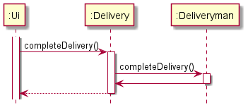

# Developer Guide

## Design & implementation

{Describe the design and implementation of the product. Use UML diagrams and short code snippets where applicable.}
### [Implementation] : Feature [1]

### [Implementation] : Recording Completed Deliveries

Most deliverymen would want an overall outlook of completed deliveries, so that they would
be able to see and judge exactly how much they have earned over the course of their delivery spree.

The primary class involved in executing this function is `Deliveryman`.

Whenever a `Delivery` is marked as completed, the `Ui` class will call
the `completeDelivery()` method which accepts a delivery number (the index of the
delivery), and a Deliveryman object.

The `completeDelivery()` in Delivery then subsequently calls another `completeDelivery` method, a
instance method of the `Deliveryman` class. This method will add the completed delivery to a
list of completed deliveries (`records`) attributed to the deliveryman.

When the `record` command is given, the `showRecords()` method is called which accepts the
`Deliveryman` object. This method will simply print a formatted list of all the items in `records`

This sequence of program flow was chosen because it would still allow for the proper abstraction of the classes.
In this particular case, the `Ui` class is only handling the User Interface aspect of code execution. Similarly,
the `Delivery` class is not especially involved in the `Deliveryman`'s `records`. The code directly changing the deliveryman's
`records` is present only in the `Deliveryman` class.

The general interaction between the abovementioned classes are briefly illustrated in the sequence diagram
shown below. Note the two different completeDelivery() methods that are called here. Despite having
similar names, their impacts are felt by different classes and maintains the abstraction between classes

## Product scope
### Target user profile

Our target audience are deliverymen that are familiar with using an application with a command
line interface. Deliverymen will use Diliveri to quickly and efficiently track and complete
their deliveries

### Value proposition

Deliverymen are oftentimes unable to accurately track their deliveries - and more often than
not like a reliable platform to easily consolidate their deliveries. Diliveri enables deliverymen to
load their delivery assignments into the application, allowing increased flexibility and
ease of use for deliverymen around the world

## User Stories

|Version| As a ... | I want to ... | So that I can ...|
|--------|----------|---------------|------------------|
|v1.0|new user|see usage instructions|refer to them when I forget how to use the application|
|v1.0|user|load up my assigned list of deliveries|see what deliveries I need to complete|

## Non-Functional Requirements

{Give non-functional requirements}

## Glossary

* *glossary item* - Definition

## Instructions for manual testing

{Give instructions on how to do a manual product testing e.g., how to load sample data to be used for testing}
