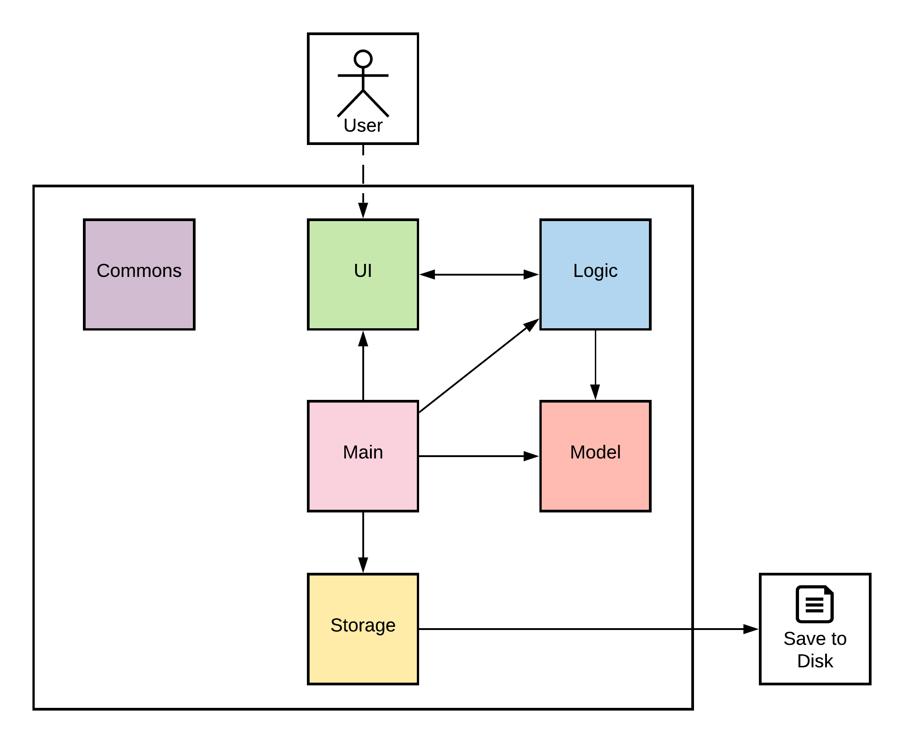
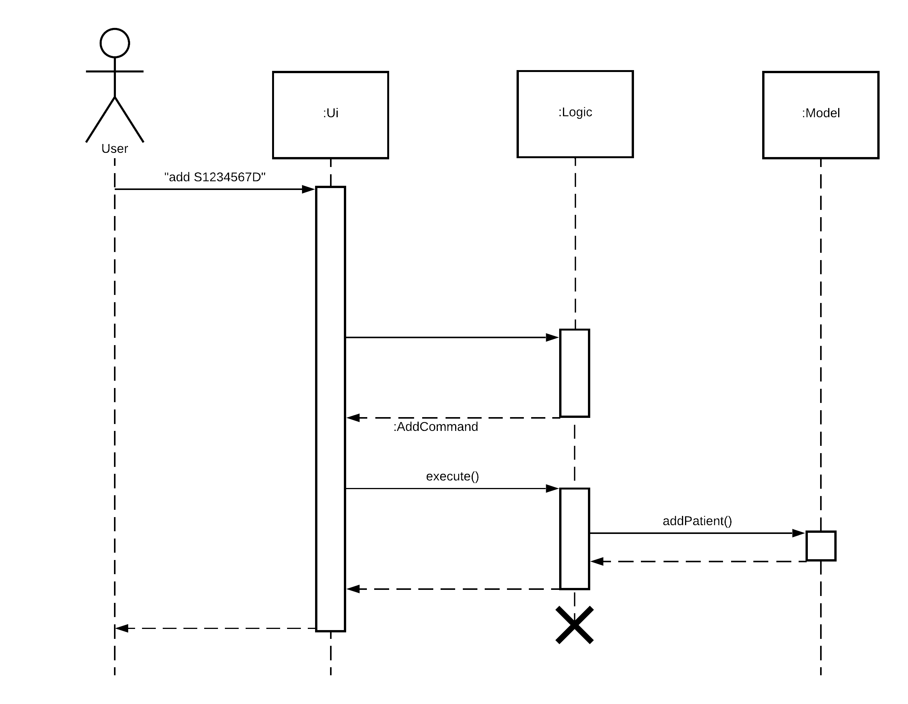
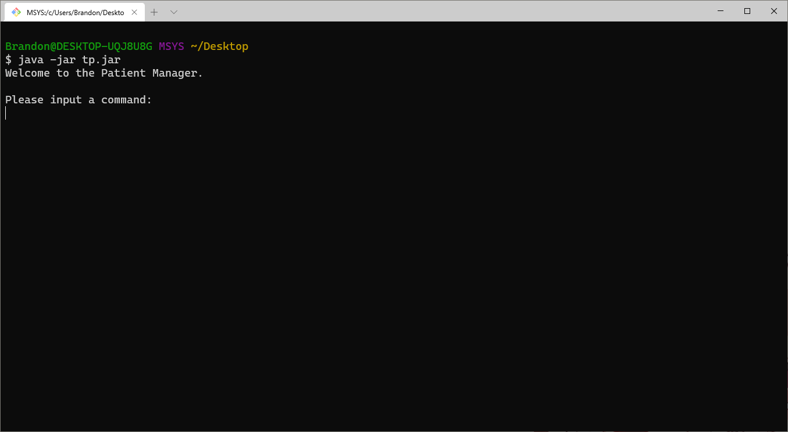

# Patient Manager Developer Guide

## Table of Contents

* [Patient Manager Developer Guide](#patient-manager-developer-guide)
  * [Table of Contents](#table-of-contents)
  * [Introduction](#introduction)
  * [Setting up the project in your computer](#setting-up-the-project-in-your-computer)
  * [Design & implementation](#design--implementation)
    * [Architecture](#architecture)
      * [How the architecture components interact with each other](#how-the-architecture-components-interact-with-each-other)
    * [UI Component](#ui-component)
    * [Parser Component](#parser-component)
    * [Logic Component](#logic-component)
    * [Model Component](#model-component)
    * [Storage Component](#storage-component)
    * [Exception Component](#exception-component)
    * [Commons](#commons)
  * [Appendix A: Product scope](#appendix-a-product-scope)
    * [Target user profile](#target-user-profile)
    * [Value proposition](#value-proposition)
  * [Appendix B: User Stories](#appendix-b-user-stories)
  * [Appendix C: Non-Functional Requirements](#appendix-c-non-functional-requirements)
  * [Appendix D: Glossary](#appendix-d-glossary)
  * [Appendix E: Instructions for Manual Testing](#appendix-e-instructions-for-manual-testing)
    * [Launch, Help and Shutdown](#launch-help-and-shutdown)
    * [Adding and Loading Patients](#adding-and-loading-patients)
    * [Adding and Viewing a Patient's Visit Records](#adding-and-viewing-a-patients-visit-records)
    * [Saving Data](#saving-data)
<!-- ^ The above table of content is auto generated -->
<!-- * [Instructions for manual testing](#instructions-for-manual-testing) -->

## Introduction

Patient Manager is a _Command Line Interface_ (CLI) application for _general practitioners_ (GP)
who work in clinics to manage their patient list. This includes a recording/retrieval of
past record of visit, scheduling of the next appointment, and some other features listed below.
With the Patient Manager, GPs will be able to reduce paperwork and have a more efficient way
to organize the records of their patients.

## Setting up the project in your computer

First, fork this repo, and clone the fork into your computer.

If you plan to use Intellij IDEA (highly recommended):

1. Configure the JDK: Follow the guide 
   [Intellij IDEA: Configuring the JDK @SE-EDU/guides](https://se-education.org/guides/tutorials/intellijJdk.html) \
   IDEA: Configuring the JDK to ensure Intellij is configured 
   to use JDK 11.
1. Import the project as a Gradle project: Follow the guide 
   [Intellij IDEA: Importing a Gradle project @SE-EDU/guides](https://se-education.org/guides/tutorials/intellijImportGradleProject.html) \
   IDEA: Importing a Gradle project to import 
   the project into IDEA.
   > ❗ Note: Importing a Gradle project is slightly different from importing a normal Java project.
1. Verify the setup: Run `seedu.duke.PatientManager` and try a few commands. 
   Run the tests to ensure they all pass.

## Design & implementation

### Architecture


The Architecture Diagram shown above gives a high-level explanation of Patient Manager.
Given below is a brief overview of each component.

The user starts the program from the main class `PatientManager`.

This class is responsible for:
- When the app is launched: Initializing the other components in the correct sequence and connecting them with each other
- When the app exits: Shuts down the components and invokes cleanup methods where necessary

`Commons` contains constants that are shared across the other classes.

`UI` is responsible for reading user input.
It is also responsible for displaying the all messages generated by Patient Manager to the screen.

`Logic` parses and executes commands.

`Model` contains the data of Patient Manager in memory and models the various entities (e.g. patients, medical records).

`Storage` manages writing and reading saved data to and from the hard disk.

#### How the architecture components interact with each other

The Sequence Diagram below shows how the components interact with each other for the scenario where the user issues the command `add S1234567D`.



The sections below give more details for each component.

### UI Component

`Ui.java` enables:

- reading of user input
- printing of string messages, exceptions, a welcome message and a standardized long line

### Parser Component

API: `Parser.java`

The parser is one of the core components in charge of parsing all user input commands into program-understandable commands and
arguments. For the ease of expansion of this program's functionality as well as for its testability, reflection is used to invoke
commands.

First is the initialization of this parser. A `Ui` instance and a `Data` instance is passed and stored. This is important as
these two will be passed to logic components (command classes) later.

Then, we can parse a user-input string by passing it to `parse()`. We use an example of this:
```
record 01/05/2021 /s coughing, fever /p panadol Paracetamol 500mg*20
```

This is broken into a few steps:

1. Initialize an empty hashmap, called `arguments`.
1. Tokenize using **any number of consecutive white spaces**.
1. Taken out the first token as command, i.e. `record`. Push it into the hash map using **key** `command`.
   Create a new empty **list** with default **key** `payload`.
1. Check if next token starts with `/`. No, so we add it to the list: `list = ['payload']`.
1. Check if next token starts with `/`. Yes, so we concatenate all tokens in the list to one string use delimiter ` `
   (empty whitespace). Put it into the hash map using the key `payload`.
   **Reset the list**, and set new key to `s` (the part after this `/`).
1. Repeat same process, we have `list = ['coughing,']`
1. Repeat same process, we have `list = ['coughing,', 'fever']`
1. Same process, `coughing, fever` is pushed into arguments hash map with key `s`. Reset the list, and new key set to `p`.
1. ... 

At the end, we have an argument hashmap like this:
| Key     | Value                        |
| ------- | ---------------------------- |
| command | record                       |
| payload | 01/05/2021                   |
| s       | coughing, fever              |
| p       | panadol Paracetamol 500mg*20 |

Next step is the initialization of a command class. Since we have command `record`, the program finds a class called
`RecordCommand` under the module `seedu.duke.command` (first character being capitalized, then concatenated with 'Command').
Since this is a valid command, this class exists. If the class does not exist, it means the command is not yet
implemented by this program.

After finding the command class, it is initialized with `(ui, data, arguments)`. `ui` and `data` are the two references
passed in when initializing the parser, and the `arguments` is the hash map we just obtained by parsing the input. The result
of the initialization (i.e. the instance of the command class) is returned.

Since all command classes implements the abstract method `execute()`, the main loop just need to execute this method to call out
the actual logic of this command.

> ❗ Note: Since we are tokenizing the user input with **any number of white spaces** and concatenate all tokens belong to the
> same key back using **single whitespace**, the number of white spaces input has no effect on the actual arguments being parsed.
> For example, the following two input has exactly the same result after being parsed.
> ```
> record 01/05/2021 /s coughing, fever
> record 01/05/2021 /s coughing,                 fever
> ```

### Logic Component

### Model Component

API: `Patient.java`, `Record.java` and `Data.java` 

`Record.java` contains:

- all the symptoms recorded by a GP during the consultation
- all the diagnoses made by a GP during the consultation
- all the prescriptions made by a GP during the consultation
- the most recently added symptom/diagnosis/prescription, which corresponds to the most recently executed `record` command

`Patient.java` contains:

- the patient's NRIC/FIN number, which uniquely identifies the patient
- a `TreeMap<LocalDate, Record>` which maps the patient's consultation dates to the visit records for that date

`Data.java`

- stores a `SortedMap<String, Patient>`, which maps the patient's NRIC/FIN number to their corresponding `Patient` instance
- implements methods to add new patients and delete existing patients
- implements methods to load an existing patient's medical records

### Storage Component

`Storage.java`:

- facilitates the saving of application data into a text file
- facilitates the loading of application data from the aforementioned text file
- convert records to string
- converts string to records

### Exception Component

API: all classes in [src/main/java/seedu/exception](src/main/java/seedu/exception)

All unexpected behaviour encountered by Patient Manager is signalled and handled with exceptions. Since the generic
`Exception` is too broad, we have created a few custom exception classes to relay exception information.

`BaseException.java`:

- inherits from the generic `Exception`
- base class of all custom exceptions
- overwrites the `toString()` method to make it output messages more meaningfully

`InvalidInputException.java`

- inherits from `BaseException`
- is used to handle all unexpected user input, like invalid commands, wrong NRIC numbers, etc.
- implies that user should re-enter correct command and arguments
- has a member enumerate (`enum`) `Type` to give a fixed set of exception messages, which can be passed as the argument
  for exception initialization (see example below)

`StorageException.java`

- inherits from `BaseException`
- is used to handle expected events occur during loading and saving data from/onto the hard disk
- shows that usual saving/loading action cannot be done, and there might be the case of a data loss after closing the program

`UnknownException.java`

- inherits from `BaseException`
- is used to handle unusual events that should not be trigger by user
- signals an internal error of the program and should be fixed during next iteration or through hotfixes

During invocation of an exception, there are two ways to invoke:
```java
throw new InvalidInputException(InvalidInputException.Type.EMPTY_STRING);
// e is a Throwable, e.g. a captured exception in a try-catch block
// for this UNKNOWN_COMMAND, the e should be of type ClassNotFoundException
throw new InvalidInputException(InvalidInputException.Type.UNKNOWN_COMMAND, e);
```

If a second argument is passed, it is called the **cause** of the exception. For example, the user's wrong input
triggers **ClassNotFoundException**, and then this exception is captured in `Parser` which then **causes**
`InvalidInputException`. If a **cause** is passed in, it will be printed out for the user as well. See the difference:

```
----------------------------------------------------------------------
Input command and/or arguments are invalid:
        Empty string is found when trying to parse command!
----------------------------------------------------------------------
wrongcommand
----------------------------------------------------------------------
Input command and/or arguments are invalid:
        Invalid command is provided!
... and is caused by ...
        java.lang.ClassNotFoundException: seedu.duke.command.WrongcommandCommand
----------------------------------------------------------------------
```

### Commons

## Appendix A: Product scope

### Target user profile

The target users for this application are _general practitioners_ (GP) who work in clinics.
They are keen to reduce the paperwork that is required of them during consultation sessions, so that they may focus more on the consultation itself.
Also, they would like to have a more efficient way to organize the records of their patients.

### Value proposition

Through Patient Manager, general practitioners are able to manage patients faster than a typical mouse/GUI driven app.
The typical paperwork, such as recording of symptoms, diagnoses and prescriptions, are greatly reduced through digital input.

## Appendix B: User Stories

| Version | As a ...           | I want to ...                          | So that I can ...                                       |
| ------- | ------------------ | -------------------------------------- | ------------------------------------------------------- |
| v1.0    | GP in a polyclinic | add a new patient                      | record a patient                                        |
| v1.0    | GP in a polyclinic | view the list of patients              | track the list of patients                              |
| v1.0    | GP in a polyclinic | select a specific patient's records    | access the patient's records                            |
| v1.0    | GP in a polyclinic | add new record for a patient           | refer to them during future consultations               |
| v1.0    | GP in a polyclinic | retrieve the patient's past records    | refer to them during the current consultation           |
| v1.0    | new User           | view list of available commands        | refer to them if I have any problems                    |
| v2.0    | GP in a polyclinic | delete a patient                       | remove patients are no longer required to be tracked    |
| v2.0    | GP in a polyclinic | delete a patient's records             | remove records that I no longer need                    |
| v2.0    | GP in a polyclinic | know if I entered a invalid Patient ID | make sure no mistake is made recording the patient's ID |
| v2.0    | GP in a polyclinic | load and save existing data            | work on the data on another device                      |

## Appendix C: Non-Functional Requirements

1. Should work on any mainstream OS as long as it has Java 11 or above installed. 
1. Should be able to hold up to 1000 patients without a noticeable sluggishness in performance for typical usage.
1. A user with above average typing speed for regular English text (i.e. not code, not system admin commands) should 
   be able to accomplish most of the tasks faster using commands than using the mouse.
1. The data should be stored locally and should be in a human editable text file.
1. The application should work without requiring an installer.
1. The application should be at most 100 MB in size.
1. The application should not rely on any remote server, or database management system.

<!-- NFRs taken from: https://nus-cs2113-ay2021s2.github.io/website/admin/tp-constraints.html -->

## Appendix D: Glossary

- *Mainstream OS* - Windows, Linux, and OS-X platforms.
- *General Practitioner* - A doctor based in the community who treats patients with minor or chronic illnesses and
  refers those with serious conditions to a hospital. Their duties are not confined to specific organs of the body,
  and they have particular skills in treating people with multiple health issues.
- *Visit Record* - Details taken down by the doctor during one's visit. In this case, Patient Manager can record
  the patient's symptoms, the diagnosis made by the doctor, and any prescriptions or referals given.

## Appendix E: Instructions for Manual Testing

### Launch, Help and Shutdown

1. Initial launch
   1. Download `tp.jar` and copy into an empty folder.
   1. Open a terminal/command line (cmd)/powershell. A Windows 10 OS' screenshot is here:
      
   1. Execute `java -jar tp.jar` to start the Patient Manager.\
      Expected: Shows the welcome message as shown below
      
1. View help
    1. Test case: `help`\
       Expected: Application prints out a help message containing a list of valid commands
       and how to use them.
    1. Test case: `help add`\
       Expected: Application prints out a help message explaining only the `add` command.
1. Exiting
    1. Test case: `exit`\
       Expected: Application prints goodbye message and exits. All data will be saved to
       `./data/TODO_ADD_FILENAME_HERE.txt`
### Adding and Loading Patients

1. Adding a new patient
    1. Test case: `add S1234567D`\
       Expected: Application shows:
       ```
       ----------------------------------------------------------------------
       Patient S1234567D has been added!
       ----------------------------------------------------------------------
       ```
1. Loading a patient's records
    1. Prerequisite: Patients have already been added (in this case, S1234567D has already been added).
    1. Test case: `load S1234567D`\
       Expected: Application loads S1234567D's records and shows:
       ```
       ----------------------------------------------------------------------
       Patient S1234567D's data has been found and loaded.
       ----------------------------------------------------------------------
       ```
### Adding and Viewing a Patient's Visit Records
1. Adding visit records
    1. Prerequisite: Patient's records have already been loaded.
    1. Test case: `record /s coughing, runny nose, fever /d flu /p panadol, cetirizine`\
       Expected: Details added to patient's visit record. Newly-added details shown in status message.
1. Viewing visit records
    1. Prerequisite: Patient's records have already been loaded.
    1. Test case: `retrieve`\
       Expected: Details of all of the patient's past visits shown.

### Saving Data
1. Missing data files
    1. Delete the file `./data/TODO_ADD_FILENAME_HERE.txt`.
    1. Launch the app with `java -jar tp.jar`.
    1. Expected: Application should start up without any data.