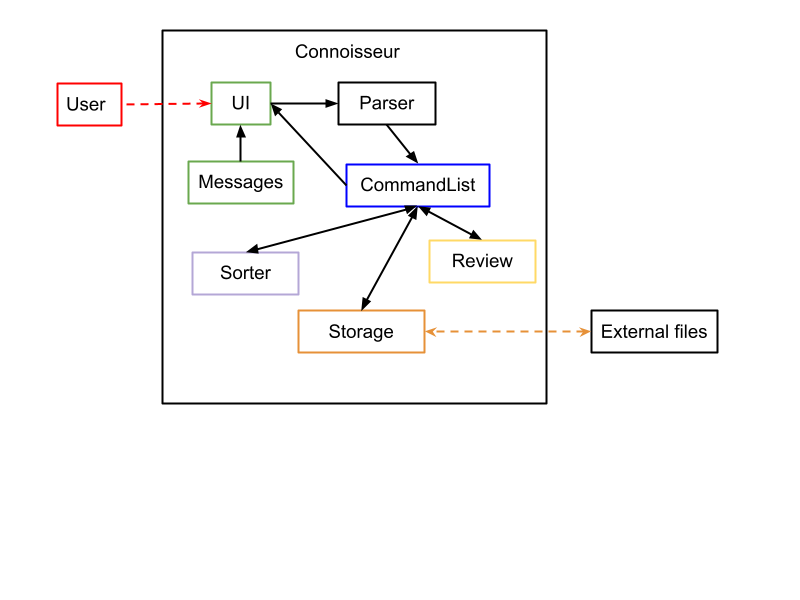
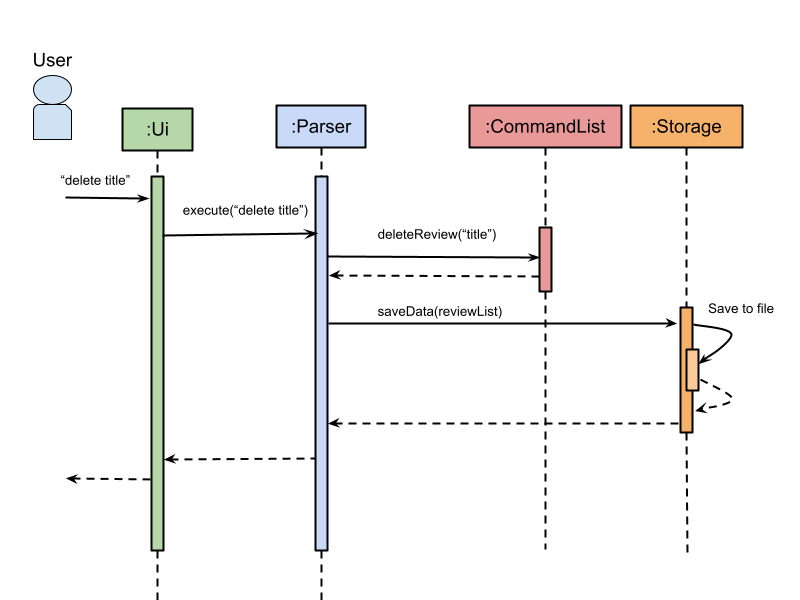
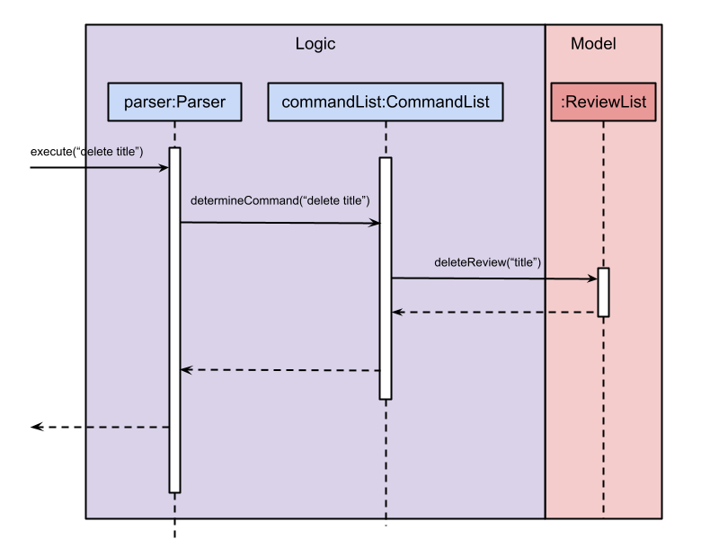
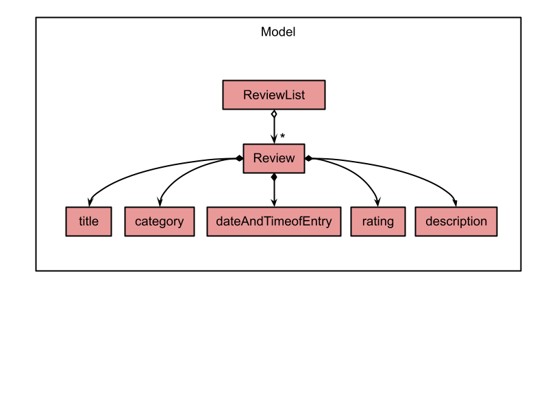

# Developer Guide

##Introduction

###What is Connoisseur
Connoisseur is a desktop app for managing and storing personal reviews that students would like to keep. It is a revolutionary app that not only provides an organised user friendly database for its users, but provides customisable categories to enhance the user experience. Through its intuitive command line interface, students would be able to store and share their recommendations easily.

###Purpose and Scope
The purpose of this developer guide is to describe the architecture and software design decisions for our application. This guide will cover our program architecture, logical view of major components and functionalities of our features.

##Setting up, getting started

###Setting up
There are 2 pre-requisites for Connoisseur to run:

1. JDK 11
    1. Configure the JDK: Follow the guide [se-edu/guides] IDEA: Configuring the JDK to to ensure Intellij is configured to use JDK 11.
      
2. Intellij IDEA (highly recommended)

###Getting Started

> ⚠ <b>Caution:</b> Follow the steps in the following guide precisely. Things will not work out if you deviate in some steps.

1. First, **fork** this repo, and **clone** the fork into your computer.
   
2. **Import the project as Gradle project**
    1. Follow the guide [[se-edu/guides] IDEA: Importing a Gradle project](https://se-education.org/guides/tutorials/intellijImportGradleProject.html) to import the project into IDEA

3. **Verify the setup:**
    1. Run the `seedu.address.connoisseur` and try a few commands.
    2. Run the [tests](https://github.com/AY2021S2-CS2113T-F08-3/tp/tree/master/src/test/java/seedu/connoisseur) to ensure they all pass.
>ℹ️ <b>Note:</b>  Importing a Gradle project is slightly different from importing a normal Java project.

## Design & implementation

### Architecture

*Fig. 1: Design Architecture of Connoisseur*

The Architecture Diagram given above explains the high-level design of Connoisseur.
Our application utilised many layers of abstraction which allows each individual component to be able to maintain their own properties while interacting with the other components. The main component acts as the root component that allows access to other components.

Given below is a quick overview of each component.
The app consists of four main components.

* `Ui`: The UI of the App.
* `Parser`: The command processor.
* `CommandList`: The command executor.
* `Storage`: Reads data from, and writes data to, the hard disk.

**How the architecture components interact with each other**

The *Sequence Diagram* below shows how the components interact with each other for the scenario where the user issues the command `delete title`.

*Fig. 2: Sequence Diagram of Connoisseur*

The sections below give more details of each component.

###UI component
This component is the user-facing component of our app, which the user interacts with. It takes input from the user through a Command Line Interface and displays the information to the user. It passes the input to the Parser.java class in order to process the commands and execute the respective methods.
###Logic component
This component would be the brain component of our app, where commands given by the user are determined and executed by calling the respective classes.

The command is passed into the `Parser.java` class which would determine the actions to perform. The actions are called from the `CommandList.java` class with their respective functions.

**API:** `Logic.java`

1. `Parser` class to parse the user command.
   
2. This results in a `Command` object which is executed by the `CommandList`.
   
3. The command execution can affect the `ReviewList` (e.g. adding a review). 
   
4. The result of the command execution is encapsulated as a `Command` object which is passed back to the `CommandList`. 
   
5. In addition, the `Command` object can also instruct the `Ui` to perform certain actions, such as displaying help to the user.

Given below is the *Sequence Diagram* for interactions within the logic component for the `execute (“delete”)` API call.

*Fig. 3: Sequence Diagram when executing delete*

###Model

*Fig. 4: Model of Connoisseur*

###Storage component

**API**: `Storage.java`

The storage component: 
* Can save Review objects in plaintext format and read it back.
* Can save the sorting preference of user in plaintext format and read it back

Methods:

1. `retrieveTextFile()` : Call upon this method in setting up Connoisseur, to ensure that a file is available for the writing and retrieving of data.

2. `loadData()` : Call upon this method while setting up data input from text file, before running Connoisseur

3. `saveData()` : Call upon this method to ensure that any changes in existing text file will be saved, for future reference.

### Common classes
The following are classes used by multiple components:
1. Review

2. Sorter

## Implementation
This section describes how the features in Connoisseur are implemented. The scope will include adding, deleting, listing and sorting of Reviews.

###Review related features
There are 2 main types of reviews that users can enter. One is the ‘quick review’ type and the other is the ‘long review’ type.
Users are able to add in new reviews in 2 different ways.

## Product scope
### Target user profile

{Describe the target user profile}

### Value proposition

{Describe the value proposition: what problem does it solve?}

## User Stories

|Version| As a ... | I want to ... | So that I can ...|
|--------|----------|---------------|------------------|
|v1.0|new user|see usage instructions|refer to them when I forget how to use the application|
|v2.0|user|find a to-do item by name|locate a to-do without having to go through the entire list|

## Non-Functional Requirements

{Give non-functional requirements}

## Glossary

* *glossary item* - Definition

## Instructions for manual testing

{Give instructions on how to do a manual product testing e.g., how to load sample data to be used for testing}
