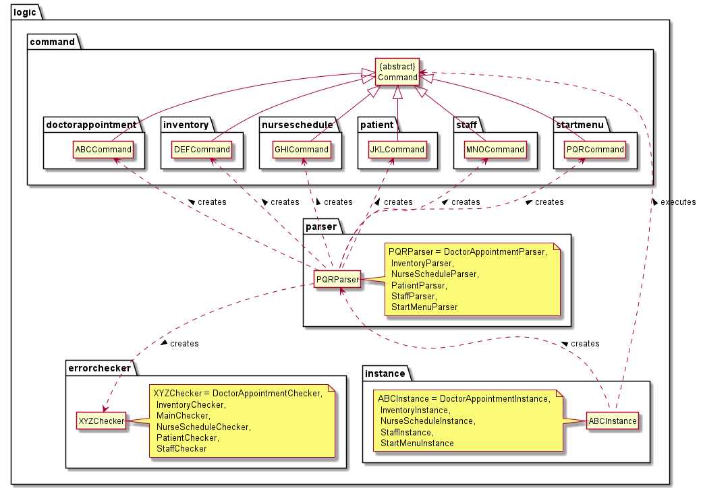
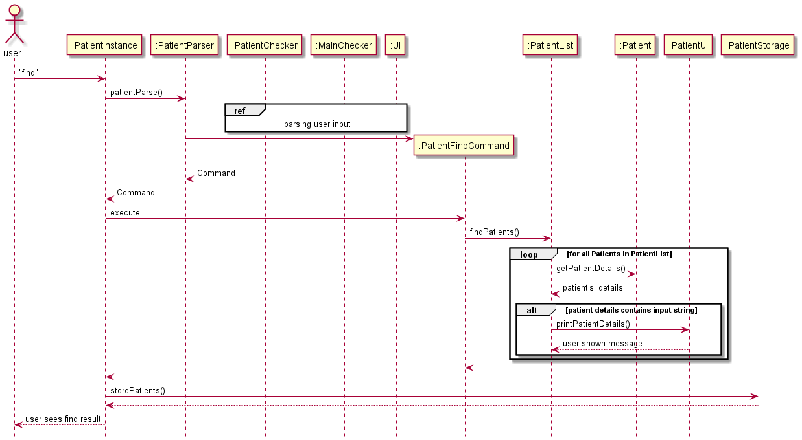
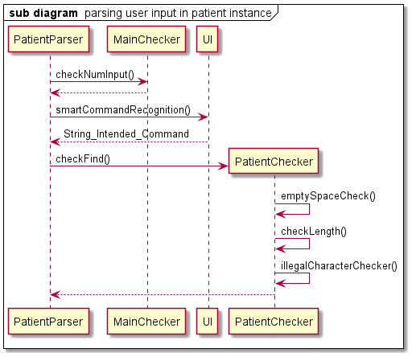

**Developer Guide**
===================

## Content Page

1. [Introduction](#1-introduction) (jia en)
	1. [What is HealthVault?](#11-what-is-healthvault) 
	2. [About the Developer Guide](#12-about-the-developer-guide)
2. [How to use this guide](#2-how-to-use-the-guide) (sarrah)
	1. [Technical Terms](#21-technical-terms)
	2. [Symbols & Icons](#22-symbols-&-icons)
4. [Getting Started](#3-getting-started) (Owen)
5. [Design](#4-design) 
    1. [Architecture](#41-architecture) (owen)
    2. [UI component](#42-ui-component) (ms)
    3. [Instance Component](#43-instance-component) (jiaen)
    4. [Parser Component](#44-parser-component) (jien)
    5. [Error Checker Component](#45-error-checker-component) (jiaen)
    6. [Commands Component](#46-commands-component) (jiaen)
    7. [Exceptions Component](#47-exceptions-component) (jiaen)
    8. [Model component](#48-model-component) (alex)
    9. [Storage component](#49-storage-component) (sarrah)
6. [Implementation](#5-implementation)
    1. [Staff](#51-staff) 
    	1. [Staff Menu](#511-staff-menu)
    	2. [Add](#512-add)
    	3. [Delete](#513-delete)
    	4. [List](#514-list)
    	5. [Find](#515-find)
    2. [Patient](#52-patient)
    	1. [Patient Menu](#521-patient-menu)
    	2. [Add](#522-add)
    	3. [Delete](#523-delete)
    	4. [List](#524-list)
    	5. [Find](#525-find)
    3. [Doctor Appointment](#53-doctor-appointment)
    	1. [Doctor Appointment Menu](#531-doctor-appointment-menu)
    	2. [Add](#532-add)
    	3. [Delete](#533-delete)
    	4. [List All](#534-list-all)
    	5. [List by Doctor ID or Appointment ID](#535-list-by-doctor-id-or-appointment-id)
    4. [Nurse Schedule](#54-nurse-schedule)
    	1. [Nurse Schedule Menu](#541-nurse-schedule-menu)
    	2. [Add](#542-add)
    	3. [Delete](#543-delete)
    	4. [List All](#544-list-all)
    	5. [List by Nurse ID](#545-list-by-nurse-id)
    5. [Inventory](#55-inventory)
        1. [Inventory Menu](#551-inventory-menu)
    	2. [Add](#552-add)
    	3. [Delete](#553-delete)
    	4. [List](#554-list)

[Appendix A: Product Scope](#a-appendix-a-product-scope) (jiaen)

[Appendix B: User Stories](#b-appendix-b-user-stories) (alex)

[Appendix C: Non Functional Requirements](#c-appendix-c-non-functional-requirements) (mingshun)

[Appendix D: Glossary](#d-appendix-d-glossary) (owen)

[Appendix E: Instructions for Manual Testing](#e-appendix-e-instructions-for-manual-testing) (sarrah)

## 1. Introduction
### 1.1 What is HealthVault?

In light of the recent COVID-19 pandemic. The weakness of modern healthcare systems has surfaced. 
Many of which are unsatisfactory in coping with the current needs.
HealthVault was thus created to improve the efficiency of hospital and healthcare information management.
 
**HealthVault** is a desktop application made for healthcare workers as their one stop application for recording and 
accessing critical patient or staff information.
It is optimized for the Command Line Interface, where an experienced typist will be able to 
make full use of the informative and minimalistic GUI to achieve significant gains in efficiency

### 1.2 About the Developer Guide

The HealthVault Developer guide is made specifically for those who are interested in the specifics of how HealthVault is 
implemented. Such personnel may include: students, technical support staff, web developers, healthcare professionals.

This Developer guide seeks to inform and instruct readers on the architecture and specific implementation of the various
functions within HealthVault. So that if they wish to make any fixes or edits to improve on the code for their own 
usage, they will be well equipped with both the knowledge and expertise to do so. 

The Developer Guide hopes to impart to you the following:
1. Properly set up for HealthVault
2. HealthVault's system architecture
3. The implementation method for HealthVault's various functions and their considerations

We hope you will have a fruitful time learning about HealthVault.

 

## 2. How to use the guide
### 2.1 Technical Terms

&nbsp;&nbsp;&nbsp;&nbsp;&nbsp;&nbsp;&nbsp;&nbsp; **Command Line Interface** - Accessing the functionalities of a computer program in the form of lines of text.

&nbsp;&nbsp;&nbsp;&nbsp;&nbsp;&nbsp;&nbsp;&nbsp; **User Input** - Any information or data sent to a computer by the user using the application.

### 2.2 Symbols & Icons

&nbsp;&nbsp;&nbsp;&nbsp;&nbsp;&nbsp;&nbsp;&nbsp; **<>** - Angles quotation marks for optional user inputs.

&nbsp;&nbsp;&nbsp;&nbsp;&nbsp;&nbsp;&nbsp;&nbsp; **[]** - Square brackets for compulsory user inputs.

&nbsp;&nbsp;&nbsp;&nbsp;&nbsp;&nbsp;&nbsp;&nbsp; :information_source: This icon denotes a important information to note.

&nbsp;&nbsp;&nbsp;&nbsp;&nbsp;&nbsp;&nbsp;&nbsp; :exclamation: Warning sign to inform user against doing certain actions 

&nbsp;&nbsp;&nbsp;&nbsp;&nbsp;&nbsp;&nbsp;&nbsp; Invalid input is shown with:

>
	- Invalid input 1
	- Invalid input 2
	- Invalid input 3

 

## 3. Getting Started

:exclamation: Caution: Follow the steps in the following guide precisely. Things will not work out if you deviate in some steps.

First fork this repo, and clone the fork into your computer.

**Setting up the project in your computer**

1. Configuring the JDK to to ensure Intellij is configured to use JDK 11.
2. Import the project as a Gradle project.
3. Run the seedu.duke.HealthVault and try a few commands as stated in the User Guide.
4. Run the tests to ensure they all pass.

**Before writing code**

1. If using IDEA, configuring the code style to set up IDEA’s coding style to match ours.
2. When you are ready to start coding, we recommend that you get some sense of the overall design by reading about HealthVault’s architecture.

 

## 4. Design

###  4.1 Architecture

&nbsp;&nbsp;&nbsp;&nbsp;&nbsp;&nbsp;&nbsp;&nbsp; 

**Overview Architecture:**

Our application utilises many layers of abstraction which allows each individual component to be self contained yet able to work with other components. Each component has been absracted and grouped together based on its function and purpose in the system.

The above diagram shows how each component interacts with the other components. The directed arrows represent the direction in which functions of each component is called and used. For example, the Instance Component utilises the Storage Component.

 

**Brief Description of Components:**

**UI Component:** Controls all the User Interface. All input and output is handled by the UI component.

**Logic Component:**

&nbsp;&nbsp;&nbsp;&nbsp;&nbsp;&nbsp;&nbsp;&nbsp; Instance Component: Represents all Menu Instances.

&nbsp;&nbsp;&nbsp;&nbsp;&nbsp;&nbsp;&nbsp;&nbsp; Parser Component: Parses user input to obtain control flow decisions.

&nbsp;&nbsp;&nbsp;&nbsp;&nbsp;&nbsp;&nbsp;&nbsp; Error Checker Component: Contains functions to check validity of user input.

&nbsp;&nbsp;&nbsp;&nbsp;&nbsp;&nbsp;&nbsp;&nbsp; Commands Component: Command Class Objects which executes specified actions.

**Exceptions Component:** All possible Exceptions identified.

**Model Component:** Consist of the base objects and its collection.

**Storage Component:** Manages all file I/O.

### 4.2 UI component

&nbsp;&nbsp;&nbsp;&nbsp;&nbsp;&nbsp;&nbsp;&nbsp; 

**API :** `UI.java`

The UI of this program can be found under the package named UI. It consists of `UI`, `DoctorAppointmentUI`, `InventoryUI`, `NurseScheduleUI`, `PatientUI` and `StaffUI`.  The main `UI` class as shown in the diagram acts as the parent class with the other classes being its subclasses. Having a main `UI` class allows the program to have a common pool of methods so that each method is reusable in each functionality. Each individual function UI extends the main `UI` and consists of the methods that deals with users unique to their functionality. The UI component interacts with the Logic package and Instance package the most.

**The `UI` component**,

&nbsp;&nbsp;&nbsp;&nbsp;&nbsp;&nbsp;&nbsp;&nbsp; Executes user commands using the ‘Logic’ component.

&nbsp;&nbsp;&nbsp;&nbsp;&nbsp;&nbsp;&nbsp;&nbsp; Listens to changes to `Instance` data so that the UI can be updated with the modified data.

&nbsp;&nbsp;&nbsp;&nbsp;&nbsp;&nbsp;&nbsp;&nbsp; Is responsible for handling all input and output of the program. 

### 4.3 Instance Component
**image for logic**

### 4.4 Parser Component
### 4.5 Error Checker Component
### 4.6 Commands Component
### 4.7 Exceptions Component
### 4.8 Model component
### 4.9 Storage component

 

## 5. Implementation

###  5.1 Staff

### 5.1.1 Staff Menu

Similar to the Start Menu, the Staff Menu will repeatedly request user input until the `return` command is given.

Whenever a user input is given to the Staff Menu, the following steps will occur.

**Launching Staff Menu**

1. `ToStaffInstance.execute()` will create and call `StaffInstance.run()`
2. `StaffInstance.run()` will start by loading/creating the Staff data .txt file for Staff database records. It will check for any signs of corrupted file when loading. Exception will be thrown if any corruption occurs.
3. `StaffInstance.run()` will then repeatedly call `commandHandler()`.

**Getting User Input**

4. `StaffInstance.run()` will repeatedly request for user input and call `StaffParser.commandHandler()`.
5. `commandHandler()` will call the `smartCommandRecognition()` to assess the given user input and determine which command is most similar to the input
6. Based on the recognised command by the system, the relevant commands will be carried out.

 

### 5.1.2 Add

**Implementation:**

The function Add takes in 4 compulsory fields (Staff ID, Name, Age, Specialisation) to create the Staff Object and adds it to an aggregation of Staff Objects. Data input is first checked to ensure validity. Any invalid input detected will result in an Exception thrown and command aborted. A StaffAdd Command object is created. StaffAdd command object will be executed to create the Staff Object which will be added to the aggregation of Staff Objects.

Invalid Input includes:

> 
	- Invalid Staff ID format
	- Duplicated Staff ID
	- Age that < 18 or > 150
	- Blank input (i.e Empty inputs)
	- Illegal Characters

`add/[Staff ID]/[name]/[age]/[specialisation]`

**Check validity of the data input**

1. If the command recognised is the add command, `commandHandler()` calls `staffChecker.checkValidDataForAdd()` to ensure data entered is valid
2. `checkValidDataForAdd()` will call the following function in sequence:

	- checkStaffID()	
	- checkDuplicateStaffID()
	- checkStaffAge()
	- checkBlankInput2()
	- invalidCharactersStaffChecker()

**Creating StaffAdd command**

3. If the input data is valid, a StaffAdd Command object is created. Else a relevant error is thrown.
4. The StaffAdd Command object is returned to `StaffInstance.run()`

**Creating Staff Object with User Input**

5. StaffInstance then executes the StaffAdd Command object to begin the process of creating the Staff object

6. `StaffAdd.execute()` will call the function in `StaffList.add()`

7. `StaffList.add()` will instantiate a new Staff object and add it to the ArrayList<Staff> StaffList. which contains all the Staff Objects. 

**Saving Staff Objects into .txt file**

8. `StaffList.add()` then calls `staffStorage.writeToFile()` which starts the process of writing the details of all existing Staff Objects, within the StaffList into a specified .txt file.
9. `staffStorage.writeToFile()` then calls `createFile()` which ensures that the specified .txt file exists.
10. Data is written and saved.
11. Control is then returned to StaffInstance.

 

### 5.1.3 Delete

**Implementation:**

The function Delete takes in 1 compulsory field (Staff ID) to identify and delete the Staff Object from the aggregation of Staff Objects. Data input is first checked to ensure validity. Any invalid input detected will result in an Exception thrown and command aborted. After validation, a StaffDelete Command object is created. StaffDelete command object will be executed to iterate through the aggregation of Staff Objects. If Staff Object exists, it will be removed. Else an error message will be displayed.

Invalid Input includes:

> 
	- Invalid Staff ID format
	- Blank input (i.e Empty inputs)
	- Illegal Characters

`delete/Staff ID`

**Check validity of the data input**

1. If the command recognised is the delete command, `commandHandler()` calls `staffChecker.checkDeleteCommand()` to ensure that there are valid and sufficient inputs

**Creating StaffDelete command**

2. If the input data is valid, a StaffDelete Command object is created 
3. The StaffDelete Command object is returned to `StaffInstance.run()`

**Deleting Staff Object using User Input**

4. StaffInstance then executes the StaffDelete Command object to begin the process of deleting the referenced Staff object
5. `StaffDelete.execute()` will call the function `StaffList.delete()`
6. `StaffList.delete()` will iterate through the objects in ArrayList<Staff> StaffList. The Staff Object referenced by the input given by the user will be deleted.

**Saving changed Staff Objects into .txt file**

7. `StaffList.delete()` then calls staffStorage.writeToFile() which starts the process of writing the changed details of Staff Objects, within the StaffList into a specified .txt file.

8. `staffStorage.writeToFile()` then calls `createFile()` which ensures that the specified .txt file exists.
9. Data is written and saved.
10. Control is then returned to StaffInstance.

 

### 5.1.4 List

**Implementation:**

The function list takes in 1 option field (nurses/doctors) to identity and list the category of Staff Objects required from the aggregation of Staff Objects. Data input is first checked to ensure validity. Any invalid input detected will result in an Exception thrown and command aborted. After validation, a StaffList Command object is created. StaffList command object will be executed to iterate through the aggregation of Staff Objects. Staff Objects will then be displayed based on the user given input.

Invalid Input includes:

> 
	- Any input apart from Blank Input (i.e Empty input) OR "doctors" OR "nurses"

`list/<doctors/nurses>`

**Check validity of the data input**

1. If the command recognised is the list command, `commandHandler()` calls `staffChecker.checkListCommand()` to check and verify the validity of inputs accompanied by the list command, if any.

**Creating StaffList command**

2. If the input data is valid, a StaffList Command object is created 
3. The StaffList Command object is returned to `StaffInstance.run()` 

**Viewing Staff Objects**

4. StaffInstance then executes the StaffList Command object to begin the process of displaying all Staff objects.
5. `StaffList.execute()` will call the function `StaffList.list()`
6. `StaffList.list()` will iterate through the objects in ArrayList<Staff> StaffList. 
7. Depending on the input given by the user, the relevant Staff Objects will be displayed.
8. Control is then returned to StaffInstance.

 

### 5.1.5 Find

**Implementation:**

The function Add takes in 1 compulsory field (keyword) to find the relvant Staff Objects within the aggregation of Staff Objects. Data input is first checked to ensure validity. Any invalid input detected will result in an Exception thrown and command aborted. The given input is used to match with every single field of the Staff Object. If there is a match, the Staff Object will be displayed. Else, an error message will be displayed.

Invalid Input includes:

> 
	- Blank input (i.e Empty inputs)

`find/[keyword]`

**Check validity of the data input**

1. If the command recognised is the find command, `commandHandler()` calls `MainChecker.checkNumInput()`. `MainChecker.checkNumInput()` does a simple check to ensure there is an accompanying input given by the user together with the find command.

**Creating StaffFind command**

2. If the input data exist, a StaffFind Command object is created 
3. The StaffFind Command object is returned to `StaffInstance.run()` 

**Finding relevant Staff Objects**

4. StaffInstance then executes the StaffList Command object to begin the process of finding and displaying relevant Staff objects.
5. `StaffFind.execute()` will call the function `StaffList.find()`
6. `StaffList.find()` will iterate through the objects in ArrayList<Staff> StaffList. 
7. `StaffList.find()` will utilise a search function in StaffList to find any Staff Objects that matches the given keyword by the user. 
8. The relevant Staff Objects are then displayed.
9. Control is then returned to StaffInstance.

 

###  5.2 Patient

### 5.2.1 Patient Menu

The Patient Menu will repeatedly request user input until the `return` command is given.

Whenever a user input is given to the Patient Menu, the following steps will occur.

**Launching Patient Menu**

1. `ToPatientInstance.execute()` will create and call `PatientInstance.run()`
2. `PatientInstance.run()` will start by loading/creating the Patient data .txt file for Patient database records. It will check for any signs of corrupted file when loading and exception will be thrown if any corruption is detected.
3. `PatientInstance.run()` will then enters its running for loop and repeatedly take in user inputs for data processing.

**Getting User Input**

4. `PatientInstance.run()` will repeatedly request for user input and call `PatientParser.patientParse()`.
5. `patientParse()` will call the `smartCommandRecognition()` to assess the given user input and determine which command is most similar to the input.
6. The most relevant command is then returned to the parser and the parser then scans the input thoroughly based on the command returned. Relevant errors in the input are detected and the appropriate exceptions thrown.
7. Only after scanning the input for errors, will the proper command be returned to `PatientInstance` where it will then be executed.
8. After getting an input, and parsing it into string tokens, a new instance of PatientChecker class `checker` is instantiated to perform error checking.

 

### 5.2.2 Add

**Implementation:**

The function Add takes in 6 compulsory fields (Patient ID, Name, Age, Gender, Illness and Medication Required) to create the Patient Object and adds it to a list of Patient Objects.
Data input is first checked to ensure validity. Any invalid input detected will result in an exception thrown and command aborted. If there are no exceptions thrown, a PatientAdd Command object is created.
The PatientAdd command object will be executed to create the Patient Object which will be added to the list of Patient Objects.

Invalid Input includes:

>
	- Invalid Patient ID format
	- Duplicated Patient ID
	- Age that < 0 or > 150
	- Invalid Gender Input
	- Blank input (i.e Empty inputs)
	- Inputs that only consist of spaces
	- Illegal Characters

**Format**
`add/[Patient ID]/[name]/[age]/[gender]/[illness]/[medication required]`

**Check validity of the data input**

1. If the command recognised is the add command, `patientParse()` calls `checker.checkAdd()` to ensure data entered is valid.
2. `checkAdd()` will call the following methods in sequence:

	- emptySpaceCheck();
		- checkLength();
		- checkID();
		- checkAge();
		- illegalCharacterChecker();
		- checkGender();

**Creating PatientAdd command**

3. If the input data is valid, a PatientAdd Command object is created. Else a relevant error is thrown.
4. The StaffAdd Command object is returned to `PatientInstance.run()`

**Creating Patient Object with User Input**

5. PatientInstance then executes the PatientAdd Command object to begin the process of creating the Patient object

6. `PatientAdd.execute()` will call the function in `PatientList.add()`

7. `PatientList.add()` will instantiate a new Staff object and add it to the ArrayList<Patient> PatientList. which contains all the Patient Objects.

**Saving Patient Objects into .txt file**

8. PatientInstance then calls `PatientStorage.storePatients()` which starts the process of writing the details of all existing Patient Objects, within the PatientList into a specified .txt file.
9. `PatientStorage.storePatients()` then calls `fileInit()` which ensures that the specified .txt file exists.
10. Data is written and saved.
11. Control is then returned to PatientInstance.

 

### 5.2.3 Delete

**Implementation:**

The function Delete takes in 1 compulsory field (Patient ID) to identity and delete the Patient Object from the list of Patient Objects. Data input is first checked to ensure validity. Any invalid input detected will result in an Exception thrown and command aborted. After validation, a PatientDelete Command object is created. The PatientDelete command object will be executed to iterate through the list of Patient Objects. If Patient Object exists, it will be removed. Else an error message will be displayed.

Invalid Input includes:

>
	- Invalid Patient ID format
	- Blank input (i.e Empty inputs)
	- Inputs that only consist of spaces

**Format**
`delete/[Patient ID]`

**Check validity of the data input**

1. If the command recognised is the delete command, `patientParse()` calls `checker.checkLength()` and `checker.checkID()` to ensure data entered is valid.

**Creating PatientDelete command**

2. If the input data is valid, a PatientDelete Command object is created
3. The PatientDelete Command object is returned to `PatientInstance.run()`

**Deleting Patient Object using User Input**

4. PatientInstance then executes the PatientDelete Command object to begin the process of deleting the referenced Patient object
5. `PatientDelete.execute()` will call the function `PatientList.deletePatient()`
6. `PatientList.deletePatient()` will iterate through the objects in ArrayList<Patient> PatientList. The Patient Object referenced by the input given by the user will be deleted.

**Saving changed Staff Objects into .txt file**

7. PatientInstance then calls `PatientStorage.storePatients()` which starts the process of writing the details of all existing Patient Objects, within the PatientList into a specified .txt file.
8. `PatientStorage.storePatients()` then calls `fileInit()` which ensures that the specified .txt file exists.
9. Data is written and saved.
10. Control is then returned to PatientInstance.

 

### 5.2.4 List

**Implementation:**

The function List does not take in any additional inputs, in order to show the user a list of current Patient objects in the database. Data input is first checked to ensure validity. Any invalid input detected will result in an Exception thrown and command aborted. After validation, a PatientList Command object is created. PatientList command object will be executed to iterate through the list of Patient Objects. Patient Objects will then be displayed based on the user given input.

Invalid Input includes:

>
	- Any input apart from Blank Input or a single delimiting slash.

**Format**
`list`

**Check validity of the data input**

1. If the command recognised is the list command, `patientParse()` calls `checker.checkLength()` to ensure data entered is valid.

**Creating PatientList command**

2. If the input data is valid, a PatientList Command object is created
3. The PatientList Command object is returned to `PatientInstance.run()`

**Viewing Patient Objects**

4. PatientInstance then executes the PatientList Command object to begin the process of displaying all Patient objects.
5. `PatientList.execute()` will call the function `PatientList.listPatients()`
6. `PatientList.listPatients()` will iterate through the objects in ArrayList<Patient> PatientList.
7. Patient Objects will be displayed.
8. Control is then returned to PatientInstance.

 

### 5.2.5 Find

**Implementation:**

The function Find takes in 1 compulsory field (keyword) to find the relvant Patient Objects within the list of Patient Objects. Data input is first checked to ensure validity. Any invalid input detected will result in an Exception thrown and command aborted. The given input is used to match with every single field of the Patient Object. If there is a match, the Patient Object will be displayed. Else, an error message will be displayed.

Invalid Input includes:

>
	- Blank input (i.e Empty inputs)
	- Illegal Characters
	- Inputs that only consist of spaces

**Format**
`find/[keyword]`

**sub-diagram to show the ref**

**Check validity of the data input**

1. If the command recognised is the find command, `patientParse()` calls `checker.checkFind()` to ensure data entered is valid.
2. `checkFind()` will call the following methods in sequence:

	- emptySpaceCheck();
		- checkLength();
		- illegalCharacterChecker();

**Creating PatientFind command**

3. If the input data exist, a PatientFind Command object is created
4. The PatientFind Command object is returned to `PatientInstance.run()`

**Finding relevant Patient Objects**

5. PatientInstance then executes the PatientFind Command object to begin the process of finding and displaying relevant Patient objects.
6. `PatientFind.execute()` will call the function `PatientList.findPatient()`
7. `PatientList.findPatient()` will iterate through the objects in ArrayList<Patient> PatientList.
8. `PatientList.findPatient()` will compare the the patient details of every Patient Object in the current list of Patient Objects with the keywork inputted by the user and discover any matches.
9. The relevant Patient Objects are then displayed.
10. Control is then returned to PatientInstance.

 

###  5.3 Doctor Appointment

### 5.3.1 Doctor Appointment Menu

Similar to the Start Menu, the Doctor Appointment Menu will repeatedly request user input until the `return` command is given.

Whenever a user input is given to the Doctor Appointment Menu, the following steps will occur.

**Launching Doctor Appointment Menu**

1. `ToDoctorAppointment.execute()` will create and call `DoctorAppointmentInstance.run()`
2. `DoctorAppointmentInstance.run()` will start by loading/creating the DoctorAppointment data .txt file for database records. It will check for any signs of corrupted file when loading. Exception will be thrown if any corruption occurs.
3. `DoctorAppointmentInstance.run()` will then repeatedly call `DoctorAppointmentParser.parse()`.

**Getting User Input**

4. `DoctorAppointmentInstance.run()` will repeatedly, requesting for user input and calling `DoctorAppointmentParser.parse()`.
5. `parse()` will call the `smartCommandRecognition()` to assess the given user input and determine which command is most similar to the input
6. Based on the recognised command by the system, the relevant commands will be carried out.

 

### 5.3.2 Add

**Implementation:**

The function Add takes in 5 compulsory fields (Doctor ID, Appointment ID, Patient's Name, Gender, Date) to create the DoctorAppointment Object to be added. Data input is first checked to ensure validity. Any invalid input detected will result in an Exception thrown and command aborted. A DoctorAppointmentAdd Command object is created and executed to create the DoctorAppointment Object to be added.

Invalid Input includes:

> 
	- Invalid Doctor ID format
	- Non-existent Doctor ID 
	- Invalid Appointment ID format
	- Duplicated Appointment ID
	- Illegal Characters for Names
	- Invalid Gender format
	- Invalid Date format
	- Blank input (i.e Empty inputs)

`add/[Doctor ID]/[Appointment ID]/[Patient's Name]/[Gender]/[Date]`

**Check validity of the data input**

1. If the command recognised is the add command, `DoctorAppointmentParser.parse()` calls `MainChecker.checkNumInput()` and `DoctorAppointmentChecker.checkValidDataForAdd()` to ensure data entered is valid.
2. `checkValidDataForAdd()` will call the following function in sequence:

	- isValidDocID()	
	- isValidAppointmentID()
	- illegalCharacterChecker()
	- isValidGender()
	- checkValidDate(); 

**Creating DoctorAppointmentAdd command**

3. If the input data is valid, a DoctorAppointment Command object is created. Otherwise a relevant error will be thrown.
4. The Command object is returned to `DoctorAppoitmentInstance.run()`

**Creating DoctorAppointment Object with User Input**

5. DoctorAppointmentInstance then executes the DoctorAppointment Add Command object by running `DoctorAppointmentAdd.execute()`.
6. `AppointmentList.addAppointment()` will be called in which a DoctorAppointment object will be created and added into the ArrayList<DoctorAppointment> appointmentList, which contains all the DoctorAppointment Objects. 

**Saving DoctorAppointment Objects into .txt file**

7. `AppointmentList.addAppointment()` then calls `DoctorAppointmentStorage.writeToFile()` which all existing DoctorAppointment Objects within the appointmentList is written into a DoctorAppointment.txt file.
8. `staffStorage.writeToFile()` then calls `createFile()` which ensures that the specified .txt file exists.
9. Control is then returned to DoctorAppointmentInstance.

 

### 5.3.3 Delete

**Implementation:**

The delete function takes in 1 compulsory field (Doctor ID/ Appointment ID) to identity and delete the corresponding DoctorAppointment Object from ArrayList <DoctorAppointment> appointmentList . Data input is first checked to ensure validity. Any invalid input detected will result in an Exception thrown and command aborted. After validation, a DoctorAppointmentDelete Command object is created and executed in which the program will iterate through appointmentList. If the desired DoctorID or Appointment ID exists, it will be removed. Else an error message will be displayed.

Invalid Input includes:

> 
	- Invalid Doctor ID format
	- Non-existent Doctor ID
	- Invalid Appointment ID format
	- Non-existent Appointment ID
	- Blank input (i.e Empty inputs)

`delete/[Doctor ID/ Appointment ID]`

**Check validity of the data input**

1. If the command is recognised as the delete command, `DoctorAppointmentParser.parse()` calls `MainChecker.checkNumInput()` and `DoctorAppointmentChecker.checkValidDataForDelete()` to ensure that the inputs are valid.

**Creating DoctorAppointmentDelete command**

2. A DoctorAppointmentDelete Command object is created if the inputs are valid. 
3. The Command object is returned to `DoctorAppointmentInstance.run()`

**Deleting DoctorAppointment Object using User Input**

4. DoctorAppointmentInstance then executes the DoctorAppointmentDelete Command object by running `DoctorAppointmentDelete.execute()`.
5. `AppointmentList.deleteAppointment()` is called, which iterates through the objects in ArrayList<DoctorAppointment> appointmentList. The DoctorAppointment Object matching the input given by the user will be removed from the array list.

**Saving changed DoctorAppointment Objects into .txt file**

6. `AppointmentList.deleteAppointment()` then calls `DoctorAppointmentStorage.writeToFile()` which rewrites the updated appointmentList into the DoctorAppointment.txt file.
7. Control is then returned to StaffInstance.

 

### 5.3.4 List all

**Implementation:**

The function lists all Doctor Appointment Objects currently in ArrayList <DoctorAppointment> appointmentList. Data input is first checked to ensure validity. Any invalid input detected will result in an Exception thrown and command aborted. After validation, a DoctorAppointmentList Command object is created and executed in which the program will iterate and display all DoctorAppoinment Objects currently within the array list.

Invalid Input includes:

> 
	- Any input apart from Blank Input (i.e Empty input) OR "all" OR "Appointment ID" OR "Doctor ID" 

`list/all`

**Check validity of the data input**

1. If the command recognised is the list command, `DoctorAppointmentParser.parse()` calls `MainChecker.checkNumInput()` and `DoctorAppointmentChecker.checkValidDataForList()` to check and verify the validity of inputs accompanied by the list command, if any.

**Creating DoctorAppointmentList command**

2. A DoctorAppointmentList Command object is created if the inputs are valid.
3. The Command object is returned to `DoctorAppointmentInstance.run()`

**Viewing DoctorAppointment Objects**

4. DoctorAppointmentInstance then executes the DoctorAppointmentList Command object by running `DoctorAppointmentList.execute()`.
5. `AppointmentList.listAppointment()` is called, and will iterate through the objects in ArrayList<DoctorAppointment> appointmentList.
6. All DoctorAppointment Objects in the array list will be displayed.
7. Control is then returned to DoctorAppointmentInstance.

 

### 5.3.5 List by Doctor ID or Appointment ID

**Implementation:**

The function list takes in 1 compulsory field (keyword) to list the relevant DoctorAppoitment Objects currently in ArrayList <DoctorAppointment> appointmentList.Data input is first checked to ensure validity. Any invalid input detected will result in an Exception thrown and command aborted. After validation, a DoctorAppointmentList Command object is created and executed in which the program will iterate and display the DoctorAppoinment Objects matching the user input currently within the array list.
Invalid Input includes:

> 
	- Any input apart from Blank Input (i.e Empty input) OR "all" OR "Appointment ID" OR "Doctor ID" 

`list/[Doctor ID/ Appointment ID]`

**Check validity of the data input**

1. If the command recognised is the list command, `DoctorAppointmentParser.parse()` calls `MainChecker.checkNumInput()` and `DoctorAppointmentChecker.checkValidDataForList()` to check and verify the validity of inputs accompanied by the list command, if any.

**Creating DoctorAppointmentList command**

2. A DoctorAppointmentList Command object is created if the inputs are valid.
3. The Command object is returned to `DoctorAppointmentInstance.run()`

**Viewing DoctorAppointment Objects**

4. DoctorAppointmentInstance then executes the DoctorAppointmentList Command object by running `DoctorAppointmentList.execute()`.
5. `AppointmentList.listAppointment()` is called, and will iterate through the objects in ArrayList<DoctorAppointment> appointmentList.
6. DoctorAppointment Objects matching the user input present in the array list will be displayed.
7. Control is then returned to DoctorAppointmentInstance.

 

###  5.4 Nurse Schedule

### 5.4.1 Nurse Schedule Menu

Similar to the start menu, the Nurse Schedule menu will repeatedly request user input until the `return` command is given.

Whenever a user input is given to the Nurse Schedule Menu, the following steps will occur

**Launching Nurse Schedule Menu**

1.`ToNurseScheduleInstance.execute()` will create and call `NurseScheduleInstance.runCommandLoopUntilExit()`.

2.`runCommandLoopUntilExit()` will start by loading/creating the NurseSchedule.txt for database records. It will check for any signs of file corruption when loading. An exception will be thrown if any corruption is present.

3.`runCommandLoopUntilExit()` will then repeatedly call nurseParse().

**Getting User Input**

4.User inputs are repeatedly requested by `runCommandLoopUntilExit`.

5.`nurseParse()` will call `smartCommandRecognition` to assess the given user input and determine which command is the most similar to the input.

6.Based on the recognised command, the relevant execution will be carried out.

### 5.4.2 Add

**Implementation**

The function Add takes in 3 compulsory fields (Nurse ID, Patient ID, Date) to create a new Nurse Schedule object to be added. The Nurse ID, Patient ID and Date inputs will be first checked to ensure validty. Any invalid input detected will result in an Exception thrown and command will be aborted. Else, a NurseScheduleAdd Command object is created and executed which will create a NurseSchedule object to be added.

Invalid Inputs include:

>
	- Invalid Nurse ID or Patient ID format
	- Non-existent Nurse ID or Patient ID
	- Blank input
	- Illegal Characters
	- Illegal date format
	- Duplicate schedules (i.e similar Patient ID and date)
	
`add/[Nurse ID]/[Date (DDMMYYYY)]`

**Checking validity of data input**

1.If the command recognised is the add command, the parameters will first be checked for their validity. The following functios will be called in sequence:
	- isValidDate()
	- checkNumInput()
	- illegalCharacterChecker()
	
**Creating NurseScheduleAdd object with User Input**

2.If the parameters are valid, a NurseScheduleAdd Command object is created, which will be passed back to `NurseScheduleInstance.runCommandLoopUntilExit()`.

3.The Command objected is then executed and `NurseScheduleActions.addSchedule()` will be called which creates a NurseSchedule object an adds it into the array list.

**Saving NurseSchedule objects into .txt file**

4.The command loop then calls `NurseScheduleStorage.writeToFile()` which starts the process of writing detials of all existing Nurse Schedule objects within the Arraylist into a specific .txt file.

5.Control is then returned to NurseScheduleInstance.

### 5.4.3 Delete

**Implementation**

The delete function takes in 2 compulsory field (Nurse ID, Date) to identify and delete the Nurse Schedule object from the arraylist of Nurse Schedule objects. The Nurse ID and date will first be checked for its validity. Any invalid input detected will result in an exception thrown and command will be aborted. Else, a NurseScheduleDelete Command object is created and executed.

Invalid Inputs include:

>
	- Invalid Nurse ID format
	- Non-existent Nurse ID
	- Blank input
	- Illegal Characters
	- Illegal date format
	
`delete/[Nurse ID]/[Date (DDMMYYYY)]`

**Checking validity of data input**

1. If the command is recognised as a delete command, the parameters provided will first be checked for its validity.

**Creating NurseScheduleDelete object**

2. If the parameters are valid, a NurseScheduleDelete Command object is created, which will be passed back to `NurseScheduleInstance.runCommandLoopUntilExit()`.

3. `NurseScheduleDelete.execute()` will call the function `NurseScheduleActions.deleteSchedule()`.

4. `deleteSchedule` iterates through the arraylist and removes the first object that matches the user input given.

**Saving updated NurseSchedule objects into .txt file**

5. `runCommandLoopUntilExit()` will then call `NurseScheduleStorage.writeToFile()` which starts the process of writing detials of all existing Nurse Schedule objects within the Arraylist into a specific .txt file.

6. Control is then returned to NurseScheduleInstance.

### 5.4.4 List all

**Implementation**

This function lists all Nurse Schedule objects, sorted by earliest added Nurse ID, then sorted by earliest date. Data input is first checked to ensure validity. Any invalid input detected will result in an Exception thrown and command aborted. After validation, a NurseScheduleList Command object is created. NurseScheduleList command object will be executed to iterate through the arraylist of Nurse Schedule objects. Nurse Schedule Objects will then be displayed.

Invalid Inputs include:

>
	- Any input apart from "all" OR "NurseID"

`list/all`

**Checking validity of data input**

1. If the command recognised is the list command, the number of fields in inputs will first be checked.

**Creating NurseScheduleList command**

2. If the input is valid, a NurseScheduleList Command object is created.

3. The NurseScheduleList object is returned to `NurseScheduleInstance.runCommandLoopUntilExit()`.

**Viewing Nurse Schedule objects**

4. NurseScheduleInstance then executes the NurseScheduleList Command object to begin the process of displaying Nurse Schedule objects.

5. `NurseScheduleList.execute()` will call the function `NurseScheduleList.listSchedules()` which calls `listAllSchedules()`.

6. `listAllSchedules()` iterates through the arraylist of Nurse Schedule objects, printing all schedules.

### 5.4.5 List by Nurse ID

**Implementation**

This function lists specified Nurse Schedule objects, sorted by earliest date. Data input is first checked to ensure validity. Any invalid input detected will result in an Exception thrown and command aborted. After validation, a NurseScheduleList Command object is created. NurseScheduleList command object will be executed to iterate through the arraylist of Nurse Schedule objects. Nurse Schedule Objects will then be displayed.

Invalid Inputs include:

>
	- Any input apart from "all" OR "NurseID"

`list/[Nurse ID]`

**Checking validity of data input**

1. If the command recognised is the list command, the number of fields in inputs will first be checked.

**Creating NurseScheduleList command**

2. If the input is valid, a NurseScheduleList Command object is created.

3. The NurseScheduleList object is returned to `NurseScheduleInstance.runCommandLoopUntilExit()`.

**Viewing Nurse Schedule objects**

4. NurseScheduleInstance then executes the NurseScheduleList Command object to begin the process of displaying Nurse Schedule objects.

5. `NurseScheduleList.execute()` will call the function `NurseScheduleList.listSchedules()` which calls `getSchedulesByID`.

6. `getSchedulesByID` iterates through the arraylist of Nurse Schedule objects, printing schedules of the relevant Nurse ID.

 

**Inventory-related features**

Similar to the Start Menu, the Inventory Menu will repeatedly request user input until the `return` command is given.

Whenever a user input is given to the Inventory Menu, the following steps will occur.

**Launching Inventory Menu**

1. `ToInventoryInstance.execute()` will create and call `InventoryInstance.run()`
2. `InventoryInstance.run()` will start by loading/creating the Inventory data .txt file for Inventory database records. It will check for any signs of corrupted file when loading. Exception will be thrown if any corruption occurs.
3. `InventoryInstance.run()` will then repeatedly call `InventoryParser()`.

**Getting User Input**

4. `InventoryInstance.run()` will repeatedly request for user input and call `InventoryParser.inventoryParse()`.
5. `inventoryParse()` will call the `smartCommandRecognition()` to assess the given user input and determine which command is most similar to the input
6. Based on the recognised command by the system, the relevant commands will be carried out.

 

### 5.1.2 Add

**Implementation:**

The function Add takes in 3 compulsory fields (Drug Name, Price, Quantity) to create the Inventory Object to be added.  Data input is first checked to ensure validity. Any invalid input detected will result in an Exception thrown and command aborted. A InventoryAdd Command object is created. InventoryAdd command object will be executed to create the Inventory Object to be added.

Invalid Input includes:

> 
	- Invalid Price 
	- Invalid Quantity
	- Blank input (i.e Empty inputs)
	- Illegal Characters

`add/[Drug Name]/[Price]/[Quantity]`

*upload diagram*

**Check validity of the data input**

1. If the command recognised is the add command, `InventoryParser.parse()` calls `InventoryChecker.checkAdd()`, `MainChecker.checkNumInput()`, and `MainChecker.checkBlankInput()` to ensure data entered is valid
2. `checkAdd()` will call the following function in sequence:

	- emptySpaceCheck()	
	- checkStorageLength()
	- illegalCharacterChecker()
	- checkPrice()
	- checkQuantity()
	- checkDuplicate()

**Creating InventoryAdd command**

3. If the input data is valid, a InventoryAdd Command object is created. Otherwise a relevant error is thrown.
4. The InventoryAdd Command object is returned to `InventoryInstance.run()`

**Creating Inventory Object with User Input**

5. InventoryInstance then executes the InventoryAdd Command object by running `InventoryAdd.execute()`.

6. `InventoryList.addDrugs()` will be called in which a Inventory object will be created and added into the ArrayList<Inventory> inventoryList which contains all the Inventory Objects. 

7. If the list already contains data with the same Drug Name and Price, the Quantity of the Drug will be increased in the list by the value in the user input Quantity field. `InventoryList.addDrugs()` will call `Inventory.addQuantity`. This will modify the Quantity of that specified Drug.
 
**Saving Inventory Objects into .txt file**

7. `InventoryInstance` then calls `InventoryStorage.storeInventory()` which starts the process of writing the details of all existing Inventory Objects, within the InventoryList into a specified .txt file.
8. `InventoryStorage.writeToFile()` then calls `fileInit()` which ensures that the specified .txt file exists.
9. Data is written and saved.
10. Control is then returned to InventoryInstance.

 

### 5.1.3 Delete

**Implementation:**

The function Delete takes in 2 compulsory field (Drug Name, Quantity) to identify and decrease the Quantity of the Inventory Object from ArrayList<Inventory> list. Data input is first checked to ensure validity. Any invalid input detected will result in an Exception thrown and command aborted. After validation, a InventoryDelete Command object is created. InventoryDelete command object will be executed to iterate through the ArrayList<Inventory> InventoryList. If Inventory Object exists, its Quantity will be decreased by the Quantity indicated in the user input. Else an error message will be displayed.

Invalid Input includes:

> 
	- Invalid Quantity
	- Invalid Name
	- Blank input (i.e Empty inputs)
	- Illegal Characters

`delete/Drug Name/Quantity`

**Check validity of the data input**

1. If the command recognised is the delete command, `InventoryParser.parse()` calls `InventoryChecker.checkDelete()`, `MainChecker.checkNumInput()`, and `MainChecker.checkBlankInput()` to ensure that there are valid and sufficient inputs

**Creating StaffDelete command**

2. If the input data is valid, a InventoryDelete Command object is created 
3. The Command object is returned to `InventoryInstance.run()`

**Deleting Quantity from a Inventory Object using User Input**

4. InventoryInstance then executes the InventoryDelete Command object to begin the process of deleting the referenced Quantitiy of the Inventory object
5. `InventoryList.deleteDrugs()` is called, which iterate through the objects in ArrayList<Inventory> InventoryList. The Inventory Object referenced by the input given by the user, will have its Quanitity reduced by the Quantity indicated in the user input.

**Saving changed Inventory Objects into .txt file**

7. `InventoryInstance` then calls `InventoryStorage.storeInventory()` which starts the process of writing the details of all existing Inventory Objects, within the InventoryList into a specified .txt file.
8. `InventoryStorage.writeToFile()` then calls `fileInit()` which ensures that the specified .txt file exists.
9. Data is written and saved.
10. Control is then returned to InventoryInstance.

 

### 5.1.4 List

**Implementation:**

This function lists all the Inventories currently in the ArrayList<Inventory> InventoryList. A InventoryList Command object is created. InventoryList command object will be executed to iterate through the list of Inventory Objects. Inventory Objects will then be displayed based on the user given input.

**Check validity of the data input**

1. If the command recognised is the list command, `InventoryParser.parse()` calls `MainChecker.checkNumInput()` to check and verify the validity of inputs accompanied by the list command, if any.

**Creating InventoryList command**

2. If the input data is valid, a InventoryList Command object is created 
3. The InventoryList Command object is returned to `InventoryInstance.run()` 

**Viewing Inventory Objects**

4. InventoryInstance then executes the InventoryList Command object to begin the process of displaying all Inventory objects.
5. `InventoryList.execute()` will call `InventoryList.listInventory()` and will iterate through the objects in ArrayList<Inventory> InventoryList.
7. Depending on the input given by the user, the relevant Inventory Objects will be displayed.
8. Control is then returned to InventoryInstance.

 

## a. Appendix A: Product Scope

 

## b. Appendix B: User Stories

 

## c. Appendix C: Non Functional Requirements

* Should work on any mainstream OS if it has Java 11 or above installed.

* Database should be able to hold up to 1000 patients, staff, appointments, nurses’ schedules, and drugs inventory without feeling a noticeable lag in the program. 

* A user with above average typing speed should be able to accomplish most of the tasks faster using commands than using the mouse.

* The data retrieval time should return near instant without feeling a pause in between command and output.

* New features for example, auto generation of nurses’ schedules and personalized account login are currently in the works to demonstrate that this program is still being developed to be better and accommodate more of the concerns medical personnel have. 

* Application would be affordable to the general masses

* The security and accessibility of the system is relatively secure, but authorization and authentication scheme is in consideration to be implemented for greater protection.

* All data process and management is in accordance to Singapore IMDA and MOH policy

* Healthvault is not accountable for any data lost due to individuals computer failure. 

 

## d. Appendix D: Glossary

* *Illegal Characters* - Non-alphanumeric characters
 
* *Aggregation* - Any collection of objects. In this case, we utilise an ArrayList to store all our objects. 
 
* *Features* - In this case, we refer to the entire interaction with the various types of objects. E.g. any interaction with Staff/Patient/Doctor Appointment/Nurse Schedules/Inventory.
 
* *Functionalities* - Any command that is given to the feature. E.g. `help` command, `list` command.
 
* *Blank Input* - Refers to any whitespace input. E.g. " ", "\t".
 
* *No Input* - Refers to no input given. 

 

## e. Appendix E: Instructions for Manual Testing

 

