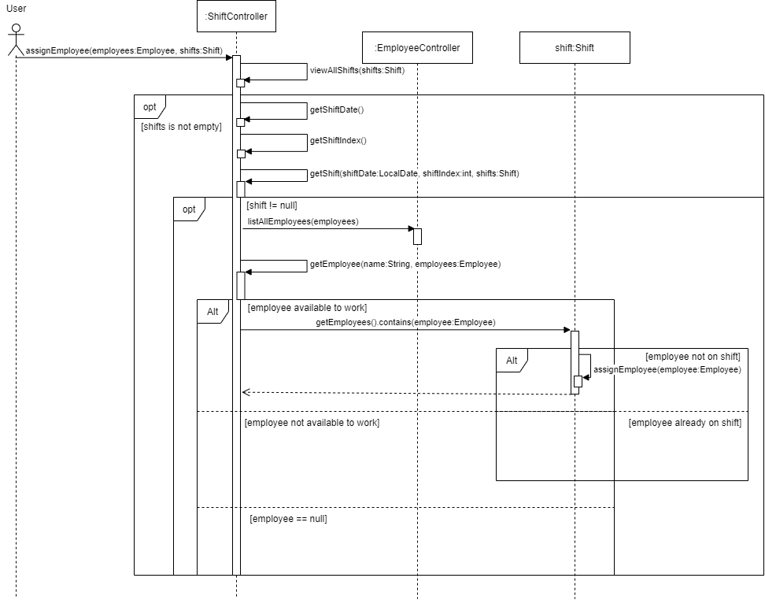

# Developer Guide

## Design

{Describe the design and implementation of the product. Use UML diagrams and short code snippets where applicable.}

## Implementation
This section describes some noteworthy details on how certain features are implemented.

### View One Shift feature
#### Implementation
The current implementation of the View One Shift feature is to call the `App Controller` from `Duke`, and when the user requests to View One Shift, they input "view one shift" as a command.
The `App Controller` then calls the method from its class.

Within the `View One Shift` method, the user is prompted to provide details regarding the date and shift index they are looking for.
The `App Controller` will then call some methods in Shift to verify the shift exists, and returns the employees scheduled if any.

Given below is an example usage scenario and how this method works at each step.
This assumes that the data has already been loaded (`date: `11/04/2021, `shiftIndex:` 1, `vacancy:` 2, `employees` : [Adam, Eve])

|Step Number| System Output| User Input | Remarks|
|-------------|--------------|------------------|------------------|
|1|Enter Command: | view one shift | user can type in `help` for a list of commands|
|2|Enter Shift date (in dd/MM/YYYY):|11/04/2021|date format is specified|
|3|Enter Shift index | 1 | Shift index is from 1-6, each index representing a 4 hr block|
|4|The people assigned to the shift are: [Adam,Eve]|-|Empty array will be returned if no employee is assigned for the shift|

Step 1: The user launches the program, with the data already loaded. The application then prompts the user for their command.

Step 2: The user inputs a date, and the date is processed by a DateTimeFormatter to ensure that it is in the correct format. 
This date will be added into the shift ArrayList. 

Step 3: The user inputs a shift index, which represents which shift the user is looking for. For instance, index 1 refers to 
0000-0400 in the morning, which will be relevant to 24hr fast food chains such as McDonalds!

Given below is what will be shown if wrong/invalid inputs are given

|Step Number| System Output| Wrong User Input | System Output|
|-------------|--------------|------------------|------------------|
|1|Enter Command: | view one Shift | invalid command|
|2|Enter Shift date (in dd/MM/YYYY):|12/05/2021|Date chosen has no shifts|
|3|Enter Shift index | 1 | Shift index selected is not available|

Given below is a sequence diagram of the View One Shift feature

### add schedule to employee feature
#### Implementation

The add schedule feature uses of the `Employee` object in the `employee` package to store the schedules of each employee. 

The class diagram for the `Employee` class is as follows:

Each `Employee` object has an employee name, and an arrayList of schedules, together with the functionality to set/get the employee name, add or drop a schedule from the employee object.

The arraylist of schedules contains all of the employee's schedules. Each schedule is a String which follows certain constraints as described below:

A schedule must be in the format: dd/mm/yyyy

dd must be an integer between 1-31

mm must be an integer between 1-12

yyyy must be an integer between 2021-2099

The validation for a schedule is done internally in the `Employee` Class through a method called `isScheduleValid`, which is used in the `addSchedule` method in the `employee` class. Only when `isScheduleValid` returns true, the `addSchedule` method will add the schedule to the employee.

The logic for allowing the user to add a new schedule is in the `AppController` class in the `controller` package and the `Employee` class in the `employee` package. The sequence diagram for the interaction is shown below:

When the user enters “add schedule”, the `addSchedule` method in the `AppController` is called. 

In the `addSchedule` method, the user is first asked to enter the employee’s name that the user wants to add a schedule to. 

The method will then check if there is a matching employee from the arraylist of employees in the system (from the `employees` variable in `AppController`). 

If no employee with the queried name is found, the method terminates with a feedback to the user. 

If there is a matching employee, the system proceeds to ask the user to enter a schedule to be added for the employee. 

After the user enters a schedule, control is passed to the `Employee` object, where the schedule is added to the employee if the schedule is verified to be valid. 

Control is then passed back to the `addSchedule` method in `AppController`, with feedback from the `Employee` object on whether the schedule is valid or not. 

`addSchedule` in `AppController` will provide feedback to the user on if the schedule is added successfully, and end the method call by passing control back to the `run` method in `AppController`.

### Assign Employee feature
#### Implementation

The proposed Assign Employee feature is facilitated by the `Shift` object in the `shift` package,
where it stores the employees on the shift, its shift date, shift index, and vacancy. 
This method, like its name suggests, assigns an employee to an available shift.

Given below is an example usage scenario and how the Assign Employee method behaves at each step.

Step 1: The user launches the application and the `Employee` and `Shift` objects are initialised with the saved data.
For this example, we will use the `Employee` object to store all employees and their schedules, where `employees: `[Adam, Eve], and 
`shifts` which is an ArrayList of `Shift` objects. The example will use a `Shift` object with attributes `employees: `[Adam], 
an ArrayList of employees assigned to this shift, meaning `Adam` is assigned to this shift, `shiftDate: `04/04/2021, `shiftIndex: `3, meaning that the shift period is 0800 to 1200, 
and `vacancy: `2.

Step 2: The system calls `App Controller` and prompts "Enter Command: ".

Step 3: The user enters `assign employee`. This command will call `assignEmployee()` in `App Controller`, which then 
causes the system to output "Enter Employee name to assign: ".

Step 4: The user inputs "Eve", which calls the`getName()` method in `Employee` to check whether `Eve` exists in the database.
If `Eve` does not exist in the database, the system will output "Employee not found", and the method ends here. Since `Eve`
exist in the database, the system proceeds to output "Enter Shift date (in dd/MM/yyyy)".

Step 5: The user inputs "04/04/2021" and this is stored as a temporary `shiftDate` object in the method, where the `LocalDate.parse()` method will parse the `String` input using the `DateTimeFormatter` into a `LocalDate` object.
The system will then output "Enter Shift index:".

Step 6: The user inputs "3" which is temporarily stored as `shiftIndex`, and the system proceeds to verify that the `Shift` object with this particular `shiftDate` and `shiftIndex` exists.
The system outputs "Shift not found" if the particular `Shift` object does not exist. Since this `Shift` exists, the system
calls the `assignEmployee()` method in `Shift` to assign `Eve` to this shift by adding `Eve` into the ArrayList of `employees` stored in the `Shift` object. This causes the `vacancy` in this current `Shift` object to decrement by 1.
If the `vacancy` is 0, the system outputs "Shift is full!". Since there is still 2 vacancies for this shift, the system will instead
output "Employee Eve assigned." and `vacancy` becomes 1.

Given below is a sequence diagram of the Assign Employee feature.
 

### Saving of Data
#### Implementation
Employee and shift details are saved on separate text files "employees.text" and "shifts.text".
A FileWriter is used to write formatted data from the Employee and Shift classes, with "#" as the delimiter.

### Loading of Data
#### Implementation
 

## Product scope
### Target user profile

This application is for fast-food restaurant managers who have difficulty in scheduling different employees to the different shift that they have. 

### Value proposition

{Describe the value proposition: what problem does it solve?}

## User Stories

|Version| As a ... | I want to ... | So that I can ...|
|--------|----------|---------------|------------------|
|v1.0|new user|see usage instructions|refer to them when I forget how to use the application|
|v2.0|user|find a to-do item by name|locate a to-do without having to go through the entire list|

## Non-Functional Requirements

{Give non-functional requirements}

## Glossary

* *glossary item* - Definition

## Instructions for manual testing

{Give instructions on how to do a manual product testing e.g., how to load sample data to be used for testing}
