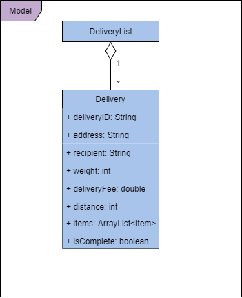
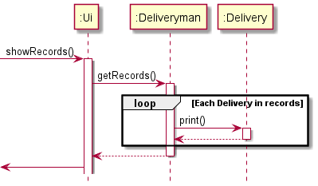
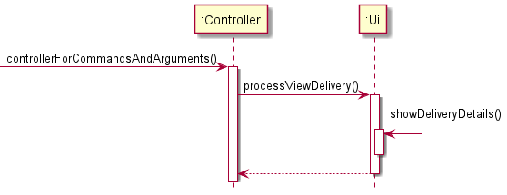
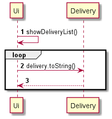
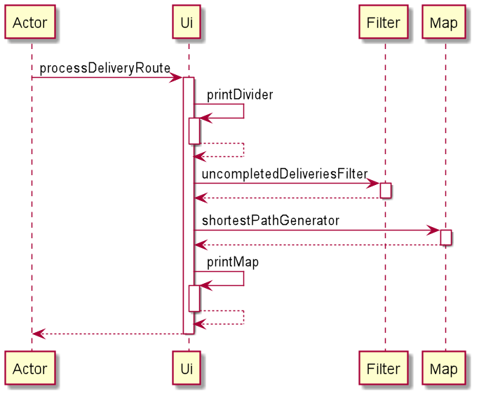

# Developer Guide

* Do not remove this line (it will not be displayed)
{:toc}

## Introduction 

### What is Diliveri
Diliveri is desktop application built on Java and has cross platform abilities across different operating systems. 
With the rise of demand for deliveryman due to the pandemic, this app optimises the delivery route for each delivery 
man taking into account the number of deliveries per location and distances between locations, we improve the time and 
efficiency of deliveries. This app aims to be a one stop solution and more for to meet all the needs of a deliverymen.  

## Design 

### Overview
Our application implements multiple layers of abstraction, enabling individual components to be self contained while being able to function with other components. Each component has been absracted and grouped together according to its function and purpose in the system. The diagram above indicates how each component interacts with one another, with directed arrows representing the direction in which functions of each component is called and used. Below is a brief description of each component in the system.

* UI: The user interface of the application. Controls and handles all input and output of the application.
* Model: Consists of the base objects and respective collections.
* Logic: Consists of various sub-components listed below.
  ** Parser: Parses user's input to obtain control flow decisions.
  ** Command: Command class objects that executes actions specified by the user's input.
  ** Exceptions: Every possible exception handling identified.
* Main: Represents the Main class of the application. On launch, it initializes the components in sequence and connects them up with each other, and on shut down, collapses the components.

### UI Component
The UI of this program can be found under the package named UI. The UI class allows the program to have a pool of methods that are reusable in each functionality. The UI component interacts with the Parser class the most. The UI component executes user commands in tandem with the ‘Logic’ component and is responsible for handling all input and output of the program.

### Logic Component
The Logic component is responsible for running each instance of the application that accepts and processes user inputs in order to access various functions. It helps convert user inputs into data that is readable and usable by the program, and ultimately executes the Command based on interpreted data. The sequence of steps utilised by the Logic component is highlighted below:

1. Interpreting user input: The Main class runs an instance of the program to accept user input and creates a Parser class to interpret user inputs.
2. Checking User Input: The Parser component checks through the user input for any erroneous and unacceptable inputs and throws any exceptions during error handlign.
3. Creating respective Command: After checking the input, the Parser component then creates the Command that corresponds to the user input.
4. Executing Command: With the interpreted Command processed from the Parser, the  application instance then executes the Command accordingly.

### Model Component
The Model component consists of classes that represents the tasks that the deliveryman can do. 

Delivery contains an arraylist of Item ojects and the corresponding unique delivery ID, address and recipient name. It also has methods to modify the Class information.
DeliveryList consists of Delivery and Item objects and also has methods to modify the list of objects.
Route contains an arraylist of various routes with their corresponding delivery fees and relative distance for unique delivery locations.

### Storage Component
The Storage component consists of DataManager class that individually reads data from and writes data to three different .txt files, and consists of the following classes:

* `loadProfile()` loads deliveryman details from a .txt file. The method class also implements `createNewFile()` to create new .txt files for delivery and routes if the user is new.
* `saveProfile()` implements `FileWriter()` to save the deliveryman's personal details - allowing accessibility on next startup.
* `saveDeliveries()` implements `FileWriter()` to save all the deliveries - required in order to reflect the updated status `isComplete`.
* `loadDeliveryList()` loads list of deliveries.
* `loadRoutes()` loads list of routes.
* `saveRoutes()` implements `FileWriter()` to save the Routes data.
* `saveAll()` to save the deliveries, profile and routes data, given the deliveryman object.

## Implementation

### [Implementation] : Recording Completed Deliveries

Most deliverymen would want an overall outlook of completed deliveries, so that they would
be able to see and judge exactly how much they have earned over the course of their delivery spree.

The primary class involved in executing this function is `Deliveryman`.

Whenever a `Delivery` is marked as completed by the user, the `Ui` class will call
the `completeDelivery()` method which accepts a delivery number (the index of the
delivery), and a Deliveryman object.

The `completeDelivery()` will mark the Delivery as completed in the delivery list. 
Subsequently, another `completeDelivery()` method is called, and this method will add 
the completed delivery to a list of completed deliveries (`records`) attributed to the deliveryman.

When the `record` command is given, the `showRecords()` method is called which calls the `getRecords()` method
of the `Deliveryman` class.
an arraylist of Delivery objects  object. This method will simply print a formatted list of all the items in `records`

This sequence of program flow was chosen because it would still allow for the proper abstraction of the classes.
In this particular case, the `Ui` class is only handling the User Interface aspect of code execution. Similarly,
the `Delivery` class is not especially involved in the `Deliveryman`'s `records`. The code directly changing the deliveryman's
`records` is present only in the `Deliveryman` class.

### [Implementation] : Retrieving Delivery Details

The controllerForCommandsAndArguments() inside out `Controller` will call the `Ui`'s `processViewDelivery()` method,
which will then select the relevant `Delivery` to be examined, and finally the `showDeliveryDetails()` method
loops through all items inside the `Delivery` and prints details about each item

### [Implementation] : List Assigned Deliveries

All deliverymen would want have a list of deliveries that are assigned to them so that they would be able to get an 
overview delivery jobs that have on that day.

The primary class involved executing this function is `Delivery`.

Whenever the user request for the delivery list, the `Ui` class will call the `showDeliveryList()` method. 

The `showDeliveryList()` in Delivery then subsequently retrieve the list of deliveries from the static variable 
`DeliveryList.deliveries`. This static variable contains the list of completed and uncompleted deliveries. 

Having obtained the list of deliveries, the program will iterate through this list of `Delivery` objects and calls the 
`toString()` method that has been overridden in the `Delivery` class. The `toString()` method has been overridden 
specifically to return a formatted string that includes `deliveryID`,  `DeliveryStatusSymbol`, `Address` and `Recipient`
information for each delivery job. 

The sequence of program flow was chosen as it allows for proper abstraction of the classes. The `Ui` class will only 
handle the User Interface aspect of the code execution. 

The general interaction between the abovementioned classes are briefly illustrated in the sequence diagram
shown below. 

### [Implementation] : Print Shortest Delivery Path

Every deliverymen would want to the most efficient path for their deliveries so that they can save time and fuel.
Furthermore, the quicker their delivery turnover, the more deliveries they can complete.

The primary class involved in executing this function is `Map`.

Whenever the user requests for the delivery route, the `Ui` class will call the `processDeliveryRoute` method.

Subsequently, the `processDeliveryRoute` method will call the `uncompletedDeliveriesFilter` method in the `Filter` class.
This method returns an arrayList of `Delivery` objects which the user has not completed.

Upon receiving the list, the `processDeliveryRoute` method will call the `shortestPathGenerator` method in the `Map` class.
This method will take an arrayList of `Delivery` objects and sort them based on the distance attribute. 
The objects are sorted in an ascending order before being returned to the `processDeliveryRoute` method.

Finally,the `printMap` method within the `Ui` class is called. 
The method will iterate through the arrayList and shortest route available.

## Product scope

The usage of this app is primarily restricted to Deliverymen making use of the capabilities of this application.
This application will heavily rely on external information regarding the delivery assignments for the deliverymen,
but for the purpose of v2.1 we have taken the liberty of loading dummy data into the Delivery.txt and Routes.txt files.
The contents of all the files are not to be manually modified, or the program will likely not work as described.

### Target user profile

Our target audience are deliverymen that are familiar with using an application with a command
line interface. Deliverymen will use Diliveri to quickly and efficiently track and complete
their deliveries

### Value proposition

Deliverymen are oftentimes unable to accurately track their deliveries - and more often than
not like a reliable platform to easily consolidate their deliveries. Diliveri enables deliverymen to
load their delivery assignments into the application, allowing increased flexibility and
ease of use for deliverymen around the world

## User Stories

|Version| As a ... | I want to ... | So that I can ...|
|--------|----------|---------------|------------------|
|v1.0|new user|see usage instructions|refer to them when I forget how to use the application|
|v1.0|user|load up my assigned list of deliveries|see what deliveries I need to complete|

## Non-Functional Requirements

1. Application should work on any mainstream OS if it has Java 11 or above installed.
2. A user with above average typing speed for English text should be able to accomplish majority of the tasks faster using commands than using the mouse.
3. The database implemented should be able to hold up to 1000 deliverymen details without experiencing a noticeable lag in the program.
4. The data retrieval time should return near instant without experiencing a delay in between command and output.
5. Application would be affordable and easily accessible to the general public.
6. The accessibility of the system is relatively secure, but further authorization schemes are in consideration to be implemented for greater security to protect user data.
7. Deliveri is not accountable for any data lost in the case of the user's computer failure.

## Glossary

Mainstream OS: Windows, Linux, Unix, OS-X

## Instructions for manual testing

Given below are the instructions to test Deliveri manually. Do note that these instructions merely provide a starting point for testers to work on and they are expected to do more exploratory testing on their own will. You can refer to the User Guide for further information regarding the command formats.

### Launching Deliveri
1. Initial launch of Deliveri.
2. Download the jar file and copy into an empty folder.
3. Open up a command pormpt window and change directory to that folder with the jar file. 
4. Run the command java -jar tp.jar.

Expected: Deliveri will be loaded, and a welcome message will be displayed. Do ensure that the version number in the welcome matches version of the jar file downloaded.
