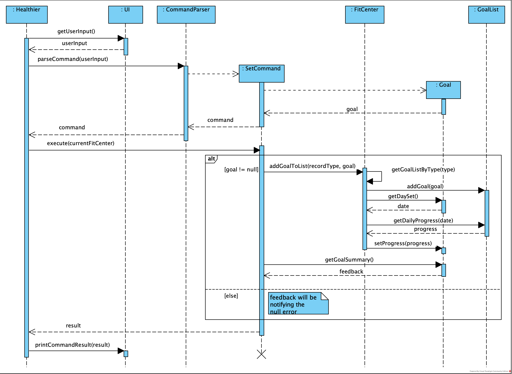

[Home](README.md)

# Healthier Developer Guide

Group `CS2113-F10-2`  
Last update on `12 Apr 2021`
---

## Table of Contents

- [Getting Started](#getting-started)
- [Design](#design)
    - [Architecture](#architecture)
        - [Interactions between major components](#the-interactions-between-major-components)
    - [Components](#components)
        - [UI component](#ui-component)
        - [Parser component](#parser-component)
        - [Command component](#command-component)
        - [Entity component](#entity-component)
        - [Common component](#common-component)
- [Implementation](#implementation)
    - [Add record feature](#add-record-feature)
    - [Set goal feature](#set-goal-feature)
- [Future Works](#future-works)
- [Appendix: Requirements](#appendix-requirements)
    - [Product Scope](#product-scope)
        - [Target User Profile](#target-user-profile)
        - [Value Proposition](#value-proposition)
    - [User Stories](#user-stories)
    - [Non-Functional Requirements](#non-functional-requirements)
- [Glossary](#glossary)
- [Instructions for manual testing](#instructions-for-manual-testing)

---

## Getting Started

1. Fork [this repo](https://github.com/AY2021S2-CS2113-F10-2/tp) to your GitHub account
1. Clone the forked repo into your machine
1. Ensure you have **Java SE 11** installed
1. Import the repo in your Java IDE as project
1. Start hacking!

> 💡 You are advised to choose JetBrain's Intellij IDEA as your IDE.

[**Get back to Table of Contents**](#table-of-contents)

---

## Design

This section describes design details of the app Healthier.

### Architecture

<h5 align="center">Figure 1: Architecture Diagram</h5>
The high-level design of Healthier is shown in *Figure 1: Architecture Diagram* given above.

`Healthier` corresponds to the main class that coordinates the execution of this application. It is where the `main`
method is located. It is responsible for,

* When app starts: Initializes essential data objects from stored files and displays basic information about the status
  of the app by utilizing the UI component.
* When app is running: Handles user input and coordinates corresponding operations by invoking methods from `Parser`
  and `Command` classes.
* When app ends: Terminates the execution of this app.

`Common` contains classes that can be repeatedly used by other components.

In addition to that, the app also consists of following components:

* `UI`: Handles the display of ui messages as well as user input.
* `Parser`: Processes the raw user input with validations and passes usable info to `Command` components.
* `Command`: Performs operations according to the command that the user input.
* `Storage`: Handles the read & write of various data files created/stored locally.
* `Account`: Manages the user accounts.
* `Entity`: Contains data objects that are essential to this app.

> 💡Healthier is an application that runs locally without Internet connections.  
> Data files will be stored in the format of plain-text documents for easy inspection and test.

Each of the components has corresponding Java classes that

* Define data attributes and methods in different levels of abstraction.
* Provide various APIs (i.e. public members) that can be utilized by other classes.

More information about the components will be discussed in the [Components](#components) section.

#### The interactions between major components

We will take how Healthier handles user's input as an representative example to illustrate the internal logic of this
application.

The *Sequence Diagram* of the operation is given below:

<h5 align="center">Figure 2: Sequence Diagram of handling user input</h5>

After initialization, `Healthier` calls the `loopCommand()` method, which gets user input in a while loop which
terminates only when the command is `exit`, i.e. `"exit"` is received.  
Inside the loop, `UI` will handle the read of user input, and pass the raw input in `String` to `CommandParser`, where
the input will be validated and a corresponding instance of `Command` will be created.  
After that, the `execute` command will be invoked and the returned result in `String` will be printed by `UI`. At the
end of the loop, the `store()` method of `Storage` will be called to update the local files to reflect any changes, and
the parsed parameters in `CommandParser` will be cleared to get ready for next parse.

### Components

#### UI component

**API**: `UI.java`

* Provides various public methods defined for displaying messages in the CLI, such as command result & error messages.
* Facilitates getting raw user input in `String`.
* Instances are primarily utilized in `Healthier.java`, where the `main` method is located.

#### Parser component

**API**: `CommandParser.java`

* Gets raw user input in `String` passed by the `UI` component.
* Recognizes command patterns from the raw input according to the command syntax.
* Validates mandatory/optional arguments supplied by the user.
* Processes and packages the arguments in the format that can be used by `Command` components.
* Returns a new `Command` instance initialized with relevant parameters according to the user input.
* Returns `InvalidCommand` if an erroneous input is received.

#### Command component

**APIs**: `Command.java`, `CommandResult.java`, etc

* Consists of an abstract class `Command.java` from which all other command classes (subclasses) inherit.
* Each subclass corresponds to one text command defined in the user guide.
* Each subclass must implement the abstract `execute` method, which invokes APIs defined in `Entity` classes to perform
  an operation.
* Each subclass has an attribute `feedback`, which is a `String` that stores the result of the command execution.

How the command is executed?

1. `UI` component takes in user's input, which is then passed to `Parser` component.
2. `Parser` component processes the user input and create a `Command` object initialized with relevant parameters.
3. The `Command` object is returned to `Healthier`, in which the `execute` method is invoked.
4. The `execute` method returns the execution result in `String`, which is displayed by `UI`.

#### Entity component

**APIs**: `Goal.java`,`Record.java`,`GoalList.java`, `RecordList.java`, etc

<h5 align="center">Figure 3: class structure for entity classes</h5>

* Each`User` stores a `FitCenter` object that holds all the records and goals for the user.
* Each `FitCenter` stores four `RecordList` and four `GoalList` for `EXERCISE`, `DIET`, `SLEEP`, `BODY_WEIGHT` type
  respectively.
* `Record` is an abstract class, which is the superclass for different types of records.
* `Goal` is an abstract class, which is the superclass for different types of goals.
* Each `RecordList` is composed of `Record`. Each `GoalList` is composed of `Goal`.

#### Common component

**API**: `messages.java`

* Classes that can be repeatedly used by other components are located in the `seedu.duke.common` package.
* Currently used as collection of frequently used messages.

[**Get back to Table of Contents**](#table-of-contents)

---

## Implementation

This section describes details of how some of the important features are implemented, which can give some insights about
how features are realized in general.

### Add record feature

Adding a record to record list is achieved by `AddCommand` and `RecordList`. Records of the same category are stored as
a `RecordList`. A `ReocrdList` supports the following operation:

* `RecordList#addRecord(Record newRecord)` — Add a new record of the specified type to the list.

All `Record` in a `RecordList` are of the same type so each user has 4 `RecordList` to hold `EXERCISE`, `DIET`
, `BODY_WEIGHT`, `SLEEP` records respectively.

`FitCenter` is a uniform interface to manipulate all the `RecordList` and provide
interface `FitCenter#addRecordToList(CommandRecordType type, Record record)`

Given below is an example of interaction among classes to add a new exercise record:

Step 1. The user enters a valid `add` command. An `AddCommand` will be initialized with the parsed parameters from user
input.

Step 2. The `AddCommand` initializes a `Record` and
calls `FitCenter#FitCenter#addRecordToList(CommandRecordType type, Record record)` to add the record.

> 💡 If any of the parameters passed are invalid, `AddCommand` will throw an error and will not call `FitCenter#FitCenter#addRecordToList(CommandRecordType type, Record record)`, so the record will not be saved into the `RecordList`.

Step 3.`FitCenter#FitCenter#addRecordToList(CommandRecordType type, Record record)`
calls `RecordList#addRecord(Record newRecord)` to modify the list.

The following sequence diagram shows how the `add` command works:

<h5 align="center">Figure 3: Sequence Diagram of adding a record</h5>

[**Get back to Table of Contents**](#table-of-contents)

### Set Goal feature

The functionality of setting a goal and maintaining the goal in a goal list is achieved by `SetCommand`.   
The realization is facilitated by `FitCenter`, as discussed previously in the [Add record feature](#add-record-feature)
.  
A goal has the following attributes: `dateSet`, `intervalType`, `target`, and `progress`.   
As a goal corresponds to a kind of record, each goal object will also have a `type` attribute, which can be `EXERCISE`
, `DIET`, `SLEEP`, and `BODYWEIGHT`.  
Hence, once a goal object is created, it will be added to a `GoalList` in which more operations are defined and utilized
by `FitCenter`, which contains the following method:

* `FitCenter#addGoalToList(CommandRecordType type, Goal goal)` - add a goal object to the goal list.

**How the setting is done?**

Take the example of setting a goal:

Step 1. The user enters a valid set command. A `SetCommand` instance will be initialized with parameters from user input
parsed by `CommandParser` .

Step 2. The `SetCommand` initializes a `Goal` with parameters specified by the user, and the command object is returned
to `Healthier`.

Step 3. The `execute` method of the `SetCommand` object is invoked, and it
calls `FitCenter#addGoalToList(CommandRecordType type, Goal goal)` by passing the goal object of a particular record
type, which adds the goal into the goal list.

Step 4. If the `Goal` object is not null, `FitCenter#addGoalToList(CommandRecordType type, Goal goal)`
calls `GoalList#addGoal(Goal newGoal)` to update the list and the progress of the goal (if any).

The following *Sequence Diagram* illustrates how the `set` command works:

<h5 align="center">Figure 5: Sequence Diagram of Setting a Goal</h5>

---

## Future Works

1. Smart recommendation for `food` and `workout`.
1. Multi-user capability with file separation & encryption.
1. Friend/leaderboard features that encourages user to compete.
1. Some other health indicators for monitoring, such as `height` and `blood pressure`.
1. Graphical user interface.

---

## Appendix: Requirements

### Product Scope

#### Target User Profile

* People who care about fitness
* People who exercise regularly (at least 3 times/week) and have diet plans
* Age group:18-30
* People who are proficient in using CLI tools& typing.

#### Value proposition

* Help users record and analyze daily diet data.
* Help users record sleeping data.
* Help users record exercise data such as calorie burned.
* Help users record basic information (gender, weight, etc).
* Help users set/manage fitness goals (e.g. body-weight, exercise).

[**Get back to Table of Contents**](#table-of-contents)

### User Stories

|Version| As a ... | I want to ... | So that I can ...|
|--------|----------|---------------|------------------|
|v1.0|new user|see usage instructions|refer to them when I forget how to use the application|
|v1.0|user|upload/delete my workout exercise/duration data|keep track of my exercise history daily|
|v1.0|user|upload/delete my diet details|keep track of the food I eat daily|
|v1.0|user|upload/delete my sleeping data|keep track of my sleeping hours daily|
|v1.0|user|upload/delete my body weight|keep track of my body weight daily|
|v1.0|user|view my history workout exercise/duration data|know the progress of my strength|
|v1.0|user|view my diet details|know my daily/weekly calorie intake|
|v1.0|user|view my history sleeping data|see my past sleeping hours daily/weekly|
|v1.0|user|view my history body weight data|monitor the weight change|
|v2.0|user|set goals for exercises|have a reference and try to reach my exercise goals|
|v2.0|user|set goals for diet|have a reference and try to reach my diet goals|
|v2.0|user|set goals for body weight|have a reference and try to reach my exercise goals|
|v2.0|user|set goals for sleeping hours|have a reference and try to reach my weight goals|
|v2.0|user|check existing goals set|view the list of achieved goals and know the progress of unachieved goals|
|v2.0|user|cancel a goal set previously|stop tracking a goal that I am no longer interested in achieving|
|v2.1|user|use the app without encountering bugs|ensure my data are correctly recorded|

### Non-Functional Requirements

* Cross-platform and high compatibility.
* User-friendly and bug-free experience.
* Detailed and easy-to-follow user guide.
* Boost efficiency for people who are familiar with CLI tools.
* Easy maintenance.
* Scalable for additional features.
* Responsive interface.

[**Get back to Table of Contents**](#table-of-contents)

---

## Glossary

* *CLI* - Command-line Interface.
* *Record* - Contains all important data of a particular health activity, such as activity name, date, etc.
* *Goal* - A reminder with desired target that can be completed by adding records.

[**Get back to Table of Contents**](#table-of-contents)

---

## Instructions for manual testing

[**Get back to Table of Contents**](#table-of-contents)  
[Home](README.md)