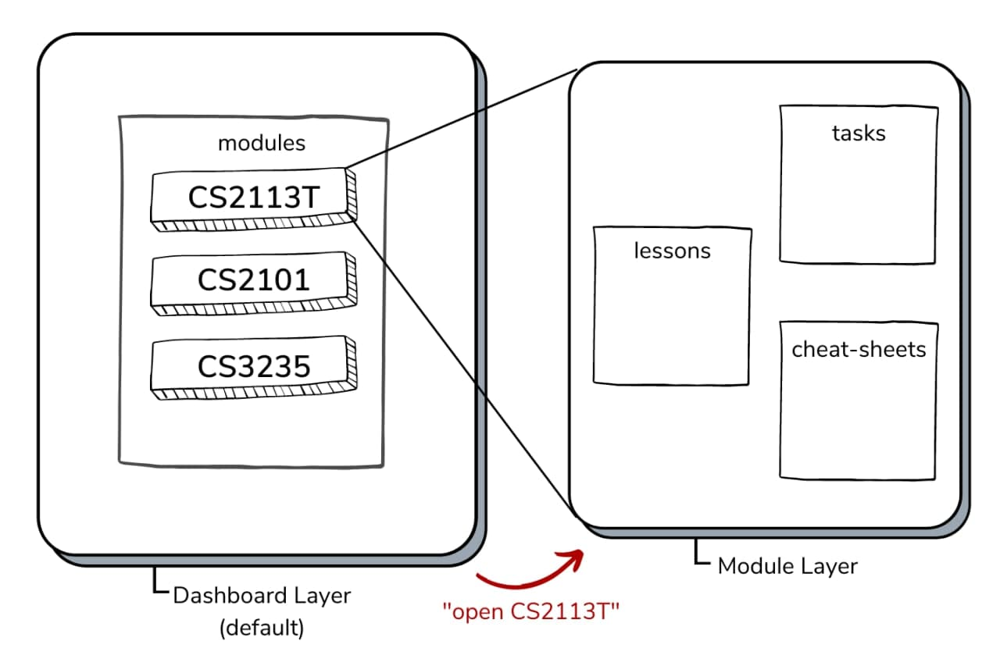

# GULIO Developer Guide

**GULIO (Get Ur Life In Order)** is a desktop app that provides a single consolidated and personalised workspace for NUS SOC students to organize their modules. It is optimized for use via a Command Line Interface (CLI) which SOC students will be familiar with typing in, instead of a Graphical User Interface (GUI).

This guide is for developers looking to modify GULIO. For users of GULIO, please refer to the User Guide [here](UserGuide.md).

&nbsp;

----

## Table of Contents

* [How to Use This Guide](#how-to-use-this-guide)
* [Setting up GULIO on Your Computer](#setting-up-gulio-on-your-computer)
* [Introduction](#introduction)
* [Design](#design)
    * [Architecture](#architecture)
    * [UI Component](#ui-component)
    * [Parser Component](#parser-component)
    * [Command Component](#command-component)
    * [Model Component](#model-component)
    * [Storage Component](#storage-component)
    * [Common Classes](#common-classes)
* [implementation](#implementation)
    * [Add Lesson](#add-lesson)
    * [Adding of Cheat-Sheet](#adding-of-cheat-sheet)
    * [Loading & Storing of Data](#loading--storing-of-data)
    * [Future Features](#future-features)
* [Appendix: Requirements](#appendix-requirements)
    * [Product Scope](#product-scope)
    * [User Stories](#user-stories)
    * [Non-Functional Requirements](#non-functional-requirements)
    * [Glossary](#glossary)
* [Appendix: Instruction for Manual Testing](#appendix-instruction-for-manual-testing)
    * [Launching GULIO](#launching-gulio)
    * [Exiting GULIO](#exiting-gulio)
    * [Adding a Module](#adding-a-module)
    * [Deleting a Module](#deleting-a-module)
    * [Opening a Module](#opening-a-module)
    * [Closing a Module](#closing-a-module)
    * [Adding a Lesson](#adding-a-lesson)
    * [Deleting a Lesson](#deleting-a-lesson)
    * [Opening a Link](#opening-a-link)

&nbsp;

----

## How to Use This Guide

> Icons used in this guide: 
>  
> 💡 - Indicates a tip that may be useful to you. 
> ⚠ - indicates a warning that you should take note of.

&nbsp;

----

## Setting up GULIO on Your Computer

1. Fork [this repo](https://github.com/AY2021S2-CS2113T-W09-3/tp), and clone the fork into your computer.
1. Ensure you are using Java 11 or above.
1. Import the project in your IDE.

> 💡 You are highly recommended to use Intellij IDEA.
>
> To set up Intellij:
> 1. Ensure Intellij is configured to use JDK 11.
> 1. Import the project as a Gradle project.
> 1. Verify the setup:
     >   1. Run `seedu.duke.Duke` and try a few commands.
>   1. Run the tests to ensure they all pass.

&nbsp;

----

## Introduction

### Background of GULIO

GULIO is a command line application for NUS SOC students to organize their modules. It has a 2-layer system: dashboard layer and module layer. In both layers, the user has access to a different set of commands.

On start up, the user will be on the dashboard layer and has an overview of all their modules. They will have access to module management commands such as adding, deleting or opening a particular module. Opening a module then puts them on the module layer where they can interact with the data within the module.

     
    Figure 1 - Visualisation of GULIO’s 2-layer system

Currently, GULIO is a basic university module manager intended to provide students with an overview and consolidated workspace for all of their modules, lessons, tasks and cheat-sheets. Going forward, we feel that GULIO has the potential for many more features to be added, some of which are proposed in the “Implementation” section.

### Purpose

This document describes the architecture and implementation details of the command line application, GULIO.

### Scope

This describes the software architecture and software design decisions for the implementation of GULIO. The intended audience of this document is the developers, designers, and software testers of GULIO.

&nbsp;

----