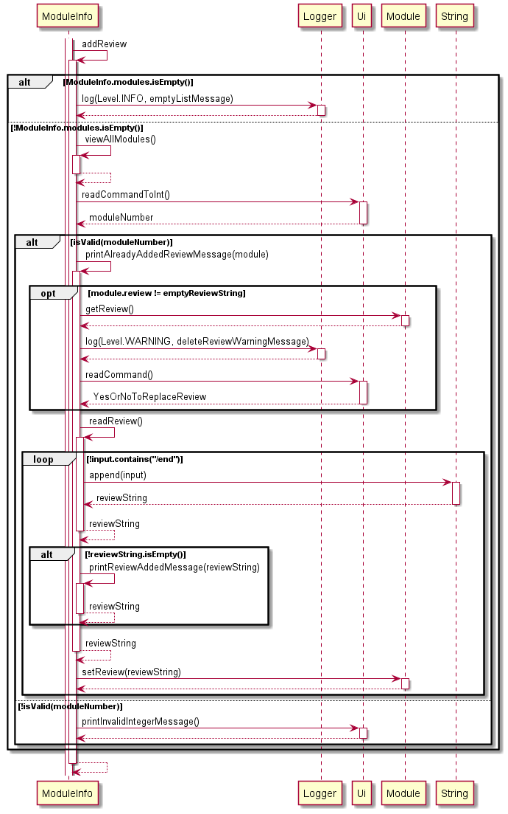
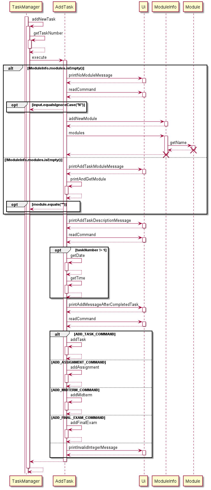
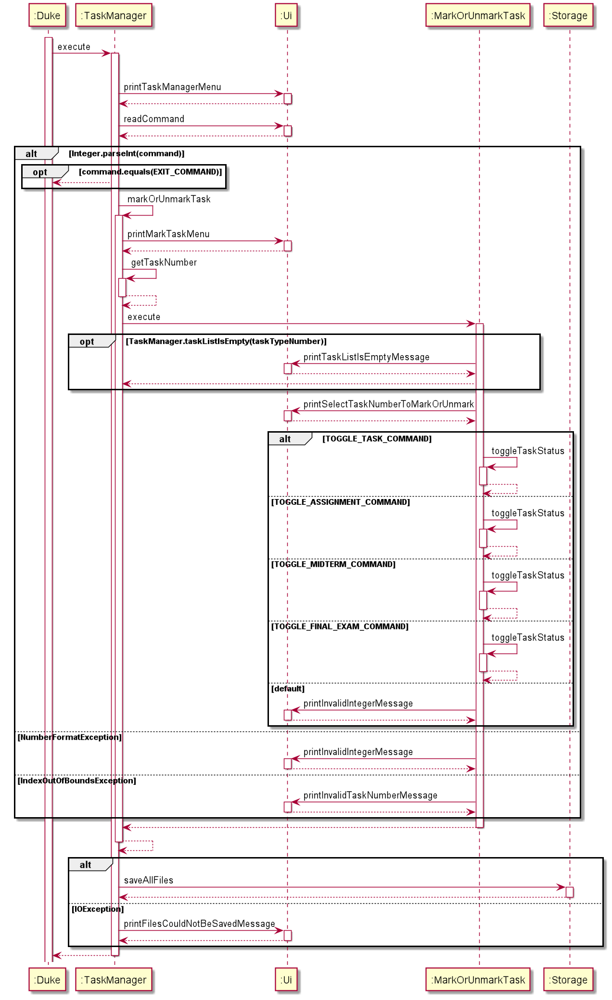
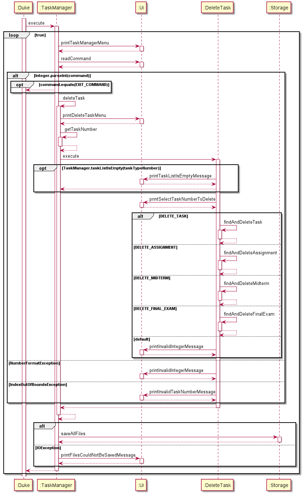
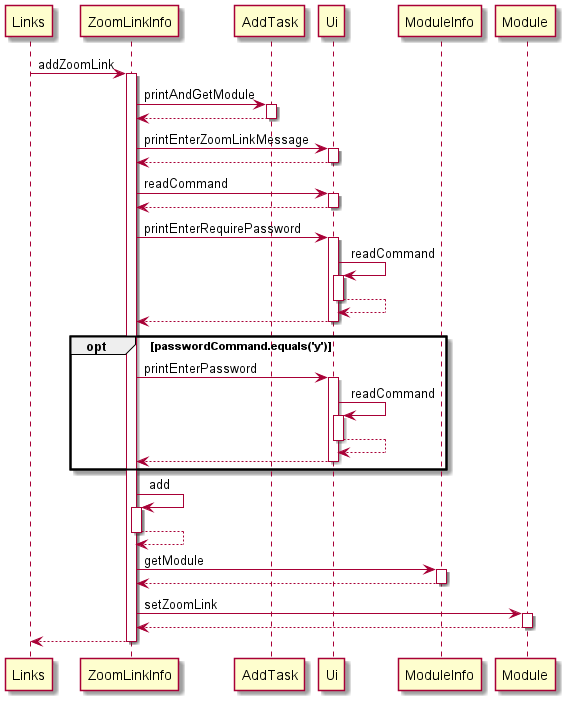
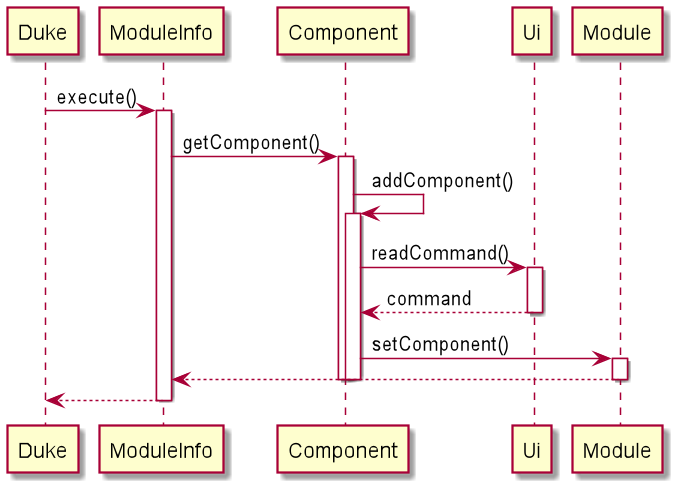

# Developer Guide

## Table of Contents

[1. Introduction](#1-introduction)  

&nbsp;&nbsp;&nbsp;&nbsp;[1.1 About This Developer Guide](#11-about-this-developer-guide)  
&nbsp;&nbsp;&nbsp;&nbsp;[1.2 How to Use This Developer Guide](#12-how-to-use-this-developer-guide)  
&nbsp;&nbsp;&nbsp;&nbsp;[1.3 Conventions in This Developer Guide](#13-conventions-in-this-developer-guide)

[2. Setting Up](#2-setting-up)

[3. Design](#3-design)  

&nbsp;&nbsp;&nbsp;&nbsp;[3.1 Architecture](#31-architecture)  
&nbsp;&nbsp;&nbsp;&nbsp;[3.2 UI Class](#32-ui-class)

[4. Implementation](#4-implementation)  

&nbsp;&nbsp;&nbsp;&nbsp;[4.01 Add New Review](#401-add-new-review)  
&nbsp;&nbsp;&nbsp;&nbsp;[4.02 Delete a Review](#402-delete-a-review)  
&nbsp;&nbsp;&nbsp;&nbsp;[4.03 Add New Task](#403-add-new-task)  
&nbsp;&nbsp;&nbsp;&nbsp;[4.04 Mark/Unmark a Task as Done](#404-markunmark-a-task-as-done)  
&nbsp;&nbsp;&nbsp;&nbsp;[4.05 Delete a Task](#405-delete-a-task)   
&nbsp;&nbsp;&nbsp;&nbsp;[4.06 View All Tasks](#406-view-all-tasks)  
&nbsp;&nbsp;&nbsp;&nbsp;[4.07 Pin A Task](#407-pin-a-task)  
&nbsp;&nbsp;&nbsp;&nbsp;[4.08 Add Zoom Link](#408-add-zoom-link)  
&nbsp;&nbsp;&nbsp;&nbsp;[4.09 Add Module Components](#409-add-module-components)  
&nbsp;&nbsp;&nbsp;&nbsp;[4.10 View Module Components](#410-view-module-components)  

[5. Product scope](#5-product-scope)    

&nbsp;&nbsp;&nbsp;&nbsp;[5.1 Target user profile](#51-target-user-profile)   
&nbsp;&nbsp;&nbsp;&nbsp;[5.2 Value proposition](#52-value-proposition)

[6. User Stories](#6-user-stories)

[7. Non-Functional Requirements](#7-non-functional-requirements)

[8. Glossary](#8-glossary)

[9. Instructions for manual testing](#9-instructions-for-manual-testing)

---

## 1. Introduction

- UniTracker is a one-stop application for NUS students to keep track of their work in school.

- It comprises 4 key features (ModuleInfo, SU Calculator/Simulator, TaskManager, Links) that helps
  to organise all information they need in one place.

- Users are allowed to add and edit module information, tasks, zoom links to suit their needs.

- This product is optimal for NUS students who prefer Command Line Interface (CLI) over Graphical
  User Interface (GUI).

### 1.1 About This Developer Guide

This developer guide was made to help you set up UniTracker on your computer for usage, testing and further implementations. It also provides you with
all the information you need to use UniTracker alongside detailed diagrams on the implementation of our different features and how they integrate together.

### 1.2 How to Use This Developer Guide

Firstly, refer to [Section 2. Setting Up](#2-setting-up) for instructions on setting up UniTracker
on and IDE on your local computer.

Once UniTracker is up and running, you can refer to the [table of contents](#table-of-contents) to
navigate to specific sections to explore and learn about our different features and how they were implemented.

### 1.3 Conventions in This Developer Guide

> 📝 **Note!**  
> This is a note section. Additional useful information will be written in sections such as this one.

> ⚠️ **<span style="color: red"> WARNING! </span>**  
> This is a warning section. Any user interaction with UniTracker that may result in issues or unintended results will be written in sections such as this one.


---

# 2. Setting Up

1. Ensure you have version 11 of Java. You can install it
   from [here](https://docs.aws.amazon.com/corretto/latest/corretto-11-ug/downloads-list.html).
2. Fork the UniTracker repo from [here](https://github.com/AY2021S2-CS2113T-F08-4/tp).
3. Clone the fork on to your computer. We recommend using Sourcetree for this. You can download
   Sourcetree from [here](https://www.sourcetreeapp.com/).
4. Download and open Intellij. You can download Intellij
   from [here](https://www.jetbrains.com/idea/)
5. If you are not in the welcome screen, click `File` -> 'Close project' to close the existing
   project dialog.
6. Set up the correct JDK version for Gradle.
    1. Click `Configure` -> `Project Defaults` -> `Project Structure`
    2. Click `New...` and set it to the directory of the JDK.
7. Click `Open or Import` in Intellij.
8. Locate the `build.gradle` file, select it and click `OK`.
9. If asked, choose to `Open as Project`.
10. Click `OK` to accept the default settings.
11. Right click on the `Duke.java` file and select `Run Duke.main()`.
12. If the set up was done right, you should see this welcome message:
    ````  
     Welcome to 
       _   _               _      _____                                _
      | | | |   _ _       (_)    |_   _|     _ _    __ _      __      | |__     ___       _ _
      | |_| |  | ' \      | |      | |      | '_|  / _` |    / _|     | / /    / -_)     | '_|
       \___/   |_||_|    _|_|_    _|_|_    _|_|_   \__,_|    \__|_    |_\_\    \___|    _|_|_
     _|"""""| _|"""""| _|"""""| _|"""""| _|"""""| _|"""""| _|"""""| _|"""""| _|"""""| _|"""""|
     "`-0-0-' "`-0-0-' "`-0-0-' "`-0-0-' "`-0-0-' "`-0-0-' "`-0-0-' "`-0-0-' "`-0-0-' "`-0-0-'
  
    This is the list of your pinned tasks:
  
    Main Menu:
    [1] Module Information
    [2] CAP Simulator/Calculator
    [3] Task Manager
    [4] External Links
    [5] Exit Program
    ````

---

## 3. Design

### 3.1 Architecture

The `Duke` class contains the main method of our application.

- At the start of the application, it initializes all the classes in sequence.

We have 5 main classes for our key features.

- `ModuleInfo`: contains methods for our module information features.
- `HelpGraduation`: contains methods for our SU calculator/simulator.
- `TaskManager`: contains methods for our task management features.
- `Links`: contains methods for our links features.
- `Storage`: Write data to, and loads data to hard disk


### 3.2 UI Class

This class handles the interactions with the user and contains the methods for system output.

---

## 4. Implementation

### 4.01 Add New Review

This feature allows user to `add a review` for any of the modules they have taken.

> 📝 **Note!**  
> This action will **overwrite** any existing reviews with the new review.


```
> CS2113T is very fun:) I have learnt so many important concepts.
> Overall 10/10 :)
> /end
Woohoo~ Review added:  
CS2113T is very fun:) I have learnt so many important concepts.  
Overall 10/10 :) 

Returning to module information menu...
  ```
Given below is the sequence diagram for the feature:  
  
A general explanation of how this feature works:

**Problem**: When the user wants to review a module, he/she should be able to type ___multiple lines
of input___, as reviews are generally long and detailed.

**Solution**: A `while` loop is used to take in multiple lines of input until the input contains
the `/end` symbol. Anything typed after this `/end` symbol will be erased.

**When overwriting this review with a new review**: The old review will be printed for user
reference. The user will also be alerted that this action will delete his/her old review via a log.
The log is printed out as a warning.


### 4.02 Delete a Review

This feature allows user to delete a review from the `module`.

A general explanation of how this feature works:

Deleting a review would __reset__ the `Review` *String* attribute of a `module` to a default value
of:  
`"You have not reviewed this module yet."`

### 4.03 Add New Task

This feature allows the user to add tasks of type `task`, `assignment`, `midterm`, `final exam` to a
task list.

All task types (except `Task`, which contains arguments 1, 2 and 5) contain 5 arguments upon
creation:

1) `Module Code` <br> Example: `CS2113T`
2) `Task Description` <br> Example: `Finish v2.0`
3) `Date` <br> Example: `2021-03-21`
4) `Time` <br> Example: `23:59`
5) `Message` <br> Example: `Good job!`

Given below is the sequence diagram for the feature:  


A general explanation of how this feature works:

When the user calls this feature, the application will prompt them to input the arguments required
for task creation. This new task will then be stored into an `ArrayList` for future reference. The
user has to input a valid format for the __date__ and __time__ field (refer to section 3.3.1 of User
Guide or the example above), and our application will convert it to a more readable format for the
user. Using the example above,

- `2021-03-21` will be outputted as `Mar 21 2021`
- `23:59` will be outputted as `11:59 PM`

The user input for `Message` (argument 5 above) will be printed out when the user deleted the task,
signalling completion.

### 4.04 Mark/Unmark a Task as Done

This feature allows the user to mark or unmark tasks of type `task`, `assignment`, `midterm`, `final exam` as done.

Given below is the sequence diagram for this feature:


A general explanation of how this feature works:

When the user calls this feature, the application will prompt them to choose the __task
type__ (`task`, `assignment`, `midterm`, `final exam`) of the task they want to mark/unmark. All existing
tasks in the ArrayList for the task type they chose will then be printed out, and the user has to
input the index of the task they want to mark/unmark. 

Depending on the current status of the task, the user will be informed of the current status of the task and be asked if they want to change it.

Upon marking a task as done, the `Message` that the user inputted upon creation of this particular task will then be printed out.


### 4.05 Delete a Task

This feature allows the user to delete a task of type `task`, `assignment`, `midterm`, `final exam`
from a task list.

Given below is the sequence diagram for this feature:


A general explanation of how this feature works:

When the user calls this feature, the application will prompt them to choose the __task
type__ (`task`, `assignment`, `midterm`, `final exam`) of the task they want to delete. All existing
tasks in the `ArrayList` for the task type they chose will then be printed out, and the user has to
input the index of the task they want to delete. The task they select will then be deleted from
the `ArrayList`.

### 4.06 View All Tasks

This feature allows the user to view all their existing tasks for all task types.

Given below is the sequence diagram for this feature:


A general explanation of how this feature works:

When the user calls this feature, the application will first iterate through and print out the pinned task list.
This is then followed by the `task` list, `assignment` list, `midterm` list and `final exam` list.

### 4.07 Pin a Task

This feature allows the user to pin a task of type `task`, `assignment`, `midterm`, `final exam`
from a task list.

Given below is the sequence diagram for this feature:


A general explanation of how this feature works:

When the user calls this feature, the application will prompt them to choose the __task
type__ (`task`, `assignment`, `midterm`, `final exam`) of the task they want to pin. All existing
tasks in the `ArrayList` for the task type they chose will then be printed out, and the user has to
input the index of the task they want to pin. 

The pinned task list is stored using a HashMap, with the key being the __task type__ and value being an ArrayList.
The task the user selected will then be added to the respective pinned task
ArrayList corresponding to the __task type__ they chose.

### 4.08 Add Zoom Link

Given below is the sequence diagram for the feature:  


A general 4-step explanation of how this feature works is shown below:

Step 1. The ZoomLinkInfo#addZoomLink() method calls AddTask#printAndGetModule() which asks the user
to input the number corresponding to the module code they want, and returns the module code.

Step 2. The ZoomLinkInfo#addZoomLink() method calls other methods in the Ui class to determine the
link, and whether a password is required for the Zoom meeting.

> 📝 **Note!**  
> If the user does not require the zoom link to be tagged to a module,
> AddTask#printAndGetModule() in Step 1 would return an empty string, and the module code would be
> initialised to "Zoom link has no module code".

Step 3. The ZoomLinkInfo#addZoomLink() method then calls ModuleInfo#getModule() in order to retrieve
the module object which is stored in the ModuleInfo class.

Step 4. Module#setZoomLink then sets the `zoomLink` attribute of the module object to the zoom link
that was entered.

### 4.09 Add Module Components
This feature allows user to add user-defined module components and its related weightage for an
existing module.

  
How the feature works:  
The feature is facilitated by the `Component` class and a call to `addComponent()` is performed upon
expected user input to add a new component to a module.

First, a call to `Ui` is performed to find out what module* the user wishes to add a component (and
its weightage). Secondly, a `for` loop is run to find whether the module entered by the user is
stored in the system.  
Here, there are two possible routes:

- If the module is present, a call to `Ui` is performed to find out the component name and the
  associated weightage for that component.
- If the module is not present, the call to `addComponent()` returns to `ModuleInfo` class (main
  class for module-related commands).

Assuming the first route is well executed, the component (and its weightage) is stored in a
Hashtable format in the `Module` object specified by the user previously*.

### 4.10 View Module Components

How the feature works:  
The feature is an extension of the `Component` feature.

It allows user to view all the module components under a module specified by the user input.

Improvement: the total weightage (in whole numbers) of the module should not exceed 100.


---

## 5. Product scope

### 5.1 Target user profile

This product is for NUS students to help them to keep track/add/edit module information, and
deadlines. This product is for users who prefer CLI over GUI.

### 5.2 Value proposition

Our product is user-specific as it allows users to customize and personalize their own module
information and deadlines to suit their needs. Our product allows users to organize their own daily
schedules and keep track of their deadlines all on one platform.

Information and materials of our various modules are on varying platforms; some could be on Luminus,
or the professor's personal websites, or sent to us via email, or on Wiki.nus. We want to solve the
issue of being disorganized and confused over not knowing or remembering where certain information
is.

By using UniTracker, users will be able to store all necessary details on one platform so that they
can keep track of commonly accessed information while keeping track of the tasks they have.

---

## 6. User Stories

|Version| As a ... | I want to ... | So that I can ...|
|--------|----------|---------------|------------------|
|v1.0|new user|see usage instructions|refer to them when I forget how to use the application|
|v1.0|student|add zoom links| find them more quickly without always having to log into LumiNUS or checking the email|
|v1.0|student|add external links| refer to them more easily
|v2.0|user|find a to-do item by name|locate a to-do without having to go through the entire list|
|v2.0|user| store my information | view them later without having to re-type them again 
---

## 7. Non-Functional Requirements

1. Must be able to work on any Mainstream OS as long as Java 11 (or above) is installed.
2. Must be able to work completely offline

---

## 8. Glossary

* Mainstream OS: Windows, Linux, macOS
---

## 9. Instructions for manual testing

*[This section will be completed in the future.]* <br>
{Give instructions on how to do a manual product testing e.g., how to load sample data to be used
for testing}
