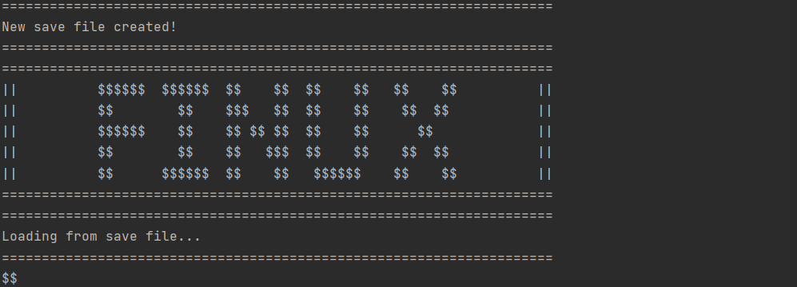
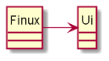
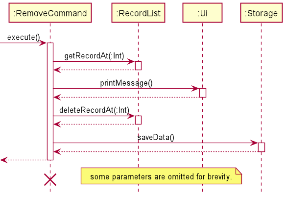

# Developer Guide

# *FINUX*

## Table of Content

---

1. [Introduction](#1-introduction)\
   1.1 [Purpose](#11-purpose)\
   1.2 [Using this Guide](#12-using-this-guide)
2. [Setting Up](#2-setting-up)\
   2.1 [Setting up the project in your computer](#21-setting-up-the-project-in-your-computer)\
   2.2 [Before writing code](#22-before-writing-code)
3. [Design](#3-design)\
   3.1 [Architecture](#31-architecture)\
   3.2 [UI Component](#32-ui-component)\
   3.3 [Parser Component](#33-parser-component)\
   3.4 [CommandHandler Component](#34-commandhandler-component)\
   3.5 [RecordList Component](#35-recordlist-component)\
   3.6 [Storage Component](#36-storage-component)
4. [Implementation](#4-implementation)\
   4.1 [Add Feature](#41-add-feature)\
   4.2 [List Feature](#42-list-feature)\
   4.3 [View Feature](#43-view-feature)\
   4.4 [Return Feature](#44-return-feature)\
   4.5 [Remove Feature](#45-remove-feature)\
   4.6 [Storage Feature](#46-storage-feature)\
   4.7 [Credit Score Feature](#47-credit-score-feature)
5. [Documentation, Logging, Testing, and DevOps](#5-documentation-logging-testing-and-devops)\

[Appendix A: Product Scope](#appendix-a-product-scope)\
\
[Appendix B: User Stories](#appendix-b-user-stories)\
\
[Appendix C: Non-Functional Requirements](#appendix-c-non-functional-requirements)\
\
[Appendix D: Instructions For Manual Testing](#appendix-d-instructions-for-manual-testing)

## 1. Introduction

---

**Greetings from Finux!**

**Finux** is a CLI Style application that allows the user to make better financial
decisions based on the information recorded in the application. If you’re familiar
with the CLI command interface, you will enjoy the benefit of speeding up your
finance management rather than using the traditional management system.

**Finux** is written in Java 11 and uses the Object-Oriented Programming (OOP) paradigm.
OOP enables us to produce organized and reusable codes, allowing efficient improvements
and revisions in the future.

### 1.1 Purpose

This guide is for new and current developers of **Finux**. It describes the overall architecture
design of **Finux** and describes the current implementation details of our main features
with the thought process behind each of them. The current edition of this guide is meant for
the `v2.1` release.

### 1.2 Using this Guide

Throughout the guide, you might encounter several icons, refer to the following consolidate
list of icons:

> 💡 It indicates that this is an important piece of information.\
> ❗  It indicates that this is a warning and you should be aware of it while developing.\
> 📝 It indicates that this is a tip and you may find it useful when using our application or guide.

> 📝 Text that are blue like this [example(jumps to 1.2)](#12-using-this-guide), are clickable links
> that will move you to the relevant section of the guide.

## 2. Setting Up

---

### 2.1 Setting up the project in your computer

Ensure that you have the following installed:
* JDK 11
* Intellij IDEA (Highly Recommended)

Firstly, **fork** this repo and **clone** a copy into your computer.

If you plan to use IntelliJ IDEA:
1. **Ensure IntelliJ is configured to develop in JDK 11.**
   1. If you are not at the welcome screen, click `File` > `Close Projects` to close any currently opened projects.
   1. Click on `Configure` > `Structure for New Projects` > `Project Settings` > `Project`, ensure
      the `Project SDK` is using **JDK 11**.
1. **Import the project as a Gradle Project.**
   1. Click on `Import Project` and locate the `build.gradle` file and select it. Click `OK`.
   1. If prompted, choose to `Open as Project` (not `Open as File`).
   1. Click `OK` to accept the default settings but do ensure that the selected version of `Gradle JVM`
      matches the JDK being used for the project.
   1. Wait for the importing process to finish (it could take a few minutes).
1. **Verify the setup.**
   1. After importing successfully, locate the `src/main/java/seedu.duke/Duke.java` file, right click it, 
      and choose `Run...`. If the setup is correct, you should see the following:
   

### 2.2 Before writing code

#### 2.2.1 Configuring the Coding Style

If you are using IDEA, follow this guide 
[IDEA: Configuring the code style](https://se-education.org/guides/tutorials/intellijCodeStyle.html)
to setup IDEA's coding style to match ours.

#### 2.2.2 Set up CI

There is no set up required as the project comes with GitHub Actions config files, located in `.github/workflows`
folder. When GitHub detects these files, it will run the CI for the project automatically at each push to the master
branch or to any PR.

#### 2.2.3 Learn the Design

Before starting to write any code, we recommend that you have a look at Finux's overall design by reading
[Finux's Architecture](#31-architecture) section.

## 3. Design

---

### 3.1 Architecture

Note: Not final implementation yet, need refactor Parser and CommandHandler into
CommandLogic.

{Describe the design and implementation of the product. Use UML diagrams and short code snippets where applicable.}

### 3.2 UI Component

\
*Figure 1: Ui Class Diagram*

The Ui Component consists of a `Ui` class which handles all user input and system output.
The Ui is only dependent on the `Duke` class and does not interact directly with other classes,
ensuring a high level of cohesiveness, low level of coupling and separation of roles.

The `Ui` component actively listens for:
* the execution of commands to print the result of a `command`

### 3.3 Parser Component

*Figure X: ParserHandler Class Diagram*

#### Description
The Parser component consist of 1 class called `ParserHandler`.
The role of `ParserHandler` can be interpreted as a "manager" or "middle man" to parse
the user input from the console into an `ArrayList<String>` format.

#### Design
In the main program, `ParserHandler` is instantiated through the constructor `new ParserHandler()`,
finalizing the startOptionArray, endOptionArray, and middleOptionArray. Whenever the program needs
to parse a user input, the ParserHandler calls the method `getParseInput` and returns an `ArrayList<String>`.

1. `getParseInput` will trim the leading white space before calling `startExtraction`.
2. `startExtraction` will check if the trimmed input starts with option. If yes, extract the option and 
   remove the option from the trimmed input before calling `extractSubsequencePart`.
3. `extractSubsequencePart` will check for the next option index and extract whatever is in between the start of the 
   trimmed input to the start of the next option index. This is the argument tagged after the option. 
   * Any leading or trailing white space of the argument field will be removed.
   * If no argument is provided, the argument would be stored an empty string.

   Afterward, the checking mechanism will loop until no valid next options are left in the input before calling
   `extractFinalPart`.
   * Valid next option format: `' <option> '` with 1 leading and trailing whitespace. e.g. `' -e '`
4. `extractFinalPart` will check if the last trimmed input ends with option. If yes, extract the option and 
   add an empty string as the argument, else just add the last trimmed input to the ArrayList. 
5. Finally, after the extraction to ArrayList<String> is complete, `extractFinalPart` will 
   call `checkFirstBlock` for the final check to parse any `help` or `creditscore` in the first argument block.
   
#### Parser Component Design Consideration
1. Leading and trailing whitespace should be considered carefully especially with options involve.
   * Input starting with valid option should consider the possibility of multiple leading whitespaces, 
   thus `stripLeading()` should be applied.
   * Input ending with valid option should also be considered with possibility of multiple trailing whitespaces,
   thus `stripTrailing()` should be applied as well.
2. Checking of options in the start, end, and during the processing should be considered carefully with accordance 
   to consideration 1.
   * Starting option should be in the form of `'<option> '` with no leading whitespace and 1 trailing whitespace. 
     e.g. `'-e '`
   * Ending option should be in the form of `' <option>'` with 1 leading whitespace and no trailing whitespace.
     e.g. `' -e'`
   * During processing, next option should be in the form of `' <option> '` with 1 leading and trailing whitespace.
     e.g. `' -e '`
3. As rearrangement of options is allowed, option detection should cater to non-fixed option order. 
   Apache Commons Lang, 3.11, providing the StringUtils class is used to cater to consideration 2.
   * StringUtils.startsWithAny() - detection of start option with non-fixed order.
   * StringUtils.endsWithAny()   - detection of end option with non-fixed order.
   * StringUtils.indexOfAny()    - detection of during processing option with non-fixed order.
4. As multiple whitespaces is allowed, options and arguments should be fully trimmed (leading and trailing).
5. getParseInput should always return a new ArrayList<String> per new input.

### 3.4 CommandHandler Component
...

### 3.5 RecordList Component
...

### 3.6 Storage Component
...

## 4. Implementation

---

This section introduces the specific implementation details and design thought processes
of some features in **Finux**.

### 4.1 Add Feature
...

### 4.2 List Feature
...

### 4.3 View Feature
...

### 4.4 Return Feature
...

### 4.5 Remove Feature

The remove feature aims to allow users to remove records after querying the record's
index number with the `list` command. The users will be able to then use the `remove`
command to delete certain records that they deem obsolete or is incorrect. Hence, this feature
allows them to amend their mistakes or edit their list with constraints.

#### 4.5.1 Current Implementation

The remove feature is facilitated by `RemoveCommand`. By running the command with required options and relevant 
parameters, our `Parser` will construct the `RemoveCommand` object which will validate the input and provide
relevant parameters that will be used in the execute function.

Given below is an example usage scenario of how `RemoveCommand` behaves at each step.

***Step 1:***\
User executes the command `remove -i 1`. The application invokes `CommandHandler#createCommand()`, and since the 
command type is `remove`, the `createCommand` constructs a `RemoveCommand` object. The validation of the constructed
`RemoveCommand` is done in the constructor. The created command is then returned to `Finux`.

***Step 2:***\
The `CommandHandler` terminates after parsing user input and creating the corresponding Command object. The application
invokes `RemoveCommand#execute()` to execute the user's instruction.

***Step 3:***\
The `RemoveCommand` first invokes `RecordList#getRecordAt(recordNumberInt)` to get the record located at index
`recordNumberInt`. The record retrieved will be used in the next step.
> 📝 `recordNumberInt` is the index number that you will see on the list minus by one.

***Step 4:***\
The application invokes `Ui#printMessage()` and prints the record that will be removed with their respective 
`toString()` method. 

***Step 5:***\
The application invokes `RecordList#deleteRecordAt(recordNumberInt)` which removes the record located at the index 
`recordNumberInt`.

***Step 6:***\
The application invokes `Storage#saveData()` to save the modification on the record list onto the save file after the
removal of the record is successful. This will then enable future file loading to be accurate and there are no mismatch
of information or records.

The sequence diagram presented below depicts the interaction between the components for running the command.
`remove -i 1`.
> 📝 The sequence diagram starts from Step 2 onward.
> 
> 📝 The `CommandLooper` only serves as a user input reader here and takes certain actions when certain allowed commands
> are given.

*Figure x: Sequence Diagram for `remove -i 1`*

#### 4.5.2 Design Consideration

This section shows the design considerations taken when implementing the remove feature.

Aspect: **When should the application validate the user input index**

Since it is entirely possible that the index provided by the user can be invalid where the indices may be one of the
following:
* negative numbers
* numbers that refer to non-existent records
* non-numerics (e.g. alphabets, symbols, etc.)\

There is a need to validate the index given by the user to ensure that the application does not terminate unexpectedly
and that suitable error messages are printed to notify the user of their intentional or unintentional parameter inputs.

|Approach | Pros | Cons| 
|---------|------|-----|
|During command execution.|No additional class required.|A new argument for the `execute()` method is needed. It also increases coupling and decreases cohesion.|
|During command creation.|Decreases coupling and increases cohesion as there is a clear cut in between responsibilities. The arguments of `execute()` can remain consistent with other command types.|Duplication of validation may occur in other commands.|

Having considered two of the approaches, we have decided to adopt the second approach which is to validate the index
during command creation. The lower coupling and higher cohesion was the deterministic factor here and also the
consistency of the arguments in `execute()` can also be maintained.

Aspect: **The way the index is specified(option)**

As the user has to specify the index of which record to remove, the index has to be provided but is `-i` required?

|Approach|Pros|Cons|
|--------|----|----|
|Have to use `-i`|The options will be consistent with the `return` command as it requires the user to input an index as well|Extra time is used to enter 2 more characters just to satisfy the application requirement where the `remove` command actually only need one parameter.|
|Do not have to use `-i`|Saves the time needed to input the 2 characters.|It will be inconsistent to require users to include `-i` for the `return` command but not for the `remove` command.|

With the two approaches considered, we have decided to adopt the first approach as it gives consistency for the
user experience, and it will not cause any confusion. The time wasted is negligible, and the consistency provides
long-term benefit.

### 4.6 Storage Feature
...

### 4.7 Credit Score Feature
...

## 5. Documentation, Logging, Testing, and DevOps

---

...

## Appendix A: Product Scope

---

### A.1 Target User Profile

* prefers typing in CLI instead of GUI interactions
* ...

### A.2 Value proposition

{Describe the value proposition: what problem does it solve?}

## Appendix B: User Stories

---

|Version| As a ... | I want to ... | So that I can ...|
|--------|----------|---------------|------------------|
|v1.0|user|be able to add a record (expense) with dates|record each expense into the app.|
|v1.0|clumsy user|be able to delete wrong inputs|easily rectify errors in the record list.|
|v1.0|debt collector (Student)|list down a list of people who owes me money with a deadline|make sure that they return their money.|
|v1.0|student|list each and every incurred expense|better manage my daily/weekly expenses.|
|v1.0|SOC student|have a CLI style money management system|accomplish tasks faster typing on a CLI compared to clicking on a GUI.|
|v1.0|user|be able to view the total expenditure, saving and loan credit|know the total amount of each category for planning and viewing.|
|v1.0|debt collector (Student)|mark a loan as returned|know which loans are returned to me.|
|v1.0|new user|know the list of commands|use the app correctly.|
|v2.0|new user|know what function I can use|tell what are the valid inputs for the application.|
|v2.0|lender|know the loanee's punctuality on returning the loan|gauge who to continue lending money the next time.|
|v2.0|student|know how trustworthy a person is according to a score indicator|decide how risk-free it is to lend money to the said person.|

## Appendix C: Non-Functional Requirements

---

1. The application should be responsive.
1. The application should work on most operating systems (OS) such as Windows and Linux with `Java 11` installed.
1. Users who can type fast should be able to complete equivalent tasks faster as compared to using a mouse.
1. Users should be able to use the application with ease with the help of the User Guide (UG) and the Developer's Guide (DG).

## Appendix D: Instructions for manual testing

---

{Give instructions on how to do a manual product testing e.g., how to load sample data to be used for testing}

## Glossary

---

* *glossary item* - Definition
