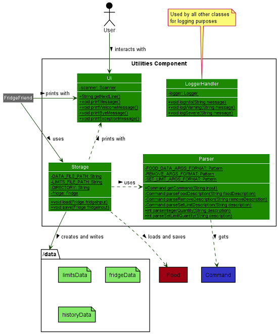

# Developer Guide

## Introduction

`FridgeFriend` is an app for managing food in the fridge, optimised for use via a Command Line Interface (CLI).
If you can type fast, `FridgeFriend` can track your cold or frozen groceries faster and easier than any other apps.
It is written in Java, and has more than 3.2kLoC.

## Design

### Architecture


The ***Architecture Diagram*** given above explains the high-level design of the App. 
Given below is a quick overview of each component.


The Main driver class for the FridgeFriend app is
named **[`FridgeFriend`](https://github.com/AY2021S2-CS2113-T10-1/tp/blob/master/src/main/java/seedu/fridgefriend/FridgeFriend.java)**.
It is responsible for,
* At app launch: Initializes the components in the correct sequence, and connects them up with each other.
* At shut down: Shuts down the components and invokes cleanup methods where necessary.


The rest of the App consists of four components.

* [**`Utilities`**](#utilities-component): The main component containing the key driver classes in
  FridgeFriend, such as `Parser`, `UI`, and `Storage`.


* [**`Command`**](#command-component): Executes commands based on the input obtained
  and processed from `Parser` in `Utilities`. The list of executable commands can be found in our
  [User Guide](https://ay2021s2-cs2113-t10-1.github.io/tp/UserGuide.html).


* [**`Food`**](#food-component) represents a collection of classes used by the FridgeFriend application.
  Food objects are instantiated by the `Command` Component. Once a `Food` object is created,
  it may be stored to disk using the `Storage` function in `Utilities`.


* [**`Exception`**](#exception-component) represents a collection of classes that represent potential
  exception events that may occur during the usage of `FridgeFriend`. The `Exception` component
  facilitates the return of exceptions to the `UI` class in `Utilities`, which will display
  the error message to the user.


### Command Component

The Command component contains the sub classes of the features that will be executed.

The command Object is executed by the main method in FridgeFriend.
The execution of the command can affect the fridge.
After the execution, the results of the command object is pass to the UI.
The results of the command instruct the Ui to display the message return to the user.


The ***Command Class Diagram*** given above shows how the Command interact with Fridge. 

The Command Component consist of 10 sub class which each command represents a features. 

* **AddCommand**: Add a food object to the fridge when executed.
* **RemoveCommand**: Remove a portion of food quantity from a particular food in the fridge when executed.
* **ListCommand**: List details of food either by a category, storage location or all off it when executed.
* **SearchCommand**: Search for the details of the food. 
* **ExpiringCommand**: Provide the list of item that is expiring in a week when executed. 
* **ClearCommand**: Clear the list of food objects in the fridge object.
* **HelpCommand**: List the instruction on how to use all the commands in FridgeFriend.
* **RunningLowCommand**: Provide the food category that are running low compare to the limit set in the Food Category.
* **SetLimitCommand**: Change the default quantity limit in that particular Food Category.
* **ByeCommand**: Indicate to the main method to exit the program. 

### Utilities Component

The Utilities component contains the main classes that run the main functions of FridgeFriend.



The ***Utilities Class Diagram*** given above shows how the classes in the Utilities component interact with each other and classes from other component.

The Utilities Component consists for 4 classes.

- **`LoggingHandler`**: Logs information during execution to the console.
- **`Parser`**: Breaks down user input into relevant objects.
- **`Storage`**: Reads data from, and writes data to, the local disk.
- **`Ui`**: Handles the input and output of the application.

### Exception Component

The Exception component represents a collection of classes that represent potential
exception events that may occur during the usage of `FridgeFriend`. 

The `Exception` component facilitates the return of exceptions to the `UI` class 
in `Utilities`, which will display the corresponding error message to the user.


The ***Exception Class Diagram*** given above shows the custom `Exceptions`
created for the FridgeFriend project, and stored inside the `Exceptions` component. 

All exceptions extend from the Java default `Exception` class. They only differ with regard
to the throwable error message.

The `Exceptions` component currently consists of ten (10) custom Exceptions, as of v2.0:

Among these ten custom exceptions, the `Exceptions` component can generally be 
classified into three broad categories:

_Exceptions related to invalid user input:_
- **`EmptyDescriptionException`**: Is thrown when an empty input string is detected by `Parser`, where
  an input is expected.
  - Error Message: `"Sorry my friend, the description cannot be empty."`
- **`InvalidFoodCategoryException`**: Is thrown when user input is not a valid `FoodCategory`,
  where a valid `FoodCategory` is expected. Users can check `help` or the
  [User Guide](https://ay2021s2-cs2113-t10-1.github.io/tp/UserGuide.html).
  - Error Message: `"Sorry my friend, FOOD_CATEGORY is not a valid category."`
- **`InvalidDateException`**: Is thrown when user input, where a date is expected, does not
  match the `dd-mm-yy` format.
    - Error Message: `"Sorry my friend, the date must be in the form 'dd-mm-yy'."`
- **`InvalidIndexException`**: Is thrown when user input does not translate into a valid integer index that represents
  an existing Food in the Fridge, where
  a valid input index that represents Food that exists in the Fridge is expected.
    - Error Message: `"Please enter a valid index to remove food."`
- **`InvalidInputException`**: Is thrown when an unrecognised command is input into FridgeFriend,
  or when the List Command does not recognise the secondary input string.
    - Error Message: `"Sorry my friend, please give a valid input."`
- **`InvalidQuantityException`**: Is thrown when user input is not an integer where an integer is expected for
  `Quantity` related functions, or when excess quantity of food is removed from the Fridge, where the quantity
  of food in the fridge remaining would be negative.
    - Error Message: `"Sorry my friend, the quantity QUANTITY_INPUT must be a number."`
    - Error Message: `"Not enough in fridge to remove!"`

_Exceptions related to Food:_
- **`FoodNameNotFoundException`**: Is thrown when the input string contains the name of a Food that is
  not found in the Fridge, where the name of a food existing in the Fridge is expected.
  - Error Message: `"Food specified not found."`
- **`RepetitiveFoodIdentifierException`**: Is thrown when user attempts to add duplicate Food to the Fridge in a 
  different location or with a different expiry date. This is not allowed as of v2.0.
    - Error Message: `"Sorry my friend, you have added this food before but in a different location or have different expiry dates.
      Please specify another foodname."`

_Exceptions related to file storage:_
- **`StorageLoadingException`**: Is thrown when an error occurred during loading of the saved data.
    - Error Message: `"There was an error loading the data for FridgeFriend!"`
- **`StorageSavingException`**: Is thrown when an error occurred during saving of the current data.
    - Error Message: `"There was an error saving the data for FridgeFriend!"`

## Implementation

## Product scope

### Target user profile

{Describe the target user profile}

### Value proposition

{Describe the value proposition: what problem does it solve?}

## User Stories

|Version| As a ... | I want to ... | So that I can ...|
|--------|----------|---------------|------------------|
|v1.0|new user|see usage instructions|refer to them when I forget how to use the application|
|v2.0|user|find a to-do item by name|locate a to-do without having to go through the entire list|

## Non-Functional Requirements

{Give non-functional requirements}

## Glossary

* *glossary item* - Definition

--------------------------------------------------------------------------------------------------------------------


## **Appendix: Instructions for manual testing**

Given below are instructions to test the app manually.

**Note:** These instructions only provide a starting
point for testers to work on; testers are expected to do more *exploratory* testing.


### Launch and shutdown

1. Ensure that you have Java 11 or above installed.
2. Download the latest version of `FridgeFriend` from [here](https://github.com/AY2021S2-CS2113-T10-1/tp/releases/tag/v1.0).
3. Copy the file to the folder you want to use as the home folder for your `FridgeFriend`.
4. Open your Command Line Terminal in the folder where `FridgeFriend.jar` is located, and run
   `FridgeFriend` with `java -jar FridgeFriend.jar`.
5. Type the command in the command box and press Enter to execute it. e.g. typing list and pressing Enter will show a
   list of all current food.
6. To terminate the app, use the `bye` command. It is also acceptable to interrupt the Command Line Terminal with 
   `Ctrl+C` or closing the terminal.   

### Adding food

When adding food, the `FridgeFriend` application requires a very specific format, so that all attributes of 
a given food can be added to the Fridge. This might be very troublesome for manual testing.

Here are some inputs you can try:
* `add chicken /cat meat /exp 30-06-2021 /loc lower_shelf /qty 100`
  * Inputs a `chicken` of category `meat`, with expiry date of `30-06-2021`, location of `lower_shelf`, and 
    quantity of `100`.
* `add milk /cat dairy /exp 31-12-2021 /loc fridge_door /qty 2`
  * Inputs a `milk` of category `dairy`, with expiry date of `31-12-2021`, location of `fridge_door`, and
    quantity of `2`.
* `add Coke /cat beverage /exp 30-07-2021 /loc upper_shelf /qty 5`
  * Inputs a `Coke` of category `beverage`, with expiry date of `30-07-2021`, location of `upper_shelf`, and
    quantity of `5`.    
* `add squid /cat seafood /exp 15-08-2021 /loc freezer /qty 100`
  * Inputs a `squid` of category `seafood`, with expiry date of `15-08-2021`, location of `freezer`, and
    quantity of `100`.

For subsequent examples below, this guide assumes that these four foods `chicken`, `milk`, `Coke`, and `squid`
have been added to the Fridge. 

### Listing food

The `list` command in `FridgeFriend` has three (3) variations:
* List all food in the fridge.
* List all food of a certain category in the fridge.
* List all food of a certain storage location in the fridge.

The latter two commands will return an output that is a subset of the first command (_List all food_).

No items will be listed if no food in the fridge match the conditions specified in the command.

1. Test case: `list`
* Expected:
  ```
  Here are the items in your fridge:
    1. Food name: chicken, category: MEAT, expiry: 30-06-2021, stored in: LOWER_SHELF, quantity: 100
    2. Food name: milk, category: DAIRY, expiry: 31-12-2021, stored in: FRIDGE_DOOR, quantity: 2
    3. Food name: Coke, category: BEVERAGE, expiry: 30-07-2021, stored in: UPPER_SHELF, quantity: 5
    4. Food name: squid, category: SEAFOOD, expiry: 15-08-2021, stored in: FREEZER, quantity: 100
  ```

2. Test case: `list meat`
* Expected:
  ```
  These are the MEAT in your fridge:
    1. Food name: chicken, category: MEAT, expiry: 30-06-2021, stored in: LOWER_SHELF, quantity: 100
  ```    

3. Test case: `list freezer`
* Expected:
  ```
  These are the food stored in FREEZER:
	  1. Food name: squid, category: SEAFOOD, expiry: 15-08-2021, stored in: FREEZER, quantity: 100
  ```    

### Removing a food
Removing a food while all foods are being shown.

1. Prerequisites: List all foods using the `list` command. Multiple food in the list.
2. Test case: `remove squid /qty 100`
    * Expected: `squid` is deleted from the list. Details of the deleted food shown in the status message. Additional
      warning that `seafood` is running low may appear.
3. Test case: `remove chicken /qty 50`
    * Expected: Quantity of `chicken` is reduced by 50. Details of the removed food shown in the status message.
      Additional warning that `meat` is running low may appear.
4. Test case: `remove coke /qty 1`
    * Expected: `Food specified not found.` Note that the search for food name in this command is case sensitive;
      note that when `Coke` was added, it was with a capital 'C'. No food is removed.
5. Test case: `remove Coke /qty 69`
    * Expected: `Not enough in fridge to remove!` User attempted to remove a greater quantity than what was
      available in the fridge. Error message was thrown. No food is removed.
6. Test case: `remove chicken`
    * Expected: `Sorry my friend, please give a valid input.` It is required to specify the quantity to be removed with
      `/qty`.

### Searching for a food
Checks if a food is in the fridge, and if it is found, outputs the location of the food.
If it is not found, outputs `You do not have FOOD_INPUT in your fridge.`

1. Test case: `search chicken`
    * Expected: `You have chicken stored in LOWER_SHELF of your fridge.`
2. Test case: `search pear`
    * Expected: `You do not have pear in your fridge.`
3. Test case: `search chick`
    * Expected: `You do not have chick in your fridge.`

### Expiring food
This feature might be slightly more challenging to test, since the user tester has to input a food
that has an expiry date within 7 days of their **local system time**, as of the date of testing.

1. Prerequisites: Add a food with an expiry date within 7 days of the user's system date.
    * Modify the input in the above [add command](adding-food) in order to fulfil this requirement.
    * Example: The current date on my system time is `29-03-2021`. 
      * Prior to testing, I perform the command `add duck /cat meat /exp 30-03-2021 /loc lower_shelf /qty 100`.
      * Thus, this food should expire in 1 day, within the 7 days required to trigger the `expiring` command.
2. Test case: `expiring`
    * Expected:
  ```
  These are the food expiring in the next week:
      1. Food name: duck, category: MEAT, expiry: 30-03-2021, stored in: LOWER_SHELF, quantity: 100
  ```  

### Runninglow and Setlimit

By default, the `limits` for all food is set at `500`. Use `setlimit` to modify this number for a certain food category.

1. Preparation: Change the limits for `meat`, `dairy`, `beverage`, `seafood`, since they are the categories of food
   we have added to the fridge so far.
    * `setlimit meat /qty 200`
    * `setlimit dairy /qty 5`
    * `setlimit beverage /qty 3`
    * `setlimit seafood /qty 50`
2. Test case: `runninglow`
    * Expected:
   ```
   You are running low on food in these categories:
   1. VEGETABLE quantity: 0 out of 500
   2. FRUIT quantity: 0 out of 500
   3. MEAT quantity: 100 out of 200
   4. EGG quantity: 0 out of 500
   5. DAIRY quantity: 2 out of 5
   6. COOKED_DISH quantity: 0 out of 500
   7. READY_TO_EAT quantity: 0 out of 500
   8. FROZEN quantity: 0 out of 500
   9. OTHER quantity: 0 out of 500
    ```
   
Note that `SEAFOOD` AND `BEVERAGE` category are omitted from the above list,
as they are not "running low". There is sufficient food from the given category in the
fridge, because it is above the quantity we have specified by `setlimit`.

### History
While the history command may be simple to test, the expected output may vary depending on the food added by 
the user during testing. 

Therefore, user testers should manually compare the results of the `history` command with their actual input
during testing, and see if they correspond. 

1. Prerequisites: Only the input in the above [add command](adding-food) was added to the list. 
   No other food was added to the list.
    * Note: To reset the history, use `history clear`.
    * `add chicken /cat meat /exp 30-06-2021 /loc lower_shelf /qty 100`
    * `add milk /cat dairy /exp 31-12-2021 /loc fridge_door /qty 2`
    * `add Coke /cat beverage /exp 30-07-2021 /loc upper_shelf /qty 5`
    * `add squid /cat seafood /exp 15-08-2021 /loc freezer /qty 100`
2. Test case: `history`
    * Expected: 
   ```
   This is the full history of items you've added in the fridge:
     1. Food name: chicken, category: MEAT, expiry: 30-06-2021, stored in: LOWER_SHELF, quantity: 100
	    2. Food name: milk, category: DAIRY, expiry: 31-12-2021, stored in: FRIDGE_DOOR, quantity: 2
	    3. Food name: Coke, category: BEVERAGE, expiry: 30-07-2021, stored in: UPPER_SHELF, quantity: 5
	    4. Food name: squid, category: SEAFOOD, expiry: 15-08-2021, stored in: FREEZER, quantity: 100
   ```

### Saving data
_Dealing with missing/corrupted data files._

All data is stored in the `/data` folder in the same folder as `FridgeFriend.jar`.

Three (3) text files will be generated in the folder during usual execution of `FridgeFriend`.
These text files are used to store data in the disk for various commands during the usual operation of `FridgeFriend`.

1. `fridgeData.txt`
    * Contains the food stored in the fridge. 
    * Is automatically loaded when `FridgeFriend` starts. Food in the text file will be stored in the fridge.
    * The text file will be updated with the contents of the fridge when the `FridgeFriend` application is terminated
    using the `bye` command.
    * The text file will **not** be updated if `FridgeFriend` is not terminated with the `bye` command,
    such as when the runtime is interrupted with `Ctrl+C`.
    * _Missing data file:_ A new, blank `fridgeData.txt` will automatically be created upon launching `FridgeFriend`.
    The fridge at program launch will be empty. No further action needed.
    * _Corrupted data file:_ Upon program launch, `FridgeFriend` will throw an exception with 
      an accompanying error message:
        ```
        There was an error loading the data for FridgeFriend!
        Index 1 out of bounds for length 1
        ```
      * `FridgeFriend` will load the contents of the text file until the point in the file where corrupted/invalid
        data is encountered.
      * User can recover the contents of the file by manually inspecting the text file and removing invalid content.  
2. `limitsData.txt`
    * Contains the food quantities used to determine which food is running low in `setlimit` and `runninglow`.
    * Is automatically loaded when `FridgeFriend` starts. The loaded content can be viewed with `runninglow`.
    * The text file will be updated with the contents of the fridge when the `FridgeFriend` application is terminated
     using the `bye` command.
    * The text file will **not** be updated if `FridgeFriend` is not terminated with the `bye` command,
     such as when the runtime is interrupted with `Ctrl+C`.
    * _Missing data file:_ A new, blank `fridgeData.txt` will automatically be created upon launching `FridgeFriend`.
          The limits of all food categories will be reset to the default of 500. No further action needed.  
    * _Corrupted data file:_ 
        * Test case: Corrupted categories. 
           * If the corrupted category is readable: No error message will be shown. User can only identify that data 
             has been corrupted when using the `runninglow` command. The quantity of the invalid categories due to 
             corruption will be reset to `500`.
          * If the corrupted category is unreadable: 
            ```
            There was an error loading the data for FridgeFriend!
            Index 1 out of bounds for length 1
            ```
              * The quantity limits will be parsed up until the corrupted unreadable category. 
                Subsequent quantity limits in the file would not be parsed, and will be reset to the default of `500`.
        * Test case: Corrupted quantities.
          * If the corrupted quantity is an integer: No error message will be shown. User can only identify that 
            data has been corrupted when using the `runninglow` command. The limit will be updated to the corrupted 
            value.
          * If the corrupted quantity is **not** an integer: Error message will be shown. 
            ```
            There was an error loading the data for FridgeFriend!
            Sorry my friend, the quantity must be a number.
            ```
            * The quantity limits will be parsed up until the corrupted non-integer value. Subsequent quantity limits
                in the file would not be parsed, and will be reset to the default of `500`.
3. `historyData.txt`
    * Contains the logs of food added to the fridge using `add` command.
    * Is automatically updated whenever a successful `add` command is invoked.  
    * Content is loaded from disk only when `history` command is invoked.
    * _Missing data file:_ A new, blank `fridgeData.txt` will automatically be created upon executing the `history`
      command. No further action needed.
   * _Corrupted data file:_
       * Test case: If corrupted data is readable. No error message will be shown. User can only identify that data
             has been corrupted when using the `history` command. The `history` command will continue to print out
            the contents of the file, including the corrupted data.
            * While this corrupted data would not affect program flow, it may create unexpected output. If necessary, 
              users can manually inspect the file and remove unwanted data at their own discretion.
       * Test case: If corrupted data is unreadable. No error message will be shown. User can only identify that
         data has been corrupted when using the `history` command. The contents of the entire file will not be parsed, 
         even if there is valid content in some parts of the file.
            * The contents of the file will not be affected. If necessary,
              users can manually inspect the file and remove corrupted data, in order to salvage any valid data.
        
      
## Attribution

The format of this User Guide was adapted from [AddressBook Level 3(AB3) Developer Guide](https://github.com/se-edu/addressbook-level3/blob/master/docs/DeveloperGuide.md).