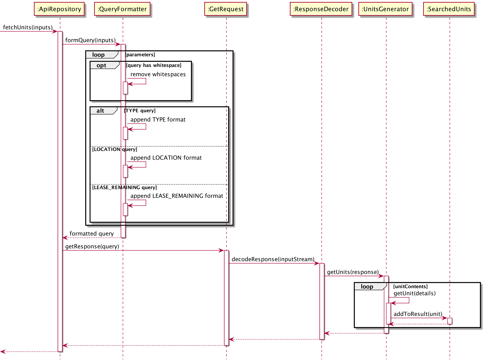

# Developer Guide

## Design & implementation

**`HdBuy`** has [`HdBuy`](https://https://github.com/AY2021S2-CS2113-F10-1/tp/blob/master/src/main/java/seedu/hdbuy/HdBuy.java). It is responsible for,
* At app launch: Loads previously shortlisted resale flats, if any, and starts receiving user commands.
* At shut down: Clears search history and saves shortlisted resale flats to local file.

The rest of the App consists of:

* [**`Api`**](#api-component): Retrieves data on resale flats from server.
* [**`Command`**](#command-component): The command executor.
* [**`Parser`**](#parser-component): Translate user input to valid commands to be executed.
* [**`Ui`**](#ui-component): Communicates with user via messages.
* [**`Data`**](#data-component): Contains user input history and temporary memory.
* [**`Storage`**](#storage-component): Reads data from, and writes data to, the hard disk.
* [**`Common`**](#common-component): Models of objects used internally.

### Api component

The `Api`,

* receives a raw query from Find Command, query will contain filter conditions.
* creates a connection to remote server containing data on resale flats.
* formats raw query into valid query to be sent as a GET request.
* returns all flats matching filter conditions and is parsed back to Command to be shown to user via Ui.
* does not depend on other components apart from being called by Command.

**How classes within Api component interact with each other**

The *Sequence Diagram* below shows how the components interact with each other for the scenario where a Find command is executed.

## Product scope
### Target user profile

Low-to-middle income single users looking to buy resale flats.

### Value proposition

Easily find and bookmark resale flats available matching user's preference.

## User Stories

|Version| As a ... | I want to ... | So that I can ...|
|--------|----------|---------------|------------------|
|v1.0|user|find units by location, flat type and lease remaining|search for resale flats matching my preferences|
|v2.0|new user|see usage instructions|understand all the available commands|
|v2.0|returning user|bookmark potential flats|refer to them in the future|
|v2.0|user|sort flats by price, in either ascending or descending order|view flats matching my budget|

## Non-Functional Requirements

1.  Should work on any _mainstream OS_ as long as it has Java `11` or above installed.
2.  Requires internet connection.
3.  A user with above average typing speed for regular English text (i.e. not code, not system admin commands) should be able to accomplish most of the tasks faster using commands than using the mouse.

## Glossary

* **Mainstream OS**: Windows, Linux, Unix, OS-X

## Instructions for manual testing

{Give instructions on how to do a manual product testing e.g., how to load sample data to be used for testing}
