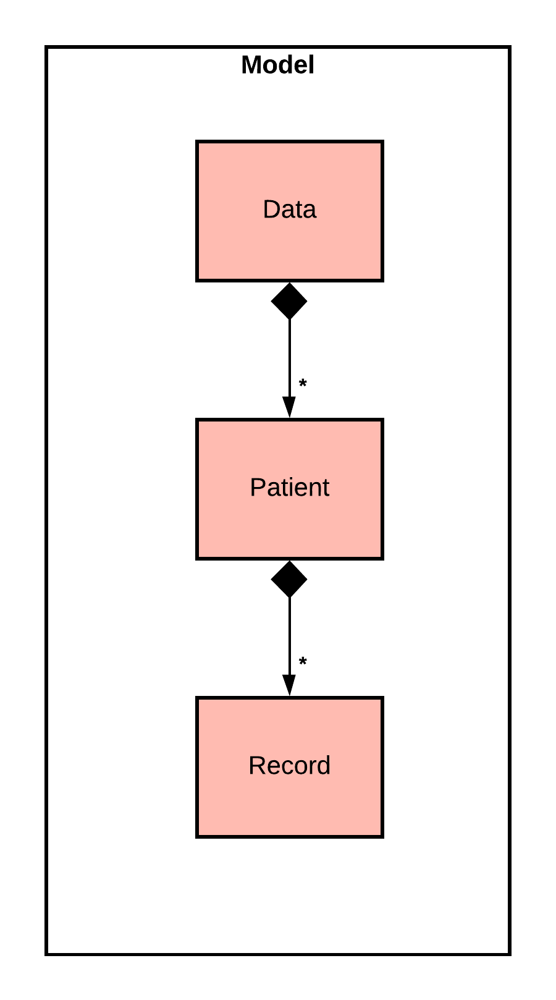
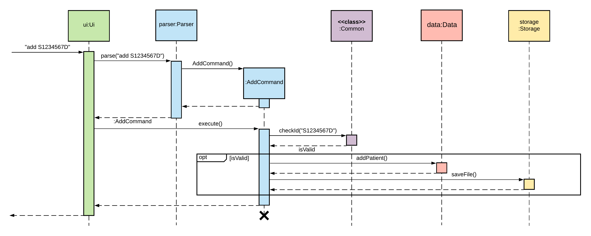

<!-- @author brandonfoong -->
<style type="text/css">
ol {
    counter-reset: item
}
ul {
    counter-reset: item
}
ol > li {
    counter-increment: item;
}
ol ol > li {
    display: block
}
ol ol > li:before {
    content: counters(item, ".") ". ";
}
</style>

# Patient Manager Developer Guide

## Table of Contents

1. [Introduction](#introduction)
1. [Setting up the project in your computer](#setting-up-the-project-in-your-computer)
1. [Application Design](#application-design)
    1. [Architecture](#architecture)
        1. [Interaction Among Architecture Components](#interaction-among-architecture-components)
    1. [UI Component](#ui-component)
    1. [Logic Component](#logic-component)
    1. [Model Component](#model-component)
    1. [Storage Component](#storage-component)
    1. [Exception Component](#exception-component)
    1. [Commons](#commons)
1. [Implementation](#implementation)
    1. [Parsing User Input](#parsing-user-input)
    1. [Initializing Command Class](#initializing-command-class)
    1. [Adding Patients](#adding-patients)
    1. [Loading Patients](#loading-patients)
    1. [Exception Handling](#exception-handling)
    1. [Organization of the Model Component](#organization-of-the-model-component)
1. [Appendix A: Product scope](#appendix-a-product-scope)
    1. [Target user profile](#target-user-profile)
    1. [Value proposition](#value-proposition)
1. [Appendix B: User Stories](#appendix-b-user-stories)
1. [Appendix C: Non-Functional Requirements](#appendix-c-non-functional-requirements)
1. [Appendix D: Glossary](#appendix-d-glossary)
1. [Appendix E: Instructions for Manual Testing](#appendix-e-instructions-for-manual-testing)
    1. [Launch, Help and Shutdown](#launch-help-and-shutdown)
    1. [Adding and Loading Patients](#adding-and-loading-patients)
    1. [Adding, Viewing and Deleting a Patient's Visit Records](#adding-viewing-and-deleting-a-patients-visit-records)
    1. [Saving Data](#saving-data)
1. [Appendix F: Command Summary](#appendix-f-command-summary)

<!-- ^ The above table of content is auto generated -->

## Introduction

Patient Manager is a _Command Line Interface_ (CLI) application for **_general practitioners_** (GPs)
who work in polyclinics to manage their patient list. This includes managing patient list, recording/retrieval of past
record of visit, and some other features listed below.

With the Patient Manager, GPs will be able to reduce paperwork and have a more efficient way to organize the records of
their patients.

<!-- TODO: add a description on this DG -->

## Setting up the project in your computer

First, **fork** [this repo](https://github.com/AY2021S2-CS2113T-W09-4/tp), and **clone** the fork into your computer.

If you plan to use IntelliJ IDEA (highly recommended):

1. Configure the JDK: Follow the guide
   [IntelliJ IDEA: Configuring the JDK @SE-EDU/guides](https://se-education.org/guides/tutorials/intellijJdk.html)
   and ensure IntelliJ is configured to use JDK 11.
1. Import the project as a Gradle project: Follow the guide
   [IntelliJ IDEA: Importing a Gradle project @SE-EDU/guides](https://se-education.org/guides/tutorials/intellijImportGradleProject.html)
   to import the project into IDEA.
   > ❗ Note: Importing a Gradle project is slightly different from importing a normal Java project.
1. Verify the setup: Run `seedu.duke.PatientManager` and try a few commands.
1. [Run the tests](#appendix-e-instructions-for-manual-testing) to ensure they all pass.

## Application Design

### Architecture


The Architecture Diagram shown above gives a high-level explanation of Patient Manager. Given below is a brief overview
of each component.

`Main` contains the class `PatientManager`.

This class is responsible for:

* When the app is launched: Initializing the other components in the correct sequence and connecting them with each
  other
* When the app exits: Shuts down the components and invokes clean-up methods where necessary

[`Commons`](#common-classes) contains constants and functions that are shared across multiple classes.

[`UI`](#ui-component) is responsible for displaying the all messages generated by Patient Manager to the screen.

[`Logic`](#logic-component) parses and executes commands.

[`Model`](#model-component) contains the data of Patient Manager in memory.

[`Storage`](#storage-component) reads data from, and writes data to, the hard disk.

#### Interaction Among Architecture Components

The Sequence Diagram below shows how the components interact with each other for the scenario where the user issues the
command `add S1234567D`.


The sections below give more details for each component.

### UI Component

API: `Ui.java`

The `UI` component implements methods for:

* reading user input and handling control characters (e.g. End-Of-File) appropriately
* displaying responses from command execution and error messages in a standardized manner

### Logic Component


API: `Parser.java` and `Command.java`

1. `Logic` uses the `Parser` class to tokenize and parse the user command.
1. This creates a `Command` object which is then executed by the `PatientManager` class via the
   `execute()` method.
1. The command execution can affect the `Model` (e.g. adding a patient).
1. Within the `execute()` method, the `Command` object can instruct the `Ui` to perform certain actions, such as
   displaying the command output to the screen

Detailed explanations of the implementation of each `Command` subclass can be found
in [Section 4: Implementation](#implementation).

### Model Component



API: `Data.java`

`Data`

* stores a `SortedMap<String, Patient>`, which maps the patient's NRIC/FIN number to their corresponding `Patient`
  instance
* implements methods to add new patients and delete existing patients
* implements methods to load an existing patient's medical records

A `Patient` contains:

* the patient's NRIC/FIN number, which uniquely identifies the patient
* a `TreeMap<LocalDate, Record>` which maps the patient's consultation dates to the visit records for that date

A `Record` contains:

* all the symptoms recorded by a GP during the consultation
* all the diagnoses made by a GP during the consultation
* all the prescriptions made by a GP during the consultation
* the most recently added symptom/diagnosis/prescription, which corresponds to the most recently executed `record`
  command

### Storage Component

API: `Storage.java`

The `Storage` component is responsible for:

* facilitates the saving of application data into a text file
* facilitates the loading of application data from the aforementioned text file
* convert records to string
* converts string to records

1. `Storage` is first initialized with the `SortedMap<String, Patient>` from the Data class during object creation.
1. After initialization, the `save(SortedMap<String, Patient> patientData)` method can be called to save the records to
   a file. The path of the output file is specified by the variable, `FILE_PATH`, in the `Constants` class.
1. The reverse process is the `load()` method. This method reads the contents from the file located at `FILE_PATH`, and
   returns a `SortedMap<String, Patient>`, which can be loaded into the `Data` constructor during program
   initialization.

### Exception Component


API: `BaseException.java` and its subclasses

`BaseException.java`:

* handles all exceptions that occur during the execution of Patient Manager
* can report an error message, prompting the user to provide a syntactically correct command
* may also report the cause of error for debugging purposes

Each subclass of `BaseException`:

* has at most one component that is dependent on it (e.g `InvalidInputException` and the `UI` component)
* contains an enumeration of error messages specific to that component

More details on the specific implementation of each subclass can be found
at [Section 4.3: Exception Handling](#exception-handling).

### Common Classes

There are two common classes, `Constants` and `Common`.

`seedu.duke.Constants` class stores constants used by multiple classes. This includes help and exception messages, magic
numbers, delimiter for save file parsing, etc.

`seedu.duke.Common` class have a number of static methods shared by multiple command classes. For example, it
includes `isValidID()` for checking the validity of an NRIC/FIN number.

## Implementation

This section describes some noteworthy details on how certain details are implemented.

### Parsing User Input

The parser is one of the core components in charge of parsing all user input commands into program-understandable
commands and arguments. For the ease of expansion of this program's functionality as well as for its testability,
reflection is used to invoke commands.

First is the initialization of this parser. A `Ui` instance and a `Data` instance is passed and stored. This is
important as these two will be passed to logic components (command classes) later.

Then, we can parse a user-input string by passing it to `parse()`. We use an example of this:

```
record 01/05/2021 /s coughing, fever /p panadol Paracetamol 500mg*20
```

This is broken into a few steps:

1. Check whether the command contains any forbidden characters. Currently, they are these characters:
   ```
   ~ ` % # @ !
   ```
1. Initialize an empty hashmap, called `arguments`.
1. Tokenize using **any number of consecutive white spaces**.
1. Taken out the first token as command, i.e. `record`. Push it into the hash map using **key** `command`. Create a new
   empty **list** with default **key** `payload`.
1. Check if next token starts with `/`. No, so we add it to the list: `list = ['payload']`.
1. Check if next token starts with `/`. Yes, so we concatenate all tokens in the list to one string use delimiter ` `
   (empty whitespace). Put it into the hash map using the key `payload`.
   **Reset the list**, and set new key to `s` (the part after this `/`).
1. Repeat same process, we have `list = ['coughing,']`
1. Repeat same process, we have `list = ['coughing,', 'fever']`
1. Same process, `coughing, fever` is pushed into arguments hash map with key `s`. Reset the list, and new key set
   to `p`.
1. ...

At the end, we have an argument hashmap like this:

| Key     | Value                          |
| ------- | ------------------------------ |
| command | record                         |
| payload | 01/05/2021                     |
| s       | coughing, fever                |
| p       | Panadol Paracetamol 500 mg\*20 |

### Initializing Command Class

Continuing from the command parsing above. Next step is the initialization of a command class. Since we have
command `record`, the program finds a class called `RecordCommand` under the module `seedu.duke.command`
(first character being capitalized, then concatenated with 'Command').

Since this is a valid command, this class exists. If the class does not exist, it means the command is not yet
implemented by this program.

After finding the command class, it is initialized with `(ui, data, arguments)`. `ui` and `data` are the two references
passed in when initializing the parser, and the `arguments` is the hash map we just obtained by parsing the input. The
result of the initialization (i.e. the instance of the command class) is returned.

Since all command classes implements the abstract method `execute()`, the main loop just need to execute this method to
call out the actual logic of this command.

> ❗ Note: Since we are tokenizing the user input with **any number of white spaces** and concatenate all tokens belong to the
> same key back using **single whitespace**, the number of white spaces input has no effect on the actual arguments being parsed.
> For example, the following two input has exactly the same result after being parsed.
> ```
> record 01/05/2021 /s coughing, fever
> record 01/05/2021 /s coughing,                 fever
> ```

### Adding Patients

Adding of patients is implemented via the `AddCommand`, which is created by the `Parser.parse()` method. As
per [Section 4.1: Parsing User Input](#parsing-user-input), the arguments to the command are stored in
a `HashMap<String, String>` and passed to the `AddCommand` during initialization.

Below is a sequence diagram when the user executes the command `add S1234567D`.



### Loading Patients

Loading of patients is implemented via the `LoadCommand`, which is created by the `Parser.parse()` method. As
per [Section 4.1: Parsing User Input](#parsing-user-input), the arguments to the command are stored in
a `HashMap<String, String>` and passed to the `LoadCommand` during initialization.

Below is a sequence diagram when the user executes the command `add S1234567D`.


### Exception Handling

All unexpected behaviour encountered by Patient Manager is signalled and handled with exceptions. Since the generic
`Exception` is too broad, we have created a few custom exception classes to relay exception information.

`BaseException.java`:

* inherits from the generic `Exception`
* base class of all custom exceptions
* overwrites the `toString()` method to make it output messages more meaningfully

`InvalidInputException.java`

* inherits from `BaseException`
* is used to handle all unexpected user input, like invalid commands, wrong NRIC numbers, etc.
* implies that user should re-enter correct command and arguments
* has a member enumerate (`enum`) `Type` to give a fixed set of exception messages, which can be passed as the argument
  for exception initialization (see example below)

`StorageException.java`

* inherits from `BaseException`
* is used to handle expected events occur during loading and saving data from/onto the hard disk
* shows that usual saving/loading action cannot be done, and there might be the case of a data loss after closing the
  program

`UnknownException.java`

* inherits from `BaseException`
* is used to handle unusual events that should not be trigger by user
* signals an internal error of the program and should be fixed during next iteration or through hotfixes

During invocation of an exception, there are two ways to invoke:

```java
throw new InvalidInputException(InvalidInputException.Type.EMPTY_STRING);
// e is a Throwable, e.g. a captured exception in a try-catch block
// for this UNKNOWN_COMMAND, the e should be of type ClassNotFoundException
        throw new InvalidInputException(InvalidInputException.Type.UNKNOWN_COMMAND,e);
```

If a second argument is passed, it is called the **cause** of the exception. For example, the user's wrong input
triggers **ClassNotFoundException**, and then this exception is captured in `Parser` which then **causes**
`InvalidInputException`.

This cause is stored for debugging purposes, and it will not be printed out to the user. The implementation of this
facilitates breakpoint debugging during development.

### Organization of the Model Component

In the `Model` component, the `Data` class acts as a Facade for the `Patient` and `Record` classes. As such, if a
command requires to make some modifications to the `Patient` or `Record` as part of its execution, it will have to do so
via method(s) implemented in the `Data` class. However, since the `Patient` and `Record` are implemented seperately from
the `Data` class, all their methods are still exposed as public methods. In theory, one could still bypass the `Data`
class and directly interface `Patient` and `Record` classes.

One alternative solution to prevent this is to implement `Patient` and `Record` as nested classes within the `Data`
class, and then making all their methods private. This would allow `Data` to access their methods while preventing other
classes from doing the same. However, since Java does not have support for seperately defining and defining classes, all
the definitions would have to be included in the `Data` class, making the codebase much larger and harder to read.

As such, we have opted to seperate these three classes individual files, and rely on the developers' to exercise their
due discretion to not directly interface with the `Patient` and `Record` classes, but implement and utilize the
necessary methods in the `Data` class.

## Appendix A: Product scope

### Target user profile

The target users for this application are _general practitioners_ (GP) who work in clinics. They are keen to reduce the
paperwork that is required of them during consultation sessions, so that they may focus more on the consultation itself.
Also, they would like to have a more efficient way to organize the records of their patients.

### Value proposition

Through Patient Manager, general practitioners are able to manage patients faster than a typical mouse/GUI driven app.
The typical paperwork, such as recording of symptoms, diagnoses and prescriptions, are greatly reduced through digital
input.

## Appendix B: User Stories

| Version | As a ...           | I want to ...                           | So that I can ...                                       |
| ------- | ------------------ | --------------------------------------- | ------------------------------------------------------- |
| v1.0    | GP in a polyclinic | add a new patient                       | record a patient                                        |
| v1.0    | GP in a polyclinic | view the list of patients               | track the list of patients                              |
| v1.0    | GP in a polyclinic | select a specific patient's records     | access the patient's records                            |
| v1.0    | GP in a polyclinic | add new record for a patient            | refer to them during future consultations               |
| v1.0    | GP in a polyclinic | retrieve the patient's past records     | refer to them during the current consultation           |
| v1.0    | new User           | view list of available commands         | refer to them if I have any problems                    |
| v2.0    | GP in a polyclinic | delete a patient                        | remove patients are no longer required to be tracked    |
| v2.0    | GP in a polyclinic | delete a patient's records              | remove records that I no longer need                    |
| v2.0    | GP in a polyclinic | know if I entered an invalid Patient ID | make sure no mistake is made recording the patient's ID |
| v2.0    | GP in a polyclinic | load and save existing data             | work on the data on another device                      |

## Appendix C: Non-Functional Requirements

1. Should work on any mainstream OS as long as it has Java 11 or above installed.
1. Should be able to hold up to 1000 patients without a noticeable sluggishness in performance for typical usage.
1. A user with above average typing speed for regular English text (i.e. not code, not system admin commands) should be
   able to accomplish most of the tasks faster using commands than using the mouse.
1. The data should be stored locally and should be in a human editable text file.
1. The application should work without requiring an installer.
1. The application should be at most 100 MB in size.
1. The application should not rely on any remote server, or database management system.

<!-* NFRs taken from: https://nus-cs2113-ay2021s2.github.io/website/admin/tp-constraints.html -->

## Appendix D: Glossary

* *Mainstream OS* - Windows, Linux, and OS-X platforms.
* *General Practitioner* - A doctor based in the community who treats patients with minor or chronic illnesses and
  refers those with serious conditions to a hospital. Their duties are not confined to specific organs of the body, and
  they have particular skills in treating people with multiple health issues.
* *Visit Record* - Details taken down by the doctor during one's visit. In this case, Patient Manager can record the
  patient's symptoms, the diagnosis made by the doctor, and any prescriptions or referrals given.

## Appendix E: Instructions for Manual Testing

### Launch, Help and Shutdown

1. Initial launch
    1. Download `tp.jar` and copy into an empty folder.
    1. Open a terminal/Command Prompt (cmd)/PowerShell. A Windows 10 OS' screenshot is here:
       
    1. Execute `java -jar tp.jar` to start the Patient Manager.\
       Expected: Shows the welcome message as shown below
       
1. View help
    1. Test case: `help`\
       Expected: Application prints out a help message containing a list of valid commands and how to use them.
    1. Test case: `help add`\
       Expected: Application prints out a help message explaining only the `add` command.
1. Exiting
    1. Test case: `exit`\
       Expected: Application prints goodbye message and exits. All data will be saved to
       `pm.save` in the same folder as `tp.jar`.

### Adding and Loading Patients

1. Adding a new patient
    1. Test case: `add S1234567D`\
       Expected: Application adds patient to the list and shows:
       ```
       ----------------------------------------------------------------------
       Patient S1234567D has been added!
       ----------------------------------------------------------------------
       ```
1. Loading a patient's records
    1. Prerequisite: Patients have already been added (in this case, S1234567D has already been added).
    1. Test case: `load S1234567D`\
       Expected: Application loads S1234567D's records and shows:
       ```
       ----------------------------------------------------------------------
       Patient S1234567D's data has been found and loaded.
       ----------------------------------------------------------------------
       ```
1. Deleting a patient
    1. Prerequisite: Patients have already been added (in this case, S1234567D has already been added).
    1. Test case: `delete /p S1234567D`\
       Expected: Application deletes patient S1234567D and shows:
       ```
       ----------------------------------------------------------------------
       Patient S9841974H has been deleted!
       ----------------------------------------------------------------------
       ```

### Adding, Viewing and Deleting a Patient's Visit Records

1. Adding visit records
    1. Prerequisite: Patient's records have already been loaded.
    1. Test case: `record 30/03/2021 /s coughing, runny nose, fever /d flu /p panadol, cetirizine`\
       Expected: Application adds details to patient's visit record and shows:
       ```
       ----------------------------------------------------------------------
       Added new record to patient S1234567D:
       
       Symptom: coughing, runny, fever
       Diagnosis: flu
       Prescription: panadol, cetirizine

       ----------------------------------------------------------------------
       ```
1. Viewing visit records
    1. Prerequisite: Patient's records have already been loaded.
    1. Test case: `retrieve`\
       Expected: Application shows details of all the patient's past visits:
        ```
       ----------------------------------------------------------------------
       Here are S1234567D's records:
       30/03/2021:
       Symptoms:
           coughing, runny, fever
       Diagnoses:
           flu
       Prescriptions:
           panadol, cetirizine

       ----------------------------------------------------------------------
       ```
1. Deleting visit records
    1. Prerequisite: Patient's records have already been loaded.
    1. Test case: `delete /r 30/03/2021`\
       Expected: Application deletes record dates 30/03/2021 and shows:
       ```
       ----------------------------------------------------------------------
       Record for 2021-03-30 has been deleted!
       ----------------------------------------------------------------------
       ```

### Saving Data

1. Missing data files
    1. Delete the file `pm.save`, which should be in the same folder as `tp.jar`.
    1. Launch the app with `java -jar tp.jar`.
    1. Expected: Application should start up without any data.

## Appendix F: Command Summary

Listed below are all currently implemented commands in alphabetical order. For a more detailed explanation and
input/output samples, please refer to the [User Guide](UserGuide.md).

| Command                                                                             | Usage                                                         |
| ----------------------------------------------------------------------------------- | ------------------------------------------------------------- |
| [add](UserGuide.md#adding-a-patient-add)                                            | `add IC_NUMBER`                                               |
| [current](UserGuide.md#displaying-the-current-loaded-patient-current)               | `current`                                                     |
| [delete](UserGuide.md#deleting-a-patient-or-a-patients-consultation-details-delete) | `delete [/p IC_NUMBER]  [/r DATE]`                            |
| [exit](UserGuide.md#exiting-the-program-exit)                                       | `exit`                                                        |
| [help](UserGuide.md#print-a-help-message-help)                                      | `help [OPTIONAL_COMMAND]...`                                  |
| [list](UserGuide.md#listing-all-patients-list)                                      | `list`                                                        |
| [load](UserGuide.md#loading-a-patients-medical-records-load)                        | `load IC_NUMBER`                                              |
| [record](UserGuide.md#recording-a-patients-consultation-details-record)             | `record [DATE] [/s SYMPTOM] [/d DIAGNOSIS] [/p PRESCRIPTION]` |
| [retrieve](UserGuide.md#retrieving-a-patients-consultation-details-retrieve)        | `retrieve [DATE]`                                             |
