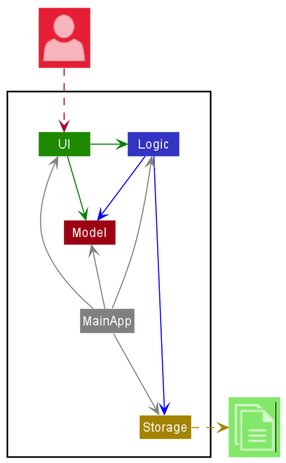

# Developer Guide

## Introduction

MovieApp is a desktop app for users to see the upcoming shows, book a movie and read movie reviews.\
The app is optimized for use via a Command Line Interface (CLI) while still having the benefits of a Graphical User Interface (GUI).\
If you can type fast, MovieApp can help you view and book movies conveniently.

## Design 

### Architecture
\
The **Architecture Diagram** given above explains the high-level design of the App. Given below is a quick overview of each component.

* `MainApp`: At app launch, loads data from the database and allow users to log in as customer or admin.
* `UI`: The UI of the App.
* `Logic`: The command executor.
* `Model`: Holds the data of the App in memory.
* `Storage`: Reads data from, and writes data to, the hard disk.

### UI component

1. The UI consists of a Login class, and a MainMenu interface.
2. AdminMainMenu and CustomerMainMenu inherit from the MainMenu interface.
3. The UI component:\
Allows users to login using the Model data.\
Executes user commands using the Logic component.

### Logic component

1. Logic uses the `MovieMenu` class to read users inputs and execute the commands accordingly.
2. The command execution can affect the Model.
3. The result of the command execution is passed back to the Ui.

### Model component

The Model:
1. Stores users data including the customer and admin users.
2. Stores booking details that contains the information about Cinema, Movie, Seat and Showtime.
3. Stores information related to Movie, such as Review and Showtime.
4. Stores information related to Cinema, such as Seat and Cineplex.
5. Does not depend on any of the other three components.

## Implementation
Our team is going to use breadth-first iterative approach as it allows us to focus on all features in parallel throughout the version 1.0, 2.0 and 2.1.
### Main Logic
The main application logic underlines the main executable conditions that make up the bulk of the application. 
Below is the outline of the logic:
1. `MovieApp` uses the `UI` class to obtain the user input.
2. `MovieApp` imports database from `Storage`.
3. `MovieApp` then uses the `Parser` class to parse the user input.
4. The `Parser` execute the command using `Model`.
5. The result is returned to the user.

Given below is the sequence diagram for the interactions within the main application logic.

### Import Data Command
The process starts with the actor constructs a Database
object. The Database then import the text data from the .txt
files into array lists. Finally, according to the user's
login credentials, the Database (of user) would direct the user into either
the Customer, or the Admin interfaces.\
 
 
### Login Command
The process starts with the actor calling the Login object.
The login then read the user inputs on their name and password
before authenticate these inputs to the user database.
Authentication is done through password-based encryption
provided by Java to improve security.   \

 
### Admin Commands
The process starts with the actor calling the Admin Main Menu
object (after logging into an admin account). The system
would then display a few options for them to choose from.
They can either view, add, delete, or update movies. 
Based on their chosen options, the interface would then call
the respective classes and functions to perform the actions.

**Delete/ Edit movie feature**\
This feature is implemented by methods from the ui component, and database component.

For Delete movie, the ui uses displayDeleteMovieMenu(ArrayList<Movie> movieDatabase) to print out a list of movies,
and prompts the user to enter the index they would like to delete. The database then uses
deleteMovie(int choice) to delete that movie. It updates the database by wiping it clean and write remaining objects
to the .txt file.

Like wise for Edit movie, except the ui uses displayEditMovieMenu(ArrayList<Movie> movieDatabase) and
displayEditMovieSectionMenu(ArrayList<Movie> movieDatabase), and the database uses editMovie(int choice, int type).

### Customer Commands
The process starts with the actor calling the Customer Main Menu
object (after logging into an admin account). The system
would then display a few options for them to choose from.
To view the movies, customers may filter the movies based on
several aspects. They can finally choose a movie and perform
the chosen actions respectively.\

## Product scope
### Target user profile

This app is for movie lovers who want to know movie details, make online booking, and are in need of a user-friendly interface.

### Value proposition

The app is a single-user application that can computerize the processes of making online booking and purchase of movie tickets, and listing of movie details and reviews.
The app will help customers to make a movie schedule ahead of time, and enable a fast and intuitive ticket purchasing procedure.
The app will help cinema administrators to update the movie information regularly through an intuitive interface.

## User Stories

|Version| As a ... | I want to ... | So that I can ...|
|--------|----------|---------------|------------------|
|v1.0|new customer|follow through with the steps provided|make a booking.|
|v1.0|indecisive customer|display summaries of several movies|decide which I want to book for.|
|v1.0|customer|I can have a “quit” command|close the application easily.|
|v1.0|customer|load the application without any errors|use the other functions.|
|v1.0|customer|see the location of the cinemas of the particular movie|go to the nearest cinema.|
|v1.0|customer|see the list of the movie and timing|make plans ahead.|
|v1.0|customer|book as many seats as it can hold|help my friends book too.|
|v1.0|customer|book as many movies available|make plans ahead without being restricted.|
|v2.0|customer|cancel any of my bookings|don't waste my money for being unable to attend.|
|v2.0|admin|add new movies|make the application is continuously updated.|
|v2.0|admin|edit new movies|make the application is continuously updated.|
|v2.0|admin|delete new movies|make the application is continuously updated.|
|v2.0|customer|filter movies by their rating.|make my decision to either watch them or not.|
|v2.0|customer|add a few reviews of the movies|convey my opinions about the movie to other watchers.|
|v2.0|customer|view the reviews of the movies|make my decision to either watch them or not.|
|v2.0|customer|filter the movies by type, director, actors...|quickly find the movie I like.|

## Non-Functional Requirements

1. Usability Requirements
    1. All text in the system must be consistently written in English.
    2. The wording used in system text must be intuitive for user to understand easily.   
    3. The layout of the application must be consistent throughout all the pages.
    4. The system will provide a list of options for the user to choose.
2. Performance Requirements
    1. Database must be regularly updated according to user inputs.
    2. Exceptions must be performed in cases of undesirable incidents.
3. Security Requirements
    1. All passwords must be hashed before it is stored.

## Glossary

| Word | Definition |
|------|------------|
|Admin|Authorized users of the movie application that have the ability to modify the movie details|
|Customer|Regular users of the movie application that have the ability to view, review, and buy tickets to available movies|
|Movie|Details on a movie, including name, dates, casts, etc.|
|Cineplex|Movie theatre where customers may create bookings|
|Cinema|Individual room of the cineplex where customers sit and watch the movies at|
|Seat|Individual space inside the cinema where each customer sits at|
|Review|Comments and ratings of each movie|
|Showtimes|Individual entity of a particular movie, showing at a particular time|
|Booking|Individual appointment where one seat of one showtime is assigned to one user|
|Database|Offline text files that store information on cineplex, movie, showtime, and customer entities|

## Instructions for manual testing

To run the JAR file, run `java -jar [CS2113-T10-3][MovieApp].jar`