# Developer Guide for NUSMaze

---------------------------------------------------------------------------------------------

## Table Of Contents
<!-- TOC -->
1. [Introduction](#1-introduction)  
    1.1. [Overview](#11-overview)  
    1.2. [Setting up and getting started](#12-setting-up-and-getting-started)  
2. [Design](#2-design)  
    2.1. [Architecture](#21-architecture)     
    2.2. [UIManager Component](#22-uimanager-component)  
    2.3. [Parser Component](#23-parser-component)  
    2.4. [Command Component](#24-command-component)  
    2.5. [Router Component](#25-router-component)  
    2.6. [Data Component](#26-data-component)  
    2.7. [Storage Component](#27-storage-component)  
3. [Implementation](#3-implementation)  
    3.1. [Finding The Shortest Route Feature](#31-finding-the-shortest-route-feature)  
    &nbsp;&nbsp;&nbsp;&nbsp; 3.1.1. [Current implementation](#311-current-implementation)  
    &nbsp;&nbsp;&nbsp;&nbsp; 3.1.2. [Routing](#312-routing)    
    3.2. [Daily Route Planning Feature](#32-daily-route-planning-feature)  
    &nbsp;&nbsp;&nbsp;&nbsp; 3.2.1. [Current implementation](#321-current-implementation)  
    &nbsp;&nbsp;&nbsp;&nbsp; 3.2.2. [Adding daily route](#322-adding-daily-route)  
    &nbsp;&nbsp;&nbsp;&nbsp; 3.2.3. [Showing daily route](#323-showing-daily-route)  
    &nbsp;&nbsp;&nbsp;&nbsp; 3.2.4. [Deleting daily route](#324-deleting-daily-route)  
    3.3. [Favourite Routes Feature](#33-favourite-routes-feature)  
    &nbsp;&nbsp;&nbsp;&nbsp; 3.3.1. [Current implementation](#331-current-implementation)  
    &nbsp;&nbsp;&nbsp;&nbsp; 3.3.2. [Loading of saved favourite routes](#332-loading-of-saved-favourite-routes)  
    &nbsp;&nbsp;&nbsp;&nbsp; 3.3.3. [Adding of favourite routes](#333-adding-of-favourite-route)  
    &nbsp;&nbsp;&nbsp;&nbsp; 3.3.4. [Reviewing saved favourite routes](#334-reviewing-saved-favourite-routes)  
    &nbsp;&nbsp;&nbsp;&nbsp; 3.3.5. [Repeating favourite route](#335-repeating-favourite-route)  
    &nbsp;&nbsp;&nbsp;&nbsp; 3.3.6. [Deleting favourite route](#336-deleting-favourite-route)  
    3.4. [Custom Aliases Feature](#34-custom-aliases-feature)  
    &nbsp;&nbsp;&nbsp;&nbsp; 3.4.1. [Current implementation](#341-current-implementation)  
    &nbsp;&nbsp;&nbsp;&nbsp; 3.4.2. [Adding of custom aliases](#342-adding-of-custom-aliases)  
    &nbsp;&nbsp;&nbsp;&nbsp; 3.4.3. [Showing custom aliases](#343-showing-custom-aliases)  
    &nbsp;&nbsp;&nbsp;&nbsp; 3.4.4. [Deleting a custom alias](#344-deleting-a-custom-alias)  
    &nbsp;&nbsp;&nbsp;&nbsp; 3.4.5. [Example for alias feature](#345-example-for-alias-feature)  
    &nbsp;&nbsp;&nbsp;&nbsp; 3.4.6. [Design consideration](#346-design-consideration)  
    3.5. [History Feature](#35-history-feature)  
    &nbsp;&nbsp;&nbsp;&nbsp; 3.5.1. [Current implementation](#351-current-implementation)  
    &nbsp;&nbsp;&nbsp;&nbsp; 3.5.2. [Loading of saved history](#352-loading-of-saved-history)  
    &nbsp;&nbsp;&nbsp;&nbsp; 3.5.3. [Showing past searches](#353-showing-past-searches)  
    &nbsp;&nbsp;&nbsp;&nbsp; 3.5.4. [Repeat past searches](#354-repeat-past-searches)  
    &nbsp;&nbsp;&nbsp;&nbsp; 3.5.5. [Clear past searches](#355-clear-past-searches)  
    &nbsp;&nbsp;&nbsp;&nbsp; 3.5.6. [Design consideration](#356-design-consideration)  
    3.6. [Save Feature](#36-save-feature)  
    &nbsp;&nbsp;&nbsp;&nbsp; 3.6.1. [Current implementation](#311-current-implementation)  
    &nbsp;&nbsp;&nbsp;&nbsp; 3.6.2. [Saving/Loading Data](#362-savingloading-data)  
    &nbsp;&nbsp;&nbsp;&nbsp; 3.6.3. [Design consideration](#363-design-consideration)  
4. [Appendix: Requirements](#4-appendix-requirements)  
    4.1. [Product Scope](#41-product-scope)  
    4.2. [User Stories](#42-user-stories)  
    4.3. [Use Cases](#43-use-cases)  
    4.4. [Non-functional Requirements](#44-non-functional-requirements)  
    4.5. [Glossary](#45-glossary)
5. [Appendix: Instructions for manual testing](#5-appendix-instructions-for-manual-testing)  
   5.1. [Launch and shutdown](#51-launch-and-shutdown)  
   5.2. [Viewing help](#52-viewing-help)  
   5.3. [Viewing venues in NUSMaze](#53-viewing-venues-in-nusmaze)  
   5.4. [Routing](#54-routing)  
   5.5. [History](#55-history)
<!-- TOC -->

---------------------------------------------------------------------------------------------

## *1. Introduction*  
### 1.1. Overview

NUSMaze is a Command Line Interface (CLI) based application that aims to simplify NUS Engineering students’ journey from one point to another within the Engineering and Computing faculties of NUS. The application allows users to find the best route from one block to another, add favourite locations, locate the nearest eatery and much more.

The purpose of this developer guide is to aid any curious or interested contributor in developing NUSMaze further by providing more insight on how the features were implemented.

### 1.2. Setting up and getting started 
1. Ensure that Java 11 and IntelliJ Idea (or your preferred Java IDE) are installed in your computer.  
2. Fork the NUSMaze repo from [here](https://github.com/AY2021S2-CS2113T-T09-2/tp), and clone the fork into your computer.    
3. Configure the JDK in IntelliJ Idea to use JDK 11 by following instructions from [here](https://www.jetbrains.com/help/idea/sdk.html#set-up-jdk).    
4. Import the project as a Gradle project.
5. If you had previously disabled the Gradle plugin, go to `File → Settings → Plugins` to re-enable them.  
6. Click on Import Project and select the build.gradle file.  
7. Navigate to the NUSMaze class via the path `src → main → java → seedu.duke → NUSMaze` and right click on it.  
8. Press run on the `Main()` method of NUSMaze.

If the set up process had been completed successfully, you should see the following message:  
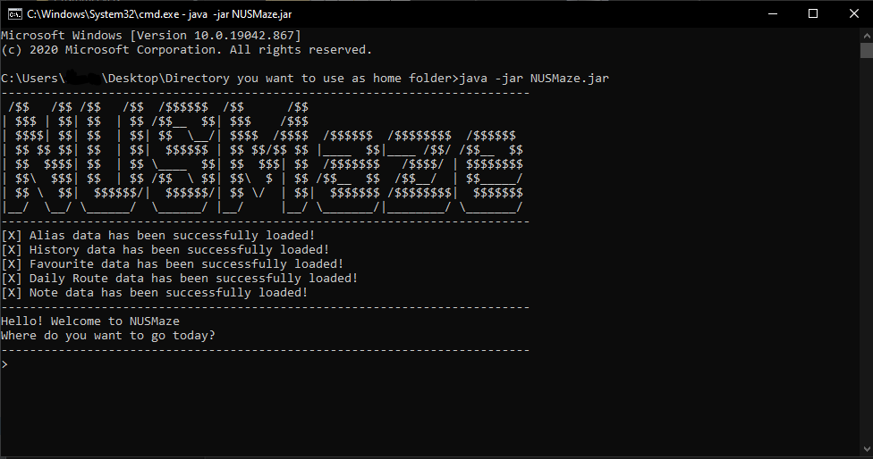

---------------------------------------------------------------------------------------------

## *2. Design* 
### 2.1. Architecture

The **Architecture Diagram** above depicts the high-level design of the NUSMaze. You can always refer to this diagram
to understand how the different components of NUSMaze interact with each other.

The class [`NusMaze`](https://github.com/AY2021S2-CS2113T-T09-2/tp/blob/master/src/main/java/seedu/duke/NusMaze.java) is where the `main()` 
method belongs and is responsible for:
* When the app launches, initialise and connect different components of the NUSMaze in correct sequence.
* When the app terminates, shut down all the components.

Architecture Components of NUSMaze:
* [**`UIManager`**](#22-uimanager-component): The user interface of the app
* [**`Parser`**](#23-parser-component): Processes commands inputted by the user
* [**`Command`**](#24-command-component): Executes the user command 
* [**`Router`**](#25-router-component): Searches the shortest route
* [**`Data`**](#26-data-component): Holds the data of the app to be used 
* [**`Storage`**](#27-storage-component): Reads app data from and writes the app data to created text files
* **`Text Files`**: Holds the data of the app in memory

Explanations on how each component is designed and how it functions are further elaborated in the following 
chapters of the developer guide.

### 2.2. UIManager Component 
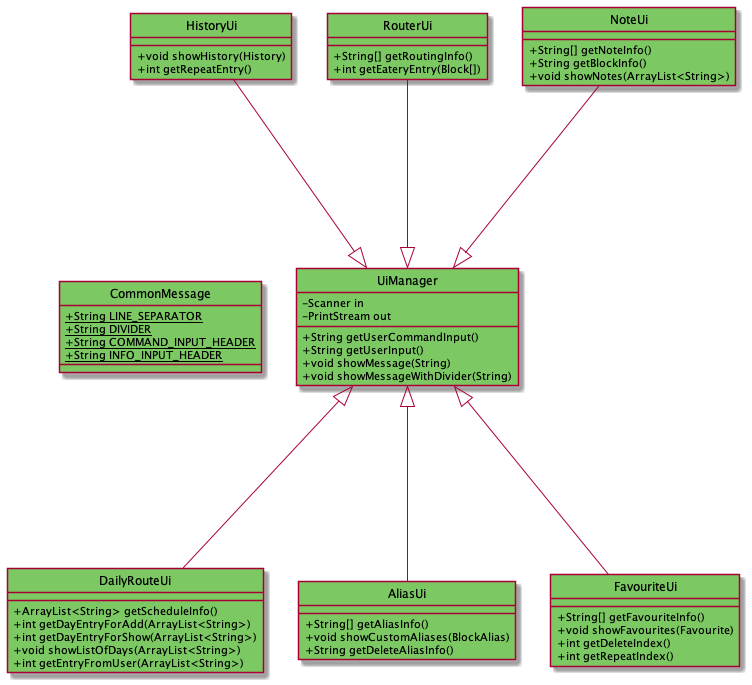  

The UI of the application is managed by the [`UiManager`](https://github.com/AY2021S2-CS2113T-T09-2/tp/blob/master/src/main/java/seedu/duke/ui/UiManager.java) class as shown by the class diagram above. The individual UI classes for each feature such as `AliasUi`, `DailyRouteUi` and
`FavouriteUi` extend the `UiManager` class. The UiManager class consists of the methods that are used to display recurrent messages on the *CLI* and also the utilities to get the user's inputs.

The `UiManager` requires the static string variables from the `CommonMessages` class to obtain the commonly used messages that
such as the divider and input headers.

The individual UI classes contain the methods that are used to get user inputs specific to the needs of the specific feature that
it is responsible for. For example, when the routing feature is to be executed, the UI will need to prompt the user to obtain 2
inputs, namely the `from block` and the `to block`. Hence, the `RouterUi` contains the `getRoutingInfo()` method which will prompt
the user for these two inputs using the utility methods from the UiManager. Methods to get user input are called upon directly from the command classes of the specific feature command.

The `UiManager` component,
* displays messages in the *CLI*.
* provides the Ui classes of the respective features with the utilities to obtain user input specific to their needs.

### 2.3. Parser Component 
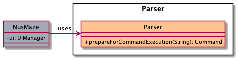

As shown above in the class diagram, **Parser component** is made out of the `Parser` class.
After the `UiManager` reads in the user command, `NusMaze` makes use of the `Parser` to interpret 
the user command and it will instantiate a new Command object to execute the command. 

The Sequence diagram shown below is of a scenario where the user inputs an `invalid input`. It will allow you to 
get a better understanding of how the `Parser` class interacts with `NusMaze` and `UiManager`.

### 2.4. Command Component
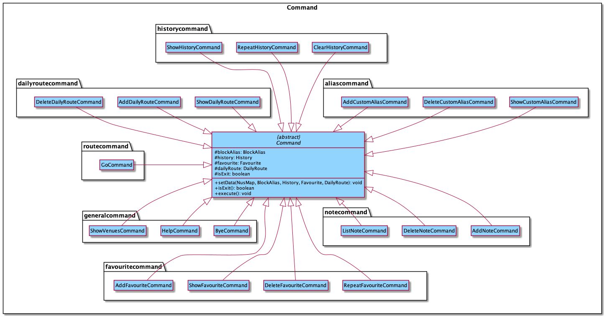

The class diagram above may seem complicated at first glance but it actually isn't.
The **Command Component** of NUSMaze is made out of `Command` class, which is the parent class of
all the other classes in the component (eg. `GoCommand`, `ByeCommand`). Depending on which command the user inputs, the
`Parser` creates different `Command` class to execute the task. 

Each `Command` class has :
* A distinct `execute()` method which is overrides the parent class, therefore tailored to execute the given command.
* An `ui` specifically for taking in further user input in order to carry out the command.

### 2.5. Router Component
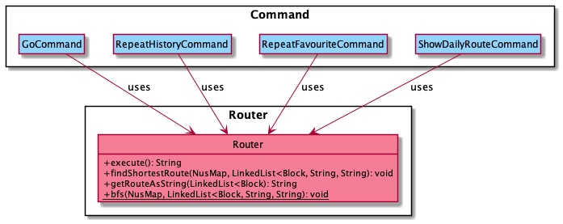

The **Router Component** consist of the `Router` class which is responsible for finding the shortest route to get from
one location to another. In finding the shortest route, it utilises the breath-first-search algorithm, which will be 
further elaborated in the implementation section.

As shown in the diagram above, `Router` is used by the following classes:
* `GoCommand`
* `RepeatHistoryCommand`
* `RepeatFavouriteCommand`
* `ShowDailyRouteCommand`

### 2.6. Data Component
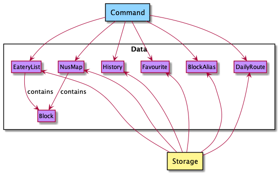

The **Data Component** is where all the data that are needed to execute a command is stored. For example when `"go"`
command is executed, the `GoCommand` object will use data stored in `NusMap`, `EateryList` and `BlockAlias` in order to find
the shortest route.

On the other hand, the **Storage Component** is responsible for saving from and loading data into stored in the **Data Component**. This will be
further elaborated in the following section.

### 2.7. Storage Component
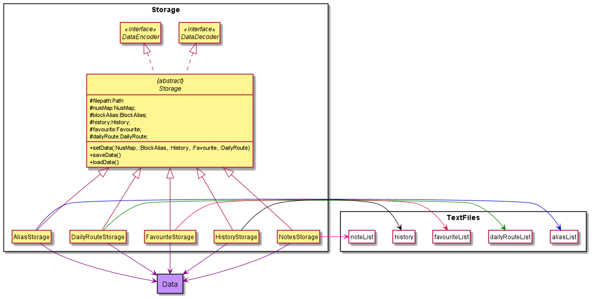
The **Storage Component** reads app's data from the objects of the **Data Component** and writes to the **Text File component**. 
It reads the app's data from the **Text File component** and writes the app's data into the objects of the **Data component**.  
The **Storage Component**:
- loads the app's data from the relevant text file using the `filepath` into the `nusMap`, `blockAlias`, `history`, `favourite`, or `dailyRoute` objects.
- saves the app's data from `nusMap`, `blockAlias`, `history`, `favourite`, or `dailyRoute` objects into the relevant text file using the `filepath`.

---------------------------------------------------------------------------------------------

## *3. Implementation*
### 3.1. Finding The Shortest Route Feature
#### 3.1.1. Current Implementation

The current implementation of finding the shortest route is facilitated by the `Router` class which uses data stored in `NusMap`, `Block`, and `BlockAlias` class to return the shortest path.

The `GoCommand` class extends the `Command` class and overrides the `execute` method to run the routing algorithm.

The image below depicts how the `GoCommand` is implemented.

#### 3.1.2. Routing
Given below is an example scenario of how the routing algorithm functions.

1. User executes `GoCommand` and the `RouterUi` reads in the starting location and destination. 
2. The input is changed to the name of the block if applicable. 
3. The blocks are then checked to see if they are valid blocks.
4. `GoCommand` will then check if the second entry is eatery. If it is not "EATERY", step 3 and 4 are skipped for step 5. 
5. `GoCommand` will then create an instance of `EateryList` and invokes its method `sortEateriesByDistance()` which returns a list of eateries in order of the closest distance. 
6. `GoCommand` then takes in the selection of eatery that the user is chosen and sets the destination. 
7. The Router will then run the `findShortestRoute()` method which is a routing algorithm based on breath-first search. This returns the shortest route as a string 
8. The `RouterUi` will then show the shortest route to the user through `showMessageWithDivider()` method. 

Shown below is the sequence diagram when a valid block is entered for the starting location and destination.
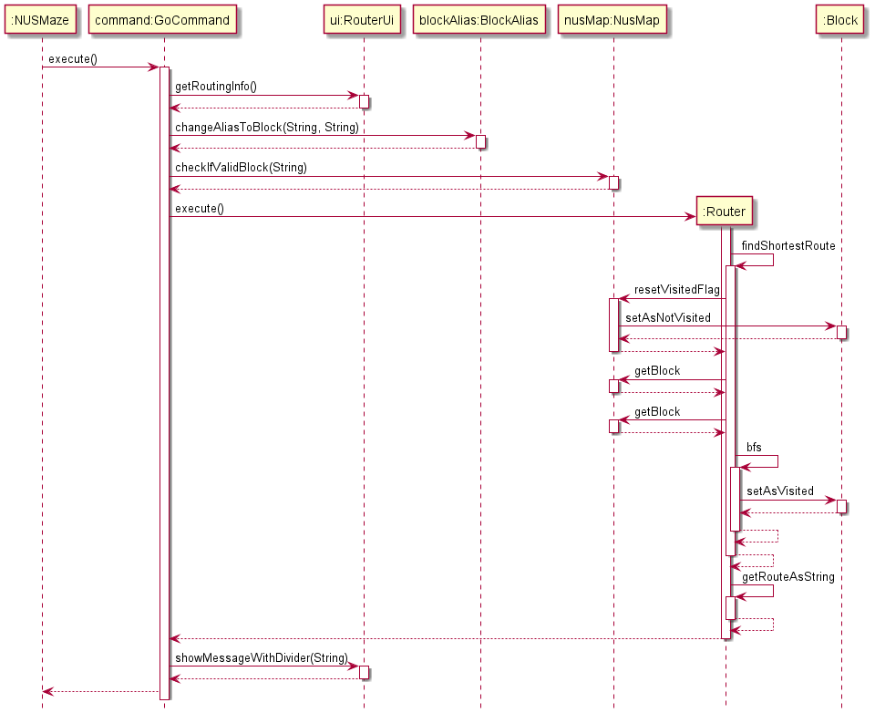

### 3.2. Daily route planning feature
#### 3.2.1. Current Implementation
The current implementation is facilitated by `DailyRoute` class, with the `AddDailyRouteCommand`, `ShowDailyRouteCommand` and `DeleteDailyRouteCommand` subclasses invoking methods that the `DailyRoute` class provides.  
`AddDailyRouteCommand`, `ClearDailyRouteCommand` and `DeleteDailyRouteCommand` extend `Command` (superclass).  
`AddDailyRouteCommand` implements the feature of adding the schedule of the day to the `DailyRoute` object. `ShowDailyRouteCommand` accesses the `DailyRoute` object to retrieve an ArrayList with the location schedule provided from the `AddDailyRouteCommand` and run the routing algorithm present in the `Router` object. `DeleteDailyRouteCommand` clears the schedule mapped to the selected day. 

Additionally, `DailyRoute` implements the following operations:

`addDailyRoute(String ,ArrayList<String>)` — Maps the inputted day string to the inputted ArrayList of the schedule of the day in a hashmap .  
`getDailyRoute(String)` — Returns the schedule of the day that is mapped to the inputted day.  
`getSelectableDays()` — Returns the current days that have schedules mapped to them. 
`getValidDays()` — Returns the days of the week. 

These operations are exposed in the `DailyRoute` class  as `DailyRoute#addDailyRoute()`, `DailyRoute#getDailyRoute(String)`, `DailyRoute#getSelectableDay()`, `DailyRoute#getValidDay()`.  

#### 3.2.2. Adding daily route 
Given below is an example usage scenario and how the addDailyRoute mechanism behaves at each step.  
1. The user launches the application. 
2. The user executes `add daily route` command. UI will then prompt the user `Select entry to add:`  to input a day index.  
3. The UI then prompts the user to input the next block that is in the day's schedule.    The inputted location will be appended to an ArrayList.  
4. Repeat step 3 until the word `END` is input by the user.   
5. The inputted day, and the filled Arraylist from step 3 is then passed into the DailyRoute object  This done using the addDailyRoute method from the DailyRoute class. The selectableDay boolean flag for the selected day is also set to true.  
6. The day and filled Arraylist passed in step 5 is then saved in a hashmap that the DailyRoute object contains.   

The following image shows the sequence diagram in which the addDailyRoute command is executed.

#### 3.2.3. Showing daily route
Given below is an example usage scenario and how the showDailyRoute mechanism behaves at each step.

1. The user launches the application. 
2. The user executes `show daily route` command. UI will then prompt the user `Select entry:`  to input a day index. This returns an arraylist of the day's schedule.  
3. The routing algorithm is now performed for each of the blocks in the array list in order. Each execution of the routing algorithm returns a string which is then appended to the end of an Array list.  
4. The arraylist of the days schedule, and the arraylist that contains the routes from the routing algorithm are then output through Daily Route Ui  

The following image shows the sequence diagram in which the showDailyRoute command is executed.
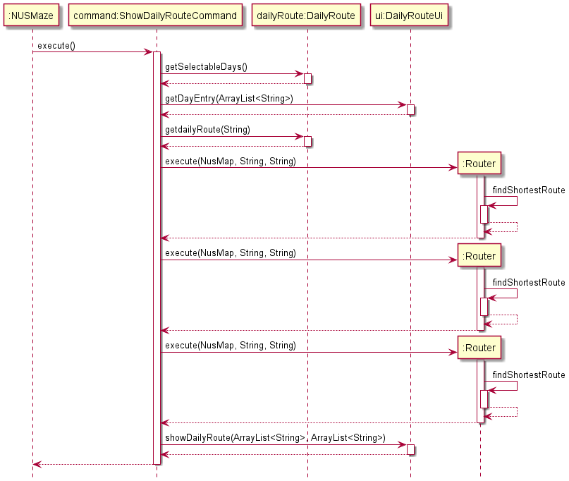

#### 3.2.4. Deleting daily route
Given below is an example usage scenario and how the deleteDailyRoute mechanism behaves at each step.

1. The user launches the application. 
2. The user executes `delete daily route` command. UI will then show the selectable days if applicable and prompt the user `Select entry:`  to input a day index. If there are no days scheduled, the UI will print `"There are no daily routes planned!"`  
3. The `addDailyRoute(day, schedule)` method is then called with the selected day as day, and an empty array list as the schedule. The selectable day boolean flag for the day is set to false in the DailyRoute object, and the schedule mapped to the day is cleared. 
4. The String `"Got it! Successfully cleared [DAY]'s schedule!"` is output through Daily Route Ui  

The following image shows the sequence diagram in which the deleteDailyRoute command is executed.

### 3.3. Favourite Routes feature

#### 3.3.1. Current Implementation

The favourite routes feature acts as an independent storage of the user's favourites routes,
allowing the user to call of the route without going through the hassle of the `go` command.
The start and destination of the favourite routes are saved within an ArrayList named `favourites`.
The contents of `favourites` will be stored into a text file named `favouritesList.txt` when NUSMaze terminates.

#### 3.3.2. Loading of saved favourite routes

When NUSMaze launches, the contents of the text file `favouritesList.txt` will be read,
and stored into `favourites`.
Refer to the section on **Storage** for more information.

#### 3.3.3. Adding of favourite route

The command to add a favourite route is `add favourite`.
Upon calling the `add favourite` command, the user will be prompted to enter the starting block,
followed by the destination block. If valid blocks are given,
the route from the starting block to destination block will be added into `favourites`.
If any invalid block is given, `InvalidBlockException` will be thrown.

#### 3.3.4. Reviewing saved favourite routes

The command to display all the saved favourite routes is `show favourite`.
If there are no saved routes, `EmptyFavouriteException` will be thrown.
If there are any saved favourite routes, a numbered list of the saved routes will be shown to the user.

#### 3.3.5. Repeating favourite route

The command to repeat a favourite route is `repeat favourite`.
Upon calling the `repeat favourite` command, the user would be shown a numbered list of saved favourite routes.
Otherwise, `EmptyFavouriteException` will be thrown.
After the numbered list of saved favourite routes is shown, the user would be prompted to enter the index of the favourite
route to be executed. Any invalid input such as decimals or alphabets will result in
`InvalidIndexException` to be thrown.

#### 3.3.6. Deleting favourite route

The command to delete a favourite route is `delete favourite`.
If there are no saved favourite routes, `EmptyFavouriteException` will be thrown.
If there are any saved favourite routes, a numbered list of the saved routes will be shown to the user.
The user is then prompted to enter the index of the route to be deleted.
Any invalid input such as decimals or alphabets will result in
`InvalidIndexException` to be thrown.

### 3.4. Custom aliases feature
#### 3.4.1. Current Implementation
The following diagram illustrates the class diagram for implementation of the alias feature:

The command entered by the user in the `Main()` function of NUSMaze will be parsed by the `Parser` class. Thereafter, the parser will decide which of the 3 alias commands,
if applicable, was the command that the user wanted to execute. 

The three command classes, namely `AddCustomAliasCommand`, `ShowCustomAliasCommand` and `DeleteCustomAliasCommand` extend the `Command` class, and they all depend on the `AliasUi` class to obtain inputs and display outputs.

Another thing to note is that the `NUSMaze` class has an `AliasStorage` class that facilitates the storage of the aliases so that the user can access their aliases even after they close and reopen the application. 

The data model for this feature is facilitated by the `BlockAlias` class which contains the hashmap of custom aliases and block pairs. 
The hashmap will have the `custom alias name` as the `key` and the `block name` as the `value` for each key-value pair. The
`BlockAlias` class also depends on the `NusMap` class to ensure that valid blocks are input by the user.

#### 3.4.2. Adding of custom aliases
The user can enter `add alias` invoke an instance of `AddCustomAliasCommand` which will prompt them for the
alias and block names. If the alias name already exists, or the alias name conflicts
with a block name, the application will display an error message and the addition of the custom alias will not be executed. If there
were no errors, the alias and block pair would be added to the hashmap in the instance of the `BlockAlias` class and it will also be
stored in the `AliasStorage`.

#### 3.4.3. Showing custom aliases
The user can enter `show alias` to invoke an instance of `ShowCustomAliasCommand` to view all the alias and block pairs that have been stored previously by them.
If there are no alias and block pairs, then the message `You haven't set any aliases yet!` will be displayed to the user. If there 
are valid alias and block pairs stored in the application, then the list of alias and block pairs will be displayed.

#### 3.4.4. Deleting a custom alias
The user can enter `delete alias` to invoke an instance of `DeleteCustomAliasCommand` which will prompt them for the alias name that they
wish to delete. If the entered alias name exists in the alias hashmap stored in the instance of `BlockAlias`, then that alias will be removed.
However, if the alias does not exist in the hashmap, then an invalid alias error message will be displayed.

#### 3.4.5. Example for alias feature
Given below is an example usage scenario and how the add/view/delete mechanism behaves at each step:

1. The user launches the application for the first time. If there is a storage file with pre-existing alias-block pairs, then the hashmap in `BlockAlias` class will be initialized with those data, or an empty hashmap if it does not exist.  

2. The user executes `add alias` command. The user input will be parsed by the `Parser` which will create a new `AddCustomAliasCommand` command. This will invoke the UI which will prompt the user `Enter the block:` to input the block name and `Enter the alias name:` to input the alias name that the user wants. The UI parser will then check if the entered block and alias are valid and throw an exception if they are not.  

3. The entered alias and block pair will then be put into a temporary hashmap which will then be merged with the main hashmap in the instance of the BlockAlias.  

4. The user executes `show alias` command. The user input will be parsed by the `Parser` which will create a new `ShowCustomAliasCommand` command. The new command will then invoke the UI which will print `It seems that you do not have any aliases` if the hashmap is empty, or it will print the alias-block pairs in new lines when the hashmap has been previously populated.  

5. The user executes `delete alias` command. The user input will be parsed by the `Parser` which will create a new `DeleteCustomAliasCommand` command. The new command will then invoke the UI which will prompt the user `Enter the alias name that you wish to delete:` where the user will enter the alias name that the user wishes to remove. The user input for the alias to be removed will be checked against the hashmap and return an exception if the key does not exist. If the alias to be removed exists in the hashmap, the key-value pair will be removed, and a success message will be displayed to the user.

Shown below is the sequence diagram when a valid block name and alias are **added**:
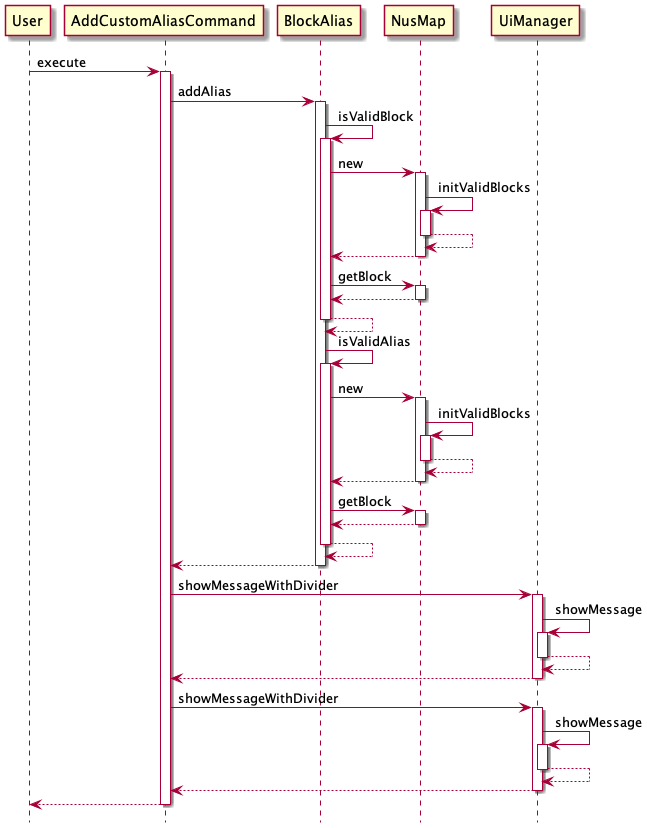

#### 3.4.6. Design Consideration
**Current choice:** Saves the alias and block names in a hashmap stored within a data model class which is the `BlockAlias` class.  
- Pros: Easy to implement.  
- Cons: The same instance of `BlockAlias` needs to be shared among the other classes that may use the alias feature.  

### 3.5. History feature 
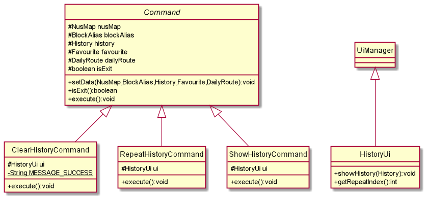
#### 3.5.1. Current Implementation
Whenever the user inputs the `go` command, and enters a valid start and destination address, a String consisting the start and end block is created and stored in `historyList`. 
The contents of the `historyList` will be stored into a text file named `historyList.txt` when NUSMaze terminates.

#### 3.5.2. Loading of saved history
When NUSMaze starts running, any contents from `historyList.txt` file would be loaded and stored into `historyList`.
Refer to the section on **Storage** for more information.

#### 3.5.3. Showing past searches
The user can enter the command `history`, and a numbered list of past searches will be shown to the user.
If there were no past searches, a line of text `"Oops! You have no past history!"` will be shown to the user.

#### 3.5.4. Repeat past searches
The user can enter the command `repeat history` to request for a repeat of past searches.
If there are no past searches, a line of text `"Oops! You have no past history!"` will be shown to the user.
If there is at least one entry in `historyList`, then all past searches would be shown to the user, in a numbered list format. 
(Only the starting location and destination location will be shown.)
The user is then prompted to enter the index of the past search to repeat.

#### 3.5.5. Clear past searches
The user can enter the command `clear history` to delete all the contents of `historyList`.
A message: `"Your history has been successfully cleared"` will be shown to the user upon successful deletion of the contents of `historyList`.

#### 3.5.6. Design Consideration
Alternative 1 (current choice): Each command to add, view and delete are implemented using separate classes.  
Pros: Easy to understand and each command is standalone.  
Cons: Might have to repeat some code fragments.  

Alternative 2: Place all commands (add, view, delete) as functions in 1 command class.  
Pros: Less code to be written and hashmap can be shared by the 3 commands in 1 class.  
Cons: Might be confusing since there is less distinction between each command.

### 3.6. Save feature  
#### 3.6.1. Current Implementation  
The save mechanism is facilitated by `AliasStorage`, `DailyRouteStorage`, `FavouriteStorage`, `HistoryStorage` and `NotesStorage` subclasses.  
They extend `Storage` (superclass) with a feature to save the blocks' aliases, daily routes, favourite locations, history of visited routes and tagged notes, stored internally as `aliasList`,  `dailyRouteList`, `favouriteList`, `history`, `noteList` text files.  
Additionally, they implement the following operations:  
- `AliasStorage#saveData()` —  Saves all aliases given by user to blocks into `aliasList`.  
- `AliasStorage#loadData()` —  Restores all aliases given by user to blocks from `aliasList`.  
- `DailyRouteStorage#saveData()` —  Saves all the daily routes that user wants to see for each day of the week into `dailyRouteList`.  
- `DailyRouteStorage#loadData()` —  Restores all the daily routes that user wants to see from `dailyRouteList`.  
- `FavouriteStorage#saveData()` —  Saves the current list of all the routes that the users are interested in keeping in `favouriteList`.  
- `FavouriteStorage#loadData()` —  Restores the previous list of all the routes that the users are interested in keeping from `favouriteList`.  
- `HistoryStorage#saveData()` —  Saves the current list of the 10 most recently visited routes in its history into `history`.  
- `HistoryStorage#loadData()` —  Restores the previous list of the 10 most recently visited routes in its history from `history`.  
- `NotesStorage#saveData()` —  Saves all notes tagged to a location into `noteList`.  
- `NotesStorage#loadData()` —  Restores all notes tagged to a location from `noteList`.  

These 'saveData()' operations are exposed in the `DataEncoder` interface as `DataEncoder#encodeAlias(:BlockAlias) `, `DataEncoder#encodeDailyRoute(:DailyRoute)`, `DataEncoder#encodeFavourite(:Favourite)`, `DataEncoder#encodeHistory(:History)` and `DataEncoder#encodeNotes(:NusMap)` respectively. 
These 'loadData()' operations are exposed in the `DataDecoder` interface as `DataDecoder#decodeAliasAndNoteData()`, `DataDecoder#decodeDailyRouteData()` and `DataDecoder#decodeHistoryAndFavouriteData()`.

#### 3.6.2. Saving/Loading data
Given below is an example usage scenario and how the save mechanism behaves at each step.  
1. The user launches the application for the first time.
   `AliasStorage`, `DailyRouteStorage`, `FavouriteStorage`, `HistoryStorage` and `NotesStorage` objects
   will be initialized with the filepaths of `aliasList`,  `dailyRouteList`, `favouriteList`, `history` and `noteList` text files respectively.  
   The `blockAlias`, `dailyRoute`, `favourite`, `history` or `nusMap` object in `NusMaze` class will be initialised using the initial state of the respective text file,
   by calling `AliasStorage#loadData()`, `DailyRouteStorage#loadData()`, `FavouriteStorage#loadData()` `HistoryStorage#loadData()` and `NotesStorage#loadData()`.  
   This is done only once for each time the application is launched.  
   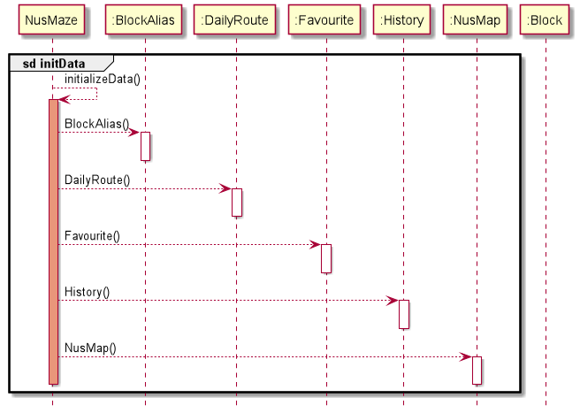
   
   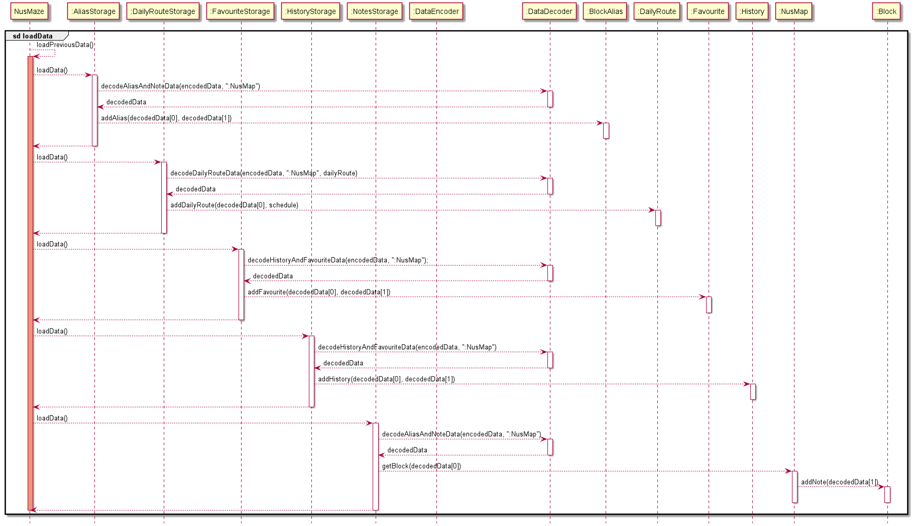  
2. For all valid commands called before the last user input 'bye' or before program is terminated, the following process is executed continuously.  
   `AliasStorage#saveData()`, `DailyRouteStorage#saveData()`, `FavouriteStorage#saveData()`, `HistoryStorage#saveData()`, `NotesStorage#saveData()` are called.
   When `#saveData()` for each of the storage objects are called, data from the `blockAlias`, `dailyRoute`, `favourite`, `history` or `nusMap` object is saved into the respective text file.  
   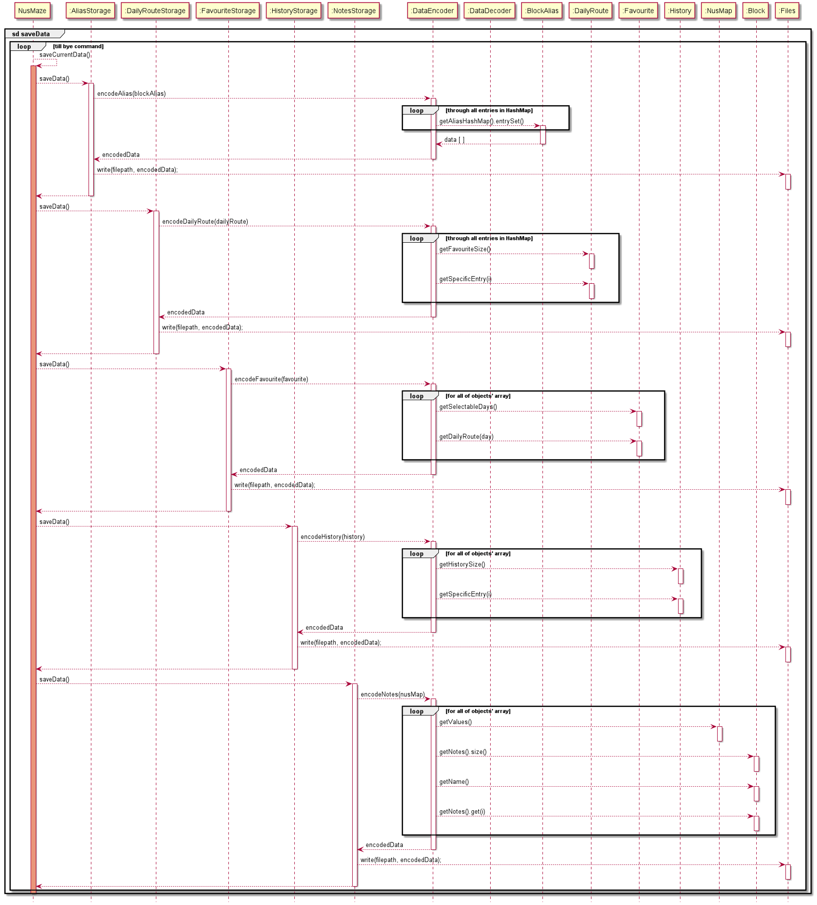

**:information_source:** At any point when a command is called, the `AliasStorage#saveData()`, `DailyRouteStorage#saveData()`, `FavouriteStorage#saveData()`, `HistoryStorage#saveData()`, `NotesStorage#saveData()` will be executed,
but not all text files will be modified.  
* The `history` text file is modified by the `go`, `clear history` and `repeat history` commands.  
* The `aliasList` text file is modified by the `add alias` and `delete alias` commands.  
* The `dailyRouteList` text file is modified by the `add daily route` and `delete daily route` commands.  
* The `noteList` text file is modified by the `add note` and `delete note` commands.  
* The `favouriteList` text file is modified by the `add favourite`, `repeat favourite` and `delete favourite` commands  

 

**:information_source:** If a command fails its execution, it will not call `#saveData()` for all the storage objects,
so the content from the `nusMap`, `blockAlias`, `history`, `favourite`, or `dailyRoute` objects will not be saved into the text files.

#### 3.6.3. Design Consideration
**Current choice:** Saves the entire list of block aliases, visited routes, tagged notes, daily routes and favourite locations.  
- Pros: Easy to implement.  
- Cons: Only highly effective when limited to use of one user.  

---------------------------------------------------------------------------------------------

## *4. Appendix: Requirements*
### 4.1. Product Scope

NUSMaze is targeted at NUS engineering freshmen, to help new students find their way to their destination blocks.

The engineering block is extremely huge, and the layout of the blocks may be confusing for new students. To reduce the time wasted on navigating the numerous blocks in Engineering, NUSMaze will provide the shortest route available for students to take.

### 4.2. User Stories

Below is our analysis of our target user and the importance in which he/she would place on the potential user stories we have chosen.

|Version| As a ... | I want to ... | So that I ...|Importance|
|--------|----------|---------------|------------------|----|
|v1.0|new user|see usage instructions|can refer to them when I forget how to use the application|HIGH|
|v1.0|user|have a clear path to my destination|will not get lost|HIGH|
|v1.0|user|be able to pin a note to certain locations as a reminder|do not forget|MEDIUM|
|v1.0|user|keep track of my search history|don't have to repeatedly search for the same route.|MEDIUM|
|v1.0|user|have a clear interface in which I can enter my commands|can have a good user experience|HIGH|
|v2.0|user|find the nearest eatery|do not have to starve for longer than necessary|HIGH|
|v2.0|user|have a list of favorite locations|can access directions to them quickly|MEDIUM|
|v2.0|user|have my list of favourites and history stored|can access it every time I start the app|MEDIUM|
|v2.0|user|be able to set custom aliases to blocks|can access the blocks more conveniently|MEDIUM|
|v2.0|user|be able to store my routing for my daily activities|can access it easily|MEDIUM|

### 4.3. Use Cases

### 4.4. Non-Functional Requirements

1. Should work on any mainstream OS as long as it has Java 11 or above installed.

2. Should be able to hold up to 1000 history, notes, favourites and block alias entries without a noticeable sluggishness in performance for typical usage.

3. A user with above average typing speed for regular English text (i.e. not code, not system admin commands) should be able to accomplish most of the tasks faster using commands than using the mouse.

### 4.5. Glossary

* *CLI* - Command Line Interface
* *IntelliJ* - An Integrated Development Environment (IDE) designed for Java software development.
* *UML* - Unified Modeling Language.
* *Terminal/PowerShell* - Any operating system shell with a command-line interface.
* *Mainstream OS* - Windows, mainstream distributions of Linux, and macOS.
* *JDK* - Java Development Kit.

---------------------------------------------------------------------------------------------

## *5. Appendix: Instructions for manual testing*

### 5.1 Launch and shutdown
1. Initial launch 
    1.1. Download the latest jar file from [here](https://github.com/AY2021S2-CS2113T-T09-2/tp/releases) and copy it into an empty folder.   
    1.2. Open the terminal/powershell console and navigate to the folder in which the `.jar` file was saved. 
   Expected: Greeting message of NUSMaze  to be shown 
2. Exiting the application 
    2.1 Enter `bye` and press enter 
    Expected: The application shows thank you message and exits successfully. 
   

### 5.2 Viewing help
1. Viewing help for NUSMaze  
    1.1 Enter `help` 
   Expected: A list of all the commands that can be used in NUSMaze should be displayed. 
   

### 5.3 Viewing venues in NUSMaze
1. Viewing all the blocks in NUSMaze (Currently only the Engineering and Computing blocks)  
    1.1 Enter `show venues` 
   Expected: A table of all the blocks that have been pre-loaded into NUSMaze. 

### 5.4 Routing
1. Routing with valid blocks 
    1.1 Launch the application and type 'Go' followed by the enter key. 
    1.2 Test case: Starting block → `E1`, Destination block → `E7` 
    Expected:  `Route: E1 -> LT5 -> E3 -> E4 -> E4A -> EW2 -> E6 -> E7` should be displayed 
    1.3 Test case: Starting block → `e4`, Destination block → `techno edge` 
    Expected:  `Route: E4 -> E3 -> LT5 -> TECHNO EDGE` should be displayed 
2. Routing with invalid blocks 
    2.1 Test case: Starting block → `E20`, Destination block → `E7` 
    Expected:  `Invalid block! Please try again with a block that exists :(` should be displayed 
    2.2 Test case: Starting block → `Invalid block`, Destination block → `Invalid block` 
    Expected:  Similar to previous 
3. Routing to an eatery 
    3.1 Test case: Starting block → `e3`, Destination block → `eatery`, Select entry to go → `5` 
    Expected: `Route: E3 -> E2 -> EA -> SPINELLI COFFEE` should be displayed 
    3.2 Test case: Starting block → `e3`, Destination block → `spinelli coffee` 
    Expected: Similar to previous 
   

### 5.5 History
1. Viewing history when routing has not been used or history has been cleared  
    1.1 Enter `history` 
   Expected: `Oops! You have no past history!` 
2. Viewing history when routing has been previously used  
   1.1 Enter `history` 
   Expected: A list of the past routing history will be displayed (Capped at 10) 
3. Repeating history when history is empty 
    1.1 Enter `repeat history` 
    Expected: `Oops! You have no past history!` 
4. Repeating history when there is 1 record in the history 
   1.1 Test case: `repeat history` → `1` 
   Expected: The result of the routing will be displayed 
   1.2 Test case: `repeat history` → `2` 
   Expected: `Oops! You must enter an Integer that is within the bounds :(` 
5. Clearing history 
    1.1 Enter `clear history` 
   Expected: `Your history has been successfully cleared` 
   

### 5.7 Daily Route
1. Viewing daily route when the user haven't scheduled any daily route. 
    1.1 Enter `show daily route` 
    Expected: `Oops! You haven't planned any daily routes yet :(` 
2. Adding daily route 
    1.1 Test case: `add daily route` → `1` → `ea` → `end` 
   Expected: `Got it! Successfully added MONDAY's schedule!`  
    1.2 Test case: `add daily route` → `8` 
   Expected: `Oops! You must enter an Integer that is within the bounds :(` 
3. Deleting daily route when only Monday's schedule is planned 
    1.1 Test case: `delete daily route` → `1` 
   Expected: `Got it! Successfully cleared MONDAY's schedule!` 
   1.2 Test case: `delete daily route` → `2`  
   Expected: `Oops! You must enter an Integer that is within the bounds :(` 

### 5.9 Notes
1. Adding note to blocks 
    1.1 Test case: `add note` → `e1` → `crowded` 
   Expected: `Got it! Successfully added and tagged note to E1` 
   1.2 Test case: `add note` → `e20` → `crowded` 
   Expected: `Invalid block! Please try again with a block that exists :(` 
   1.3 Test case: `add note` → `e20` → `""` 
   Expected: `Your note description cannot be empty or contain "/". Please try the command again :)` 
   1.4 Test case: `add note` → `e20` → `very/crowded` 
   Expected: `Your note description cannot be empty or contain "/". Please try the command again :)` 
2. Viewing notes tagged to specific block 
    2.1 Test case: `show note` → `e1` 
   Expected: Show a list of notes tagged to e1 
   2.2 Test case: `show note` → `e20` 
   Expected: `Invalid block! Please try again with a block that exists :(` 
3. Deleting note tagged to a specific block 
   3.1 Test case: `delete note` → `e1` → `1` (When there is at least one note tagged to e1) 
   Expected: `Got it! Successfully deleted note tagged to E1`  
   3.2 Test case: `delete note` → `e1` → `1` (When there are no notes tagged to e1) 
   Expected: `Oops! There are no notes tagged to E1`  