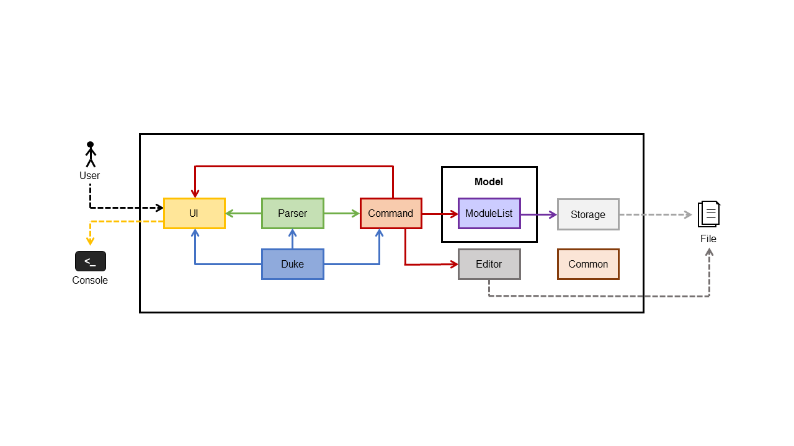
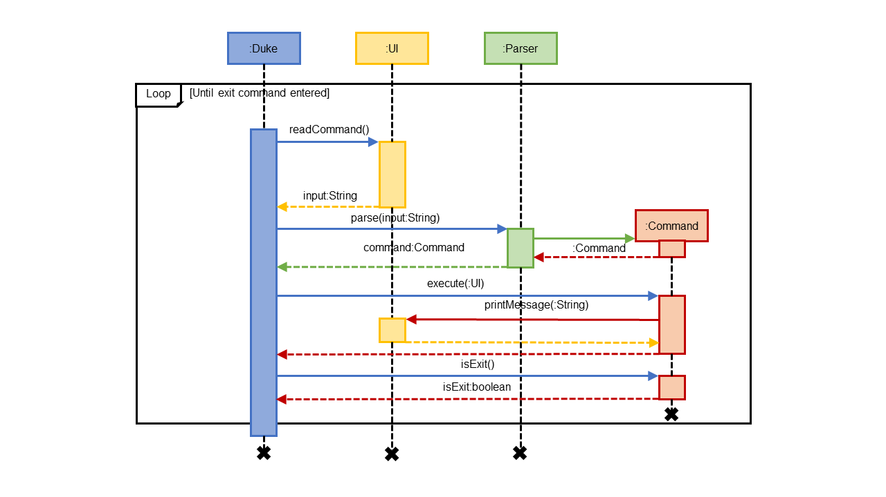
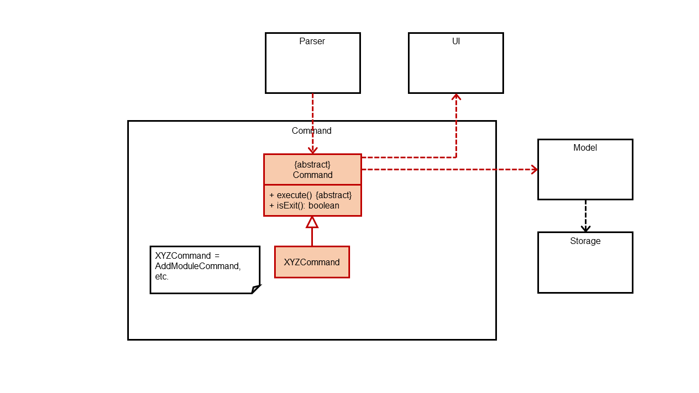
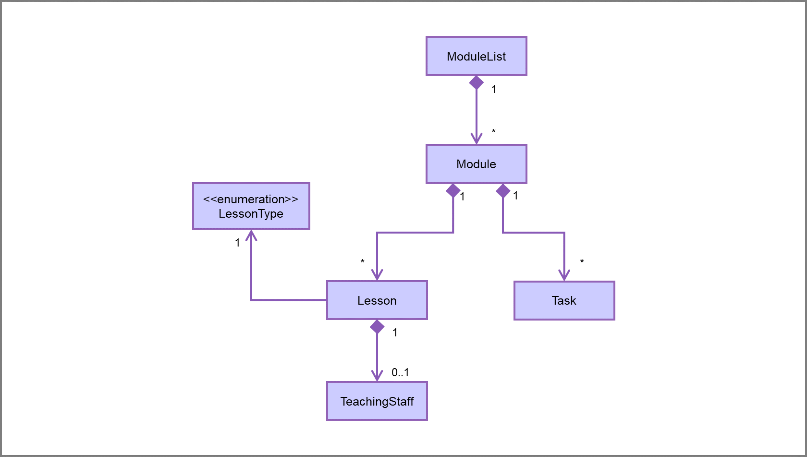
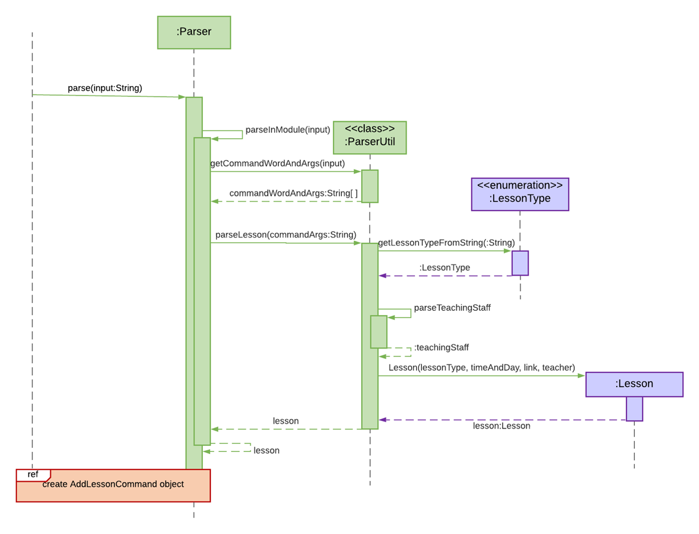

# GULIO Developer Guide

**GULIO (Get Ur Life In Order)** is a desktop app that provides a single consolidated and personalised workspace for NUS SOC students to organize their modules. It is optimized for use via a Command Line Interface (CLI) which SOC students will be familiar with typing in, instead of a Graphical User Interface (GUI).

This guide is for developers looking to modify GULIO. For users of GULIO, please refer to the User Guide [here](UserGuide.md).

&nbsp;

----

## Table of Contents

* [How to Use This Guide](#how-to-use-this-guide)
* [Setting up GULIO on Your Computer](#setting-up-gulio-on-your-computer)
* [Introduction](#introduction)
* [Design](#design)
    * [Architecture](#architecture)
    * [UI Component](#ui-component)
    * [Parser Component](#parser-component)
    * [Command Component](#command-component)
    * [Model Component](#model-component)
    * [Storage Component](#storage-component)
    * [Common Classes](#common-classes)
* [implementation](#implementation)
    * [Add Lesson](#add-lesson)
    * [Adding of Cheat-Sheet](#adding-of-cheat-sheet)
    * [Loading & Storing of Data](#loading--storing-of-data)
    * [Future Features](#future-features)
* [Appendix: Requirements](#appendix-requirements)
    * [Product Scope](#product-scope)
    * [User Stories](#user-stories)
    * [Non-Functional Requirements](#non-functional-requirements)
    * [Glossary](#glossary)
* [Appendix: Instruction for Manual Testing](#appendix-instruction-for-manual-testing)
    * [Launching GULIO](#launching-gulio)
    * [Exiting GULIO](#exiting-gulio)
    * [Adding a Module](#adding-a-module)
    * [Deleting a Module](#deleting-a-module)
    * [Opening a Module](#opening-a-module)
    * [Closing a Module](#closing-a-module)
    * [Adding a Lesson](#adding-a-lesson)
    * [Deleting a Lesson](#deleting-a-lesson)
    * [Opening a Link](#opening-a-link)

&nbsp;

----

## How to Use This Guide

> Icons used in this guide: 
>  
> 💡 - Indicates a tip that may be useful to you. 
> ⚠ - indicates a warning that you should take note of.

&nbsp;

----

## Setting up GULIO on Your Computer

1. Fork [this repo](https://github.com/AY2021S2-CS2113T-W09-3/tp), and clone the fork into your computer.
1. Ensure you are using Java 11 or above.
1. Import the project in your IDE.

> 💡 You are highly recommended to use Intellij IDEA.
>
> To set up Intellij:
> 1. Ensure Intellij is configured to use JDK 11.
> 1. Import the project as a Gradle project.
> 1. Verify the setup:
     >   1. Run `seedu.duke.Duke` and try a few commands.
>   1. Run the tests to ensure they all pass.

&nbsp;

----

## Introduction

### Background of GULIO

GULIO is a command line application for NUS SOC students to organize their modules. It has a 2-layer system: dashboard layer and module layer. In both layers, the user has access to a different set of commands.

On start up, the user will be on the dashboard layer and has an overview of all their modules. They will have access to module management commands such as adding, deleting or opening a particular module. Opening a module then puts them on the module layer where they can interact with the data within the module.

     
    Figure 1 - Visualisation of GULIO’s 2-layer system

Currently, GULIO is a basic university module manager intended to provide students with an overview and consolidated workspace for all of their modules, lessons, tasks and cheat-sheets. Going forward, we feel that GULIO has the potential for many more features to be added, some of which are proposed in the “Implementation” section.

### Purpose

This document describes the architecture and implementation details of the command line application, GULIO.

### Scope

This describes the software architecture and software design decisions for the implementation of GULIO. The intended audience of this document is the developers, designers, and software testers of GULIO.

&nbsp;

----

## Design

### Architecture

     
    Figure 2 - GULIO Architecture Diagram

`Duke` contains the main method which is required by Java to run the application. It is responsible for instantiating and calling methods from the `UI`, `Parser` and `Command` components.

Apart from `Duke`, the application consists of the following components:

* `UI`: Handles reading and printing
* `Parser`: Validates and checks user input
* `Command`: Executes commands
* `Model`: Consists of data related to the application
* `Storage`: Handles loading and storing of data into text files
* `Editor`: Graphical interface for users to type
* `Common`: collection of classes used by multiple components.

GULIO is a local application that stores its application data using readable text files, allowing users the flexibility of viewing and editing data locally.

The way GULIO runs and handles user input can be described as follows:

     
    Figure 3 - GULIO Sequence Diagram

Upon start, the main class calls run() which enters a while loop and reads in user input. In the loop, the Parser component processes the user input into various commands implemented in GULIO. The loop ends when the user enters exit.

&nbsp;

### UI component

**API**: `UI.java`

* Facilitates the CLI interface
* Methods to display general messages, prompt messages and error messages
* Reads in user’s input, and used by Command classes to react to user’s inputs
* The UI object created as an attribute in Duke is passed into each command to be executed
* Instances of UI are used by tests in general

&nbsp;

### Parser component

**API**: `Parser.java`

* Determines the command entered by the user

* Parses the parameters needed by the `Command` object (for commands which require additional details)

* Checks the validity of parsed parameters, in some instances calling methods from other relevant classes, e.g. calling a method from the `Lessons` class to verify parsed lesson links.

* May instruct `UI` to print warnings and prompts to users, e.g. when users enter invalid parameters.

* Returns a new `Command` object with all the necessary attributes filled

&nbsp;

### Command component

     
    Figure 4 - Visualisation of Dual Layer Command System

**API**: `Command.java`

The `Command` component is an abstract class with methods that all commands inherit from. They can be further distinguished by commands that are used when the user is at the dashboard or when the user is within a module specified.

Steps for command execution:

1. The `Parser` after validating user input returns a `Command` object
1. Each `Command` object has an execute method and gets executed by `Duke`
1. Depending on the command, it may make changes to the objects within `Model`
1. If there are changes, `Model` then updates application data via the `Storage` component
1. The `UI` prints user information related to the command executed

&nbsp;

### Model component

     
    Figure 5 - Class Diagram of Model

The Model component consists of classes that represent real-world objects related to the program. `ModuleList` represents the various modules that a typical SOC student may be taking within the semester. Each of these modules is encapsulated in the `Module` class which contains an ArrayList of `Lesson` and `Task` objects representing the lessons that would be conducted for the module and tasks that students have to complete for the modules they are taking.

#### ModuleList:

`ModuleList` is responsible for managing loaded modules in the program and keeping track if a user is at the dashboard or within a selected module. `ModuleList` interacts with the `Loader` and `Writer` components to load and write data respectively to the storage files. It also contains methods to sort data that after loading and before writing.

The `ModuleList` class contains the attributes:

* ArrayList of module code strings
* Class-level member storing `Module`

#### Module:

The `Module` class contains the attributes:

* Module code string
* ArrayList of `Lesson`
* ArrayList of `Task`

#### Lesson:

In SOC, lessons are conducted by a combination of lectures, tutorials or labs. To enforce this constraint, the Enum class `LessonType` contains a set of constants for lecture, tutorial and lab.

The `Lesson` class contains attributes related to a typical course lesson:

* Lesson Type, e.g. lab, tutorial or lecture
* Time and day of the lesson (stored as a String for flexibility)
* Link for online lessons
* Teaching Staff information encapsulated in `TeachingStaff`

#### Teaching staff:

Being enrolled in several modules, it would be useful for students to store names of the teaching staff the way they prefer to be addressed along with their email addresses in events that require the student to call upon or inquire a teaching staff for a module.

The `TeachingStaff` class contains the attributes related to the teacher(s) of a particular lesson:

* Name of the teacher
* Email address of the teacher

#### Task:

The Task class contains attributes related to an assignment, deadline or task in a university setting

* Description of task
* Deadline of task
* Remarks
* Done status
* Graded status

&nbsp;

### Storage component

     
    Figure 6 - Illustration of Storage Structure

The storage component is responsible for creating and loading modules and their respective data, as well as saving the data each time a change is made. It consists of two components: Loader and Writer. At every moment, the loader only loads up to 1 module at a time and data for each module is stored separately. This is done to ensure fast loading and writing of files.

#### Loader:

* Loads the list of modules from the “Data” directory
* Loads lesson and task data from the selected module’s “.txt” file

#### Writer:

* Creates all the directories required
* Deletes files and directories
* Creates the “.txt” file that saves the module’s lessons and tasks
* Writes changes to the “.txt” file that saves the module’s lessons and tasks

&nbsp;

### Editor component

**API**: `TextEditor.java`

The editor component is responsible for opening the text editor to add or edit cheat-sheets/notes. It consists of two components:

#### Text Editor

* Sets up the editor
* Loads existing file from Cheatsheet directory within a module for the edit cheat-sheet command
* Flushes out the text from the editor when a different or new file is opened.
* Adjusts the font size of the text within the editor
* Detects mouse input to change font style and save the text
* Saves the text from the text editor into a file

#### ShortcutListener

* Detects keyboard input for shortcuts

&nbsp;

### Common classes

Classes that are used by multiple components:
* CommonMethods: Stores methods that are used by multiple components
* Constants: Stores constants
* Messages: Stores strings that are printed by the UI
* DashboardCommands: Enum of commands that can be used outside a module
* ModuleCommands: Enum of commands that can be used inside a module

&nbsp;

----

## Implementation

In this section, we highlight a few of the key features whose implementations are reflective of most of the commands available, as well as those that are more unique to GULIO.

### Add Lesson

The AddLessonCommand class is responsible for the creation and addition of a new Lesson object to the lesson list of a given module. The following sequence diagrams shows how a new Lesson is created and added to the lesson list.

     
    Figure 7 - parse() Sequence Diagram

The creation process is facilitated by the Parser class, which parses the appropriate arguments from the user input and initialises the Lesson object attributes with the parsed values.

     
    Figure 8 - AddLessonCommand Constructor Sequence Diagram

The newly created Lesson object is then passed to a new AddLessonCommand object as an argument.

     
    Figure 9 - execute() AddLessonCommand Sequence Diagram

AddLessonCommand then adds the Lesson object to the lesson list of a module. The lessons in the list are sorted by their lesson types each time a new lesson is added. AddLessonCommand also calls the writeLesson method of ModuleList to update the change locally.

&nbsp;

### Adding of Cheat-Sheet

The AddCheatSheetCommand class enables the creation, addition and saving of a .txt file to the current module’s “Cheatsheet” directory (see Figure 6). Upon creating a new AddCheatSheetCommand object and calling the “execute” method on it, the GULIO Text Editor application will also be automatically started.

An invocation of the `add cheat-sheet` command involves the following interactions:

     
    Figure 10 - AddCheatSheetCommand Invocation Sequence Diagram

When the AddCheatSheet command is executed, it gets the current selected module by calling the “getSelectedModule” method in ModuleList. It then calls the “getDirectoryPath” method to obtain the directory where the cheat-sheet would be saved in. Then, it calls the “openTextEditor” method in itself.

&nbsp;

### Loading & Storing of Data

This section covers how the storage component works, from the loading of all module codes to the loading of individual module and creation of data files.

#### Saving of Data

The Writer class is responsible for writing any changes to the module’s data file, as well as creating the file itself. Interaction with this writer class is done through the ModuleList class, whose methods are called by the other components of the app.

     
    Figure 11 - writeModule() Sequence Diagram

Whenever some data in a module changes, the command that made those changes would call the method “writeModule” in ModuleList to update the change in the data file. This method would then call a method of the same name in the Writer class, which overwrites the existing data in the file with the new data.

Due to how much data needs to be written each time, we decided to split the data file by module. That way, we only need to overwrite the module's data when changes are made.

#### Loading of Data

The Loader class is responsible for identifying all the modules currently added, as well as loading the data file of the selected class. Like the Writer class, methods in the Loader class are accessed by the other components via the ModuleList class.

     
    Figure 12 - loadModuleCodes() Sequence Diagram

To identify modules in the “Data” directory, Duke would call “loadModuleCodes” method in the ModuleList. This method would then call the “getModules” method in Loader, which returns a list of module codes. For each of the identified module code, ModuleList would call its own “insertModule” method to add it to the module list.

     
    Figure 13 - setSelectedModule() Sequence Diagram

When a module is selected via the “setSelectedModule” method, the specified module code would be searched for in the module list. If it is inside, “loadModule” method in the Loader would be called. This method reads the module’s data file for data and adds them into a new instance of Module class. This Module is then returned to ModuleList and set as the selected module.

If the Loader failed to load the file, null would be returned. If null is not returned, ModuleList would sort the data and then use Writer to override the existing file. This is done to remove invalid entries that were initially in the file.

&nbsp;

### Future Features

1. Add weightage for modules.
1. Integrate with github.
1. Project info. (Including links and emails)
1. Search via a filter.

&nbsp;

----

## Appendix: Requirements

### Product Scope

#### Target user profile:

1. needs a consolidated and personalisable workspace to organize their university modules
1. prefers desktop apps over other types
1. can type fast
1. is comfortable using CLI apps
1. is familiar with command-line shell environment

#### Value proposition:

Efficiently view and update regularly-needed information on modules and deadlines using a single keyboard.

&nbsp;

### User Stories

> 💡 Priorities levels: 
> `1`: High (Must have) 
> `2`: Medium (Good to have) 
> `3`: Low (Unlikely to have)

| Priority | As a/an ... | I want to ... | So that I can ... |
| --- | --- | --- | --- |
| 1 | new user | see available commands | refer to the help page when I forget how to use the app |
| 1 | NUS student | add a module | store useful information by module that I can easily refer to |
| 1 | NUS student faced with e-learning | add a lesson | consolidate regularly-needed information such as Zoom links by tutorial/lecture, for quick access before the lesson |
| 1 | busy NUS student | add a task | keep track of assignments and deadlines for a module in an organised to-do list |
| 1 | NUS student | get an overview of the module / lesson / task list | filter out specific information with a single command |
| 2 | NUS student | delete a module | store the information only temporarily, e.g. for the semester/term |
| 2 | NUS SOC student | open a module’s cheat sheet(s) | I have a handy list of tools for the module, tests and exams at my disposal |
| 2 | NUS SOC student with many team projects | View a module’s project team information and contact details | keep track of the various teams I am in and communicate more efficiently with my teammates |
| 3 | busy NUS student | sort tasks by graded and done status | know which tasks are of highest priority |

&nbsp;

### Non-Functional Requirements

1. Text editor will only work on OS with GUI support.
1. All other features will work on any mainstream OS.
1. It should work for students taking up to 10 modules.
1. Each module should be able to store 100 tasks without issues.
1. Every command should respond within 10s of input on a typical modern computer.

&nbsp;

### Glossary

* Mainstream OS: Windows, Linux, Unix, OS-X
* CLI: Command-Line Interface
* GUI: Graphical User Interface
* Module: A university module

&nbsp;

----

## Appendix: Instruction for Manual Testing

Due to the 2-layer command system, you will need to identify which layer you are on in order to run the tests correctly.To identify which layer you are on, simply check the tag beside your input, known as the **input label**.

* “GULIO” indicates that you are at the dashboard layer.
* A module code (e.g. “CS2113T”) indicates that you are within that module.

<table>
    <tr>
        <td>
            

                 
                Figure 3a - Dashboard Layer
            

        </td>
        <td>
            

                 
                Figure 3b - Module Layer
            

        </td>
    </tr>
</table>

### Launching GULIO

1. Shift the file GULIO.jar to your desired directory.
1. Open command prompt and navigate to the directory.
1. Enter “Java -jar GULIO.jar” into the command prompt. 
   _Expected outcome: Prints welcome message._

### Exiting GULIO

1. Ensure that no module is selected. Input label should show “GULIO”.
  1. If you see a module code instead, enter “close” to close the module. 
     _Expected outcome: Input label changes to “GULIO”._
1. Enter “exit”. 
   _Expected outcome: Prints exit message and program closes._

### Adding a Module

1. Ensure that no module is selected. Input label should show “GULIO”.
  1. If you see a module code instead, enter “close” to close the module. 
     _Expected outcome: Input label changes to “GULIO”._
1. Enter “module”. 
   _Expected outcome: Lists all existing modules._
1. Enter “add \<module>” where “\<module>” is a module code that is not in the list. 
   _Expected outcome: Prints success message._
1. Enter “module” again to list all existing modules. 
   _Expected outcome: New module is added to list._

### Deleting a Module

1. Ensure that no module is selected. Input label should show “GULIO”.
  1. If you see a module code instead, enter “close” to close the module. 
     _Expected outcome: Input label changes to “GULIO”._
1. Enter “delete”. 
   _Expected outcome: Lists all existing modules and asks for indices to delete._
1. Enter indices of modules to delete, separated by space. 
   _Expected outcome: Prints success message._
1. Enter “module”. 
   _Expected outcome: Specified modules deleted._

### Opening a Module

1. Ensure that no module is selected. Input label should show “GULIO”.
  1. If you see a module code instead, enter “close” to close the module. 
     _Expected outcome: Input label changes to “GULIO”._
1. Enter “modules”. 
   _Expected outcome: Lists all existing modules._
1. Enter “open <module>” where “<module>” is a module code in the list. 
   _Expected outcome: Prints overview of module and input label changes to module code._

### Closing a Module

1. Check if a module is selected via the input label.
  1. If the input label shows “GULIO”, enter “modules”. 
     _Expected outcome: Lists all existing modules._
  1. Add a new module if the list is empty.
  1. Open one of the modules. 
     _Expected outcome: Prints overview of module._
1. Enter “close”. 
   _Expected outcome: Input label changes back to “GULIO”._

### Adding a Lesson

1. Check if a module is selected via the input label.
  1. If the input label shows “GULIO”, enter “modules”. 
     _Expected outcome: Lists all existing modules._
  1. Add a new module if the list is empty.
  1. Open one of the modules. 
     _Expected outcome: Prints overview of module._
1. Enter “lessons”. 
   _Expected outcome: Lists all lessons for that module._
1. Add a new lesson. E.g. “add lesson lecture ;; Friday 6pm”. 
   _Expected outcome: Prints success message._
1. Enter “lessons”. 
   _Expected outcome: New lesson added to list._

### Deleting a Lesson

1. Check if a module is selected via the input label.
  1. If the input label shows “GULIO”, enter “modules”. 
     _Expected outcome: Lists all existing modules._
  1. Add a new module if the list is empty.
  1. Open one of the modules. 
     _Expected outcome: Prints overview of module._
1. Enter “delete lesson”. 
   _Expected outcome: Lists all existing lessons and asks for indices to delete._
1. Enter indices of lessons to delete, separated by space. 
   _Expected outcome: Prints success message._
1. Enter “lessons”. 
   _Expected outcome: Specified lessons removed from list._

### Opening a Link

1. Check if a module is selected via the input label.
1. If the input label shows “GULIO”, enter “modules”. 
   _Expected outcome: Lists all existing modules._
1. Add a new module if the list is empty.
1. Open one of the modules. 
   _Expected outcome: Prints overview of module._
1. Add a new lesson with a link. E.g. “add lesson lecture ;; Friday 4pm ;; https://nus-sg.zoom.us/”.  
   _Expected outcome: Prints success message._
1. Enter “link”. 
   _Expected outcome: Lists all existing lessons._
1. Enter indices of lessons with links to open. 
   _Expected outcome: Opens link for lessons selected._
