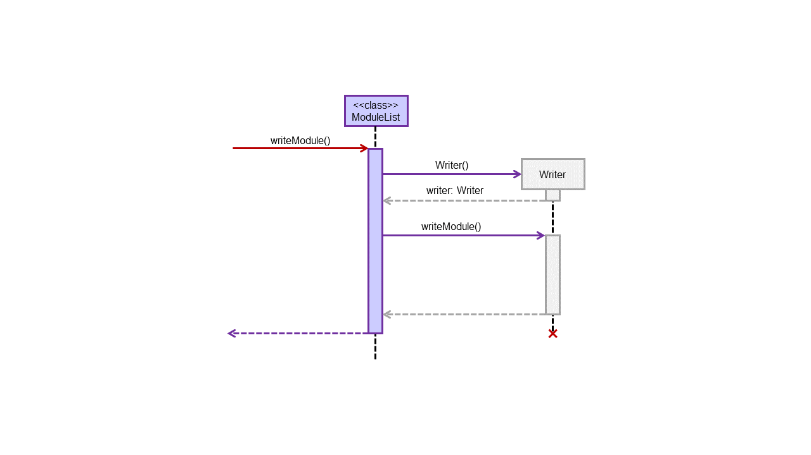
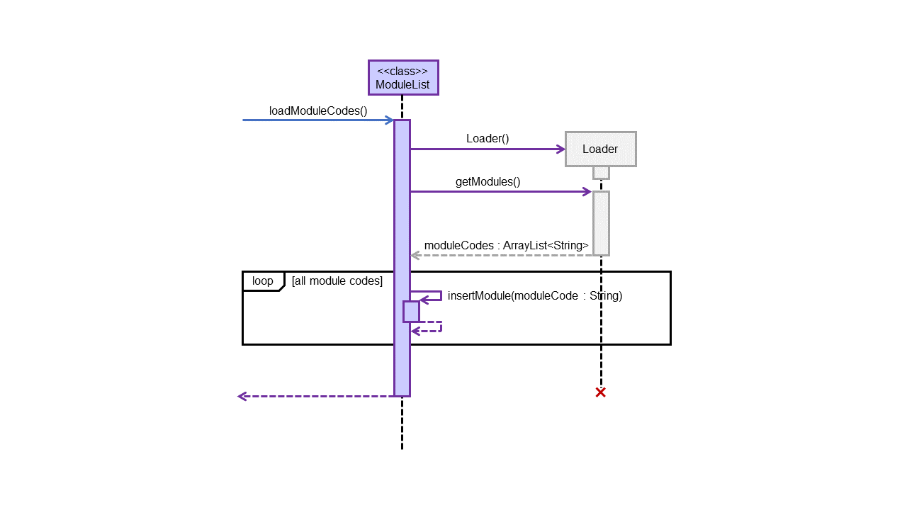

### Adding of Cheat-Sheet

The AddCheatSheetCommand class enables the creation, addition and saving of a .txt file to the current module’s “Cheatsheet” directory (see Figure 6). Upon creating a new AddCheatSheetCommand object and calling the “execute” method on it, the GULIO Text Editor application will also be automatically started.

An invocation of the `add cheat-sheet` command involves the following interactions:

     
    Figure 10 - AddCheatSheetCommand Invocation Sequence Diagram

When the AddCheatSheet command is executed, it gets the current selected module by calling the “getSelectedModule” method in ModuleList. It then calls the “getDirectoryPath” method to obtain the directory where the cheat-sheet would be saved in. Then, it calls the “openTextEditor” method in itself.

&nbsp;

### Loading & Storing of Data

This section covers how the storage component works, from the loading of all module codes to the loading of individual module and creation of data files.

#### Saving of Data

The Writer class is responsible for writing any changes to the module’s data file, as well as creating the file itself. Interaction with this writer class is done through the ModuleList class, whose methods are called by the other components of the app.

     
    Figure 11 - writeModule() Sequence Diagram

Whenever some data in a module changes, the command that made those changes would call the method “writeModule” in ModuleList to update the change in the data file. This method would then call a method of the same name in the Writer class, which overwrites the existing data in the file with the new data.

Due to how much data needs to be written each time, we decided to split the data file by module. That way, we only need to overwrite the module's data when changes are made.

#### Loading of Data

The Loader class is responsible for identifying all the modules currently added, as well as loading the data file of the selected class. Like the Writer class, methods in the Loader class are accessed by the other components via the ModuleList class.

     
    Figure 12 - loadModuleCodes() Sequence Diagram

To identify modules in the “Data” directory, Duke would call “loadModuleCodes” method in the ModuleList. This method would then call the “getModules” method in Loader, which returns a list of module codes. For each of the identified module code, ModuleList would call its own “insertModule” method to add it to the module list.

     
    Figure 13 - setSelectedModule() Sequence Diagram

When a module is selected via the “setSelectedModule” method, the specified module code would be searched for in the module list. If it is inside, “loadModule” method in the Loader would be called. This method reads the module’s data file for data and adds them into a new instance of Module class. This Module is then returned to ModuleList and set as the selected module.

If the Loader failed to load the file, null would be returned. If null is not returned, ModuleList would sort the data and then use Writer to override the existing file. This is done to remove invalid entries that were initially in the file.

&nbsp;

### Future Features

1. Add weightage for modules.
1. Integrate with github.
1. Project info. (Including links and emails)
1. Search via a filter.

&nbsp;

----

## Appendix: Requirements

### Product Scope

#### Target user profile:

1. needs a consolidated and personalisable workspace to organize their university modules
1. prefers desktop apps over other types
1. can type fast
1. is comfortable using CLI apps
1. is familiar with command-line shell environment

#### Value proposition:

Efficiently view and update regularly-needed information on modules and deadlines using a single keyboard.

&nbsp;

### User Stories

> 💡 Priorities levels: 
> `1`: High (Must have) 
> `2`: Medium (Good to have) 
> `3`: Low (Unlikely to have)

| Priority | As a/an ... | I want to ... | So that I can ... |
| --- | --- | --- | --- |
| 1 | new user | see available commands | refer to the help page when I forget how to use the app |
| 1 | NUS student | add a module | store useful information by module that I can easily refer to |
| 1 | NUS student faced with e-learning | add a lesson | consolidate regularly-needed information such as Zoom links by tutorial/lecture, for quick access before the lesson |
| 1 | busy NUS student | add a task | keep track of assignments and deadlines for a module in an organised to-do list |
| 1 | NUS student | get an overview of the module / lesson / task list | filter out specific information with a single command |
| 2 | NUS student | delete a module | store the information only temporarily, e.g. for the semester/term |
| 2 | NUS SOC student | open a module’s cheat sheet(s) | I have a handy list of tools for the module, tests and exams at my disposal |
| 2 | NUS SOC student with many team projects | View a module’s project team information and contact details | keep track of the various teams I am in and communicate more efficiently with my teammates |
| 3 | busy NUS student | sort tasks by graded and done status | know which tasks are of highest priority |

&nbsp;

### Non-Functional Requirements

1. Text editor will only work on OS with GUI support.
1. All other features will work on any mainstream OS.
1. It should work for students taking up to 10 modules.
1. Each module should be able to store 100 tasks without issues.
1. Every command should respond within 10s of input on a typical modern computer.

&nbsp;