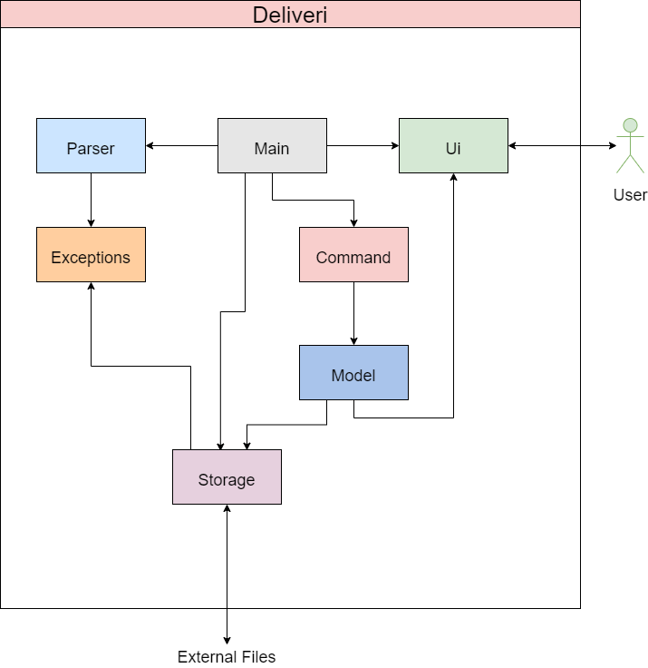

# Developer Guide

## Design & implementation

### Architecture

 

The ***Architecture Diagram*** given above explains the high-level design of the App. 
Given below is a quick overview of each component.

**[`FridgeFriend`](https://github.com/AY2021S2-CS2113-T10-1/tp/blob/master/src/main/java/seedu/fridgefriend/FridgeFriend.java)** is driven by a method called `Main`. 
It is responsible for,
* At app launch: Initializes the components in the correct sequence, and connects them up with each other.
* At shut down: Shuts down the components and invokes cleanup methods where necessary.

[**`Food`**](#common-classes) represents a collection of classes used by multiple other components.

The rest of the App consists of four components.

* [**`UI`**](#ui-component): The UI of the App.
* [**`Parser`**](#parser-component): Processes user input, and determines the related command to be executed.
* [**`Command`**](#command-component): The command executor.
* [**`Storage`**](#storage-component): Reads data from, and writes data to, the hard disk.

## Product scope
### Target user profile

{Describe the target user profile}

### Value proposition

{Describe the value proposition: what problem does it solve?}

## User Stories

|Version| As a ... | I want to ... | So that I can ...|
|--------|----------|---------------|------------------|
|v1.0|new user|see usage instructions|refer to them when I forget how to use the application|
|v2.0|user|find a to-do item by name|locate a to-do without having to go through the entire list|

## Non-Functional Requirements

{Give non-functional requirements}

## Glossary

* *glossary item* - Definition

## Instructions for manual testing

{Give instructions on how to do a manual product testing e.g., how to load sample data to be used for testing}

# Attribution

The format of this User Guide was adapted from [AddressBook Level 3(AB3) Developer Guide](https://github.com/se-edu/addressbook-level3/blob/master/docs/DeveloperGuide.md).