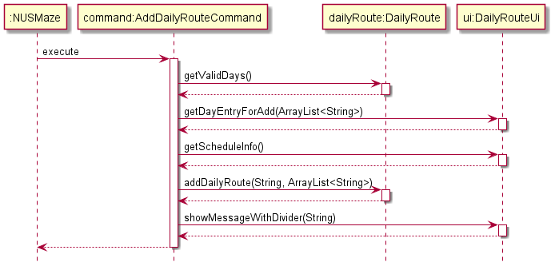

# Developer Guide for NUSMaze

## Table Of Contents
<!-- TOC -->
1. [Introduction](#1-introduction)  
    1.1. [Overview](#11-overview)  
    1.2. [Setting up and getting started](#12-setting-up-and-getting-started)  
2. [Design](#2-design)  
    2.1. [Architecture](#21-architecture)     
    2.2. [UIManager Component](#22-uimanager-component)  
    2.3. [Parser Component](#23-parser-component)  
    2.4. [Command Component](#24-command-component)  
    2.5. [Router Component](#25-router-component)  
    2.6. [Data Component](#26-data-component)  
    2.7. [Storage Component](#27-storage-component)  
3. [Implementation](#3-implementation)  
    3.1. [Save Feature](#31-save-feature)  
    3.2. [Daily Route Planning Feature](#32-daily-route-planning-feature)  
    3.3. [Finding The Shortest Route Feature](#33-finding-the-shortest-route-feature)  
    3.4. [Custom Aliases Feature](#34-custom-aliases-feature)  
    3.5. [History Feature](#35-history-feature)  
4. [Appendix: Requirements](#4-appendix-requirements)  
    4.1. [Product Scope](#41-product-scope)  
    4.2. [User Stories](#42-user-stories)  
    4.3. [Use Cases](#43-use-cases)  
    4.4. [Non-functional Requirements](#44-non-functional-requirements)  
    4.5. [Glossary](#45-glossary)
5. [Appendix: Instructions for manual testing](#5-appendix-instructions-for-manual-testing)
<!-- TOC -->

## 1. Introduction  
### 1.1. Overview

NUSMaze is a Command Line Interface (CLI) based application that aims to simplify NUS Engineering students’ journey from one point to another within the Engineering and Computing faculties of NUS. The application allows users to find the best route from one block to another, add favourite locations, locate the nearest eatery and much more.

The purpose of this developer guide is to aid any curious or interested contributor in developing NUSMaze further by providing more insight on how the features were implemented.

### 1.2. Setting up and getting started 
Step 1. Ensure that Java 11 and IntelliJ Idea (or your preferred Java IDE) are installed in your computer.  
Step 2. Fork the NUSMaze repo from [here](https://github.com/AY2021S2-CS2113T-T09-2/tp), and clone the fork into your computer.    
Step 3. Configure the JDK in IntelliJ Idea to use JDK 11 by following instructions from [here](https://www.jetbrains.com/help/idea/sdk.html#set-up-jdk).    
Step 4. Import the project as a Gradle project.
Step 5. If you had previously disabled the Gradle plugin, go to `File → Settings → Plugins` to re-enable them.  
Step 6. Click on Import Project and select the build.gradle file.  
Step 7. Navigate to the NUSMaze class via the path `src → main → java → seedu.duke → NUSMaze` and right click on it.  
Step 8. Press run on the `Main()` method of NUSMaze.

If the set up process had been completed successfully, you should see the following message:  

## 2. Design 
### 2.1. Architecture

The **Architecture Diagram** above depicts the high-level design of the NUSMaze. You can always refer to this diagram
to understand how the different components of NUSMaze interact with each other.

The class [`NusMaze`](https://github.com/AY2021S2-CS2113T-T09-2/tp/blob/master/src/main/java/seedu/duke/NusMaze.java) is where the `main()` 
method belongs and is reponsible for:
* When the app launches, initialise and connect different components of the NUSMaze in correct sequence.
* When the app terminates, shut down all the components.

Architecture Components of NUSMaze:
* [**`UIManager`**](#22-uimanager-component): The user interface of the app
* [**`Parser`**](#23-parser-component): Processes commands inputted by the user
* [**`Command`**](#24-command-component): Executes the user command 
* [**`Router`**](#25-router-component): Searches shortest router
* [**`Data`**](#26-data-component): Holds the data of the app in memory
* [**`Storage`**](#27-storage-component): Reads data from and write data to external text files

Explanations on how each component is designed and how it functions are further elaborated in the following 
chapters of the developer guide.

### 2.2. UIManager Component 
  
**API**: [UiManager.java](https://github.com/AY2021S2-CS2113T-T09-2/tp/blob/master/src/main/java/seedu/duke/ui/UiManager.java)

The UI of the application is managed by the `UiManager` class as shown by the class diagram above. The individual Ui classes for each feature such as `AliasUi`, `DailyRouteUi`,
`FavouriteUi`, `HistoryUi`, `NoteUi` and `RouterUi` extend the `UiManager` class. The UiManager class consists of the methods
that are used to display recurrent messages on the *CLI* and also the utilitarian methods to get the user's inputs.

The `UiManager` requires the static messages from the `CommonMessages` class to obtain the commonly used messages that
such as the divider and input headers.

The individual UiClasses contain the methods that are used to get user inputs specific to the needs of the specific feature that
it is responsible for. For example, when the routing feature is to be executed, the UI will need to prompt the user to obtain 2
inputs, namely the `from block` and the `to block`. Hence, the `RouterUi` contains the `getRoutingInfo()` method which will prompt
the user for these two inputs. Methods to get user input are called upon directly from the command classes of the specific feature.

The `UiManager` component,
* displays messages in the *CLI*.
* provides the individual Ui classes with the utilities to obtain user input specific to their needs.

### 2.3. Parser Component 

As shown above in the class diagram, **Parser component** is made out of the `Parser` class.
After the `UiManager` reads in the user command, `NusMaze` makes use of the `Parser` to interpret 
the user command and it will instantiate a new Command object to execute the command. 

The Sequence diagram shown below is of a scenario where the user inputs an `"invalid input"`. It will allow you to 
get a better understanding of how the `Parser` class interacts with `NusMaze` and `UiManager`.

### 2.4. Command Component

The class diagram above may seem complicated at first glance but it actually isn't.
The **Command Component** of NUSMaze is made out of `Command` class, which is the parent class of
all the other classes in the component (eg. `GoCommand`, `ByeCommand`). Depending on which command the user inputs, the
`Parser` creates different `Command` class to execute the task. 

Each `Command` class has :
* An distinct `execute()` method which is overrides the parent class, therefore tailored to execute the given command.
* An `ui` specifically for taking in further user input in order to carry out the command.

### 2.5. Router Component

The **Router Component** consist of the `Router` class which is reponsible for finding the shortest route to get from
one location to another. In finding the shortest route, it utilises the breath-first-search algorithm, which will be 
further elaborated in the implementation section.

As shown in the diagram above, `Router` is used by the following classes:
* `GoCommand`
* `RepeatHistoryCommand`
* `RepeatFavouriteCommand`
* `ShowDailyRouteCommand`

### 2.6. Data Component

The **Data Component** is where all the data that are needed to execute a command is stored. For example when `"go"`
command is executed, the `GoCommand`object will use data stored in `NusMap`, `EateryList` and `BlockAlias` in order to find
the shortest route.

On the other hand, `Storage` is responsible for saving and loading data stored in the **Data Component**. This will be
further elaborated in the following section.

### 2.7. Storage Component 

## 3. Implementation

{Describe the design and implementation of the product. Use UML diagrams and short code snippets where applicable.} 

### 3.1. Save feature
#### Current Implementation
The save mechanism is facilitated by `AliasStorage`, `HistoryRouteStorage`, `NotesStorage`, `DailyRouteStorage`, `FavouriteLocationsStorage` subclasses.  
They extend `Storage` (superclass) with a feature to save the block aliases, history of visited routes, tagged notes, daily routes and favourite locations, stored internally as a `aliasList`,  `historyList`, `notesList`, `dailyRouteList` and `favouritesList`.  
Additionally, they implement the following operations:  
- `AliasStorage#overwriteAliasListFile()` —  Saves all aliases given by user to blocks into `aliasList`.  
- `AliasStorage#loadAlias()`   —  Restores all aliases given by user to blocks from `aliasList`.  
- `HistoryRouteStorage#overwriteHistoryListFile()` —  Saves the current list of the 10 most recently visited routes in its history into `historyList`.  
- `HistoryRouteStorage#loadHistory()` —  Restores the previous list of the 10 most recently visited routes in its history from `historyList`.  
- `NotesStorage#overwriteNotesListFile()` —  Saves all notes tagged to a location into `notesList`.  
- `NotesStorage#loadNotes()` —  Restores all notes tagged to a location from `notesList`.  
- `DailyRouteStorage#loadDailyRoute()` —  Saves all the daily routes that user wants to see for each day of the week into `dailyRouteList`.  
- `DailyRouteStorage#overwriteDailyRouteFile()` Restores all the daily routes that user wants to see from `dailyRouteList`.  
- `FavouriteLocationsStorage#overwriteFavouritesListFile()` —  Saves the current list of all the locations that the users are interested in keeping in `favouritesList`.  
- `FavouriteLocationsStorage#loadFavourites()` —  Restores the previous list of the all the locations that the users are interested in keeping from `favouritesList`.  

These operations are exposed in the `Storage` class  as `Storage#loadAlias()`, `Storage#overwriteAliasListFile()`, `Storage#loadHistory()`, `Storage#overwriteHistoryListFile()` , `Storage#loadNotes()`, `Storage#overwriteNotesListFile()`, `Storage#loadDailyRoute()`, `Storage#overwriteDailyRouteFile()` , `Storage#loadFavourites()` and `Storage#overwriteFavouritesListFile()`.  
The image below shows an overview for the storage component, which consist of Storage class and its four subclasses.

Given below is an example usage scenario and how the save mechanism behaves at each step.  
Step 1. The user launches the application for the first time. 
`AliasStorage`, `HistoryRouteStorage`, `NotesStorage`, `DailyRouteStorage` and `FavouriteLocationsStorage` 
will be initialized with the respective file paths of `aliasList`,  `historyList`, `notesList`, `dailyRouteList` and `favouritesList`. 
The lists will be initialized by calling `AliasStorage#loadAlias()`, `HistoryRouteStorage#loadHistory()`, `NotesStorage#loadNotes()` `DailyRouteStorage#loadDailyRoute()` and `FavouriteLocationsStorage#loadFavourites()` with the initial state of the application.   
This is done only once for each time the application is launched.  

 
Step 2. The user executes `go` command to show the route from starting location to final location.   
The `go` command calls `HistoryRouteStorage#overwriteHistoryListFile()`, 
causing the modified state of the `historyList` in the application after the `go` command executes to be saved in the `routesHistoryList.txt`.  
Step 3. The user executes `add note E4/...` to tag a note to that location.   
The `add note` command calls `NotesStorage#overwriteNotesListFile()`, causing  the modified state of the `notesList` to be saved into the `notesList.txt`.  
Step 4. The user executes `delete note E4/1` to remove a note with the given note index from that location, assuming that it exists.   
The `delete note` command also calls `NotesStorage#overwriteNotesListFile()`, causing  the modified state of the `notesList` to be saved into the `notesList.txt`.  
Step 5. The user executes `like E4` command to add a location to favourites.   The `like` command calls `FavouriteLocationsStorage#save()`, causing the modified state of the `favouritesList` to be saved into the `favouritesList.txt`.  
Step 6. At any point when a command is called, the `AliasStorage#overwriteAliasListFile()`, `HistoryRouteStorage#overwriteHistoryListFile()`, `NotesStorage#overwriteNotesListFile()`, `DailyRouteStorage#overwriteDailyRouteFile()` and `FavouriteLocationsStorage#overwriteFavouritesListFile()` methods will be executed, 
but not all files will be modified. The above steps explains which lists will be modified after the commands listed above are called.
For all other commands, they also call the overwrite functions, but they do not modify the state of any of the lists `aliasList`,  `historyList`, `notesList`,  `dailyRouteList` and `favouritesList`. 
Thus, the `aliasList.txt`, `routesHistoryList.txt`, `notesList.txt`, `dailyRouteList.txt`  and `favouritesList.txt` inside the created `data` folder remains unchanged.  
#### Design Consideration
Alternative 1 (current choice): Saves the entire list of block aliases, visited routes, tagged notes, daily routes and favourite locations.  
Pros: Easy to implement.  
Cons: Only highly effective when limited to use of one user.  

### 3.2. Daily route planning feature
#### Current Implementation
The current implementation is facilitated by `DailyRoute` class, with the `AddDailyRouteCommand` and `ShowDailyRouteCommand` subclasses invoking methods that the `DailyRoute` class provides.  
`AddDailyRouteCommand` and `ShowDailyRouteCommand` extend `Command` (superclass), where `AddDailyRouteCommand` implements the feature of adding the schedule of the day to the `DailyRoute` object and `ShowDailyRouteCommand` accesses the `DailyRoute` object to retrieve an ArrayList with the location schedule provided from the `AddDailyRouteCommand` and run the routing algorithm present in the `Router` object.  
`DaySchedulePair` class is implemented to act as a pair between a day input String and schedule ArrayList.
Additionally, they implement the following operations:

`addDailyRoute(String ,ArrayList<String>)` — Maps the inputted day string to the inputted ArrayList of the schedule of the day in a hashmap .  
`getDailyRoute(String)` — Returns the schedule of the day that is mapped to the inputted day.  

These operations are exposed in the `DailyRoute` class  as `DailyRoute#addDailyRoute()` and `DailyRoute#getDailyRoute(String)`.  
Given below is an example usage scenario and how the addDailyRoute mechanism behaves at each step.  
Step 1. The user launches the application. 
Step 2. The user executes `add daily route` command. UI will then prompt the user `SELECT ENTRY TO ADD:`  to input a day index.  
Step 3. The UI then prompts the user to input the next block that is in the day's schedule.    The inputted location will be appended to an ArrayList.  
Step 4. Repeat step 3 until the word `END` is input by the user.   
Step 5. The inputted day, and the filled Arraylist from step 3 is then passed into the DailyRoute object  This done using the addDailyRoute method from the DailyRoute class  
Step 6. The day and filled Arraylist passed in step 5 is then saved in a hashmap that the DailyRoute object contains.   

The following image shows the sequence diagram in which the add day command is implemented

Given below is an example usage scenario and how the showDailyRoute mechanism behaves at each step.

Step 1. The user launches the application. 
Step 2. The user executes `show daily route` command. UI will then prompt the user `SELECT ENTRY TO VIEW:`  to input a day index. This returns an arraylist of the day's schedule  
Step 3. The routing algorithm is now performed for each of the blocks in the array list in order. Each execution of the routing algorithm returns a string which is then appended to the previous one.  
Step 4. The String is output through Daily Route Ui  

The following image shows the sequence diagram in which the add day command is implemented

### 3.3. Finding The Shortest Route Feature
#### Current Implementation

The current implementation of finding the shortest route is facilitated by the `Router` class which uses data stored in `NusMap`, `Block`, and `BlockAlias` class to return the shortest path.

The `GoCommand` class extends the `Command` class and overrides the `execute` method to run the routing algorithm.

The image below depicts how the `GoCommand` is implemented.

Given below is an example scenario of how the routing algorithm functions.

Step 1. User executes `GoCommand` and the `RouterUi` reads in the starting location and destination. 
Step 2. `GoCommand` will then check if the second entry is eatery. If it is not "EATERY", step 3 and 4 are skipped for step 5. 
Step 3. `GoCommand` will then create an instance of `EateryList` and invokes its method `sortEateriesByDistance()` which returns a list of eateries in order of the closest distance. 
Step 4. `GoCommand` then takes in the selection of eatery that the user is chosen and sets the destination. 
Step 5. The Router will then run the `findShortestRoute()` method which is a routing algorithm based on breath-first search. This returns the shortest route as a string 
Step 6. The `RouterUi` will then show the shortest route to the user through `showMessageWithDivider()` method. 

Shown below is the sequence diagram when a valid block is entered for the starting location and destination.

### 3.4. Custom aliases feature
#### Current Implementation
The custom aliases for block names feature is facilitated by the `BlockAlias` class which contains the hashmap of custom aliases and block pairs. The hashmap will have the `custom alias name` as the `key` and the `block name` as the `value` for each key-value pair.

The `AddCustomAliasCommand`, `ShowCustomAliasCommand` and `DeleteCustomAliasCommand` classes extends the `Command` class. These command classes contain the respective `execute` functions for adding, viewing and deleting the user's custom aliases.

The `Storage` class has the feature to save the custom aliases into a local file so that users can load back their custom alias names when restarting the app.

Given below is an example usage scenario and how the add/view/delete mechanism behaves at each step:

Step 1. The user launches the application for the first time. If there is a storage file with pre-existing alias-block pairs, then the hashmap in `BlockAlias` class will be initialized with those data, and an empty hashmap if it does not exist.  

Step 2. The user executes `add alias` command. The user input will be parsed by the `Parser` which will create a new `AddCustomAliasCommand` command. The new command will invoke the UI which will prompt the user `Enter the block:` to input the block name and `Enter the alias name:` to input the alias name that the user wants. The UI parser will then check if the entered block and alias are valid and throw an exception if they are not.  

Step 3. The entered alias and block pair will then be put into a temporary hashmap which will then be merged with the main hashmap in the instance of the BlockAlias.  

Step 4. The user executes `show alias` command. The user input will be parsed by the `Parser` which will create a new `ShowCustomAliasCommand` command. The new command will then invoke the UI which will print `It seems that you do not have any aliases` if the hashmap is empty, or it will print the alias-block pairs in new lines when the hashmap has been previously populated.  

Step 5. The user executes `delete alias` command. The user input will be parsed by the `Parser` which will create a new `DeleteCustomAliasCommand` command. The new command will then invoke the UI which will prompt the user `Enter the alias name that you wish to delete:` where the user will enter the alias name that the wish to remove. The user input for the alias to be removed will be checked against the hashmap and return an exception if the key does not exist. If the alias to be removed exists in the hashmap, the key-value pair will be removed and `Got it! Successfully deleted ALIASTOREMOVE from the aliases` will be displayed to the user.  

Step 6. The user executes `bye` and exits the app. This will invoke the instance of the `Storage` class which will convert the hashmap into the text file format and append to the text file to save the alias data locally.    

### 3.5. History feature

#### Current Implementation
Whenever the user inputs the `go` command, and enters a valid start and destination address, a String consisting the start and end block is created and stored in `historyList`. 
The contents of the `historyList` will be stored into a text file named `historyList.txt` when NUSMaze terminates.

#### Loading of saved history
When NUSMaze starts running, any contents from `historyList.txt` file would be loaded and stored into `historyList`.
Refer to the section on **Storage** for more information.

#### Showing past searches
The user can enter the command `history`, and a numbered list of past searches will be shown to the user.
If there were no past searches, a line of text `"Oops! You have no past history!"` will be shown to the user.

#### Repeat past searches
The user can enter the command `repeat history` to request for a repeat of past searches.
If there are no past searches, a line of text `"Oops! You have no past history!"` will be shown to the user.
If there is at least one entry in `historyList`, then all past searches would be shown to the user, in a numbered list format. 
(Only the starting location and destination location will be shown.)
The user is then prompted to enter the index of the past search to repeat.

#### Clear past searches
The user can enter the command `clear history` to delete all the contents of `historyList`.
A message: `"Your history has been successfully cleared"` will be shown to the user upon successful deletion of the contents of `historyList`.

#### Design Consideration
Alternative 1 (current choice): Each command to add, view and delete are implemented using separate classes.  
Pros: Easy to understand and each command is standalone.  
Cons: Might have to repeat some code fragments.  

Alternative 2: Place all commands (add, view, delete) as functions in 1 command class.  
Pros: Less code to be written and hashmap can be shared by the 3 commands in 1 class.  
Cons: Might be confusing since there is less distinction between each command.

## 4. Appendix: Requirements

### 4.1. Product Scope

NUSMaze is targeted at NUS engineering freshman, to help new students find their way to their destination blocks.

The engineering block is extremely huge, and the layout of the blocks may be confusing for new students. To reduce the time wasted on navigating the numerous blocks in Engineering, NUSMaze will provide the shortest route available for students to take.

### 4.2. User Stories

|Version| As a ... | I want to ... | So that I ...|
|--------|----------|---------------|------------------|
|v1.0|new user|see usage instructions|can refer to them when I forget how to use the application|
|v1.0|user|have a clear path to my destination|will not get lost|
|v1.0|user|be able to pin a note to certain locations as a reminder|do not forget|
|v1.0|user|keep track of my search history|don't have to repeatedly search for the same route.|
|v1.0|user|have a clear interface in which I can enter my commands|can have a good user experience|
|v2.0|user|find the nearest eatery|do not have to starve for longer than necessary|
|v2.0|user|have a list of favorite locations|can access directions to them quickly|
|v2.0|user|have my list of favourites and history stored|can access it every time I start the app|
|v2.0|user|be able to set custom aliases to blocks|can access the blocks more conveniently|
|v2.0|user|be able to store my routing for my daily activities|can access it easily|

### 4.3. Use Cases

### 4.4. Non-Functional Requirements

1. Should work on any mainstream OS as long as it has Java 11 or above installed.

2. Should be able to hold up to 1000 history, notes, favourites and block alias entries without a noticeable sluggishness in performance for typical usage.

3. A user with above average typing speed for regular English text (i.e. not code, not system admin commands) should be able to accomplish most of the tasks faster using commands than using the mouse.

### 4.5. Glossary

* *CLI* - Command Line Interface

## 5. Appendix: Instructions for manual testing

{Give instructions on how to do a manual product testing e.g., how to load sample data to be used for testing}
