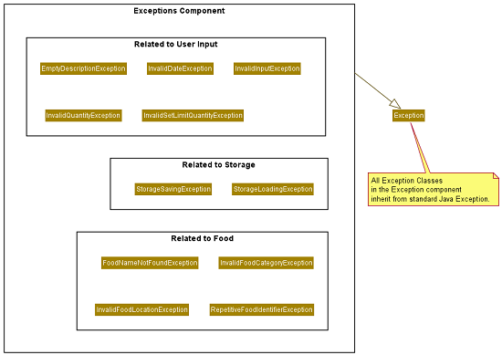

# Developer Guide

## Introduction

`FridgeFriend` is an app for managing food in the fridge, optimised for use via a Command Line Interface (CLI).
If you can type fast, `FridgeFriend` can track your cold or frozen groceries faster and easier than any other apps.
It is written in Java, and has more than 3.2kLoC.

## Contents

* [Introduction](#introduction)
* [Design](#design)
  * [Architecture](#architecture)
  * [Utilities Component](#utilities-component)
  * [Command Component](#command-component)
  * [Food Component](#food-component)
  * [Exception Component](#exception-component)
* [Implementation](#implementation)
  * [Main Logic](#main-logic)
  * [Add Command](#add-command)
  * [List Command](#list-command)
  * [Remove Command](#remove-command)
  * [Search Command](#search-command)
  * [Storage](#storage-command)
* [Product Scope](#product-scope)
  * [Target User Profile](#target-user-profile)
  * [Value Proposition](#value-proposition)
* [User Stories](#user-stories)
* [Non-Functional Requirements](#non-functional-requirements)
* [Glossary](#glossary)
* [Instructions for Manual Testing](#instructions-for-manual-testing)
* [Attribution](#attribution)

## Design

### Architecture

The ***Architecture Diagram*** given above explains the high-level design of the App.
Given below is a quick overview of each component.

The Main driver class for the FridgeFriend app is
named **[`FridgeFriend`](https://github.com/AY2021S2-CS2113-T10-1/tp/blob/master/src/main/java/seedu/fridgefriend/FridgeFriend.java)**.
It is responsible for,

* At app launch: Initializes the components in the correct sequence, and connects them up with each other.
* At shut down: Shuts down the components and invokes cleanup methods where necessary.

The rest of the App consists of four components.

* [**`Utilities`**](#utilities-component): The main component containing the key driver classes in
  FridgeFriend, such as `Parser`, `UI`, and `Storage`.

* [**`Command`**](#command-component): Executes commands based on the input obtained
  and processed from `Parser` in `Utilities`. The list of executable commands can be found in our
  [User Guide](https://ay2021s2-cs2113-t10-1.github.io/tp/UserGuide.html).

* [**`Food`**](#food-component) represents a collection of classes used by the FridgeFriend application.
  Food objects are instantiated by the `Command` Component. Once a `Food` object is created,
  it may be stored to disk using the `Storage` function in `Utilities`.

* [**`Exception`**](#exception-component) represents a collection of classes that represent potential
  exception events that may occur during the usage of `FridgeFriend`. The `Exception` component
  facilitates the return of exceptions to the `UI` class in `Utilities`, which will display
  the error message to the user.

### Utilities Component

The Utilities component contains the main classes that run the main functions of FridgeFriend.

The ***Utilities Class Diagram*** given above shows how the classes in the Utilities component interact with each other and classes from other component.

The Utilities Component consists for 4 classes.

* **`LoggingHandler`**: Logs information during execution to the console.
* **`Parser`**: Breaks down user input into relevant objects.
* **`Storage`**: Reads data from, and writes data to, the local disk.
* **`Ui`**: Handles the input and output of the application.

### Command Component

The Command component contains the sub classes of the features that will be executed.

The command Object is executed by the main method in FridgeFriend.
The execution of the command can affect the fridge.
After the execution, the results of the command object is pass to the UI.
The results of the command instruct the Ui to display the message return to the user.

The ***Command Class Diagram*** given above shows how the Command interact with Fridge.

The Command Component consist of 10 sub class which each command represents a features.

* **AddCommand**: Add a food object to the fridge when executed.
* **RemoveCommand**: Remove a portion of food quantity from a particular food in the fridge when executed.
* **ListCommand**: List details of food either by a category, storage location or all off it when executed.
* **SearchCommand**: Search for the details of the food.
* **ExpiringCommand**: Provide the list of item that is expiring in a week when executed.
* **ClearCommand**: Clear the list of food objects in the fridge object.
* **HelpCommand**: List the instruction on how to use all the commands in FridgeFriend.
* **RunningLowCommand**: Provide the food category that are running low compare to the limit set in the Food Category.
* **SetLimitCommand**: Change the default quantity limit in that particular Food Category.
* **ByeCommand**: Indicate to the main method to exit the program.

### Exception Component

The Exception component represents a collection of classes that represent potential
exception events that may occur during the usage of `FridgeFriend`.

The `Exception` component facilitates the return of exceptions to the `UI` class
in `Utilities`, which will display the corresponding error message to the user.

The ***Exception Class Diagram*** given above shows the custom `Exceptions`
created for the FridgeFriend project, and stored inside the `Exceptions` component.

All exceptions extend from the Java default `Exception` class. They only differ with regard
to the throwable error message.

The `Exceptions` component currently consists of ten (10) custom Exceptions, as of v2.0:

Among these ten custom exceptions, the `Exceptions` component can generally be
classified into three broad categories:

_Exceptions related to invalid user input:_

* **`EmptyDescriptionException`**: Is thrown when an empty input string is detected by `Parser`, where
  an input is expected.
  * Error Message: `"Sorry my friend, the description cannot be empty."`
* **`InvalidFoodCategoryException`**: Is thrown when user input is not a valid `FoodCategory`,
  where a valid `FoodCategory` is expected. Users can check `help` or the
  [User Guide](https://ay2021s2-cs2113-t10-1.github.io/tp/UserGuide.html).
  * Error Message: `"Sorry my friend, FOOD_CATEGORY is not a valid category."`
* **`InvalidDateException`**: Is thrown when user input, where a date is expected, does not
  match the `dd-mm-yy` format.
  * Error Message: `"Sorry my friend, the date must be in the form 'dd-mm-yy'."`
* **`InvalidIndexException`**: Is thrown when user input does not translate into a valid integer index that represents
  an existing Food in the Fridge, where
  a valid input index that represents Food that exists in the Fridge is expected.
  * Error Message: `"Please enter a valid index to remove food."`
* **`InvalidInputException`**: Is thrown when an unrecognised command is input into FridgeFriend,
  or when the List Command does not recognise the secondary input string.
  * Error Message: `"Sorry my friend, please give a valid input."`
* **`InvalidQuantityException`**: Is thrown when user input is not an integer where an integer is expected for
  `Quantity` related functions, or when excess quantity of food is removed from the Fridge, where the quantity
  of food in the fridge remaining would be negative.
  * Error Message: `"Sorry my friend, the quantity QUANTITY_INPUT must be a number."`
  * Error Message: `"Not enough in fridge to remove!"`

_Exceptions related to Food:_

* **`FoodNameNotFoundException`**: Is thrown when the input string contains the name of a Food that is
  not found in the Fridge, where the name of a food existing in the Fridge is expected.
  * Error Message: `"Food specified not found."`
* **`RepetitiveFoodIdentifierException`**: Is thrown when user attempts to add duplicate Food to the Fridge in a
  different location or with a different expiry date. This is not allowed as of v2.0.
  * Error Message: `"Sorry my friend, you have added this food before but in a different location or have different expiry dates.
      Please specify another foodname."`

_Exceptions related to file storage:_

* **`StorageLoadingException`**: Is thrown when an error occurred during loading of the saved data.
  * Error Message: `"There was an error loading the data for FridgeFriend!"`
* **`StorageSavingException`**: Is thrown when an error occurred during saving of the current data.
  * Error Message: `"There was an error saving the data for FridgeFriend!"`

## Implementation

## Product Scope

### Target User Profile

{Describe the target user profile}

### Value Proposition

{Describe the value proposition: what problem does it solve?}

## User Stories

|Version| As a ... | I want to ... | So that I can ...|
|--------|----------|---------------|------------------|
|v1.0|new user|see usage instructions|refer to them when I forget how to use the application|
|v1.0|user|add items into the fridge|keep track of what is in the fridge|
|v1.0|user|remove items from the fridge|keep track of what is in the fridge|
|v1.0|user|list all food items in the fridge|know inside the fridge without having to open the fridge itself|
|v1.0|forgetful user|search for a specific food item|recall if I have that food item inside the fridge|
|v1.0|organised user|tag the food’s category when I add into fridge(e.g. veggies, meat, dairy)|track what kinds of food I have in the fridge|
|v1.0|organised user|list food items by category|check specific categories of food|
|v1.0|organised user|add a storage location for a specific food item|know which part of the fridge is stored in|
|v1.0|organised user|add the expiry date to each food item I put into the fridge|keep track of what is going to expire|
|v1.0|lazy user|search for items that are expiring|see what items are about to expire without having to open the fridge|
|v1.0|lazy user|automatically save information to a data file|safely exit the system without losing information|
|v1.0|lazy user|automatically retrieve previously saved information from a data file|know the list of items I already have in my fridge|
|v2.0|lazy user|list all food stored in a part of the fridge|track how full each location is without having to open the fridge|
|v2.0|meticulous user|specify the weight or quantity of each food item I add into the fridge|know the exact amount of the food item I have left|
|v2.0|meticulous user|remove a certain weight of each food package item that I am going to use|know how much weight of the item it has left|
|v2.0|forgetful user|define the lower limits of each food category that the fridge should contain|receive reminders that the food is depleted|
|v2.0|forgetful user|receive warnings when certain food items are running low after I remove a food item|not personally check for food quantity|
|v2.0|lazy user|request for a list of food items running low or expiring|easily create a shopping list|
|v2.0|health conscious user|view the history of food items that I have bought in the past|better track my food habits|

## Non-Functional Requirements

{Give non-functional requirements}

## Glossary

* *glossary item* - Definition

## Instructions for Manual Testing

{Give instructions on how to do a manual product testing e.g., how to load sample data to be used for testing}

## Attribution

The format of this User Guide was adapted from [AddressBook Level 3(AB3) Developer Guide](https://github.com/se-edu/addressbook-level3/blob/master/docs/DeveloperGuide.md).
