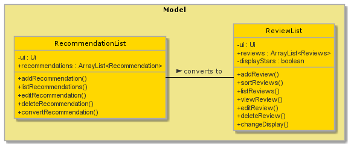
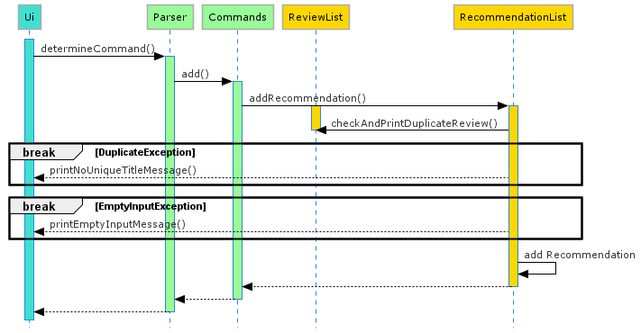

# Developer Guide
## Table of Contents

1. [Preface](#1-preface)
   
2. [How to use this document](#2-how-to-use-this-document)
   
3. [Setting up](#3-setting-up)
    
    3.1 [Prerequisites](#31-prerequisites)
   
    3.2 [Setting up the project in your computer](#32-setting-up-the-project-in-your-computer)
   
    3.3 [Verifying the setup](#33-verifying-the-setup)
    3.4 [Configure coding style](#34-configure-the-coding-style)
   
4. [Design](#4-design)
    
    4.1 [Architecture: High Level View](#41-architecture-high-level-view)
    
    4.2 [UI component](#42-ui-component)
    
    4.3 [Logic component](#43-logic-component)
    
    4.4 [Model component](#44-model-componenet)
    
    4.5 [Sorter component](#45-sorter-component)
    
    4.6 [Storage component](#46-storage-component)
    
5. [Implementation](#5-implementation)

    5.1 [Mode Switch Feature](#51-mode-switch-feature)
   
    5.2 [Review Mode](#52-review-Mode)

           5.2.1 [Add a Review Feature](#521-add-a-review-feature) 
   
           5.2.2 [List Reviews Feature](#522-list-reviews-feature) 
   
           5.2.3 [Sort Reviews Feature](#523-sort-reviews-feature) 
   
           5.2.4 [View a Review Feature](#524-view-a-review-feature) 
   
           5.2.5 [Edit a Review Feature](#525-edit-a-review-feature) 
   
           5.2.6 [Delete a Review Feature](#526-delete-a-review-feature)
   
   5.3 [Recommendation Mode](#53-recommendation-mode)
   
           5.3.1 [Add a Recommendation Feature](#531-add-a-recommendation-feature) 
   
           5.3.2 [List Recommendation Feature](#532-list-recommendation-feature) 
   
           5.3.3 [Edit a Recommendation Feature](#533-edit-a-recommendation-feature) 
   
    5.4 [Storage](#54-storage)
   
           5.4.1 [Storage Format](#541-storage-format) 
   
           5.4.2 [Implementation](#542-implementation) 
   
    5.5 [Error handling](#55-error-handling) 
   
    5.6 [Personalised Messages](#56-personalised-messages) 
   
6. [Planned Features](#6-planned-features) 
   
7. [Documentation](#7-documentation) 
   
    7.1 [Setting up and maintaining the project website](#71-setting-up-and-maintaining-the-project-website) 
   
    7.2 [Style guidance](#72-style-guidance) 
    
    7.3 [Diagrams](#73-diagrams)
    
8. [Testing](#8-testing) 

    8.1 [Running tests](#81-running-tests) 
    
    8.2 [Types of tests](#82-types-of-tests) 
    
9. [Appendix](#appendix) 
    
    Appendix A: [Product Scope](#appendix-a-product-scope) 
       
    Appendix B: [User Stores](#appendix-b-user-stories)
    
    Appendix C: [Use Cases](#appendix-c-use-cases) 
       
    Appendix D: [Non-Functional Requirements](#appendix-d-non-functional-requirements)
       
    Appendix E: [Glossary](#appendix-e-glossary) 
       
    Appendix F: [Instructions for manual testing](#appendix-e-glossary)
   
## 1. Preface
Connoisseur is a desktop application for managing and storing a list of personal reviews on experiences, and a list of 
recommendations to try next.

The Developer Guide for Connoisseur v2.1 is designed for developers intending to improve Connoisseur, by fixing bugs, 
or perhaps adding entirely new features. It explains how the project is set up, the architecture used, and the code 
style you should adopt when contributing code to the project.

## 2. How to use this document

//TODO//

## 3. Setting up
The following section describes how to set up the coding environment on your own computer, in order to start writing 
code to improve Connoisseur.

### 3.1 Prerequisites
1. JDK 11  
   [Download JDK 11](#https://www.oracle.com/sg/java/technologies/javase-jdk11-downloads.html)
2.  *Recommended integrated development environment for coding* : IntelliJ IDEA 
   [Download IntelliJ IDEA](#https://www.jetbrains.com/idea/)
   
### 3.2 Setting up the project in your computer
>
&#10071 Follow the steps in the following guide precisely. Things will not work out if you deviate in some steps.

1. **Fork** this repo, and **clone** the fork into your computer.
2. Open IntelliJ (if you are not in the welcome screen, click **`File`** > **`Close Project`** to close the existing project dialog first).
3. Set up the correct JDK version for Gradle  
   a. Click **`Configure`** > **`Project Defaults`** > **`Project Structure`**  
   b. Click **`New...`** and find the directory of the JDK.
4. Click **`Import Project`**.
5. Locate the **`build.gradle`** file and select it. Click **`OK`**.
6. Click **`Open as Project`**.
7. Click **`OK`** to accept the default settings.

### 3.3 Verifying the setup

### 3.4 Configure Coding style
If using IDEA, follow the guide [[se-edu/guides] IDEA: Configuring the code style](https://se-education.org/guides/tutorials/intellijCodeStyle.html)
to set up IDEA’s coding style to match ours.

>Optionally, you can follow the guide [[se-edu/guides] Using Checkstyle](https://se-education.org/guides/tutorials/checkstyle.html)
>to find how to use the CheckStyle within IDEA e.g., to report problems as you write code.

## 4. Design
The following section describes the design and implementation of the product. We use UML diagrams and code snippets
to explain some aspects of the code. If you are unfamiliar with UML, the diagrams should still be fairly
understandable. However, you may wish to consult [[CS2113/T] Modeling](https://nus-cs2113-ay2021s1.github.io/website/se-book-adapted/chapters/modeling.html) for a quick introduction to UML.

### 4.1 Architecture: High Level View

**How the architecture components interact with each other**

The following Figure 1, provides a rough overview of how **Connoisseur** is built. 

 
Figure 1. Architecture of Connoisseur  

As shown in Figure 1, the user interacts with `UI`, which takes in commands and displays output to the user. 

The main `Connoisseur` class initializes the other components in the application. It passes the input received from the user to the logic component, which consists of `Parser` and `Commands`. 

`Parser` will decipher the input and make the corresponding method calls in `Commands`. Depending on whether Connoisseur is in review or recommendation mode, the `Commands` class will execute the respective commands in the `ReviewList` and `RecommendationList` classes of the `Model` component. 

In the case of a storing data, `Commands` will interact directly with the `Storage` class to save the data. 

The `ReviewList` class has sorting functions which requires `Sorter`. All the reviews will be passed to `Sorter` to be sorted, which then returns the sorted reviews back to `ReviewList`. 

`RecommendationList` also interacts with `ReviewList` for converting Recomendations to Reviews. 

### 4.2 UI component

The UI component of Connoisseur consists of the classes `UI` and `Messages`.
It is instantiated in the connoisseur() method and serves two main purposes:
* Read user input from the console.
* Print program output to the console. 

The *ui.readCommand()* method reads the input which is then passed on to the `Logic` component. 

The *ui.println(output)* method prints output to the console. Default output messages are stored as static String constants in the `Messages` class, while commonly used output messages are made methods by themselves. *ui.printGreeting()* is one such method and is called to display the welcome message to the user. 

### 4.3. Logic component

 
Figure 2. Logic Component of Connoisseur  

The Logic component of Connoisseur consists of the classes `Parser` and `Commands`. 
It is instantiated in the connoisseur() method and serves to translate user input into commands which are recognised by the application. 

The *determineCommand()* method of the `Parser` class deciphers the command word of the input, calling the respective command's method in `Commands`. 

Each method in `Commands` will then check the arguments provided with the commands to make sure that they are valid, before executing the command in `Storage`, `ReviewList` or `RecommendationList`. 

### 4.4. Model component

 
Figure 2. Model Component of Connoisseur  

The Model component of Connoisseur consists of the classes `ReviewList` and `RecommendationList`. 
It is instantiated in the connoissuer() method and serves to store data as the program runs. 

Both the classes in the Model component contain methods which modify the content of their respective ArrayLists, which consist of either Reviews or Recommendations. 

### 4.5. Sorter component

 
Figure 3. Sorter Component of Connoisseur  

The Sorter component is a separate component which serves to sort the reviews based on a few sorting methods. 

When the *sortReviews()* method is called in the `ReviewList`, a sortMethod parameter is passed together with it to the `Sorter`, which then determines which of the Sorts to sort the reviews by. If the sortMethod parameter is empty, `Sorter` will use the default sortMethod saved. The sorted reviews are then passed back to `ReviewList`. 

### 4.6. Storage component

The Storage component serves to implement the storage functions of Connoisseur. It saves and loads data represented as a JSON file in the *./data* folder so that data can be retained after exiting Connoisseur. 

On startup, Connoisseur checks if there is a *connoisseur.json* file in the *./data* folder. If they exist, the data will be loaded via the *loadConnoisseurData()* method and used to initialize classes in the `Model` component. If the file and folder do not exist, they will be created and new instances of the classes in the `Model` component will be initialized instead. 

Before exiting, Connoissuer will save the data from the `Model` component and write them to *connoisseur.json* located in the *./data* folder. 

## 5. Implementation
### 5.1 Mode Switch Feature
### 5.2 Review Mode
### 5.2.1 Add a Review Feature
### 5.2.2 List Reviews Feature 
### 5.2.3 Sort Reviews Feature
### 5.2.4 View a Review Feature
### 5.2.5 Edit a Review Feature
###5.2.6 Delete a Review Feature

### 5.3 Recommendation Mode
This section provides details on the implementation of the various commands that occurs in the recommendation mode.
This mode allows users to keep a list of recommendations that they have not tried/completed.
This mode implements the following features:

*`add`/`new` - Add a Recommendation
*`list` - List Recommendations
*`edit [TITLE_OF_RECOMMENDATION]` - Edit a Recommendation
*`delete [TITLE_OF_RECOMMENDATION]` - Delete a Recommendation
*`done [TITLE_OF_RECOMMENDATION]` - Review a Recommendation
### 5.3.1 Add a Recommendation Feature
This feature allows user to add a recommendation for any of the activities that they have not completed.

&#10071; Title of a new recommendation cannot exist in current list of reviews. An error message would be printed out.

The mechanism to add a recommendation is facilitated by the `RecommendationList` class. The user is able to add in a new recommendation using `new` or `add` command.
`addRecommendation#execute` and `addRecommendationDetails#execute` are called.
`Recommendation` add by the user would be added into `recommendations`

The following is the Sequence diagram to `add a recommendation`.

Figure !!. Sequence Diagram for add recommendations

Figure !!. Adding a Recommendation

The
When the user attempts to add a new recommendation, 
### 5.3.2 List Recommendation Feature
### 5.3.3 Edit a Recommendation Feature
### 5.3.4 Delete a Recommendation Feature
### 5.3.5 Review a Recommendation Feature

### 5.4 Storage
### 5.4.1 Storage Format
### 5.4.2 Implementation
### 5.5 Error handling
#### Invalid Input Format
#### Invalid File
### 5.6 Personalised Messages
## 6. Planned Features
## 7. Documentation
### 7.1 Setting up and maintaining the project website
### 7.2 Style guidance
### 7.3 Diagrams
## 8. Testing
### 8.1 Running tests
### 8.2 Types of tests
## Appendix
### Appendix A: Product Scope
### Appendix B: User Stories
|Version| As a ... | I want to ... | So that I can ...|
|--------|----------|---------------|------------------|
|v1.0|new user|see usage instructions|refer to them when I forget how to use the application|
|v1.0|user|see the number of recommendations I have|keep track of the number of reviews I've made|
|v1.0|user|be able to save my previous recommendations|refer to the old entries that I have|
|v1.0|busy user|be able to do quick ratings|save time|
|v1.0|user|delete selected items that I no longer wish to recommend|edit my list according to my liking|
|v1.0|busy user|have a template to guide my reviews|input my reviews quickly|
|v2.0|indecisive user|change my review and opinnions on things|record my opinions accurately at all times|
|v2.0|forgetful user|be prompted of an existing review|avoid duplicates in my list|
|v2.0|lazy user|have my sorting preferences saved|avoid having to input my preferred sorting method all the time|
### Appendix C: Use Cases
### Appendix D: Non-Functional Requirements
### Appendix E: Glossary
### Appendix F: Instructions for manual testing