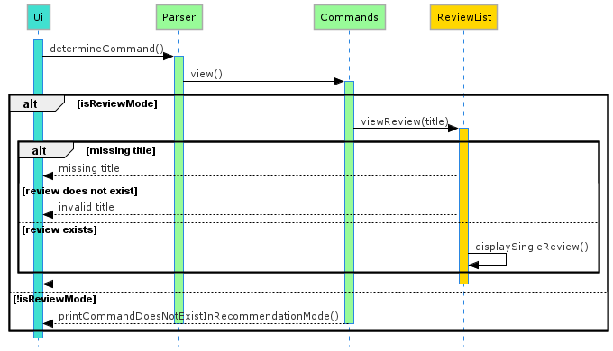
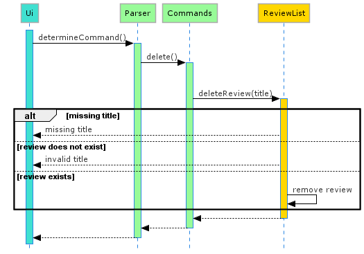

# Developer Guide

## Table of Contents

1. [Preface](#1-preface)

2. [How to use this document](#2-how-to-use-this-document)

3. [Setting up](#3-setting-up)
    
    3.1 [Prerequisites](#31-prerequisites)
   
    3.2 [Setting up the project in your computer](#32-setting-up-the-project-in-your-computer)
   
    3.3 [Verifying the setup](#33-verifying-the-setup)
   
    3.4 [Configure coding style](#34-configure-the-coding-style)
   
4. [Design](#4-design)
    
    4.1 [Architecture: High Level View](#41-architecture-high-level-view)
    
    4.2 [UI component](#42-ui-component)
    
    4.3 [Logic component](#43-logic-component)
    
    4.4 [Model component](#44-model-componenet)
    
    4.5 [Sorter component](#45-sorter-component)
    
    4.6 [Storage component](#46-storage-component)
    
5. [Implementation](#5-implementation)

   5.1 [Mode Switch Feature](#51-mode-switch-feature)

   5.2 [Review Mode](#52-review-Mode)

          5.2.1 [Add a Review Feature](#521-add-a-review-feature)

          5.2.2 [List Reviews Feature](#522-list-reviews-feature)

          5.2.3 [Sort Reviews Feature](#523-sort-reviews-feature)

          5.2.4 [View a Review Feature](#524-view-a-review-feature)

          5.2.5 [Edit a Review Feature](#525-edit-a-review-feature)

          5.2.6 [Delete a Review Feature](#526-delete-a-review-feature)

   5.3 [Recommendation Mode](#53-recommendation-mode)

          5.3.1 [Add a Recommendation Feature](#531-add-a-recommendation-feature)

          5.3.2 [List Recommendation Feature](#532-list-recommendation-feature)

          5.3.3 [Edit a Recommendation Feature](#533-edit-a-recommendation-feature)

   5.4 [Storage](#54-storage)

          5.4.1 [Storage Format](#541-storage-format)

          5.4.2 [Implementation](#542-implementation)

   5.5 [Error handling](#55-error-handling)

   5.6 [Personalised Messages](#56-personalised-messages)

6. [Planned Features](#6-planned-features)

7. [Documentation](#7-documentation)

   7.1 [Setting up and maintaining the project website](#71-setting-up-and-maintaining-the-project-website)

   7.2 [Style guidance](#72-style-guidance)

   7.3 [Diagrams](#73-diagrams)

8. [Testing](#8-testing)

   8.1 [Running tests](#81-running-tests)

   8.2 [Types of tests](#82-types-of-tests)

9. [Appendix](#appendix)

   Appendix A: [Product Scope](#appendix-a-product-scope)
    * [Target User Profile](#target-user-profile)
    * [Value Proposition](#value-proposition)

   Appendix B: [User Stores](#appendix-b-user-stories)

   Appendix C: [Non-Functional Requirements](#appendix-c-non-functional-requirements)

   Appendix D: [Instructions for manual testing](#appendix-d-instructions-for-manual-testing)
   
   Appendix E: [Other Guides: Documentation, Testing, Dev-ops](#appendix-e-other-guides-documentation-testing-dev-ops)

   Appendix F: [Glossary](#appendix-f-glossary)

## 1. Preface

Connoisseur is a desktop application for managing and storing a list of personal reviews on experiences, and a list of
recommendations to try next.

The Developer Guide for Connoisseur v2.1 is designed for developers intending to improve Connoisseur, by fixing bugs, or
perhaps adding entirely new features. It explains how the project is set up, the architecture used, and the code style
you should adopt when contributing code to the project.

## 2. How to use this document

//TODO//

## 3. Setting up

The following section describes how to set up the coding environment on your own computer, in order to start writing
code to improve Connoisseur.

### 3.1 Prerequisites

1. JDK 11  
   [Download JDK 11](#https://www.oracle.com/sg/java/technologies/javase-jdk11-downloads.html)
2. *Recommended integrated development environment for coding* : IntelliJ IDEA 
   [Download IntelliJ IDEA](#https://www.jetbrains.com/idea/)

### 3.2 Setting up the project in your computer

> 
&#10071 Follow the steps in the following guide precisely. Things will not work out if you deviate in some steps.

1. **Fork** this repo, and **clone** the fork into your computer.
2. Open IntelliJ (if you are not in the welcome screen, click **`File`** > **`Close Project`** to close the existing
   project dialog first).
3. Set up the correct JDK version for Gradle  
   a. Click **`Configure`** > **`Project Defaults`** > **`Project Structure`**  
   b. Click **`New...`** and find the directory of the JDK.
4. Click **`Import Project`**.
5. Locate the **`build.gradle`** file and select it. Click **`OK`**.
6. Click **`Open as Project`**.
7. Click **`OK`** to accept the default settings.

### 3.3 Verifying the setup

### 3.4 Configure Coding style

If using IDEA, follow the
guide [[se-edu/guides] IDEA: Configuring the code style](https://se-education.org/guides/tutorials/intellijCodeStyle.html)
to set up IDEA’s coding style to match ours.

> Optionally, you can follow the guide [[se-edu/guides] Using Checkstyle](https://se-education.org/guides/tutorials/checkstyle.html)
> to find how to use the CheckStyle within IDEA e.g., to report problems as you write code.

## 4. Design

The following section describes the design and implementation of the product. We use UML diagrams and code snippets to
explain some aspects of the code. If you are unfamiliar with UML, the diagrams should still be fairly understandable.
However, you may wish to
consult [[CS2113/T] Modeling](https://nus-cs2113-ay2021s1.github.io/website/se-book-adapted/chapters/modeling.html) for
a quick introduction to UML.

### 4.1 Architecture: High Level View

**How the architecture components interact with each other**

The following Figure 1, provides a rough overview of how **Connoisseur** is built. 

 
Figure 1. Architecture of Connoisseur  

As shown in Figure 1, the user interacts with `UI`, which takes in commands and displays output to the user. 

The main `Connoisseur` class initializes the other components in the application. It passes the input received from the user to the logic component, which consists of `Parser` and `Commands`. 

`Parser` will decipher the input and make the corresponding method calls in `Commands`. Depending on whether Connoisseur is in review or recommendation mode, the `Commands` class will execute the respective commands in the `ReviewList` and `RecommendationList` classes of the `Model` component. 

In the case of storing data, `Commands` will interact directly with the `Storage` class to save the data. 

The `ReviewList` class has sorting functions which requires `Sorter`. All the reviews will be passed to `Sorter` to be sorted, which then returns the sorted reviews back to `ReviewList`. 

`RecommendationList` also interacts with `ReviewList` for converting Recomendations to Reviews. 

### 4.2 UI component

The UI component of Connoisseur consists of the classes `UI` and `Messages`.
It is instantiated in the connoisseur() method and serves two main purposes:
* Read user input from the console.
* Print program output to the console. 

The *ui.readCommand()* method reads the input which is then passed on to the `Logic` component. 

The *ui.println(output)* method prints output to the console. Default output messages are stored as static String constants in the `Messages` class, while commonly used output messages are made methods by themselves. *ui.printGreeting()* is one such method and is called to display the welcome message to the user. 

### 4.3. Logic component

 
Figure 2. Logic Component of Connoisseur  

The Logic component of Connoisseur consists of the classes `Parser` and `Commands`. 
It is instantiated in the connoisseur() method and serves to translate user input into commands which are recognised by the application. 

The *determineCommand()* method of the `Parser` class deciphers the command word of the input, calling the respective command's method in `Commands`. 

Each method in `Commands` will then check the arguments provided with the commands to make sure that they are valid, before executing the command in `Storage`, `ReviewList` or `RecommendationList`. 

### 4.4. Model component

 
Figure 2. Model Component of Connoisseur  

The Model component of Connoisseur consists of the classes `ReviewList` and `RecommendationList`. 
It is instantiated in the connoissuer() method and serves to store data as the program runs. 

Both the classes in the Model component contain methods which modify the content of their respective ArrayLists, which consist of either Reviews or Recommendations. 

### 4.5. Sorter component

 
Figure 3. Sorter Component of Connoisseur  

The Sorter component is a separate component which serves to sort the reviews based on a few sorting methods. 

When the *sortReviews()* method is called in the `ReviewList`, a sortMethod parameter is passed together with it to the `Sorter`, which then determines which of the Sorts to sort the reviews by. If the sortMethod parameter is empty, `Sorter` will use the default sortMethod saved. The sorted reviews are then passed back to `ReviewList`. 

### 4.6. Storage component

The Storage component serves to implement the storage functions of Connoisseur. It saves and loads data represented as a JSON file in the *./data* folder so that data can be retained after exiting Connoisseur. 

On startup, Connoisseur checks if there is a *connoisseur.json* file in the *./data* folder. If they exist, the data will be loaded via the *loadConnoisseurData()* method and used to initialize classes in the `Model` component. If the file and folder do not exist, they will be created and new instances of the classes in the `Model` component will be initialized instead. 

Before exiting, Connoissuer will save the data from the `Model` component and write them to *connoisseur.json* located in the *./data* folder. 

## 5. Implementation
The following section describes the implementation of certain key features in the current version of Connoisseur. It also
provides some background into our (the original developers of Connoisseur) thinking and the rationale behind the decisions.

### 5.1 Mode Switch Feature
The mode switch feature is shown in Figure 4. The two modes in Connoisseur are Review and Recommendation. These two modes have some overlapping commands. 
However, depending on the mode Connoisseur is currently in, the same command displays different output to the user. Each mode has its own
unique features and commands as well. This section explains how the mode switch feature is implemented.

Figure 4. Mode Switching in Connoisseur

The following Figure 5 is the Sequence diagram to _Switch Mode_. 

Figure 5. Sequence Diagram for Mode Switch Feature

A general explanation of how this feature works::  

1. User inputs commands that trigger mode switch. `review` and `reco` are commands which are recognised by Parser class as mode switching commands through the `determineCommand()` method.
2. If `review` command is input by user, `Commands` class calls `reviewMode()` method which sets `private boolean isReviewMode` attribute to _true_.
3. If `reco` command is input by user, `Commands` class calls `recommendationMode()` method which sets `private boolean isReviewMode` attribute to _false_.
4. Finally, `reviewMode()` and `recommendationMode()` calls `Ui` class method `println()` to display message _"You are in review mode"_ or _"You are in recommendation mode"_ 
   respectively as shown in Figure 4. 

### 5.2 Review Mode
When User inputs a command, `Commands` class checks for the value of the attribute
`boolean isReviewMode` before executing the command. As explained in [section 5.1](#51-mode-switch-feature), when in review mode, `boolean isReviewMode` is equal to _true_. 
Hence, only commands that are recognised by the Review Mode are executed when input by user. Else, inavild command message is displayed to the user.

### 5.2.1 Add a Review Feature
The mechanism to add a review is facilitated by the `ReviewList` class. The user is able to add in a new review using `new` , `add` ,`new quick`,`add quick`, `new full` or `add full` commands.

The following Figure 6 is the Sequence diagram to _add a review_.

Figure 6. Sequence Diagram for Add a Review Feature  

A general explanation of how this feature works:  

1. `Ui` will read in user command and calls `Paser#determineCommand()` to determine the input.
2. `Parser` calls `Commands#add` if input entered is `new` or `add` command.
3. `Commands` calls `ReviewList#addQuickReview()` or `ReviewList#addFullReview()`to prompt and read respective information of the review such as `title` , `category`, `rating` and `description`(only prompted by `addFullReview()` method). 
  
   1. `title` - string with 20char limit, that will call `ReviewList#checkAndPrintDuplicateRecommendation` to check for duplicates in ArrayList `reviews`. 
   2. `category` - string with 15char limit, that cannot be whitespace or null.
   3. `rating`- integer with -0 to 5 recognised as valid input, that cannot be whitespace or null.
   4. `description` - string with unlimited char limit. 
   
4. The violation of any constraints for each attribute will print an error message from `ui` and be promoted to re-enter a valid input.

5. When all fields are valid, fields are added into a `Review` Class.

6. The new `Review` object is added into an ArrayList `reviews`.

### 5.2.2 List Reviews Feature 
This feature prints out `Title`, `Category`, `Rating` and `Date` string attributes for each `Review` object in the ArrayList `reviews`.
The mechanism to list reviews is facilitated by the `ReviewList` class. The user is able to list all reviews using `list` command.
The mechanism to list reviews sorted alphabetically according to either `Title`, `Cateogry` or from highest to lowest `rating` or from earliest/ latest `Date` of entry of the review is facilitated by the `Sorter` class.

The following Figure 7 is the Sequence diagram to _list a review_.

Figure 7. Sequence Diagram for List a Review Feature

A general explanation of how this feature works:

1. Assuming additional parameters are not specified, `Commands` calls `ReviewList#listReviews()` to retrieve `Review` objects in the ArrayList `reviews`.
2. If `reviews` array is empty, `ReviewList` calls `Ui#printEmptyReviewListMessage()` which prints message _"You have no reviews, type 'new' to start!"_
3. If additional parameters specifying sort method in addition to list command is input (for e.g `list rating`) , `ReviewList` calls `Sorter#SortReviews(sortMethod)`.
4. `ReviewList` class executes `displayReviews()` method to display a list of reviews to the user.

### 5.2.3 Sort Reviews Feature
The mechanism to change the saved sorting method is implemented by `Sorter` class

The following Figure 8 is the Sequence diagram to _Sort a review_. 

Figure 8. Sequence Diagram for Sort Reviews Feature

A general explanation of how this feature works:
1. User inputs command `sort [sortType]`, where sortType is additional parameters the user can specify such as `TITLE`, `CATEGORY`, `RATING`, `EARLIEST` or `LATEST`. 
2. `Parser` calls `Commands#sort()`.
3. Since the command `sort [sortType]` is only recognised in review mode, if `private boolean isReviewMode` attribute of `Commands` class is set to _false_, `Commands` calls `Ui#printCommandDoesNotExistInRecommendationMode()`.  
3. Else if `private boolean isReviewMode` attribute of `Commands` class is set to _true_, if user did not specify `sortType`, `ReviewList` calls `Ui#printCurrentSortMethod()`.
4. If user did specify `sortType`, `ReviewList` calls `Sorter#changeSortMethod()` which changes and saves to the specified sort method.

### 5.2.4 View a Review Feature
The mechanism to view a single specified review is implemented by `ReviewList` class

The following Figure 9 is the Sequence diagram to _View a review_. 

Figure 9. Sequence Diagram for View a Review Feature

A general explanation of how this feature works:
1. User inputs command `view [title]`, where parameter title is the title of review that should be specified by the user.
2. `Parser` calls `Commands#view()`.
3. Since the command `view [title]` is only recognised in review mode, if `private boolean isReviewMode` attribute of `Commands` class is set to _false_, `Commands` calls `Ui#printCommandDoesNotExistInRecommendationMode()`.
3. Else if `private boolean isReviewMode` attribute of `Commands` class is set to _true_, if user did not specify title of review, or it does not exist in the list , `ReviewList` calls `Ui#missingTitle` and `Ui#invalidTitle` respectively .
4. If title of review exists in ArrayList `reviews`, `ReviewList` calls `displaySingleReview()` method which displays the specified review.

### 5.2.5 Edit a Review Feature
The mechanism to edit a specified review is implemented by `ReviewList` class

The following Figure 10 is the Sequence diagram to _Edit a review_. 

Figure 10. Sequence Diagram for Edit a Review Feature

A general explanation of how this feature works:
1. User inputs command `edit [title]`, where parameter title is the title of review that should be specified by the user.
2. `Parser` calls `Commands#edit()`. 
3. Since the command `edit [title]` is recognised in both review and recommendation mode, `private boolean isReviewMode` attribute of `Commands` class is set to true in this case.
4. `ReviewList` class implements edits to the specified review object in ArrayList `reviews` and sets details.

###5.2.6 Delete a Review Feature
The mechanism to delete a specified review is implemented by `ReviewList` class

The following Figure 11 is the Sequence diagram to _Delete a review_. 

Figure 11. Sequence Diagram for Delete a Review Feature

A general explanation of how this feature works:
1. User inputs command `delete [title]`, where parameter title is the title of review that should be specified by the user.
2. `Parser` calls `Commands#delete()`.
3. Since the command `delete [title]` is recognised in both review and recommendation mode, `private boolean isReviewMode` attribute of `Commands` class is set to true in this case.
4. `ReviewList` class implements delete to the specified review object in ArrayList `reviews` and removes it from the ArrayList.

### 5.3 Recommendation Mode
This section provides details on the implementation of the various commands that occurs in the recommendation mode.
This mode allows users to keep a list of recommendations that they have not tried/completed.
This mode implements the following features:

*`add`/`new` - Add a Recommendation
*`list` - List Recommendations
*`edit [TITLE_OF_RECOMMENDATION]` - Edit a Recommendation
*`delete [TITLE_OF_RECOMMENDATION]` - Delete a Recommendation
*`done [TITLE_OF_RECOMMENDATION]` - Review a Recommendation

### 5.3.1 Add a Recommendation Feature
This feature allows user to add a recommendation for any of the activities that they have not completed.

&#10071; Title of a new recommendation cannot exist in current list of reviews. An error message would be printed out.

The mechanism to add a recommendation is facilitated by the `RecommendationList` class. The user is able to add in a new recommendation using `new` or `add` command.

The following is the Sequence diagram to `add a recommendation`.

Figure !!. Sequence Diagram for add recommendations

A general explanation of add recommendation works:
1. `Ui` will read in user command, calls `Paser#determineCommand()` to determine the input.

2. `Paser` calls for `Commands#add` if input enter is `new` or `add` command.

3. `Commands` calls for `RecommendationList#addReccomendation` to prompt and read respective information such as  `title`, `category`, `price range`,`recommendedby` and `location`.
   1.`title` - string with 20char limit, that will call [`RecommendationList#checkAndPrintDuplicateRecommendation`]() to check for duplicates in both ArrayLists `reviews` and `recommendations`.
   2. `category`, `recommendedby` and `location` - string with 15char limit, that cannot be whitespace or null.
   3. `price range`- string, that will call `RecommendationList#checkPriceValidity` and restrict it to 2 decimal places.

4. The violation of any constraints for each attribute will print an error message from `ui` and be promoted to re-enter a valid input.

5. When all fields are valid, fields are added into a `Recommendation` Class.

6. The new `Recommendation` is added into an ArrayList `recommendations`.

### 5.3.2 List Recommendation Feature
This feature prints out `title`, `category`, `price range`,`recommendedby` and `location` String attributes for each `Recommendation` class in the ArrayList `recommendations`.

The mechanism to list recommendations is facilitated by the `RecommendationList` class. The user is able to list all recommendations using `list` command.

The following is the Sequence diagram to `list a recommendation`.

A general explanation of how this feature works:

1. `Commands` calls `RecommendationList#listRecommendations` to retrieve `Recommendation` in `recommendations`
2. `RecommendationList` calls itself `displayRecommendations` to iterate through and print `Recommendation` in `recommendations`.

### 5.3.3 Edit a Recommendation Feature
This feature allows the user to change the fields in a specific `Recommendation` Class in the ArrayList `recommendations`.

The mechanism to edit a recommendation is facilitated by the `RecommendationList` class. The user is able to edit in an existing recommendation using `edit [TITLE]` command.

The following is the Sequence diagram to `edit a recommendation`.

 
A general explaination of how this feature works:

1. `Commands` will call `RecommendationList#editRecommendation` to determine which `Recommendation` from the ArrayList `recommendatios` should be editied.

2. `RecommendationList` then calls itself, `editRecommendationFields`.
Similar to [adding a recommendation](#531-add-a-recommendation-feature), edit will take in either `title`, `category`, `price range`,`recommendedby` and `location` String attributes for that specific `Recommendation` class and replace previous String stored with new user input.
After checking for duplicates, the violation of any constraints for each attribute will print an error message from `ui` and prompt for a valid input.

### 5.3.4 Delete a Recommendation Feature
This feature allows the user to remove a specific `Recommendation` from the ArrayList `recommendations`.

The mechanism to remove a recommendation is facilitated by the `RecommendationList` class. The user is able to delete in an existing recommendation using `delete [TITLE]` command.

The following is the Sequence diagram to `delete a recommendation`.

A general explanation of how this feature works:

1. `Commands` calls for `RecommendationList#deleteRecommendation`, Connoisseur will check if the title given exists.
2. If title exists, Connoisseur will remove it from the ArrayList `recommendations`.

### 5.3.5 Review a Recommendation Feature
This feature allows the user to change a specific `Recommendation` to a `Review` class, removing it from the ArrayList `recommendations` and adding it to the ArrayList `reviws`.

The mechanism to review a recommendation is facilitated by the `RecommendationList` class. The user is able to review in an existing recommendation using `done [TITLE]` command.

The following is the Sequence diagram to `review a recommendation`.

A general explanation of how this feature works:

1. `Commands` calls for `RecommendationList#convertRecommendation`, which retrieves fields from the `Recommendation` that is required by and creates a new `Review` Object.
2. `RecommendationList` then calls for `ReviewList#receiveConvert` with the new `Review` and inserts it into the ArrayList `reviews`.
3. `RecommendationList#convertRecommendation` continues with the chosen `Recommendation` object and removes it from the ArrayList `recommendations`.

### 5.4 Storage
The `Storage` class is responsible for loading data from memory and saving data to memory. The location of this data can be found at *./data/connoisseur.json* and serves to retain all the information of the user after the application has exited. Other than the reviews and recommendations, it also saves the preferences of the user such as the sorting method as well as the display type. 

### 5.4.1 Storage Format
The information is saved as a JSON Object in the data file. It consists of two strings, the sort method and display type, as well as two JSON Arrays which hold the reviews and recommendations. 
To facilitate easier conversion between the raw data and JSON object, a `ConnoisseurData` class was created to store all the data as a single object before conversion. 

### 5.4.2 Implementation
The following is a Sequence diagram to illustrate how Connoisseur saves data on exit. 

1. When the `exit()` method is called, `saveConnoisseurData()` will be called to save the data before exiting. 
2. `Storage#saveReviews` is called to convert the reviews to a JSON Array. 
3. `Storage#saveRecommendations` is called to convert the recommendations to a JSON Array. 
4. These are then combined with the sort method and display type and written to *connoisseur.json*. 
5. If there is an error writing to the file, an exception will be raised and the user will be notified. 
6. Finally, the exit message will be printed and connoisseur will exit. 

### 5.5 Error handling

Connoisseur provides default error handling. The default error handling system handles invalid input format and invalid
file errors with exceptions. Connoisseur also has a customized exception, the duplicate exception. You can also choose
to define your own custom error handling by creating custom exceptions.

*Duplicate Exception*
The Duplicate Exception is used to handle titles of reviews or recommendations that are input by the user. If the title
input is found, duplicate exception will be thrown.

The Duplicate Exception is thrown in addRecommendationDetails(), if the checkAndPrintDuplicateRecommendation(title)
returns true. This error will be caught in the addRecommendation() method.

### 5.6 Personalised Messages

## 6. Planned Features

## Appendix

### Appendix A: Product Scope

**Target User Profile**

* is a university student
* has a desire to record a significant number of experiences
* wants to manage a bucket list
* can type fast and prefers typing to mouse interactions
* is comfortable using the command line interface

**Value Proposition**

* Connoisseur helps users to consolidate their experiences, `review` and bucket lists, `recommendation` in an organised
  way. The user just needs to input their experiences or what they wish to experience, and Connoisseur will help to
  consolidate them.
* These `review` and `recommendation` can be edited or deleted as the user wishes.
* A `recommendation` can be turned into a `review` once the user marks it as done, making it convenient for the user to
  record their experiences.
* Connoisseur also allows users to have a consolidated view `review` and `recommendation` lists. Connoisseur even offers
  the option to sort `review` lists according to the user preference, namely by date earliest, date latest, ratings and
  category.

### Appendix B: User Stories

|Version| As a ... | I want to ... | So that I can ...|
|--------|----------|---------------|------------------|
|v1.0|new user|see usage instructions|refer to them when I forget how to use the application|
|v1.0|user|see the number of recommendations I have|keep track of the number of reviews I've made|
|v1.0|user|be able to save my previous recommendations|refer to the old entries that I have|
|v1.0|busy user|be able to do quick ratings|save time|
|v1.0|user|delete selected items that I no longer wish to recommend|edit my list according to my liking|
|v1.0|busy user|have a template to guide my reviews|input my reviews quickly|
|v1.0|forgetful user|remember the places I have visited and my feelings towards them|avoid visiting those places I dislike again|
|v1.0|user who values convenience|do quick ratings by entering the number of stars|I can rate the experience I had|
|v1.0|user who values privacy|access my person reviews of places private|keep them safe on my device offline|
|v1.0|user|be able to see the number of reviews or recommendations I have in my inventory|have a consolidation of my experiences and what I want to experience|
|v2.0|indecisive user|change my review and opinions on things|record my opinions accurately at all times|
|v2.0|forgetful user|be prompted of an existing review|avoid duplicates in my list|
|v2.0|lazy user|have my sorting preferences saved|avoid having to input my preferred sorting method all the time|
|v2.0|user|store my files in JSON format|they can be exported as other file formats easily if required|
|v2.0|adventurous user|have a recommendation feature (bucket list equivalent)|track my list and convert them to reviews when accomplished|

### Appendix C: Non-Functional Requirements

1. Should work on any *mainstream OS* as long as it has `Java 11` installed.
2. A user with above average typing speed for regular English text should be able to use the features of Connoisseur
   faster than by using the mouse.
3. A user who wants to modify the save file can do so by using an application that is able to edit JSON files.

### Appendix D: Instructions for manual testing

Given below are instructions to test the app manually.

**Launch and Shutdown**

1. Initial launch

   &nbsp;i. Ensure that you have **Java 11** or above installed.

   &nbsp;ii. Download the latest version of
   **Connoisseur** [here](https://github.com/AY2021S2-CS2113T-F08-3/tp/releases/tag/v2.1).

   &nbsp;iii. Copy the downloaded Connoisseur.jar into your **Desktop**.

   &nbsp;iv. Open terminal and enter `cd Desktop`.

   &nbsp;v. Then, enter `java -jar Connoisseur.jar`.

   &nbsp;**Expected**: Shows the command line interface with welcome message.

2. Shutdown Connoisseur

   &nbsp;i. Enter `exit` or `bye` into terminal while **Connoisseur** is running.

&nbsp; **Expected**: A farewell message by Connoisseur will be shown.

**Mode Switch**

Switch between review and recommendation modes to manage reviews and recommendations respectively.

1. **Test Case**: `reco`
   
   **Expected**: `You are now in recommendation mode.`

2. **Test Case**: `review`

   **Expected**: `You are now in review mode.`

3. **Test Case**: `aaaa`
   
   **Problem**: Invalid Command. Unable to switch modes.

   **Expected**: `Invalid command, please try again.`

**Adding a Review or Recommendation**

Allow user to add a review or recommendation, depending on whether they are in review or recommendation mode respectively.

*User is in review mode*

1. **Test Case**: `new` or `add`
   
   **Expected**: Connoisseur will ask user if user wants to add a quick review, followed by prompting user to add in 
   details of review.
   
2. **Test Case**: `new quick` or `add quick`
   
   **Expected**: Connoisseur will prompt user to add in details of review, excluding the description.

3. **Test Case**: `new full` or `add full`

   **Expected**: Connoisseur will prompt user to add in details of review, including the description.

4. **Test Case**: Rating given is not an integer between 0 and 5 inclusive. `-1`
   
   **Expected**: `Invalid number. Please add in a valid rating!`

*User is in recommendation mode*

1. **Test Case**: `new` or `add`

   **Expected**: Connoisseur will prompt user to add details of recommendation.

*Duplicate review or recommendation title, case insensitive)*

1. **Test Case**: `Avengers`

   **Expected**: Prints details of existing review or recommendation, followed by `Please try again with a unique title!`

*Empty Inputs*
1. **Test Case** *e.g. title*: null input or `    `

   **Expected**: `This field should not be empty!`

*Longer than expected inputs*
1. **Test Case** *e.g. title*: `abcdefghijklmnopqrstuvwxyz`
   
   **Expected**: `Please enter an input with less than 20 characters.`

**Editing a Review or Recommendation**

Allow user to edit a review or recommendation, depending on whether they are in review or recommendation mode respectively.

1. **Test Case**: `edit <review/ recommendation tite>`, review or recommendation title exists

   **Expected**: Connoisseur will ask user what the user wants to edit, until the user is satisfied with edits.

2. **Test Case**: `edit <review/ recommendation tite>`, review or recommendation title does not exist.

   **Expected**: `Specified review/ recommendation does not exist!`

*Duplicate review or recommendation title, case insensitive)*

1. **Test Case**: `Avengers`

   **Expected**: Prints details of existing review or recommendation, followed by `Please try again with a unique title!`

*Empty Inputs*
1. **Test Case** *e.g. title*: null input or `    `

   **Expected**: `This field should not be empty!`

*Longer than expected inputs*
1. **Test Case** *e.g. title*: `abcdefghijklmnopqrstuvwxyz`

   **Expected**: `Please enter an input with less than 20 characters.`

   *User is in review mode*

4. **Test Case**: Rating given is not an integer between 0 and 5 inclusive. `-1`

   **Expected**: `Invalid number. Please add in a valid rating!`

*User is in recommendation mode*

1. **Test Case**: `new` or `add`

   **Expected**: Connoisseur will prompt user to add details of recommendation.

**Setting preferred sorting method for reviews**

Sets sort method as preferred sorting method for reviews.

**Prerequisite**: Connoisseur is in `review` mode.

1. **Test Case**: `sort <preferred sorting method>`
   **Expected**: `Success! Your preferred sorting method has been saved: <preferred sorting method in caps>`
   
2. **Test Case**: `sort`
   **Expected**: Displays how to use the sort function.
   
3. **Test Case**: `sort aaaa`
   **Expected**: `aaaa is not a valid sorting method, please try again.`
   
**List stored reviews or recommendations**

Provide a consolidated view of reviews or recommendations, depending on which mode Connoisseur is in.

1. **Test Case**: `list`
   
   **Expected**: Provides list of reviews in preferred sorting method if user is in review mode. 
   Provides list of recommendations if user is in recommendation mode.

2. **Test Case**: `list abc`

   **Expected**: `Invalid Command. Please do not enter extra parameters or less parameters than required.`

**Marking a recommendation as done**

Mark a recommendation as done and convert it to a review.

**Prerequisite**: Connoisseur must be in `reco` mode. Type `reco` to switch to `reco` mode.

1. **Test case**: `done <recommendation title>` (case insensitive, recommendation exist)

   **Expected**: Prompts to enter rating and option to enter description of review. 
   This is followed by `<recommendation title> has been made a review!`.

2. **Test case**: `done <recommendation title>` (recommendation does not exist)

   **Problem**: An attempt at marking a recommendation that does not exist as done.

   **Expected** : `Specified recommendation does not exist!`

**Viewing the full details of a review**

Viewing a review details with review descriptions.

**Prerequisite**: Connoisseur is in `reco` mode. This can be accomplished with the command `reco`.

1. **Test case**: `view <review title>` (case insensitive)

   **Expected**: Details of the task with the title in the review list is shown.

2. **Test case**: `view <review title that does not exist in list>`

   **Problem**: An attempt at viewing a title that does not exist.

   **Expected**: `Specified review does not exist!`

**Data Storage**

Storage of user data (reviews and recommendations)

Test if Connoisseur is able to handle corrupted data files.

**Prerequisite**: Open connoisseur.json located at `data\`.

1. **Test case**: Remove all the contents in the JSON file, leaving it blank.

   **Problem**: File is corrupted and not in JSON format.

   **Expected**: The error is handled by program. The commandline interface with welcome message will be shown.

2. **Test case**: Remove one of the commas (`,`) from the file if connoisseur.json is not empty.

   **Problem**: File is corrupted and not in JSON format.

   **Expected**: The error message `Data file corrupted. Please remove the corrupted data file and try again.` is
   shown.

**Help**

Guide on the use of Connoisseur

1. **Test case**: `help`
   
   **Expected**: A guide on how to use Connoisseur will be shown.

2. **Test case**: `help aaaa`
   
   **Expected**: `Invalid help command!`

3. **Test case**: `help <command>`
   
   **Expected**: A guide on how to use specific commands on Connoisseur will be shown.

### Appendix E: Other Guides: Documentation, Testing, Dev-ops

This section contains links to other relevant guides that may be of use.

* [Documentation guide](DocumentationGuide.md)
* [Testing guide](TestingGuide.md)
* [Dev-ops guide](DevopsGuide.md)

### Appendix F: Glossary

* Mainstream OS: Windows, Linux, Unix, OS-X
* Review: An experience a user has experienced, and intends to record. It could be a movie, restaurant, activity, etc.
* Recommendation: An experience a user wishes to experience, and wishes to record. It could be a movie, restaurant,
  activity, etc. It can be converted to a review after a user marks it as done.
* Command: An instruction meant to update the ReviewList or RecommendationList in a certain way.
