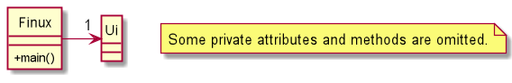
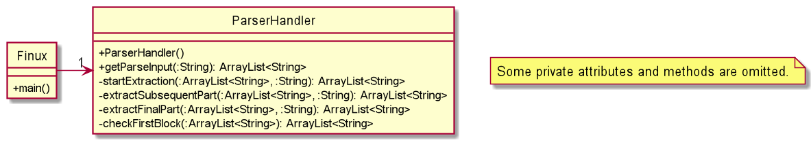
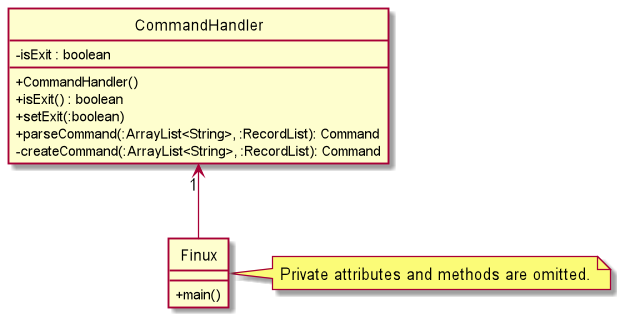
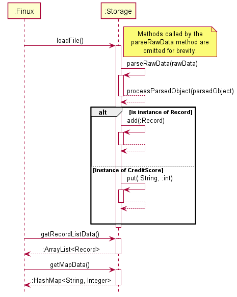

# Developer Guide

# *FINUX*

## Table of Content

---

1. [Introduction](#1-introduction)\
   1.1 [Purpose](#11-purpose)\
   1.2 [Using this Guide](#12-using-this-guide)
2. [Setting Up](#2-setting-up)\
   2.1 [Setting up the project in your computer](#21-setting-up-the-project-in-your-computer)\
   2.2 [Before writing code](#22-before-writing-code)
3. [Design](#3-design)\
   3.1 [Architecture](#31-architecture)\
   3.2 [UI Component](#32-ui-component)\
   3.3 [Parser Component](#33-parser-component)\
   3.4 [CommandHandler Component](#34-commandhandler-component)\
   3.5 [Command Component](#35-command-component)\
   3.6 [RecordList Component](#36-recordlist-component)\
   3.7 [Storage Component](#37-storage-component)
4. [Implementation](#4-implementation)\
   4.1 [Add Feature](#41-add-feature)\
   4.2 [List Feature](#42-list-feature)\
   4.3 [View Feature](#43-view-feature)\
   4.4 [Return Feature](#44-return-feature)\
   4.5 [Remove Feature](#45-remove-feature)\
   4.6 [Storage Feature](#46-storage-feature)\
   4.7 [Credit Score Feature](#47-credit-score-feature)
5. [Documentation, Logging, Testing, and DevOps](#5-documentation-logging-testing-and-devops)

[Appendix A: Product Scope](#appendix-a-product-scope)\
\
[Appendix B: User Stories](#appendix-b-user-stories)\
\
[Appendix C: Non-Functional Requirements](#appendix-c-non-functional-requirements)\
\
[Appendix D: Instructions For Manual Testing](#appendix-d-instructions-for-manual-testing)

## 1. Introduction

---

**Greetings from Finux!**

**Finux** is a CLI Style application that allows the user to make better financial
decisions based on the information recorded in the application. If you’re familiar
with the CLI command interface, you will enjoy the benefit of speeding up your
finance management rather than using the traditional management system.

**Finux** is written in Java 11 and uses the Object-Oriented Programming (OOP) paradigm.
OOP enables us to produce organized and reusable codes, allowing efficient improvements
and revisions in the future.

### 1.1 Purpose

This guide is for new and current developers of **Finux**. It describes the overall architecture
design of **Finux** and describes the current implementation details of our main features
with the thought process behind each of them. The current edition of this guide is meant for
the `v2.1` release.

### 1.2 Using this Guide

Throughout the guide, you might encounter several icons, refer to the following consolidate
list of icons:

> 💡 It indicates that this is an important piece of information.\
> ❗  It indicates that this is a warning and you should be aware of it while developing.\
> 📝 It indicates that this is a tip and you may find it useful when using our application or guide.

> 📝 Text that are blue like this [example(jumps to 1.2)](#12-using-this-guide), are clickable links
> that will move you to the relevant section of the guide.\
> 📝 Records refer to either expenses, loans or savings.

## 2. Setting Up

---

### 2.1 Setting up the project in your computer

Ensure that you have the following installed:
* JDK 11
* Intellij IDEA (Highly Recommended)

Firstly, **fork** this [repo](https://github.com/AY2021S2-CS2113T-W09-1/tp) and **clone** a copy into your computer.

If you plan to use IntelliJ IDEA:
1. **Ensure IntelliJ is configured to develop in JDK 11.**
   1. If you are not at the welcome screen, click `File` > `Close Projects` to close any currently opened projects.
   1. Click on `Configure` > `Structure for New Projects` > `Project Settings` > `Project`, ensure
      the `Project SDK` is using **JDK 11**.
1. **Import the project as a Gradle Project.**
   1. Click on `Import Project` and locate the `build.gradle` file and select it. Click `OK`.
   1. If prompted, choose to `Open as Project` (not `Open as File`).
   1. Click `OK` to accept the default settings but do ensure that the selected version of `Gradle JVM`
      matches the JDK being used for the project.
   1. Wait for the importing process to finish (it could take a few minutes).
1. **Verify the setup.**
   1. After importing successfully, locate the `src/main/java/seedu.duke/Duke.java` file, right click it, 
      and choose `Run...`. If the setup is correct, you should see the following:
   

### 2.2 Before writing code

#### 2.2.1 Configuring the Coding Style

If you are using IDEA, follow this guide 
[IDEA: Configuring the code style](https://se-education.org/guides/tutorials/intellijCodeStyle.html)
to setup IDEA's coding style to match ours.

#### 2.2.2 Set up CI

There is no set up required as the project comes with GitHub Actions config files, located in `.github/workflows`
folder. When GitHub detects these files, it will run the CI for the project automatically at each push to the master
branch or to any PR.

#### 2.2.3 Learn the Design

Before starting to write any code, we recommend that you have a look at Finux's overall design by reading
[Finux's Architecture](#31-architecture) section.

## 3. Design

---

### 3.1 Architecture

\
_Figure 1: **Finux** Architecture Diagram_

> 💡 The diagrams are built with [PlantUML](https://plantuml.com/).
> The `.puml` files can be found in the [diagrams](https://github.com/AY2021S2-CS2113T-W09-1/tp/tree/master/docs/diagrams) folder and
> the generated picture diagrams are in the [img](https://github.com/AY2021S2-CS2113T-W09-1/tp/tree/master/docs/img) folder.

The _**Architecture Diagram**_ above details the high-level design of the **Finux** Application.
Brief explanations of the components involved are given below.

The `Finux` component is the object class itself, It is responsible for,
* At launch: Initializes the components in the correct sequence and attempts to load data from file.  
* At shut down: Shuts down the components and invokes cleanup method where necessary.

The rest of the Application consists of six main components.
* `Ui`: The user interface (Ui) of the App which handles all user input and Application output.
* `Parser`: The user input parser of the CLI.
* `CommandHandler`: The handler of parsed arguments for conversion into appropriate `Commands`.
* `Command`: The appropriate command to be executed.
* `RecordList`: The list of records of the Application stored in-memory.
* `Storage`: The storage manager that handles the saving of data, or data retrieval to/from file. 

Given below are sequence diagrams describing the general Application flow and how the different objects
interact with each other.

\
_Figure 2: Initialization_

The initialization sequence diagram above shows the systematic flow of object creation and record
retrieval from storage file for creation of the `RecordList` object.

\
_Figure 3: Main Application Loop & Exit Sequence_

> 💡 The lifeline all objects should end at the destroy marker (X) but due to a limitation of PlantUML, 
> the lifeline reaches the end of diagram. This limitation persists throughout all sequence diagram in 
> this guide.

This sequence diagram follows suit after initialization in _Figure 2_.\
This shows the main flow until the `exit` command is input by the user.

The following sections below will provide more details of each component.

### 3.2 UI Component

\
*Figure 4: **Ui** Class Diagram*

The Ui Component consists of a `Ui` class which handles all user input and system output.
The Ui is only dependent on the `Finux` class and does not interact directly with other classes,
ensuring a high level of cohesiveness, low level of coupling and separation of roles.

The `Ui` component actively listens for:
* the execution of commands to print the result of a `command`

### 3.3 Parser Component
\
_Figure 5: **ParserHandler** Class Diagram_

#### Description
The Parser component consist of one class called `ParserHandler`.
The role of `ParserHandler` can be interpreted as a "manager" or "middle man" to parse
the user input from the console into an `ArrayList<String>` format.

#### Design
In the main program, `ParserHandler` is instantiated through the constructor `new ParserHandler()`,
finalizing the startOptionArray, endOptionArray, and middleOptionArray. Whenever the program needs
to parse a user input, the ParserHandler calls the method `getParseInput` and returns an `ArrayList<String>`.

1. `getParseInput` will trim the leading white space before calling `startExtraction`.
2. `startExtraction` will check if the trimmed input starts with option. If yes, extract the option and
   remove the option from the trimmed input before calling `extractSubsequencePart`.
3. `extractSubsequencePart` will check for the next option index and extract whatever is in between the start of the
   trimmed input to the start of the next option index. This is the argument tagged after the option.Afterward, 
   the checking mechanism will loop until no valid next options are left in the input before calling `extractFinalPart`.
   * Any leading or trailing white space of the argument field will be removed.
   * If no argument is provided, the argument would be stored an empty string.
4. `extractFinalPart` will check if the last trimmed input ends with option. If yes, extract the option and
   add an empty string as the argument, else just add the last trimmed input to the ArrayList<String>.
5. Finally, after the extraction to ArrayList<String> is complete, `extractFinalPart` will
   call `checkFirstBlock` for the final check to parse any `help` or `creditscore` in the first argument block.
   
#### Parser Component Design Consideration
1. Leading and trailing whitespace should be considered carefully especially with options involve.
   * Input starting with valid option should consider the possibility of multiple leading whitespaces, 
   thus `stripLeading()` should be applied.
   * Input ending with valid option should also be considered with possibility of multiple trailing whitespaces,
   thus `stripTrailing()` should be applied as well.
2. Checking of options in the start, end, and during the processing should be considered carefully with accordance 
   to consideration 1.
   * Starting option should be in the form of `'<option> '` with no leading whitespace and 1 trailing whitespace. 
     e.g. `'-e '`
   * Ending option should be in the form of `' <option>'` with 1 leading whitespace and no trailing whitespace.
     e.g. `' -e'`
   * During the extraction, the next option should be in the form of `' <option> '` with 1 leading and trailing whitespace.
     e.g. `' -e '`
3. As rearrangement of options is allowed, option detection should cater to non-fixed option order.
   Apache Commons Lang, 3.11, providing the `StringUtils` class is used to cater to consideration 2.
   * `StringUtils.startsWithAny()` - detection of start option with non-fixed order.
   * `StringUtils.endsWithAny()`   - detection of end option with non-fixed order.
   * `StringUtils.indexOfAny()`    - detection of during processing option with non-fixed order.
4. As multiple whitespaces is allowed, options and arguments should be fully trimmed (leading and trailing).
5. As the ArrayList<String> is passed back to the main program and is being used by CommandHandler,
   the argument field should compulsory and appended with empty string if empty to facilitate validations and option-argument
   pairwise logic.
6. `getParseInput(String)` should always return a new ArrayList<String> per new input.

### 3.4 CommandHandler Component
\
_Figure 6: CommandHandler Class Diagram_\
\
_Figure 7: CommandHandler Sequence Diagram_

#### Description
The `CommandHandler` component is the object class itself.
The role of the `CommandHandler` is to convert `parsedArguments` from the `ParserHandler`
into subsequent `Command` objects which will be executed thereafter.
The `XYZCommand` in _Figure 7_ represents a valid command word (e.g. `"xyz"`) from the input
parsed earlier from the `ParserHandler`. More on the actual valid commands, please refer to
the [Command Component](#35-command-component) below.

#### Design
It functions as a mapping from `parsedArguments[0]` to a set of predefined command words 
(the actual commands of the Application).\
With reference to the above _Figure 7_, 
In the case of `"xyz"` being mapped to `XYZCommand`, depending on the other data in the 
`parsedArguments`,
* arguments are valid: the `XYZCommand` object is successfully returned.
* arguments are erroneous/invalid: `CommandException` is thrown.

If `parsedArguments[0]` maps to an empty String `""`, a `null` is returned, allowing the 
`Finux` to continue prompting for user input.

Finally, if `parsedArguments[0]` cannot be mapped to any command, a `CommandException` is 
thrown to `Finux` to handle.

Not stated explicitly in the diagrams, when the `exit` command is entered, the `CommandHandler`
sets the `isExit = true`, ending control of the `commandLooper()` and resulting in `Finux` proceeding to call `end()` to exit the Application.

### 3.5 Command Component
\
_Figure 8: Command Class Diagram_

All Commands contain a command word constant named as `COMMAND_*` (as underlined in _Figure 8_),\
e.g. `protected static final String COMMAND_XYZ = "xyz";`\
These constants are used by the `CommandHandler` to map to each `Command`.\
In the case of `AddCommand` in _Figure 8_, the resultant constant is `...final String COMMAND_ADD = "add";`.\
More on the different types of commands and usages, please refer to our [User Guide](UserGuide.md).

#### Description
The `Command` component contains the `abstract Command` class and its extensions (child classes).
Each child class inherits the `Command` class.
The child classes of `Command` are the `AddCommand`, `CreditScoreCommand`, `ViewCommand`, etc...

#### Design
The only `abstract` method of `Command` is `execute(...)`, where it is called by `Finux` everytime a `Command`
object is successfully created. Most of the input validation is done in the constructor of each Command object. 
1. Firstly, arguments are checked for validity (if any):
   1. Valid options: options only for each `Command`. E.g. `-a` for the amount `add` is valid.
   2. No duplicate options: options are not repeated. E.g. `-a 200 -a 200` or `-l -l` is invalid.
   3. No conflict options: mutually exclusive options, options that cannot be input at the same time.
      E.g. ViewCommand implements `{-e | -l | -s}` options, `view -s -l` is considered a conflict of options.
2. Secondly, option values are validated (if any):
   * E.g. The input `return -i 2 -d 20122012` has option values of `"2"` for `-i` and `"20122012"` for `-d`.
     Each option value is validated based on the input validation methods for each data type.

In the case of `AddCommand`, which supports options of `{-e | -l | -s}`, the constructor will check which option
was given, and sets the `RecordType` enumeration, `recordType` to the following:
* `-e` sets `recordType` to `EXPENSE`.
* `-l` sets `recordType` to `LOAN`.
* `-s` sets `recordType` to `SAVING`.

If no violations are present in the arguments, then the subsequent `Command` object is returned.\
If violations occur at any point of the input validation, the `Command` is not created and `CommandException` 
is thrown back to the `CommandHandler`.

### 3.6 RecordList Component
The `recordlist` class maintains an internal arraylist of record objects used throughout Finux's execution.

### 3.7 Storage Component

\
_Figure X: Storage Class Diagram_

#### Description
The `storage` component consists of only 1 class called `Storage`. The role of the `Storage` is to translate all
`records` from the `RecordList` and `creditScoreHashMap` (a `HashMap`) into a text format in a text output file and 
vice versa.

#### Design
In the application, `Storage` is instantiated in classes that requires the use of the save or load function, this
is done through the constructor `new Storage()`. Whenever a new `record` gets added, removed, or marked as returned, 
the `saveData` method will be called and all `record` up to that point will be converted into a text output
and saved into the `finux.txt` file. The `creditScoreHashMap` will also be translated into a user readable text format 
and stored in the same file as the `records`. The `loadFile` method will do the exact opposite, and load the data from 
the `finux.txt` file back into the Finux application.

1. `saveData` is the method that is called after any `records` are added, deleted, or marked as returned. It 
   will then call the `writeToSaveFile` method.

2. `writeRecordListToSaveFile` will add the currently addressed `recordList` and all its stored `records` into the 
   `finux.txt` file after calling the `convertFileFormat` method from the Record class. The `writeToSaveFile` method 
   will also output each individual records in separate lines.

3. `writeCreditScoreMapToSaveFile` will convert all key:value pairs, in this case, `borrowerName`:`creditScore` pairs
   in the `creditScoreHashMap` into a user readable format and store them in the same `finux.txt` file as the `records`. 
  
4. `loadFile` method does the opposite of the `writeRecordListToSaveFile` method. In the `loadFile` method, a new 
   ArrayList of `record` is instantiated. It will then call the `saveFileExist` method. If the method returns false, 
   `initSaveFile` method will be called and a new `finux.txt` will be created in the same directory of the FINUX 
   application. The `loadFile` method will then return a new and empty ArrayList of `record` back to the `start` method 
   in the `Duke` class. Should the `saveFileExist` returns true, for each line of text in the `finux.txt` file will be 
   parsed into the `parseRecord` method which will call the individual load methods `loadExpense`, `loadLoan`, 
   `loadSaving` based on a REGEX expression of the text data. Should the pattern be unrecognisable, or the file is 
   unable to be read, an exception will be thrown to the `start` method and FINUX will terminate. If all the text data 
   is properly loaded, the `loadFile` method will return the ArrayList of `record` to the `RecordList` object in the 
   `start` method.
   
5. `initSaveFile` method will create a new `finux.txt` specified by the constant `SAVED_FILE_PATH`. It will call 
   `Ui#printSuccessfulFileCreation` on a successful creation of the file, but will throw an `IOExcpetion` if there was
   an error in creating the file.

6. `parseRawData` method will compare the pattern of the text in the `finux.txt` and call the respective methods 
   `loadExpense`, `loadLoan`, `loadSaving`, `loadCreditScoreRawData` based on the pattern that matches the `Expense`, 
   `Loan`, `Saving`, or the `creditScore` pattern in the saved file. This method will throw an exception back to 
   the `loadFile` method if any of the REGEX pattern does not match. (Add stuff here!)
   
7. `extractArg` is a "micro" parser component of the `Storage` class. This method simply splits the raw data from the 
   `finux.txt` file into an array and returns the argument that is referenced by the index to its caller method with 
   their leading and trailing white spaces removed.

8. `loadExpense` will extract the individual components from the raw data parsed into it. This method will call the
   `extractArg` method which returns the components that are addressed by the index after splitting up the raw save
   file. The `amount` object in this method will be converted into a `BigInteger` type and the `issueDate` will be 
   parsed in the `localDate` type. An exception will be thrown if either `amount` or `issueDate` is not in the right 
   format which prevents them from being parsed into their respective types. It will then return a new `Expense` object
   to the `parseRecord` method.
   
9. `loadSaving` works similar to `loadExpense` method, where the only difference is that it returns a new `Saving`
   object to the `parseRecord` method.
   
10. `loadLoan` also works similar to both `loadExpense` and `loadSaving` method, but in the `loadLoan` method, 
   it has a few extra parameters. The first being a boolean `isReturn`, where `1` signifies returned and `0` not 
    returned. The `borrowerName` is the next variable in the `Loan` object. And lastly, the `returnDate`, the 
    `returnDate` will only return not null if the `isReturn` boolean has a value of `true`. This method then returns a 
    new `Loan` object to the `parseRecord` method.
   
#### Storage Component Design Consideration

1. Regex pattern has to be strictly adhered to.
   * Spacings between the `|` and components have to be separated clearly.
   * Components in the `finux.txt` file should not contain any extraneous `|`.
   * Each component's index must be the same regardless of the instance of the object.
   
2. Save file has to exist.
   * `finux.txt` has to be created upon the first time start of the application .
   * `finux.txt` is to be checked if exist before loading or creating a new file.

3. Variable components of each `record` object has to be parsed properly.
   * As the save function saves these `record` in a particular regex pattern and type, users who edit the save file
   directly may enter ambiguous characters like the `|`, thus each variable has to be parsed without any error thrown. 
   * Error has to be thrown if the saved text is unable to be parsed, as by allowing ambiguous values to be parsed into
   the application may cause unknown and unwanted outputs.

## 4. Implementation

---

This section introduces the specific implementation details and design thought processes
of some features in **Finux**.

### 4.1 Add Feature
The `add` feature aims to allow users to add *expense*, *loan*, and *saving* records.

#### 4.1.1 Current Implementation
The `add` feature is facilitated by `AddCommand`.\
When adding an expense `add -e bread loaf -a 2.50 -d today`, or\
adding a savings `add -s week's savings -a 100 -d 28/03/2021`, or\
adding a loan `add -l loan to gerard -a 200 -d 12012021 -p Gerard`,
the `ParserHandler` will parse the input for `CommandHandler` to create the `AddCommand` object.

By calling the `execute()` method,
* the respective `Expense`, `Saving` or `Loan` object is added into the `RecordList` by invoking
  `addRecord(Record)`.
* Next, the `saveData(...)` from the `Storage` object is invoked to store the records to file.
* Finally, a notification is printed onto the console with the help of `Ui`.

\
_Figure x: Sequence Diagram for `add {-e | -l | -s}`_

> 📝 The sequence diagram starts from Step 2 onward.

Given below is an example usage scenario of how `AddCommand` behaves at each step.

***Step 1:***\
User executes the command `add -e Company lunch -a 20.00 -d 02-04-2021`.\
The application invokes `ParserHandler#getParseInput()` to provide the parsed
input to `CommandHandler#createCommand()`. This checks for the command type, `add`, and proceeds to validate the
parsed input in the `new AddCommand()` constructor before returning the constructed `AddCommand` object to `Finux`.

***Step 2:***\
The application next invokes the `AddCommand#execute()` to execute the user's instruction.

***Step 3:***\
Inside the `AddCommand#execute()`, the method conducts a check on the `RecordType` enumeration before creating
the `Record` object.
> ✔️ `EXPENSE` type creates a `new Expense(String,LocalDate,String)`

> ✔️ `LOAN` type creates a `new Loan(String,LocalDate,String,String)`

> ✔️ `SAVING` type creates a `new Saving(String,LocalDate,String)`

***Step 4:***\
The `Record` object is added to into the `RecordList` object by invoking `RecordList#addRecord(Record)`.

***Step 5:***\
The `RecordList` object is written to file by invoking `Storage#saveData(RecordList, CreditScoreReturnedLoansMap)`.

***Step 6:***\
Lastly, a successful add message is printed by invoking `Ui#printSuccessfulAdd(Record,int)`.

#### 4.1.2 Design Consideration
This section shows the design considerations taken when implementing the add feature.

Aspect: **How to manage so many different options**

For record types such as `Expense` and `Saving`, they do not require additional options.
But for `Loan` record type, it requires an extra option `-p` for the borrower name. Since the `add` command
supports many different options and option ordering is not strict, this will complicate validation.

The two choices to consider would be:
* Use regular expressions (regex)
* Use systematic validation

|Approach | Pros | Cons| 
|---------|------|-----|
|Regular expressions|Less complicated validation procedure.|May need a very complicated regex String or multiple ones, for each Command|
|Systematic validation|Option validation methods can be shared with other Commands|Many option violations to check|

Having considered two of the approaches, we have decided to adopt the second approach.
Systematic validation is better in the long run. It allows for code re-usability and addition for more
modular changes,
* i.e. addition of new options, tweaking validation procedures, etc...

Other than increased complexity of regex Strings, any changes to command and option structure requires a completely
new regex String. Therefore, systematic validation is the preferred approach, for the current and future developers.

### 4.2 List Feature
The `list` feature allows Finux users to list records that they have entered into the system.

To list loans:

`list -l`

To list expenses:

`list -e`

To list savings:

`list -s`

### 4.3 View Feature
The `view` feature aims to allow the users to view the total expenditures, loans, and savings for the respective 
category of *expense*, *loan*, and *saving* of the added records.  

#### 4.3.1 Current Implementation

The `view` feature is facilitated by `ViewCommand`. By typing in `view` and following up with the record type, 
`{-e, -l, -s}`, the `ParserHandler` will parse the input for `CommandHandler` to create the `ViewCommand` object.
By calling the `execute()` method, the total amount will be printed onto the console with the help of `Ui`.

\
_Figure x: Sequence Diagram for **`view -e`**_

> 📝 The sequence diagram starts from Step 2 onward.

Given below is an example usage scenario of how `ViewCommand` behaves at each step.

***Step 1:***\
User executes the command `view -e`. The application invokes `ParserHandler#getParseInput()` to provide the parsed
input to `CommandHandler#createCommand()`. This checks for the command type, `view`, and proceeds to validate the
parsed input in the `new ViewCommand()` constructor before returning the constructed `ViewCommand` object to `Finux`.

***Step 2:***\
The application next invokes the `ViewCommand#execute()` to execute the user's instruction.

***Step 3:***\
Inside the `ViewCommand#execute()`, the method conducts a check on the `RecordType` enumeration before executing the 
respective method.
> ✔️ `EXPENSE` type invokes `Ui#printTotalAmountExpense()`

> ✔️ `LOAN` type invokes `Ui#printTotalAmountLoan()`

> ✔️ `SAVING` type invokes `Ui#printTotalAmountSaving()`

***Step 4:***\
The `Ui` will handle the respective invocation call. The basis for the three methods utilizes the `for` loop to
iterate through the `recordList` and will only add to the `totalAmount` if it is an instance of the respective
record type.
> 📝 The `Ui#printTotalAmountLoan()` will imposed additional check on whether the record is returned.
> Only records that are not returned will be added to the `totalAmount`

***Step 5:***\
Finally, the `totalAmount` will be rounded off to two decimal place before printing onto the console.

#### 4.3.2 Design Consideration

This section shows the design considerations taken when implementing the view feature.

Aspect: **How many figures should the amount be allowed up to**

Since it is entirely possible that the amount provided by user to be very large or very small, the two choices to
consider would be:
* Integer (Classic approach)
* BigDecimal (Non-classic approach)

|Approach | Pros | Cons| 
|---------|------|-----|
|Integer|No additional class required|Limited to a fix amount of digit available to enter|
|BigDecimal|Allow more digits than classic approach|Need to create a BigDecimal object|

Having considered two of the approaches, we have decided to adopt the second approach. 
The deterministic factor was the possibility of very large number such as 1000 billions. Thus, covering more than
what the integer data type provided can cater to higher flexibility of the application.

Aspect: **When to round off the amount to two decimal place**

As the user can enter decimal into the amount field, the `ViewCommand` has two options of when to round off the value:
* When assigning value to the amount variable
* When printing the final computed value

|Approach|Pros|Cons|
|--------|----|----|
|Assigning value to the amount variable|Round off early to avoid complication|Additional time per assignment to round off|
|Printing the final computed value|Only round off once|Rounding off might be couple to other method which needs the amount field|

With the two approaches considered, we have decided to adopt the second approach as it is more efficient to round off
at the end and to preserve the accuracy for two decimal place. Since no other method is accessing the amount variable,
is it possible avoid rounding off during each value assignment until new or existing features requires it.

### 4.4 Return Feature
The `return` feature allows Finux users to mark a loan as returned.

`return -i <index of loan to return> -d <return date>`

Upon marking the loan as returned, *creditscore* for the borrower who loaned the book will be updated and saved into `finux.txt`

Example:
`return -i 2 -d 2021-03-16`

Output:
Loan marked as returned: `[L][2021-03-16] Loan to Tom [v]`

### 4.5 Remove Feature

The `remove` feature aims to allow users to remove records after querying the record's
index number with the `list` command. The users will be able to then use the `remove`
command to delete certain records that they deem obsolete or is incorrect. Hence, this feature
allows them to amend their mistakes or edit their list with constraints.

#### 4.5.1 Current Implementation

The `remove` feature is facilitated by `RemoveCommand`. By running the command with required options and relevant 
parameters, our `CommandHandler` will construct the `RemoveCommand` object which will validate the input and provide
relevant parameters that will be used in the execute function.

*Figure x: Sequence Diagram for `remove -i 1`*

Given below is an example usage scenario of how `RemoveCommand` behaves at each step.

***Step 1:***\
User executes the command `remove -i 1`. The application invokes `CommandHandler#createCommand()`, and since the 
command type is `remove`, the `createCommand` constructs a `RemoveCommand` object. The validation of the constructed
`RemoveCommand` is done in the constructor. The created command is then returned to `Finux`.

***Step 2:***\
The `CommandHandler` terminates after parsing user input and creating the corresponding Command object. The application
invokes `RemoveCommand#execute()` to execute the user's instruction.

***Step 3:***\
The `RemoveCommand` first invokes `RecordList#getRecordAt(recordNumberInt)` to get the record located at index
`recordNumberInt`. The record retrieved will be used in the next step.
> 📝 `recordNumberInt` is the index number that you will see on the list minus by one.

***Step 4:***\
The application invokes `Ui#printMessage()` and prints the record that will be removed with their respective 
`toString()` method. 

***Step 5:***\
The application invokes `RecordList#deleteRecordAt(recordNumberInt)` which removes the record located at the index 
`recordNumberInt`.

***Step 6:***\
The application invokes `Storage#saveData()` to save the modification on the record list onto the save file after the
removal of the record is successful. This will then enable future file loading to be accurate and there are no mismatch
of information or records.

The sequence diagram presented below depicts the interaction between the components for running the command.
`remove -i 1`.
> 📝 The sequence diagram starts from Step 2 onward.
> 
> 📝 The `commandLooper()` only serves as a user input reader here and takes certain actions when certain allowed 
> commands are given.

#### 4.5.2 Design Consideration

This section shows the design considerations taken when implementing the remove feature.

Aspect: **When should the application validate the user input index**

Since it is entirely possible that the index provided by the user can be invalid where the indices may be one of the
following:
* negative numbers
* numbers that refer to non-existent records
* non-numerics (e.g. alphabets, symbols, etc.)\

There is a need to validate the index given by the user to ensure that the application does not terminate unexpectedly
and that suitable error messages are printed to notify the user of their intentional or unintentional parameter inputs.

|Approach | Pros | Cons| 
|---------|------|-----|
|During command execution.|No additional class required.|A new argument for the `execute()` method is needed. It also increases coupling and decreases cohesion.|
|During command creation.|Decreases coupling and increases cohesion as there is a clear cut in between responsibilities. The arguments of `execute()` can remain consistent with other command types.|Duplication of validation may occur in other commands.|

Having considered two of the approaches, we have decided to adopt the second approach which is to validate the index
during command creation. The lower coupling and higher cohesion was the deterministic factor here and also the
consistency of the arguments in `execute()` can also be maintained.

Aspect: **The way the index is specified(option)**

As the user has to specify the index of which record to remove, the index has to be provided but is `-i` required?

|Approach|Pros|Cons|
|--------|----|----|
|Have to use `-i`|The options will be consistent with the `return` command as it requires the user to input an index as well|Extra time is used to enter 2 more characters just to satisfy the application requirement where the `remove` command actually only need one parameter.|
|Do not have to use `-i`|Saves the time needed to input the 2 characters.|It will be inconsistent to require users to include `-i` for the `return` command but not for the `remove` command.|

With the two approaches considered, we have decided to adopt the first approach as it gives consistency for the
user experience, and it will not cause any confusion. The time wasted is negligible, and the consistency provides
long-term benefit.

### 4.6 Storage Feature
The `storage` feature allows all `records` and `creditScoreHashMap` to be stored locally on the device and for `records` and 
and `creditScoreHashMap` to be loaded from a saved file into the Finux application. This is the only feature implemented 
that does not have an explicit command to call it.

#### 4.6.1 Current Implementation
As the saving and loading methods have no explicit command calls, these methods are invoked by methods from the other
classes. During the launch of the Finux application, in the `start` method, `getRecordListData` is called to load the
data from the saved file: `finux.txt`. 

*Figure x: Sequence Diagram for Storage's save function*

Saving of data works differently, the data will be automatically saved into `finux.txt` only with a few 
particular command calls, these calls are the commands that will alter the `records` in the `RecordList`. As
the `creditScoreReturnLoansMap` is also altered by changes in the `Loans` object. It will also be stored and updated
together with the commands below.

The following commands and scenarios where these `records` will be saved locally into the save file:
* `add`
* `remove`
* `return`

The sequence below will show you how the `Storage` class behaves at each step. As all three methods above generally
behave similarly in the way they call the `saveData` method, the following will be generalised to prevent repetition
for all the three methods above.

***Step 1***\
Before the end of the `add`, `remove` or `return` command, the `saveData()` method will be invoked.

***Step 2***\
The `saveData()` method will then call on the `writeRecordListToSaveFile()` method. This method will pass the
recordList back to the `RecordList` class to invoke the `getRecordAt()` method.

***Step 3***\
The `getRecordAt()` method will return the `record` that is identified by its index. With this `record`, the
method `writeRecordListToSaveFile` will then call on the `convertFileFormat()` method in the `RecordList` class. This
method will convert the `record` that is stored in the `recordList` into a text readable format.

***Step 4***\
The text format of the `record` will then be written into the `finux.txt` file through the `FileWriter` write method.

***Step 5***\
The `writeRecordListToSaveFile()` will repeat Steps 2 to 4 until the last `record` in the `recordList`. And each 
`record` will be written and separated by a newline.

---

*Figure x: Sequence Diagram for Storage's load function*

Finux will automatically load the data from the save file: `finux.txt`. When the Finux application is launched, the
data from the file will be loaded during the initialising phase, even before the welcome message is printed. The error
and exception handling is omitted from the diagram above as the application will print a failed initialization message
and terminate.

***Step 1***\
When the user launches the `finux.jar` application, in the `start` method. The `loadFile` method will be invoked.

***Step 2***\
The `loadFile` method will first check for the save file, if it exists it will then call upon the `parseRawData` method
which will read and match the contents of the `finux.txt` file with the regex patterns. It will then call on the 
respective methods to return the object type of it. (In this case, `Expense`, `Loan`, `Savings`, 
`creditScoreReturnLoansMap`)

***Step 3***\
With the returned objects, they are now parsed into the `processParsedObject` method to be added into their respective
classes. With the instances of `Record` being added into the `RecordList` and the `creditScoreReturnedLoansMap` into
the `HashMap` of itself.

***Step 4***\
The `start` method in the `Finux` class will then call the `getRecordListData` method to retrieve the loaded 
`RecordList` from the `Storage` class, this is also the same with the `creditScoreReturnedLoansMap` where the `start`
method in the `Finux` class will call the `getMapData` method from the `Storage` class which will then return the
`HashMap`.

#### 4.6.2 Design Consideration
This section will walk you through the design considerations taken when implementing the remove feature.

Aspect: **When should the data be saved into a local file**

Since we do not have an explicit function call to save the files, the data should be automatically saved but there are
multiple occasions that this can be invoked:
* On exit
* After each command call
* After any command call that edits data in `RecordList`

|Approach|Pros|Cons|
|--------|----|----|
|On Exit|Save just has to be called exactly once, minimal coupling|If program crashes before `exit` is called, all data will be lost|
|After each command call|Guaranteed save after every successful command call, users can "save" the data by simply entering any legal commands|Extraneous calls of save, high coupling, a lot of passing of data around|
|After any command call that edits data in `RecordList`|Allows data to be saved after every update to the `RecordList`|Some coupling between the methods that updates the `records` and calling the save method.|

> 💡 Note that data in the HashMap `creditScoreHashMap` is related directly to the `Loan` object in the `RecordList`, thus
> we have omitted the mention of it here as any changes to the `creditScoreHashMap` will also be reflected in the `Loan`
> object which is a part of the `RecordList`.

After considering the above approaches, we have decided to adopt the third approach even though there might be more
coupling than the first method. By choosing the third approach, we can ensure that our data is stored safely and as 
compared to the second approach, the third approach minimises the coupling within our methods.

### 4.7 Credit Score Feature
The `creditscore` feature aims to provide users with a computation of borrowers' credibility via a point scoring system.

`creditscore <borrower_name>`

With this score, Finux users can view and assess the credibility of the borrowers.

Example:

`creditscore Tom`

Output:

Credit score for Tom is 90

## 5. Documentation, Logging, Testing, and DevOps

---

...

## Appendix A: Product Scope

### A.1 Target User Profile

* Computing students
* Background in CLI interface
* Prefer typing in CLI over traditional GUI clicking
* Need to track expenditure and saving
* Borrowed some money to their friends
* Need to track borrowings and loans 
* Good with typing

### A.2 Value proposition

#### A.2.1 Problem Identification
Problems faced by students that Finux aim to assist with.
> * [Problem] Wastage of time due to connection/latency issues went accessing finance tracking website.
> * [Solution] Use a local based application.

> * [Problem] Hassle to use different applications to keep track of various stuff.
> * [Solution] Provide an integrated platform to record any expenses, loans, or saving.

> * [Problem] Disorganization issues arising from keep multiple tracking applications.
> * [Solution] Provide the option to view each category of records within an integrated platform.

> * [Problem] Spending time to gauge whether to borrow money to a friend.
> * [Solution] Provide a soft gauge through credit score indicators.

#### A.2.2 Value Adding

Finux aims to integrate the process of managing and keeping track of finance movements without the need to access online
websites and using different applications to keep track various movement such as loans and expenditure. Finux
provide an all-in-one platform for students who are usually in front of their computers. The student's expertises in 
coding and typing can speed up the process of their finance management through familiarity with the CLI interface.

> ❗ **CAUTION:** Finux does not provide any finance advise.

## Appendix B: User Stories

---

|Version| As a ... | I want to ... | So that I can ...|
|--------|----------|---------------|------------------|
|v1.0|user|be able to add a record (expense) with dates|record each expense into the app.|
|v1.0|clumsy user|be able to delete wrong inputs|easily rectify errors in the record list.|
|v1.0|debt collector (Student)|list down a list of people who owes me money with a deadline|make sure that they return their money.|
|v1.0|student|list each and every incurred expense|better manage my daily/weekly expenses.|
|v1.0|SOC student|have a CLI style money management system|accomplish tasks faster typing on a CLI compared to clicking on a GUI.|
|v1.0|user|be able to view the total expenditure, saving and loan credit|know the total amount of each category for planning and viewing.|
|v1.0|debt collector (Student)|mark a loan as returned|know which loans are returned to me.|
|v1.0|new user|know the list of commands|use the app correctly.|
|v2.0|new user|know what function I can use|tell what are the valid inputs for the application.|
|v2.0|lender|know the loanee's punctuality on returning the loan|gauge who to continue lending money the next time.|
|v2.0|student|know how trustworthy a person is according to a score indicator|decide how risk-free it is to lend money to the said person.|

## Appendix C: Non-Functional Requirements

---

1. The application should be responsive.
1. The application should work on most operating systems (OS) such as Windows and Linux with `Java 11` installed.
1. Users who can type fast should be able to complete equivalent tasks faster as compared to using a mouse.
1. Users should be able to use the application with ease with the help of the User Guide (UG) and the Developer's Guide (DG).

## Appendix D: Instructions for manual testing

---

### D.1: Launch and Shutdown

**Initial Launch**

1. Download the jar file and copy it into an empty folder where the application will save its files in.
1. Open a new command prompt (Windows) or terminal (MacOS) and navigate to the directory containing `Finux.jar`.
1. Enter the command `java -jar Finux.jar` to launch Finux.
1. Program will create a new save file if there are no existing one or load a previously saved file, thereafter Finux
will be ready for use.
   
**Shutdown**

1. To exit Finux, enter the `exit` command.

### D.2: Adding an expense to the record list

1. Prerequisite: None.
1. Test case: `add -e Plain bread loaf -a 2.50 -d 28/03/2021`
   Expected: Adds an `expense` with the description '`Plain bread loaf`' with an amount of `2.50` dollars on `28th March 2021`.
1. Test case: `add -e Gym equipment -a 500 -d 02/04/2021`
   Expected: Adds an `expense` with the description '`Gym equipment`' with an amount of `500`. dollars on `2nd April 2021`.
1. Other incorrect commands to try:
   1. `add`
   1. `add -e`
   1. `add -e -a`
   1. `add -e -a -d`
   1. `add -e lunch -a x -d 28/03/2021`
      (where `x` is a negative number or a word)

### D.3: Adding a loan to the record list

1. Prerequisite: None.
1. Test case: `add -l 1st loan to Mark -a 200 -d 20/03/2021 -p Mark`
   Expected: Adds a `loan` with the description '`1st loan to Mark`' with an amount of `200` dollars on `20th March 2021`. 
   The loan is associated with `Mark`.
1. Test case: `add -l 1st loan to Jason -a 520 -d 01/04/2021 -p Jason`
   Expected: Adds a `loan` with the description '`1st loan to Jason`' with an amount of `520` dollars on `1st April 2021`.
   The loan is associated with `Jason`.
1. Other incorrect commands to try:
   1. `add`
   1. `add -l`
   1. `add -l -a`
   1. `add -l -a -d`
   1. `add -l -a -d -p`
   1. `add -l loan to Andy -a x -d 28/03/2021 -p Andy`
      (where `x` is a negative number or a word)

### D.4: Adding a saving to the record list

1. Prerequisite: None.
1. Test case: `add -s Savings from March -a 1000 -d 29/03/2021`
   Expected: Adds a `saving` with the description '`Savings from March`' with an amount of `1000` dollars on `29th March 2021`.
1. Test case: `add -s Savings from April -a 1200 -d 29/04/2021`
   Expected: Adds a `saving` with the description '`Savings from April`' with an amount of `1200` dollars on `29th April 2021`.
1. Other incorrect commands to try:
   1. `add`
   1. `add -s`
   1. `add -s -a`
   1. `add -s -a -d`
   1. `add -s Savings from Intern -a x -d 30/05/2021`
      (where `x` is a negative number or a word)
   
### D.5 Listing expense(s) in the record list

1. Prerequisite: None.
1. Test case: `list -e`
   Expected: Lists all the `expenses` currently in the record list.

### D.6 Listing loan(s) in the record list

1. Prerequisite: None.
1. Test case: `list -l`
   Expected: Lists all the `loans` currently in the record list.

### D.7 Listing saving(s) in the record list

1. Prerequisite: None.
1. Test case: `list -s`
   Expected: Lists all the `savings` currently in the record list.

### D.8 Listing all records in the record list

1. Prerequisite: None.
1. Test case: `list -a`
   Expected: Lists all the records currently in the record list.

### D.9 Viewing total expense amount in the record list

1. Prerequisite: None.
1. Test case: `view -e`
   Expected: Views the total amount of expenses currently in the record list.

### D.10 Viewing total loan amount in the record list

1. Prerequisite: None.
1. Test case: `view -l`
   Expected: Views the total amount of loans currently in the record list.

### D.11 Viewing total saving amount in the record list

1. Prerequisite: None.
1. Test case: `view -s`
   Expected: Views the total amount of savings currently in the record list.

### D.12 Viewing total record amount in the record list

1. Prerequisite: None.
1. Test case: `view -a`
   Expected: Views the total amount of all records currently in the record list.

### D.13 Mark a loan as returned

1. Prerequisite:
   1. Assuming your current record list is empty.
   1. The record list must contain a loan record.
   1. Add a loan into the list `add -l Loan to Jason -a 500 -d 28/03/2021 -p Jason`
1. Test case: `return -i 1 -d 02/04/2021`
   Expected: The loan with index 1 will be marked as returned and will be indicated with `[v]` at the end of the entry
   in the record list.
1. Other incorrect commands to try:
   1. `return`
   1. `return -i`
   1. `return -i -d`
   1. `return -i x -d y`
      (where `x` is a negative number or a word, `y` is an invalid date)

### D.14 Remove a record from the record list

1. Prerequisite: 
   1. Assuming your current record list is empty.
   1. The record list must contain any instance of record (`Expense`, `Loan`, `Saving`)
   1. Add a record into the list `add -e Chicken Rice Lunch at Deck -a 2.50 -d 30/03/2021`
1. Test case: `remove -i 1` Expected: The record with index 1 will be removed from the record list.
1. Other incorrect commands to try:
   1. `remove`
   1. `remove -i`
   1. `remove -i 0`
   1. `remove -i -x` (where x is any integer)
   1. `remove -i y` (where y is any integer that is greater than the size of the array)

### D.15 Checking the CreditScore of a person

1. Prerequisite:
   1. Assuming your current record list is empty.
   1. The record list must contain a loan record.
   1. Add a loan into the list `add -l Loan to Jason -a 500 -d 28/03/2021 -p Jason`
   1. Mark the loan as returned `return -i 1 -d 10/04/2021`
1. Test case: `creditscore jason`
   Expected: The credit score shown should be 90 instead of 100 (default).
1. Other incorrect commands to try:
   1. `creditscore`
   1. `creditscore -p jason`
   1. `creditscore -i x` (where x is any integer)
   
Note: The `creditscore` command will also calculate the person's credit score should the loan not be returned.

### D.16 Displaying the help list
1. Prerequisite: None.
1. Test case: `help` Expected: The summary table of all commands and  format will be displayed.

### D.17 Exiting Finux application
1. Prerequisite: None.
1. Test case: `exit` Expected: Finux application exits and displays the exit message.
