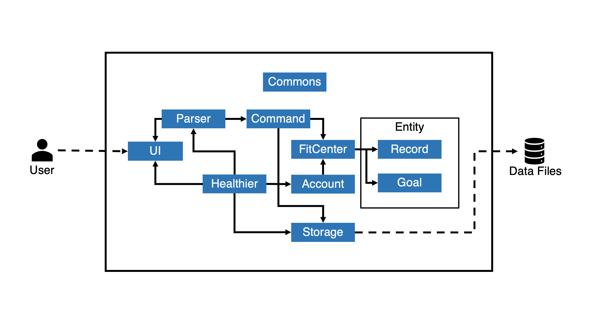

[Home](README.md)

# Healthier Developer Guide

Group `CS2113-F10-2`  
Last update on `12 Apr 2021`
---

## Table of Contents

- [Getting Started](#getting-started)
- [Design](#design)
    - [Architecture](#architecture)
    - [Components](#components)
- [Implementation](#implementation)
    - 
    - 
    - 
- [Appendix: Requirements](#appendix-requirements)
    - [Product Scope](#product-scope)
        - [Target User Profile](#target-user-profile)
        - [Value Proposition](#value-proposition)
    - [User Stories](#user-stories)
    - [Non-Functional Requirements](#non-functional-requirements)
- [Glossary](#glossary)
- [Instructions for manual testing](#instructions-for-manual-testing)

---

## Getting Started

1. Fork [this repo](https://github.com/AY2021S2-CS2113-F10-2/tp) to your GitHub account
1. Clone the forked repo into your machine
1. Ensure you have **Java SE 11** installed
1. Import the repo in your Java IDE as project
1. Start hacking!

> 💡 You are advised to choose JetBrain's Intellij IDEA as your IDE.

[**Get back to Table of Contents**](#table-of-contents)

---

## Design

This section describes design details of the app Healthier.

### Architecture

<h5 align="center">Figure 1: Architecture Diagram</h5>
The high-level design of Healthier is shown in *Figure 1: Architecture Diagram* given above.

`Healthier` corresponds to the main class that coordinates the execution of this application. It is where the `main`
method is located. It is responsible for,

* When app starts: Initializes essential data objects from stored files and displays basic information about the status
  of the app by utilizing the UI component.
* When app is running: Handles user input and coordinates corresponding operations by invoking methods from `Parser`
  and `Command` classes.
* When app ends: Terminates the execution of this app.

`Common` contains classes that can be repeatedly used by other components.

In addition to that, the app also consists of following components:

* `UI`: Handles the display of ui messages as well as user input.
* `Parser`: Processes the raw user input with validations and passes usable info to `Command` components.
* `Command`: Performs operations according to the command that the user input.
* `Storage`: Handles the read & write of various data files created/stored locally.
* `Account`: Manages the user accounts.
* `Entity`: Contains data objects that are essential to thi app.

> 💡Healthier is an application that runs locally without Internet connections.  
> Data files will be stored in the format of plain-text documents for easy inspection and test.

Each of the components has corresponding Java classes that

* Define data attributes and methods in different levels of abstraction.
* Provide various APIs (i.e. public members) that can be utilized by other classes.

More information about the components will be discussed in the [Components](#components) section.

#### The interaction between major components

We will take how Healthier handles user's input as an representative example to illustrate the internal logic of this
application.

The *Sequence Diagram* of the operation is given below:

<h5 align="center">Figure 2: Sequence Diagram of handling user input</h5>

After initialization, `Healthier` calls the `loopCommand()` method, which gets user input in a while loop which
terminates only when the command is `exit`, i.e. `"exit"` is received.  
Inside the loop, `UI` will handle the read of user input, and pass the raw input in `String` to `CommandParser`, where
the input will be validated and a corresponding instance of `Command` will be created.  
After that, the `execute` command will be invoked and the returned result in `String` will be printed by `UI`. At the
end of the loop, the `store()` method of `Storage` will be called to update the local files to reflect any changes, and
the parsed parameters in `CommandParser` will be cleared to get ready for next parse.

### Components

#### Entity classes component

<h5 align="center">Figure 3: class structure for entity classes</h5>

* Each`User` stores a `FitCenter` object that holds all the records and goals for the user.
* Each `FitCenter` stores four `RecordList` and four `GoalList` for `EXERCISE`, `DIET`, `SLEEP`, `BODY_WEIGHT` type respectively.
* `Record` is an abstract class, which is the superclass for different types of records.
* `Goal` is an abstract class, which is the superclass for different types of goals. 
* Each `RecordList` is composed of `Record`. Each `GoalList` is composed of `Goal`.

#### Command component

<h5 align="center">Figure 3: class structure for Command</h5>

* `Command` is an abstract class to interact with other components of the system.
* `AddCommand`,`ViewCommand`,`DeleteCommand`,`SetCommand`,`CheckCommand`,`CancelCommand`,`HelpCommand`,`ExitCommand` are concrete command classes inherit from `Command` class to carry out different tasks.
* `InvalidCommand` represents commands whose syntax are invalid.
* `CommandResult` stores the feedback message of command execution and will interact with UI to display the feedback.

#### Storage component

<h5 align="center">Figure 3: class structure for entity classes</h5>

* `FileInfoReader` reads information stored in text files, hence the status can be resumed when users start the application again.
* `FileInfoWriter` stores information into text files in real-time, hence users can leave the application at any time without losing any data.
* `Storage` has a `FileInfoReader` and a `FileInfoWriter` to provide a generalized interface.

[**Get back to Table of Contents**](#table-of-contents)

---

## Implementation

This section describes some details on how certain features of Healthier are implemented.

### [Proposed] Add record feature

#### Proposed implementation

Adding a record to record list is achieved by `AddCommand` and `RecordList`. Records of the same category are stored as
a `RecordList`. A `ReocrdList` supports the following operation:

* `RecordList#addRecord(Record newRecord)` — Add a new record of the specified type to the list.

All `Record` in a `RecordList` are of the same type so each user has 4 `RecordList` to hold `EXERCISE`, `DIET`
, `BODY_WEIGHT`, `SLEEP` records respectively.

`FitCenter` is a uniform interface to manipulate all the `RecordList` and provide
interface `FitCenter#addRecordToList(CommandRecordType type, Record record)`

Given below is an example of interaction among classes to add a new exercise record:

Step 1. The user enters a valid `add` command. An `AddCommand` will be initialized with the parsed parameters from user
input.

Step 2. The `AddCommand` initializes a `Record` and
calls `FitCenter#FitCenter#addRecordToList(CommandRecordType type, Record record)` to add the record.

> 💡  If any of the parameters passed are invalid, `AddCommand` will throw an error and will not call `FitCenter#FitCenter#addRecordToList(CommandRecordType type, Record record)`, so the record will not be saved into the `RecordList`.

Step 3.`FitCenter#FitCenter#addRecordToList(CommandRecordType type, Record record)`
calls `RecordList#addRecord(Record newRecord)` to modify the list.

The following sequence diagram shows how the `add` command works:

<h5 align="center">Figure 3: Sequence Diagram of adding a record</h5>

[**Get back to Table of Contents**](#table-of-contents)

---

## Appendix: Requirements

### Product Scope

#### Target User Profile

* People who care about fitness
* People who exercise regularly (at least 3 times/week) and have diet plans
* Age group:18-30
* People who are proficient in using CLI tools& typing.

#### Value proposition

* Help users record and analyze daily diet data.
* Help users record sleeping data.
* Help users record exercise data such as calorie burned.
* Help users record basic information (gender, weight, etc).
* Help users set/manage fitness goals (e.g. body-weight, exercise).

[**Get back to Table of Contents**](#table-of-contents)

### User Stories

|Version| As a ... | I want to ... | So that I can ...|
|--------|----------|---------------|------------------|
|v1.0|new user|see usage instructions|refer to them when I forget how to use the application|
|v1.0|user|upload/delete my workout exercise/duration data|keep track of my exercise history daily|
|v1.0|user|upload/delete my diet details|keep track of the food I eat daily|
|v1.0|user|upload/delete my sleeping data|keep track of my sleeping hours daily|
|v1.0|user|upload/delete my body weight|keep track of my body weight daily|
|v1.0|user|view my history workout exercise/duration data|know the progress of my strength|
|v1.0|user|view my diet details|know my daily/weekly calorie intake|
|v1.0|user|view my history sleeping data|see my past sleeping hours daily/weekly|
|v1.0|user|view my history body weight data|monitor the weight change|
|v2.0|user|set goals for exercises|have a reference and try to reach my exercise goals|
|v2.0|user|set goals for diet|have a reference and try to reach my diet goals|
|v2.0|user|set goals for body weight|have a reference and try to reach my exercise goals|
|v2.0|user|set goals for sleeping hours|have a reference and try to reach my weight goals|
|v2.0|user|check existing goals set|view the list of achieved goals and know the progress of unachieved goals|
|v2.0|user|cancel a goal set previously|stop tracking a goal that I am no longer interested in achieving|
|v2.1|user|use the app without encountering bugs|ensure my data are correctly recorded|

### Non-Functional Requirements

* Cross-platform and high compatibility.
* User-friendly and bug-free experience.
* Detailed and easy-to-follow user guide.
* Boost efficiency for people who are familiar with CLI tools.
* Easy maintenance.
* Scalable for additional features.
* Responsive interface.

[**Get back to Table of Contents**](#table-of-contents)

---

## Glossary

* *CLI* - Command-line Interface.
* *Record* - Contains all important data of a particular health activity, such as activity name, date, etc.
* *Goal* - A reminder with desired target that can be completed by adding records.

[**Get back to Table of Contents**](#table-of-contents)

---

## Instructions for manual testing

Given below are instructions to test the app manually.

Note: The instructions serve as a starting point for test, only basic test cases are listed for reference.

### Launch and shutdown

1. Initial launch

    1. Download the jar file and copy into an empty folder

    1. Execute the jar file in command line window by command `java -jar tp.jar`.

1. Use command `exit` to terminate the application/

### Adding a record

1. Adding an exercise record
    1. Test case: `add t/E a/walking d/40`  
       Expected: A record of walking for 40 minutes on the current system date is added.
       
    1.  Test case: `add t/E a/abc d/40`  
        Expected: An error message is displayed since "abc" is not a valid workout type.

    1.  Test case: `add t/E a/running d/40 date/10-04-2021`  
       Expected: A record of walking for 40 minutes on 10/04/2021 is added.

1. Adding a diet record
    1. Test case: `add t/D f/fruit w/50`  
     Expected: A record of having 50g fruit on the current system date is added.

    1.  Test case: `add t/D f/fruit w/abc`  
      Expected: An error message is displayed since "abc" is not a food amount value.

    1.  Test case: `add t/D f/fruit w/50 date/10-04-2021`  
      Expected: A record of having 50g fruit on 10/04/2021 is added.

1. Adding a sleep record
    1. Test case: `add t/S d/8`  
   Expected: A record of sleeping for 8 hours on the current system date is added.

    1.  Test case: `add t/S`  
    Expected: An error message is displayed since the syntax for `add` command is invalid.

    1.  Test case: `add t/S d/8 date/10-04-2021`  
    Expected: A record of sleeping for 8 hours on 10/04/2021 is added.

1. Adding a sleep record
    1. Test case: `add t/W w/68`  
     Expected: A record for body weight of 68.0kg on the current system date is added.

    1.  Test case: `add t/W w/abc`  
      Expected: An error message is displayed since "abc" is not a valid value for body weight.

    1.  Test case: `add t/W w/68 date/10-04-2021`  
      Expected: A record for body weight of 68.0kg on 10/04/2021 is added.

### View record lists

1. View exercise records
    1. Test case: `view t/E`  
     Expected: All exercise records are displayed.

    1.  Test case: `view t/E a/running`  
      Expected: All exercise records of running are displayed.

1. View diet records
    1. Test case: `view t/D`  
     Expected: All diet records are displayed.

    1.  Test case: `view t/E f/abc`  
      Expected: An error message is displayed since "abc" is not a valid food type.

1. View sleep records
    1. Test case: `view t/S`  
     Expected: All sleep records are displayed.

    1.  Test case: `view t/S date/10-04-2021`  
      Expected: All sleep records on date 10/04/2021 are displayed.

1. View body weight records
    1. Test case: `view t/W`  
      Expected: All body weight records are displayed.

    1.  Test case: `view t/W date/2021-04-10`  
      Expected: An error message is displayed since the date is not in the supported format.

### Delete a record

1. Delete a record of specific type

    1. Prerequisites: List all records using `view` command.

    1. Test case: `delete t/E i/1`  
     Expected: First exercise record is deleted from the list.

    1.  Test case: `delete t/D i/0`  
      Expected: An error message is displayed since 0 is out of valid range of record index.
        
    1. Test case: `delete t/S i/2`  
       Precondition: The sleep record list has at least 2 records. 
     Expected: The second sleep record is deleted from the list.

    1.  Test case: `delete t/W`  
      Expected: An error message is displayed since the syntax for `delete` command is invalid.

### Setting a goal

1. Setting an exercise goal
    1. Test case: `set t/E p/D target/300`  
     Expected: A goal of taking exercises to burn 300Kcal every day is set.

    1. Test case: `set t/E p/W target/3000`  
      Expected: A goal of taking exercises to burn 3000Kcal every week is set.

1. Setting a diet goal
    1. Test case: `set t/D p/D target/1500`  
     Expected: A goal of taking in 1500Kcal every day is set.

    1. Test case: `set t/D p/W target/abc`  
     Expected: An error message is displayed since "abc" is not a valid value for target calorie input.

1. Setting a sleep goal
    1. Test case: `set t/S p/D target/8`  
     Expected: A goal of sleeping 8 hours every day is set.

    1. Test case: `set t/S p/A target/8`  
     Expected: An error message is displayed since "A" is not a valid goal type.

1. Setting a body weight goal
    1. Test case: `set t/W p/W target/60`  
     Expected: A weekly goal of reaching the body weight of 60kg is set.

    1. Test case: `set t/W p/W target/abc`  
     Expected: An error message is displayed since "abc" is not a valid body weight target value.

### Checking progress of goals

1. Checking progress of goals of a specific type.
   
    1. Test case: `check t/E`  
     Expected: Progress of all exercise goals are displayed.

    1. Test case: `check t/D p/D`  
     Expected: Progress of all daily diet goals are displayed.
       
    1. Test case: `check t/S p/W`  
     Expected: Progress of all weekly sleep goals are displayed.

    1. Test case: `check t/W`  
     Expected: Progress of all body weight goals are displayed.

    1. Test case: `check t/W p/a`  
      Expected: An error message is displayed since "a" is not a valid goal type.

### Canceling a goal

1. Delete a record of specific type

    1. Prerequisites: check the list of all goals using `check` command.

    1. Test case: `cancel t/E i/1`  
     Expected: First exercise goal is cancelled and removed from the list.

    1.  Test case: `cancel t/D i/0`  
      Expected: An error message is displayed since 0 is out of valid range of goal index.

    1. Test case: `cancel t/S i/2`  
     Precondition: The sleep goal list has at least 2 goals. 
     Expected: The second sleep goal is cancelled and removed from the list.

    1.  Test case: `cancel t/W`  
      Expected: An error message is displayed since the syntax for `cancel` command is invalid.

[**Get back to Table of Contents**](#table-of-contents)  
[Home](README.md)