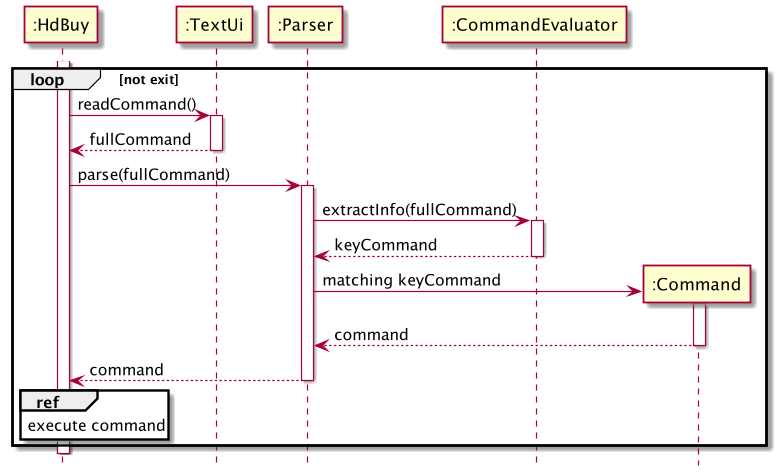

# Developer Guide

## Design & implementation

### Architecture

The Architecture Diagram given above explains the high-level design of the App.

The App consists of:

* [**`Api`**](#api-component): Retrieves data on resale flats from server.
* [**`Command`**](#command-component): The command executor.
* [**`Parser`**](#parser-component): Translate user input to valid commands to be executed.
* [**`Ui`**](#ui-component): Communicates with user via messages.
* [**`Data`**](#data-component): Contains shortlist, user input history and temporarily tracks search history.
* [**`Storage`**](#storage-component): Reads shortlisted units from, and writes shortlisted units to, the text file.
* [**`Common`**](#common-component): Models of objects used internally.

### Api component

The `Api`,

* receives a raw query from Find Command, query will contain filter conditions.
* creates a connection to remote server containing data on resale flats.
* formats raw query into valid query to be sent as a GET request.
* updates all flats matching filter conditions in SearchedUnits class of Data component.

**How classes within Api component interact with each other**

The *Sequence Diagram* below shows how the components interact with each other for the scenario where a Find command is executed.

### Storage component

The `Storage`,

* handles read and write of units into a local text file.
* manages data in ShortList.

**How classes within Storage component interact with each other**

The *Sequence Diagram* below shows how the components interact with each other for the scenario where a Save command is executed.

### Parser component

The `Parser`,

* Receives the full command line from receiveCommand().
* Depends on the key command, Parser will activate specific commands.

The diagram below shows how parser determines which command to activate based on the key command.

**How classes within Parser component interact with each other**

The *Sequence Diagram* below shows how the components interact with each other after the full user input is passed into the `Parser`.

The CommandEvaluator class extracts the information from the full input and thereafter passes a keyCommand to the Parser class for it to return the appropriate Command to the main method.

### Command component

The `Command`,

* Handles the appropriate actions to perform for each Command.
* Uses the information from the UserInput object passed into it for certain Commands.

The *Class Diagram* below shows the different Commands and the respective information they use from the UserInput object.

**How classes within Command component interact with each other**

The *Sequence Diagram* below shows how the components interact with each other when the Sort Command is executed.

## Product scope
### Target user profile

Low-to-middle income single users looking to buy resale flats.

### Value proposition

Easily find and bookmark resale flats available matching user's preference.

## User Stories

|Version| As a ... | I want to ... | So that I can ...|
|--------|----------|---------------|------------------|
|v1.0|user|find units by location, flat type and lease remaining|search for resale flats matching my preferences|
|v2.0|new user|see usage instructions|understand all the available commands|
|v2.0|returning user|bookmark potential flats|refer to them in the future|
|v2.0|user|sort flats by price, in either ascending or descending order|view flats matching my budget|

## Non-Functional Requirements

1.  Should work on any _mainstream OS_ as long as it has Java `11` or above installed.
2.  Requires internet connection.
3.  A user with above average typing speed for regular English text (i.e. not code, not system admin commands) should be able to accomplish most of the tasks faster using commands than using the mouse.

## Glossary

* **Mainstream OS**: Windows, Linux, Unix, OS-X

## Instructions for manual testing

Given below are instructions to test the app manually.

:information_source: **Note:** These instructions only provide a starting point for testers to work on;
testers are expected to do more *exploratory* testing.

### Launch and shutdown

1. Initial launch

   1. Download the jar file and copy into an empty folder

   2. Double-click the jar file. Expected: Greeting message "Welcome to HDBuy! How may I help you today?".

2. Shutdown and relaunch

   1. Input: exit. Expected: Terminating message "HDBuy Bye Bye!".

   2. Re-launch the app by double-clicking the jar file. 
       Expected: Greeting message. If there is a shortlist, text file 'shortlist.txt' will be seen in folder.

### Filter conditions

3. Setting filter condition(s) before searching for units (type of conditions: location, type, lease_remaining)

   1. Test case: `filter location jurong` 
      Expected: Filter condition is temporarily saved. Message: "Filter conditions:{LOCATION=jurong}"

   2. Test case: `filter type 4 room` 
      Expected: Another condition will be saved. Message: "Filter conditions:{TYPE=4 room, LOCATION=jurong}"

   3. Incorrect inputs to try: `filter`, `filter 0`, `filter location` (filter condition missing type and parameter) 
      Expected: Help message to guide user to fill in with correct inputs. Invalid input is not saved.

4. List all filter condition(s)

   1. Test case: `list` 
      Expected: Shows all filter condition(s). Similar to test 3. If no conditions set previously, shows message: "Currently there are no filter conditions set."

   2. Incorrect inputs to try: `list x` (where x can be input string) 
      Expected: Notify user with message: "You must enter the correct number of parameters."
      
5. Clear all filter condition(s)

   1. Test case: `clear` 
      Expected: Clear all conditions. Shows message: "Cleared filter conditions."

   2. Incorrect inputs to try: `clear x` (where x can be input string) 
      Expected: Notify user with message: "You must enter the correct number of parameters."

### Find units matching filter conditions

6. Deleting a person while all persons are being shown

   1. Test case: `find` with at least one filter condition set using `filter` 
      Expected: Up to 100 units matching filter condition(s) will be shown.

   2. Test case: `find` without any filter conditions set  
      Expected: Error message: ""FIND" has no parameters currently.", followed by help message.

   3. Incorrect delete commands to try: `find x` (where x can be input string) 
      Expected: Similar to previous. But with added message: "FIND command does not need any parameters. However, you need to provide filter before you execute the FIND command."

### Shortlisting or bookmarking units from search results

7. Saving a unit from search result to shortlist, requires at least 1 `find` to be executed prior.

   1. Test case: After `find`, input `save 1` to save first unit from result to shortlist.
   
   2. Incorrect inputs to try: `save`, `save x` (where x is not any of the indexes shown in search result) 
      Expected: Notify user with error message. Unit is not saved.

8. Removing a unit from shortlist, requires user to have at least 1 unit in shortlist

   1. Test case: `remove 1` to remove the first unit in shortlist.
   
   2. Incorrect inputs to try: `remove`, `remove x` (where x is not any of the indexes shown in shortlist) 
      Expected: Notify user with error message. Unit is not removed from shortlist.

9. Retrieving shortlist

   1. Test case: `shortlist` to display unit(s) in shortlist. If shortlist is empty, user will be notified.
   
   2. Incorrect inputs to try: `shortlist x` (where x is any string input) 
      Expected: Similar to previous.
      
### Sorting results by price in ascending or descending order

10. Sorting results in ascending order 

    1. Test case: `sort asc` to display unit(s) in ascending order of price.
       
11. Sorting results in descending order 

    1. Test case: `sort desc` to display unit(s) in descending order of price.

## Error Handling

The app will return error data that the user can use to identify and resolve incorrect formats in the command line. The
app also handles errors occur during the invocation of API calls. In general, the app provides the following types of 
error handling.

   * For errors resulting from incorrectly formatted command lines, the app returns an error message with suggestions on
improving the command line.
     
   * For errors caused by faulty API calls, the app will return an error message and will ask the user to restart the
app to attempt reconnection.

### Error Handling for Commands without Sufficient Parameters

When user initiates a `find` command without already setting a parameter to search, the app will not accept the input and
will return an exception `EmptyParameterException` and asks the user to input a valid filter parameter first.

### Error Handling for Commands with Invalid Parameters

When user enters a command to be parsed through `Parser()` with the wrong number of parameters, the app will not 
continue the process and will return an exception `InvalidParameterException` and showcase user the correct parameters 
to use.

### Error Handling for Commands with Invalid Filters

When user initiates a `filter` command with an invalid filter, the app will return an exception `InvalidFilterException`
and will list out all the possible filters.
