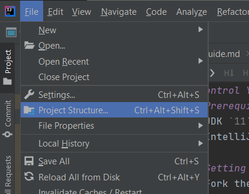
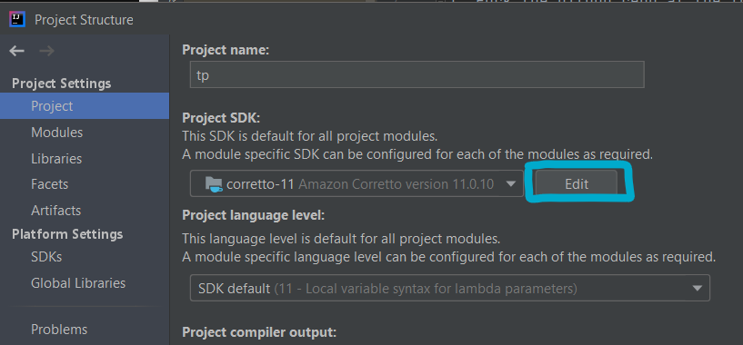

# Control Your Crowd - Setting up
## Prerequisites
1. JDK `11` or above
   *  [Amazon Corretto JDK 11](https://docs.aws.amazon.com/corretto/latest/corretto-11-ug/downloads-list.html)
2. [IntelliJ IDEA](https://www.jetbrains.com/idea/download/) IDE

## Setting up the project on your device
1. Fork the github repo at the following [link](https://github.com/AY2021S2-CS2113T-T09-1/tp)
2. Clone the fork onto your device
3. Open the project
4. Set up the correct JDK version for Gradle
   * Click `File` > `Project Structure`
   
    
     
   * Click `Edit` 
    
   
   * Click `+` > `Add jdk`
     
      
      * JDK `11` is recommended for maximum compatibility with the project.
5. `Windows`: Open the console and run the command `gradlew processResources`
   
   `macOS/Linux`: Open the console and run the command `./gradlew processResources`
6. If the task returns `BUILD SUCCESSFUL`, the set up has been successful

## Configuring the coding style
The project follows the following [java coding standards](https://github.com/oss-generic/process/blob/master/docs/CodingStandards.adoc).
1. Go to `File`>`Settings...` (Windows/Linux), or `IntelliJ IDEA`>`Preferences...` (macOS)
2. Select `Editor` > `Code Style` > `Java`
3. Click on the `Imports` tab
    * For `Class count to use import with '*'` and `Names count to use static import '*'`:
    Set to `999` to prevent auto contracting of import statements to `*`
s
## Getting started with coding
Once you are done with the setup, you can return to the [Developer Guide](DeveloperGuide.md) 
to understand the overall design.