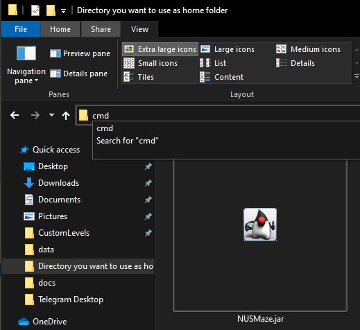
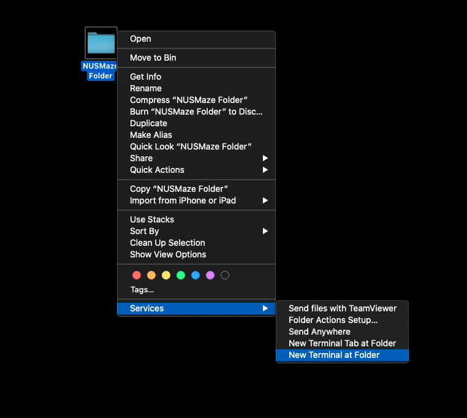
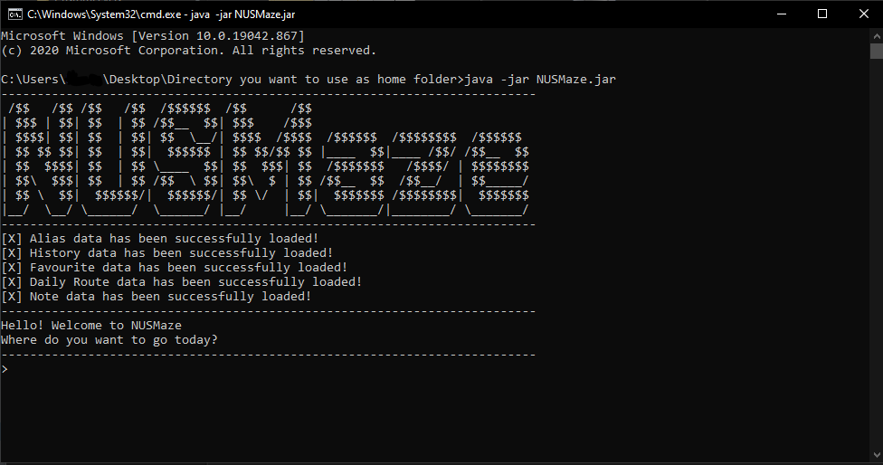

# User Guide for NUSMaze

## Table of Contents
1. [Introduction](#1-introduction) <br>
2. [Quick start](#2-quick-start) <br>
3. [About](#3-about) <br>
   3.1. [Structure of this document](#31-structure-of-this-document) <br>
   3.2. [Reading this document](#32-reading-this-document) <br>
   &nbsp;&nbsp;&nbsp;&nbsp; 3.2.1. [Technical terms](#321-technical-terms) <br>
   &nbsp;&nbsp;&nbsp;&nbsp; 3.2.2. [General Symbols and Syntax](#322-general-symbols-and-syntax) <br>
   &nbsp;&nbsp;&nbsp;&nbsp; 3.2.3. [Format of commands](#323-format-of-commands) <br>
4. [Features](#4-features)  <br>
   4.1. [Viewing Help](#41-viewing-help)<br>
   4.2. [Viewing all venues](#42-viewing-all-venues) <br>
   4.3. [Routing](#43-routing) <br>
   &nbsp;&nbsp;&nbsp;&nbsp; 4.3.1. [Routing between blocks](#431-routing-between-blocks) <br>
   &nbsp;&nbsp;&nbsp;&nbsp; 4.3.2. [Routing to the closest eatery](#432-routing-to-the-closest-eatery) <br>
   4.4. [History](#44-history) <br>
   &nbsp;&nbsp;&nbsp;&nbsp; 4.4.1. [Viewing History](#441-viewing-history) <br>
   &nbsp;&nbsp;&nbsp;&nbsp; 4.4.2. [Clearing History](#442-clearing-history) <br>
   &nbsp;&nbsp;&nbsp;&nbsp; 4.4.3. [Repeating History](#443-repeating-history) <br>
   4.5. [Alias](#45-alias) <br>
   &nbsp;&nbsp;&nbsp;&nbsp; 4.5.1. [Adding an alias for block name](#451-adding-an-alias-for-block-name) <br>
   &nbsp;&nbsp;&nbsp;&nbsp; 4.5.2. [Viewing all aliases](#452-viewing-all-aliases) <br>
   &nbsp;&nbsp;&nbsp;&nbsp; 4.5.3. [Deleting aliases](#453-deleting-aliases) <br>
   4.6. [Daily Routes](#46-daily-routes) <br>
   &nbsp;&nbsp;&nbsp;&nbsp; 4.6.1. [Adding a daily route](#461-adding-a-daily-route) <br>
   &nbsp;&nbsp;&nbsp;&nbsp; 4.6.2. [Viewing daily route](#462-viewing-daily-route) <br>
   &nbsp;&nbsp;&nbsp;&nbsp; 4.5.3. [Deleting daily route](#463-deleting-daily-route) <br>
   4.7. [Notes](#47-notes) <br>
   &nbsp;&nbsp;&nbsp;&nbsp; 4.7.1. [Adding notes](#471-adding-notes) <br>
   &nbsp;&nbsp;&nbsp;&nbsp; 4.7.2. [Viewing notes](#472-viewing-notes) <br>
   &nbsp;&nbsp;&nbsp;&nbsp; 4.7.3. [Delete note](#473-delete-note) <br>
   4.8. [Favourite Routes](#48-favourite-routes) <br>
   &nbsp;&nbsp;&nbsp;&nbsp; 4.8.1. [Adding Favourite route](#481-adding-favourite-route) <br>
   &nbsp;&nbsp;&nbsp;&nbsp; 4.8.2. [Show stored favourites](#482-show-stored-favourites) <br>
   &nbsp;&nbsp;&nbsp;&nbsp; 4.8.3. [Repeating favourite route](#483-repeating-favourite-route) <br> 
   &nbsp;&nbsp;&nbsp;&nbsp; 4.8.4. [Deleting favourite route](#484-deleting-favourite-route) <br>
   4.9. [Exiting the application](#49-exiting-the-application) <br>
   4.10. [Saving the Data](#410-saving-the-data) <br>
5. [FAQ](#5-faq) <br>
6. [Command summary](#6-command-summary) <br>


## 1. Introduction

Welcome to the User Guide of **NUSMaze**!

**NUSMaze** is a Command Line Interface (CLI) based application that aims to **simplify NUS
Computer Engineering students’ journey** from one point to another within the NUS
Engineering and Computing buildings. The application allows users to find the shortest route
from one block to another, locate the nearest eatery, add personal notes to the location and
many more.

NUSMaze uses Command Line Interface (CLI); this means that you operate the application by typing commands
into a Command Box. If your typing speed is fast, you can operate the application faster than other Graphical User Interface
(GUI) applications; GUI applications allow users to interact with the application through graphical icons such as buttons.

You do not have to worry at all even if you are new to CLI applications as this user guide will take you through step by
step on how various features of the NUSMaze can be utilised, all geared towards providing the best possible experience to the user

If you are interested, jump to [Section 2 - Quick Start](#2-quick-start) to learn how to navigate around the campus using 
**NUSMaze**.

--------------------------------------------------------------------------------------------------------------------

## 2. Quick start

This section gives you step-by-step instructions on how to download and open the application.

1. Ensure you have **Java 11** or above installed in your Computer. You may install it [here](https://www.oracle.com/java/technologies/javase-jdk11-downloads.html).

2. Download the latest **NUSMaze.jar** from [here](https://github.com/AY2021S2-CS2113T-T09-2/tp/releases).

3. Copy the file to the folder you want to use as the _home folder_ of **NUSMaze**.

4. Open your command line or terminal and navigate into the file directory where you saved the application. <br>

<div markdown="block" class="alert alert-info">
:information_source: An easy way to do so is shown below for both Mac and Windows<br>
</div>

 Windows |  Mac |
:----------:|:-------------:
<br>Key in `cmd` and press enter.| <br>Right click on the folder and click on "New Terminal at Folder"
5. Key in `java -jar NUSMaze.jar` and press enter to launch the NUSMaze application.<br>
6. A CLI similar to Figure 1 below should appear in a few seconds.  <br>
   
   <p align="center">Figure 1 - CLI of NUSMaze</p>

7. Type your command into the command box at the bottom of the screen, and press Enter on your keyboard to execute it. E.g. typing `help` and pressing Enter will open a help window.<br>

8. Refer to [Section 4 - Features](#4-features) for details on the commands you can use for each feature. <br> <br>


--------------------------------------------------------------------------------------------------------------------
## 3. About

### 3.1. Structure of this document

We have structured this User Guide in a way to help you find what you need easily and quickly.
In the next subsection, [Section 3.2 - reading this document](#32-reading-this-document), you can find several useful tips on how to read this guide.
The following section, [Section 4 - Features](#4-features), documents the main features of **NUSMaze** and provides explanation
on how to utilise them.


### 3.2. Reading this document

This section introduces you to some technical terms, symbols and syntax that are used throughout the guide. You may want to
familiarize yourself with them before moving to the next section.

#### 3.2.1. Technical terms

The table below explains some technical terms that you may come across throughout the user guide.

| Term |  What it means |
|:----------:|-------------|
| CLI |  The Command-Line Interface (or CLI for short) is the user interface in which NUSMaze is based on. Unlike traditional Graphical User Interface (GUI) base applications, it may be less intuitive to new users. However upon familiarisation, fast typists may find it faster to use.  |
| Command word| The Command word refers to the keywords which NUSMaze recognises to invoke specific commands. These command words will be indicated by `COMMAND WORD` in the various sections below.|
|Parameter|Parameter refers to the user input required after the user is prompted by NUSMaze|

#### 3.2.2. General Symbols and Syntax

The table below explains the general syntax used throughout the user guide.

| Syntax |  What it means |
|:----------:|-------------|
| `command` |  A grey highlighted block specifies a executable command or parameters that can be entered into the command box.  |
| _italics_ | Italicised text indicates that the text has a definition specific to NUSMaze, or it is a caption for a Figure in the guide. |
|<div markdown="block" class="alert alert-info"> :information_source: </div>  | An exclamation mark indicates that the following text is a tip. |
|<div markdown="block" class="alert alert-danger"> :warning: </div> | A warning sign indicates that the following text is important. |

#### 3.2.3. Format of commands
The following points explain the format of a command.
More examples will be provided for each command in [Section 4 - Features](#4-features).

1. Words in `UPPER_CASE` are parameters to be supplied by you.

2. In all formats shown in features, → denotes a prompt from the CLI. A user input is expected after the prompt.

3. All the examples provided below are simulation scenarios of expected user commands and outputs by NUSMaze.

4. In each example, lines starting with > signifies user command.

5. In each example, lines starting with * signifies a user input after being prompted by NUSMaze.

--------------------------------------------------------------------------------------------------------------------

## 4. Features

This section contains all the information about the features of **NUSMaze**.
You may enter a command into the CLI to use each feature.

### 4.1 Viewing Help

Lists all commands and functions of each feature.<br>
Format: `help` <br>
Example:
```
--------------------------------------------------------------------------------------------
> help
--------------------------------------------------------------------------------------------
1.  go:
	* finds the route to go from one block to another block or eatery
2.  history:
	* lists past 10 route searches
3.  clear history:
	* deletes all past route searches from history
4.  repeat history:
	* repeats the past route search of your choice
5.  add alias:
	* creates an alias for an existing block
6.  show alias:
	* lists all aliases that are currently active
7.  delete alias:
	* deletes an alias that was previously created
8.  add daily route:
	* adds a schedule for the selected day
9.  show daily route:
	* shows the generated route for the schedule of the selected day
10. delete daily route:
	* deletes the stored schedule based on the index number tagged to the day
11. add note:
	* adds and tags a note to a particular location
12. show notes:
	* list notes tagged to the given location
13. delete note:
	* deletes notes based on index number tagged to the given location
14. add favourite:
	* adds a favourite route
15. show favourite:
	* lists all favourite routes that were previously created
16. delete favourite:
	* deletes a favourite route based on index number tagged to the route
17. show venues:
	* lists all possible venues that can be used in the application (excluding user's alias)
18. bye:
	* exits the application
------------------------------------------------------------------------------------------------------------
```

### 4.2 Viewing all venues

List all the venues in Engineering and Computing campus. <br>
Format: `show venues`
Example:
```
--------------------------------------------------------------------------------------------
> show venues
--------------------------------------------------------------------------------------------
Venues in Engineering faculty:
1. E1   | 7.  E4  | 13. EW1  | 19. LT6         | 
2. E1A  | 8.  E4A | 14. EW1A | 20. LT7         | 
3. E2   | 9.  E5  | 15. EW2  | 21. LT7A        | 
4. E2A  | 10. E6  | 16. LT1  | 22. IT          | 
5. E3   | 11. E7  | 17. LT2  | 23. T-LAB       | 
6. E3A  | 12. EA  | 18. LT5  | 24. TECHNO EDGE | 

Links between Engineering and Computing faculties:
1. LT3 | 4. CENTRAL LIBRARY | 
2. LT4 | 5. CHINESE LIBRARY | 
3. AS6 | 

Venues in Computing faculty:
1. COM1 | 4. LT16 | 
2. COM2 | 5. LT17 | 
3. COM3 | 

Eateries:
1. TECHNO EDGE CANTEEN | 5. SPINELLI COFFEE | 
2. CHEERS MINIMART     | 6. MAXX COFFEE     | 
3. ARISE & SHINE       | 7. STARBUCKS       | 
4. PLATYPUS FOOD BAR   | 
--------------------------------------------------------------------------------------------
```

<div markdown="block" class="alert alert-info">
:information_source: These are the venue names that can be used in the features below. 
</div>


### 4.3 Routing
#### 4.3.1 Routing between blocks

Finds the shortest route to go from one block to another.<br>
Format: `go` → `STARTING_BLOCK` → `DESTINATION_BLOCK` <br>
Example:
```
--------------------------------------------------------------------------------------------
> go
--------------------------------------------------------------------------------------------
Starting Block:
* e2
Destination Block:
* com1
--------------------------------------------------------------------------------------------
Route: E2 -> E3 -> E4 -> E5 -> LT3 -> CHINESE LIBRARY -> CENTRAL LIBRARY -> AS6 -> COM1
--------------------------------------------------------------------------------------------
```
- When the `go` command is given NUSMaze will prompt you for the `STARTING_BLOCK`
  followed by the `DESTINATION BLOCK`.

<div markdown="block" class="alert alert-info">
:information_source: All the parameters for the Routing feature are **case-insensitive**. 
</div>
  
<div markdown="block" class="alert alert-warning">
:warning: Both parameters must be one of the Engineering or Computing venues.
</div>

#### 4.3.2 Routing to the closest eatery
It is also possible to find the shortest route to an eatery using the go feature.<br>
Format 1: `go` → `STARTING_BLOCK` → `EATERY_NAME` <br>
Example: 
```
--------------------------------------------------------------------------------------------
> go
--------------------------------------------------------------------------------------------
Starting Block:
* e1
Destination Block:
* starbucks
--------------------------------------------------------------------------------------------
Route: E1 -> LT5 -> TECHNO EDGE -> STARBUCKS
--------------------------------------------------------------------------------------------
```

- By entering the name of the eatery that you wish to go to in the `EATERY_NAME` parameter,
  NUSMaze will display the shortest route to go from the `STARTING_BLOCK` to the
  desired eatery.

<div markdown="block" class="alert alert-warning">
:warning: The `STARTING_BLOCK` must be one of the Engineering or Computing buildings.
</div>

NUSMaze can also provide you with a list of eateries from closest to furthest if you are unsure which eatery to go.

Format 2: `go` → `STARTING_BLOCK` → `eatery` → `EATERY_ENTRY` <br>
Example:
```
--------------------------------------------------------------------------------------------
> go
--------------------------------------------------------------------------------------------
Starting Block:
* e1
Destination Block:
* eatery
--------------------------------------------------------------------------------------------
Here are the list of eateries(from closest to furthest):
1. TECHNO EDGE CANTEEN
2. CHEERS MINIMART
3. PLATYPUS FOOD BAR
4. SPINELLI COFFEE
5. STARBUCKS
6. ARISE & SHINE
7. MAXX COFFEE
--------------------------------------------------------------------------------------------
Select entry to go:
* 5
--------------------------------------------------------------------------------------------
Route: E1 -> LT5 -> TECHNO EDGE -> STARBUCKS
--------------------------------------------------------------------------------------------
```

- By entering `eatery` as `DESTINATION_BLOCK` parameter, you can see the list of eatery to choose from. 

- NUSMaze then prompts for the index of the eatery that you wish to go to. This is when you can enter `EATERY_ENTRY`.

<div markdown="block" class="alert alert-warning">
:warning: **Points to watch out** <br>
- The `STARTING_BLOCK` must be one of the Engineering or Computing buildings. <br>
- `EATERY_ENTRY` must be an integer from 1 to 7.
</div>

### 4.4 History
#### 4.4.1 Viewing History

Lists the past 10 route searches.<br>
Format: `history`

:information_source: NUSMaze will automatically update your history to the most recent 10 searches.


#### 4.4.2 Clearing History

Deletes all histories (past route searches).<br>
Format: `clear history`

#### 4.4.3 Repeating History

Repeats past route search history.<br>
Format: `repeat history` → `REPEAT_ENTRY`<br>
Example: 
```
--------------------------------------------------------------------------------------------
> repeat history
--------------------------------------------------------------------------------------------
There are 2 records in your history: 
1. E2 -> COM1
2. E1 -> STARBUCKS
--------------------------------------------------------------------------------------------
Select Entry to Repeat:
* 2
--------------------------------------------------------------------------------------------
Route: E1 -> LT5 -> TECHNO EDGE -> STARBUCKS
--------------------------------------------------------------------------------------------
```

- When the `repeat history` command is entered, NUSMaze will show a list of past route searches.

- Followed by a prompt asking for the `REPEAT_ENTRY` index that you want to repeat.

<div markdown="block" class="alert alert-warning">
:warning: `REPEAT_ENTRY` must be an integer that is within the bounds of the history list shown.
</div>

### 4.5 Alias
#### 4.5.1 Adding an alias for block name
Creates an alias for existing blocks.<br>
Format : `add alias` → `BLOCK` → `ALIAS_NAME`
- When `add alias` command is called, NUSMaze will prompt for the `BLOCK` that you
  wish to set the alias for.

- NUSMaze then prompts you to input a desired `ALIAS_NAME`.

- Note that there cannot be multiple blocks sharing the same alias.

#### 4.5.2 Viewing all aliases
Lists all aliases that are currently active.<br>
Format : `show alias`

#### 4.5.3 Deleting aliases
Deletes an alias that was previously created.<br>
Format : `delete alias` → `ALIAS_NAME`
- When the `delete alias` command is given, NUSMaze will prompt you for the
  `ALIAS_NAME` that you wish to delete.

### 4.6 Daily Routes
#### 4.6.1 Adding a daily route
Adds a schedule for the selected day.<br>
Format : `add daily route` → `DAY_ENTRY` → `BLOCK` → ... → `end` <br>
Example : 
```
------------------------------------------------------------------------------------------------------------
> add daily route
------------------------------------------------------------------------------------------------------------
Here are the available days:
1. MONDAY
2. TUESDAY
3. WEDNESDAY
4. THURSDAY
5. FRIDAY
6. SATURDAY
7. SUNDAY
------------------------------------------------------------------------------------------------------------
Select entry:
* 1
------------------------------------------------------------------------------------------------------------
Enter location of the first activity of the day: 
* e2
Enter location of the next activity of the day: (Enter "end" to stop)
* e7
Enter location of the next activity of the day: (Enter "end" to stop)
* ea
Enter location of the next activity of the day: (Enter "end" to stop)
* end
------------------------------------------------------------------------------------------------------------
Got it! Successfully added MONDAY's schedule!
------------------------------------------------------------------------------------------------------------
```
- You will be prompted to select the `DAY_ENTRY` of the day which you want to schedule.

- You will then be prompted to enter the location of the activities(`BLOCK`) of the day one at
  a time.

- NUSMaze will continuously ask for locations until you input `end`.

:warning: `DAY_ENTRY` must be an integer between 1 and 7, each representing a day of the week
(1 represents Monday and 7 represents Sunday).

:warning: There must be at least one block entered for the schedule.

#### 4.6.2 Viewing daily route
Shows the generated route for the schedule of the selected day, if applicable.<br>
Format : `show daily route` → `DAY_NUMBER` <br>
Example :
```
------------------------------------------------------------------------------------------------------------
> show daily route
------------------------------------------------------------------------------------------------------------
Here are the available days:
1. MONDAY
2. TUESDAY
3. FRIDAY
------------------------------------------------------------------------------------------------------------
Select entry:
* 1
------------------------------------------------------------------------------------------------------------
Location of activity 1: E2

Location of activity 2: E7
Route: E2 -> E3 -> E4 -> E4A -> EW2 -> E6 -> E7

Location of activity 3: EA
Route: E7 -> E6 -> EW2 -> E4A -> E4 -> E3 -> E2 -> EA
------------------------------------------------------------------------------------------------------------
```
- When the `show daily route` command is entered, the application will display the list of available days
  for which daily routes have been saved.

- NUSMaze will then prompt you for a `DAY_NUMBER`.

:warning: The `DAY_NUMBER` must be the index of one of the available days which has been displayed.


#### 4.6.3 Deleting daily route

Clears the schedule of the selected day, if applicable.<br>
Format : `delete daily route` → `DAY_NUMBER` <br>
Example :
```
------------------------------------------------------------------------------------------------------------
> delete daily route
------------------------------------------------------------------------------------------------------------
Here are the available days:
1. MONDAY
2. TUESDAY
3. FRIDAY
------------------------------------------------------------------------------------------------------------
Select entry:
* 1
------------------------------------------------------------------------------------------------------------
Got it! Successfully cleared MONDAY's schedule!
------------------------------------------------------------------------------------------------------------
```
- When the `delete daily route` command is entered, the application will display the list of available days
  for which daily routes have been saved.

- NUSMaze will then prompt you for a `DAY_NUMBER`.

:warning: The `DAY_NUMBER` must be the index of one of the available days which has been displayed.

### 4.7 Notes
#### 4.7.1 Adding notes
Tags a note to a particular existing location of your choice.<br/>
Format : `add note` → `BLOCK` → `NOTE` <br> 
Example:
```
------------------------------------------------------------------------------------------------------------
> add note
------------------------------------------------------------------------------------------------------------
Enter Block:
* starbucks
Enter the Note:
* give myself a treat of the new caramel macchiato flavour! :))
------------------------------------------------------------------------------------------------------------
Got it! Successfully added and tagged note to STARBUCKS
------------------------------------------------------------------------------------------------------------
```
- When the `add note` command is entered, NUSMaze will prompt you for a `BLOCK`.
- After a valid location is keyed in,  NUSMaze will prompt you for a `NOTE` to be tagged to the location.
  
:warning: The `BLOCK` must be one of the Engineering or Computing buildings. <br>
:warning: The `NOTE` will be invalid if it is empty.

#### 4.7.2 Viewing notes
Lists all notes which had been tagged to the given location, if it exists.<br/>
Format : `show note` → `BLOCK` <br>
Example:
```
------------------------------------------------------------------------------------------------------------
> show note
------------------------------------------------------------------------------------------------------------
Enter Block:
* starbucks
------------------------------------------------------------------------------------------------------------
Here is the list of notes:
1. give myself a treat of the new caramel macchiato flavour! :))
------------------------------------------------------------------------------------------------------------
```
- When the `show note` command is entered, NUSMaze will prompt you for a `BLOCK`.
  
:warning: The `BLOCK` must be one of the Engineering or Computing buildings.

#### 4.7.3 Delete note
Delete the specified note based on index number tagged to the given existing location.<br/>
Format : `delete note` → `BLOCK` → `NOTE_INDEX` <br>
Example:
```
------------------------------------------------------------------------------------------------------------
> delete note
------------------------------------------------------------------------------------------------------------
Enter Block:
* starbucks
------------------------------------------------------------------------------------------------------------
Here is the list of notes:
1. give myself a treat of the new caramel macchiato flavour! :))
------------------------------------------------------------------------------------------------------------
Select Entry to delete:
* 1
------------------------------------------------------------------------------------------------------------
Got it! Successfully deleted note tagged to STARBUCKS
------------------------------------------------------------------------------------------------------------
```
- When the `delete note` command is entered, NUSMaze will then prompt you for a `BLOCK`.
- After a valid location is keyed in,  NUSMaze will prompt you for a `NOTE_INDEX` of the note to be deleted,
  which is the index of the note in the location's notes list.
  
:warning: The `BLOCK` must be one of the Engineering or Computing buildings.

:warning: The `NOTE_INDEX` must be an integer within the total number of notes that the location has.

### 4.8 Favourite Routes
#### 4.8.1 Adding Favourite Route
You can add a route to favourites to easily access it in the future.<br>
Format : `add favourite` → `STARTING_BLOCK` → `DESTINATION_BLOCK`

#### 4.8.2 Show stored favourites
You can request NUSMaze to display all the saved favourites, if you have stored at least one route to favourites.<br>
Format : `show favourite`

#### 4.8.3 Repeating favourite route
You can execute and obtain the route to take for your favourite routes.<br>
Format : `repeat favourite` → `ROUTE_INDEX`

#### 4.8.4 Deleting favourite route
You can delete a favourite route if it is not frequently used anymore.<br>
Format : `delete favourite` → `ROUTE_INDEX`

### 4.9 Exiting the application

Exits the application.<br>
Format : `bye`

### 4.10 Saving the Data

NUSMaze data is saved in the hard disk automatically after any command that changes the data. There is no need to save manually.

--------------------------------------------------------------------------------------------------------------------

## 5. FAQ

**Q**: Do I lose all my personalised routes and preferences when I close the application? <br>
**A**: Aliases, daily scheduled routes, history and notes are all stored once you exit the app and loaded upon next entry, so you do not lose any data.

**Q**: How do I transfer my personalised routes and preferences to another computer? <br>
**A**: Copy the entire data folder that can be found together with the NUSMaze.jar file on the first computer and copy it over to the same directory where the NUSMaze.jar file
can be found on the second computer.


--------------------------------------------------------------------------------------------------------------------
## 6. Command summary

|Action | Format |
|---------------|------------------------------------------------------------------|
|[**Viewing help**](#41-viewing-help)        | `help` | 
|[**Viewing all venues**](#42-viewing-all-venues)        | `help` | 
|[**Finding the route**](#43-routing)       | `go` → `START` → `DESTINATION` or `go` → `START` → `eatery` → `EATERY_ENTRY` |
|[**Viewing history**](#441-viewing-history)     | `history` | 
|[**Clearing history**](#442-clearing-history)       | `clear history` |
|[**Repeating history**](#443-repeating-history)       | `repeat history` → `REPEAT_ENTRY` |
|[**Adding alias for block names**](#451-adding-an-alias-for-block-name)| `add alias` → `BLOCK` → `ALIAS` | 
|[**Showing all aliases**](#452-viewing-all-aliases)  | `show alias` | 
|[**Deleting alias**](#453-deleting-aliases)       | `delete alias` → `ALIAS` |
|[**Adding a daily route**](#461-adding-a-daily-route)     | `add daily route` → `DAY_NUMBER` → `BLOCK` → … → `BLOCK` → `end` | 
|[**Showing a daily route**](#462-viewing-daily-route)       | `show daily route` → `DAY_NUMBER` |
|[**Deleting a daily route**](#463-deleting-daily-route)       | `delete daily route` → `DAY_NUMBER` |
|[**Adding notes**](#471-adding-notes)       | `add note` → `BLOCK` → `NOTE` |
|[**Viewing notes**](#472-viewing-notes)      | `show note` → `BLOCK` | 
|[**Deleting notes**](#473-delete-note)       | `delete note` → `BLOCK` → `NOTE_INDEX` |
|[**Adding Favourite Route**](#481-adding-favourite-route)       | `add favourite` → `STARTING_BLOCK` → `DESTINATION_BLOCK` |
|[**Show stored favourites**](#482-show-stored-favourites)       | `show favourite` |
|[**Repeating favourite route**](#483-repeating-favourite-route)       | `repeat favourite` → `ROUTE_INDEX` |
|[**Deleting favourite route**](#484-deleting-favourite-route)       | `delete favourite` → `ROUTE_INDEX` |
|[**Exiting the application**](#49-exiting-the-application)       | `bye` |

