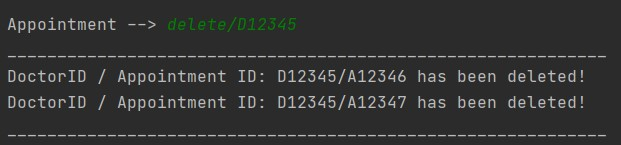
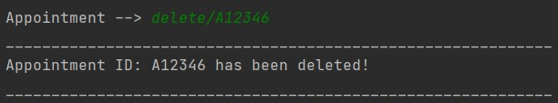
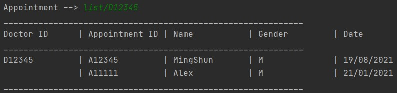
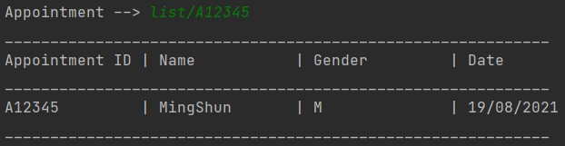

# HealthVault User Guide

<p align="center">

</p>
	
## Opening Words

Welcome to HealthVault User Guide!						 

The purpose of this User Guide is to assist you in the usage of the application. You will be able to utilize all the features of the HealthVault application to create the most efficient healthcare environment!

## Content Page
1. [Introduction](#1-introduction)
	1. [What is HealthVault?](#11-what-is-healthvault)
	2. [About the User Guide](#12-about-the-user-guide)
2. [How to use this guide](#2-how-to-use-the-guide)
	1. [Technical terms](#21-technical-terms)
	2. [Symbols & Icons](#22-symbols--icons)
3. [Getting Started](#3-getting-started)
	1. [Introduction to Command Line Interface (CLI)](#31-introduction-to-command-line-interface-cli)
	2. [Installation Guide](#-32-installation-guide)
4. [Start Menu](#4-start-menu)
 	1. [Interpreting help commands](#41-interpreting-help-commands)
5. [Features](#5-features)
	1. [Staff](#51-staff)
	2. [Patient](#52-patient)
	3. [Doctor's Appointment](#53-doctors-appointment)
	4. [Nurse Schedule](#54-nurse-schedule)
	5. [Inventory](#55-inventory)
6. [FAQ](#6-faq)
7. [Command Summary](#7-command-summary)

## 1. Introduction

### 1.1 What is HealthVault?

To save a life is the top priority of any healthcare worker. 
In such a precarious situation, every second matters and a Head Nurse cannot afford to waste time when they need to store or view critical information.

Introducting HealthVault, a Head Nurse's personal information recording system. HealthVault is a desktop app for managing doctor, nurse, patient and inventory information, optimised for use through the command line interface. If the user can type fast, HealthVault brings both convenience and speed for a Head Nurse to view and store critical information.

In this application there are 5 main features that are provided for the user. 
* **Staff:** Keeps record of and allows you to access staff information and modify them if needed.
* **Patient:** Keeps record of and allows you to access patient information and modify them if needed.
* **Doctor Appointments:** Keeps record of and allows you to create and view Doctor Appointments.
* **Nurse Schedules:** Keeps record of and allows you to create and view Nurse Schedules.
* **Inventory:** Keeps record of and allows you to view your current hospital inventory of supplies

Each feature can be accessed by accessing its specific menu. For example, the Patient details can be accessed by accessing the Patient Menu from the Start Menu.

### 1.2 About the User Guide

This user guide helps you to understand how to use the HealthVault application by introducing the various commands and interfaces to you.
Various helpful screenshots from the application also help to guide you through the application.

This user guide will cover the following:
* How to set up the application
* How to use Command Line Interface - CLI
* Helpful tips on how to use the guide
* How to use each of the features
* Frequently asked questions


<br/><br/>

## 2. How to use the guide

### 2.1 Technical Terms

&nbsp;&nbsp;&nbsp;&nbsp;&nbsp;&nbsp;&nbsp;&nbsp; **Command Line Interface** - Accessing the functionalities of a computer program in the form of lines of text.

&nbsp;&nbsp;&nbsp;&nbsp;&nbsp;&nbsp;&nbsp;&nbsp; **Graphical User Interface** - Allows users to interact with the functionalities of a computer program through graphical icons 

&nbsp;&nbsp;&nbsp;&nbsp;&nbsp;&nbsp;&nbsp;&nbsp; and audio indicators, instead of text-based user interfaces, typed command labels or text navigation.

&nbsp;&nbsp;&nbsp;&nbsp;&nbsp;&nbsp;&nbsp;&nbsp; **Case Sensitive** - Differentiating between capital and lower-case letters.

&nbsp;&nbsp;&nbsp;&nbsp;&nbsp;&nbsp;&nbsp;&nbsp; **User Input** - Any information or data sent to a computer by the user using the application.

&nbsp;&nbsp;&nbsp;&nbsp;&nbsp;&nbsp;&nbsp;&nbsp; **Alphanumeric** - Consisting of only alphabets and numerals.

&nbsp;&nbsp;&nbsp;&nbsp;&nbsp;&nbsp;&nbsp;&nbsp; **Delimiter** - A character that seperates different sections of a text or input

### 2.2 Symbols & Icons

&nbsp;&nbsp;&nbsp;&nbsp;&nbsp;&nbsp;&nbsp;&nbsp; **[]** - Square brackets for compulsory user inputs.

&nbsp;&nbsp;&nbsp;&nbsp;&nbsp;&nbsp;&nbsp;&nbsp; **<>** - Optional inputs.

&nbsp;&nbsp;&nbsp;&nbsp;&nbsp;&nbsp;&nbsp;&nbsp; :information_source: This icon denotes a important information to note.

<br/><br/>

## 3. Getting Started</a>

### 3.1 Introduction to Command Line Interface (CLI)

HealthVault uses the Command Line Interface (CLI) to run. And CLI is primary input method for interacting with HealthVault.

As CLI is not commonly used, this section hopes to orientate you with the CLI environment if you are new and acts as a refresher for returning users.

CLI takes in a user input from the input marker as shown in the image included below. The red arrow points to where the users input will appear.


After keying in their input, the most common way to enter the response into the system is to press the <kbd>Enter</kbd> key for the command to be recorded.

### <a name="section2"> 3.2 Installation Guide</a>

1. Ensure system has Java 11

2. Download the latest JAR file from this [website](https://github.com/AY2021S2-CS2113T-F08-2/tp/releases)

3. Open the command window 
   - Click the search icon in the bottom left side of the screen 
   - Type ‘command prompt’ in the search bar
   - Select the application called ‘Command Prompt’

4. `cd` into the folder containing the JAR file
   - Locate the file path of the JAR file that you have downloaded
   - For example:  (C:\Users\JohnDoe\Downloads), where JohnDoe is the user’s name
   - Then, run the following command: `cd [File Path]`
   - Example: `cd C:\Users\JohnDoe\Downloads`
   - Run the following command: `java -jar jar [JAR file name]`
  
<br/><br/>

## 4. Start Menu

The Start Menu is the first menu you will encounter after you run the application as stated in [section 3](#section3). 

Here is an example of how the welcome screen of HealthVault will look like.


The Start Menu allows you to access various Menus in the application based on the feature that you would like to access.

For example, the Staff Menu allows you to access the Staff feature within the database. 

The welcome screen of HealthVault presents you with the basic commands as well as its description of its functionalities. 

Input any command to access the respective features and input the `exit` command to quit the application.

### 4.1 Interpreting help commands

:information_source: All instances of commands and code will be highlighted in grey and will have a different font.

This is an example of a typical help command in the application.


The **Commands** column gives the command that allows you to accomplish a certain action with the relevant features. 
For example, the `add` command allows you to add a new staff and their relevant details into the database.

The **Description** column gives you an explaination on the usage and purpose of the command.

The **Format** column gives the appropriate format for you to use the command.
For example, the `add` format requires specific details regarding the staff that will be added into the database.
The '-' in the format column specifies that the command can be used alone without any additional details.

The detailed explaination of each command will be explained in the subsequent sections.

<br/><br/>

## 5. Features 

### 5.1 Staff

The functions in Staff menu allow you, the head nurse, to access and modify the details of each staff in the hospital. 
(Note for Staff ID: D/N = Doctor/Nurse)

This is an example of the welcome screen for Staff Menu.


<br/><br/>

#### Adding a new staff: `add`
&nbsp;&nbsp;&nbsp;&nbsp;&nbsp;&nbsp;&nbsp;&nbsp; Adds a new doctor or nurse to the respective staff lists. 

&nbsp;&nbsp;&nbsp;&nbsp;&nbsp;&nbsp;&nbsp;&nbsp; **Format**:

&nbsp;&nbsp;&nbsp;&nbsp;&nbsp;&nbsp;&nbsp;&nbsp;&nbsp;&nbsp;&nbsp;&nbsp;&nbsp;&nbsp;&nbsp;&nbsp; `add/[Staff ID]/[Name]/[Age]/[Specialisation]` 

>:information_source: Important notes about the input format
>1. Make sure that the inputted user ID starts with a P and has at least 5 digits in the number following! 
>
> &nbsp;&nbsp;&nbsp;&nbsp;&nbsp;&nbsp;&nbsp; **Example**: `P12345`, `P54321`
>   
>2. Excluding the delimiter "/" HealthVault only accepts space and alphanumeric characters
>3. The gender field input should only be "M", "F" or "Others"
>4. The age field input should be a positive integer not more than 150


&nbsp;&nbsp;&nbsp;&nbsp;&nbsp;&nbsp;&nbsp;&nbsp; **Example of usage**:<br/>

&nbsp;&nbsp;&nbsp;&nbsp;&nbsp;&nbsp;&nbsp;&nbsp;&nbsp;&nbsp;&nbsp;&nbsp;&nbsp;&nbsp;&nbsp;&nbsp; Adding a Pediatrician MingShun with Staff ID of D12345 of age 30

&nbsp;&nbsp;&nbsp;&nbsp;&nbsp;&nbsp;&nbsp;&nbsp;&nbsp;&nbsp;&nbsp;&nbsp;&nbsp;&nbsp;&nbsp;&nbsp; ``` Staff --> add/D12345/MingShun/30/Pediatrician```

&nbsp;&nbsp;&nbsp;&nbsp;&nbsp;&nbsp;&nbsp;&nbsp; **Expected Outcome**:

&nbsp;&nbsp;&nbsp;&nbsp;&nbsp;&nbsp;&nbsp;&nbsp; 

<br/><br/>
 
#### Deleting a staff: `delete`
&nbsp;&nbsp;&nbsp;&nbsp;&nbsp;&nbsp;&nbsp;&nbsp; Deletes a staff from the staff list.

&nbsp;&nbsp;&nbsp;&nbsp;&nbsp;&nbsp;&nbsp;&nbsp;&nbsp;&nbsp;&nbsp;&nbsp;&nbsp;&nbsp;&nbsp;&nbsp; `delete/[Staff ID]`

&nbsp;&nbsp;&nbsp;&nbsp;&nbsp;&nbsp;&nbsp;&nbsp;Example of usage:

&nbsp;&nbsp;&nbsp;&nbsp;&nbsp;&nbsp;&nbsp;&nbsp;&nbsp;&nbsp;&nbsp;&nbsp;&nbsp;&nbsp;&nbsp;&nbsp; Deleting Staff with ID D12345.

&nbsp;&nbsp;&nbsp;&nbsp;&nbsp;&nbsp;&nbsp;&nbsp;&nbsp;&nbsp;&nbsp;&nbsp;&nbsp;&nbsp;&nbsp;&nbsp; ```Staff --> delete/D12345 ```

&nbsp;&nbsp;&nbsp;&nbsp;&nbsp;&nbsp;&nbsp;&nbsp; Expected Outcome:

&nbsp;&nbsp;&nbsp;&nbsp;&nbsp;&nbsp;&nbsp;&nbsp;

<br/><br/>

#### Listing all doctors or nurses: `list`
&nbsp;&nbsp;&nbsp;&nbsp;&nbsp;&nbsp;&nbsp;&nbsp; Lists either all doctors or all nurses.

&nbsp;&nbsp;&nbsp;&nbsp;&nbsp;&nbsp;&nbsp;&nbsp;&nbsp;&nbsp;&nbsp;&nbsp;&nbsp;&nbsp;&nbsp;&nbsp; `list/<doctors/nurses>`

&nbsp;&nbsp;&nbsp;&nbsp;&nbsp;&nbsp;&nbsp;&nbsp;&nbsp;&nbsp;&nbsp;&nbsp;&nbsp;&nbsp;&nbsp;&nbsp; **Note: <> implies that the inputs are optional**


&nbsp;&nbsp;&nbsp;&nbsp;&nbsp;&nbsp;&nbsp;&nbsp; Example of usage(doctors):

&nbsp;&nbsp;&nbsp;&nbsp;&nbsp;&nbsp;&nbsp;&nbsp;&nbsp;&nbsp;&nbsp;&nbsp;&nbsp;&nbsp;&nbsp;&nbsp; List all Doctors Details.

&nbsp;&nbsp;&nbsp;&nbsp;&nbsp;&nbsp;&nbsp;&nbsp;&nbsp;&nbsp;&nbsp;&nbsp;&nbsp;&nbsp;&nbsp;&nbsp; ```Staff --> list/doctors ```

&nbsp;&nbsp;&nbsp;&nbsp;&nbsp;&nbsp;&nbsp;&nbsp; Expected Outcome(doctors):

&nbsp;&nbsp;&nbsp;&nbsp;&nbsp;&nbsp;&nbsp;&nbsp;


&nbsp;&nbsp;&nbsp;&nbsp;&nbsp;&nbsp;&nbsp;&nbsp; Example of usage (nurses):

&nbsp;&nbsp;&nbsp;&nbsp;&nbsp;&nbsp;&nbsp;&nbsp;&nbsp;&nbsp;&nbsp;&nbsp;&nbsp;&nbsp;&nbsp;&nbsp; List all Nurses Details.

&nbsp;&nbsp;&nbsp;&nbsp;&nbsp;&nbsp;&nbsp;&nbsp;&nbsp;&nbsp;&nbsp;&nbsp;&nbsp;&nbsp;&nbsp;&nbsp; ```Staff --> list/nurses ```

&nbsp;&nbsp;&nbsp;&nbsp;&nbsp;&nbsp;&nbsp;&nbsp; Expected Outcome(nurses):

&nbsp;&nbsp;&nbsp;&nbsp;&nbsp;&nbsp;&nbsp;&nbsp;


&nbsp;&nbsp;&nbsp;&nbsp;&nbsp;&nbsp;&nbsp;&nbsp; Example of usage (no input):

&nbsp;&nbsp;&nbsp;&nbsp;&nbsp;&nbsp;&nbsp;&nbsp;&nbsp;&nbsp;&nbsp;&nbsp;&nbsp;&nbsp;&nbsp;&nbsp; List all Staff Details.

&nbsp;&nbsp;&nbsp;&nbsp;&nbsp;&nbsp;&nbsp;&nbsp;&nbsp;&nbsp;&nbsp;&nbsp;&nbsp;&nbsp;&nbsp;&nbsp; ```Staff --> list```

&nbsp;&nbsp;&nbsp;&nbsp;&nbsp;&nbsp;&nbsp;&nbsp; Expected Outcome(nurses)

&nbsp;&nbsp;&nbsp;&nbsp;&nbsp;&nbsp;&nbsp;&nbsp;

<br/><br/>


#### Finding a staff: `find`
&nbsp;&nbsp;&nbsp;&nbsp;&nbsp;&nbsp;&nbsp;&nbsp; Find a staff from the staff list with a keyword.

&nbsp;&nbsp;&nbsp;&nbsp;&nbsp;&nbsp;&nbsp;&nbsp;&nbsp;&nbsp;&nbsp;&nbsp;&nbsp;&nbsp;&nbsp;&nbsp; `find/[keyword]`

&nbsp;&nbsp;&nbsp;&nbsp;&nbsp;&nbsp;&nbsp;&nbsp; Example of usage:

&nbsp;&nbsp;&nbsp;&nbsp;&nbsp;&nbsp;&nbsp;&nbsp;&nbsp;&nbsp;&nbsp;&nbsp;&nbsp;&nbsp;&nbsp;&nbsp; Find all Staff with Oncology specialisation.

&nbsp;&nbsp;&nbsp;&nbsp;&nbsp;&nbsp;&nbsp;&nbsp;&nbsp;&nbsp;&nbsp;&nbsp;&nbsp;&nbsp;&nbsp;&nbsp; ```Staff --> find/Oncology```

&nbsp;&nbsp;&nbsp;&nbsp;&nbsp;&nbsp;&nbsp;&nbsp; Expected Outcome:

&nbsp;&nbsp;&nbsp;&nbsp;&nbsp;&nbsp;&nbsp;&nbsp; 
<br/><br/>

#### Returning to Start Menu: `return`

&nbsp;&nbsp;&nbsp;&nbsp;&nbsp;&nbsp;&nbsp;&nbsp; Return you to the Start Menu.

&nbsp;&nbsp;&nbsp;&nbsp;&nbsp;&nbsp;&nbsp;&nbsp; Expected Outcome:

&nbsp;&nbsp;&nbsp;&nbsp;&nbsp;&nbsp;&nbsp;&nbsp;

#### Help: `help`

&nbsp;&nbsp;&nbsp;&nbsp;&nbsp;&nbsp;&nbsp;&nbsp; Display the commands for the Staff Menu.

&nbsp;&nbsp;&nbsp;&nbsp;&nbsp;&nbsp;&nbsp;&nbsp; Expected Outcome:

&nbsp;&nbsp;&nbsp;&nbsp;&nbsp;&nbsp;&nbsp;&nbsp;

<br/><br/>

### 5.2 Patient

The functions in the Patient menu allow you, the head nurse, to add, view, find, and delete patients in the patient list.

When you first enter the Patient menu, you will be greeted with the following welcome message.


<br/><br/>

#### Adding a new patient: `add`
&nbsp;&nbsp;&nbsp;&nbsp;&nbsp;&nbsp;&nbsp;&nbsp; Adds a new patient to the patient list.

&nbsp;&nbsp;&nbsp;&nbsp;&nbsp;&nbsp;&nbsp;&nbsp; **Format**:

&nbsp;&nbsp;&nbsp;&nbsp;&nbsp;&nbsp;&nbsp;&nbsp;&nbsp;&nbsp;&nbsp;&nbsp;&nbsp;&nbsp;&nbsp;&nbsp; `add/[Patient ID]/[Name]/[Age]/[Gender]/[Illness]/[Drugs needed]`

>:information_source: Important notes about the input format
>
>1. Make sure that the inputted user ID starts with a P and has at least 5 digits in the number following!
>
> &nbsp;&nbsp;&nbsp;&nbsp;&nbsp;&nbsp;&nbsp; **Example**: `P12345`, `P54321`
>
>2. Excluding the delimiter "/" HealthVault only accepts space and alphanumeric characters
>3. The gender field input should only be "M", "F" or "Others"
>4. The age field input should be a positive integer not more than 150

&nbsp;&nbsp;&nbsp;&nbsp;&nbsp;&nbsp;&nbsp;&nbsp; **Example of usage**:

&nbsp;&nbsp;&nbsp;&nbsp;&nbsp;&nbsp;&nbsp;&nbsp;&nbsp;&nbsp;&nbsp;&nbsp;&nbsp;&nbsp;&nbsp;&nbsp; Adding a Patient Sam (Age 40, Male who is having a fever and needs Paracetamol) with the Patient ID of P55555.

&nbsp;&nbsp;&nbsp;&nbsp;&nbsp;&nbsp;&nbsp;&nbsp;&nbsp;&nbsp;&nbsp;&nbsp;&nbsp;&nbsp;&nbsp;&nbsp; ``` Patient --> add/P55555/Sam/40/M/Fever/Paracetamol```

&nbsp;&nbsp;&nbsp;&nbsp;&nbsp;&nbsp;&nbsp;&nbsp; **Expected Outcome**:

&nbsp;&nbsp;&nbsp;&nbsp;&nbsp;&nbsp;&nbsp;&nbsp; 

<br/><br/>

#### Deleting a patient: `delete`
&nbsp;&nbsp;&nbsp;&nbsp;&nbsp;&nbsp;&nbsp;&nbsp; Deletes a patient from the patient list.

&nbsp;&nbsp;&nbsp;&nbsp;&nbsp;&nbsp;&nbsp;&nbsp; **Format**:

&nbsp;&nbsp;&nbsp;&nbsp;&nbsp;&nbsp;&nbsp;&nbsp;&nbsp;&nbsp;&nbsp;&nbsp;&nbsp;&nbsp;&nbsp;&nbsp; `delete/[Patient ID]`

>:information_source: Important notes about the input format
>
>1. Make sure that the inputted user ID starts with a P and has at least 5 digits in the number following!
>
> &nbsp;&nbsp;&nbsp;&nbsp;&nbsp;&nbsp;&nbsp; **Example**: `P12345`, `P54321`
>

&nbsp;&nbsp;&nbsp;&nbsp;&nbsp;&nbsp;&nbsp;&nbsp; **Example of usage**:

&nbsp;&nbsp;&nbsp;&nbsp;&nbsp;&nbsp;&nbsp;&nbsp;&nbsp;&nbsp;&nbsp;&nbsp;&nbsp;&nbsp;&nbsp;&nbsp; ```Patient --> delete/P55555```

&nbsp;&nbsp;&nbsp;&nbsp;&nbsp;&nbsp;&nbsp;&nbsp; **Expected Outcome**:

&nbsp;&nbsp;&nbsp;&nbsp;&nbsp;&nbsp;&nbsp;&nbsp; 

<br/><br/>

#### Listing all patients: `list`

&nbsp;&nbsp;&nbsp;&nbsp;&nbsp;&nbsp;&nbsp;&nbsp; Lists all patients in the patient list.

&nbsp;&nbsp;&nbsp;&nbsp;&nbsp;&nbsp;&nbsp;&nbsp; **Format**:

&nbsp;&nbsp;&nbsp;&nbsp;&nbsp;&nbsp;&nbsp;&nbsp;&nbsp;&nbsp;&nbsp;&nbsp;&nbsp;&nbsp;&nbsp;&nbsp; `list`

&nbsp;&nbsp;&nbsp;&nbsp;&nbsp;&nbsp;&nbsp;&nbsp; Example of usage:

&nbsp;&nbsp;&nbsp;&nbsp;&nbsp;&nbsp;&nbsp;&nbsp;&nbsp;&nbsp;&nbsp;&nbsp;&nbsp;&nbsp;&nbsp;&nbsp; ``` Staff --> list```

&nbsp;&nbsp;&nbsp;&nbsp;&nbsp;&nbsp;&nbsp;&nbsp; **Expected Outcome**:

&nbsp;&nbsp;&nbsp;&nbsp;&nbsp;&nbsp;&nbsp;&nbsp; 

<br/><br/>

#### Finding a patient: `find`
&nbsp;&nbsp;&nbsp;&nbsp;&nbsp;&nbsp;&nbsp;&nbsp; Finds a patient currently in the patient list.

&nbsp;&nbsp;&nbsp;&nbsp;&nbsp;&nbsp;&nbsp;&nbsp; **Format**:

&nbsp;&nbsp;&nbsp;&nbsp;&nbsp;&nbsp;&nbsp;&nbsp;&nbsp;&nbsp;&nbsp;&nbsp;&nbsp;&nbsp;&nbsp;&nbsp; `find/[Keyword/Phrase]`

>:information_source: Important notes about the input format
>
>1. Other than inputting known values like the ID or Name, the inputted field can be an arbitrary input. HealthVault will search through the list of patients for any patient that matches the keyword or phrase.
>2. Excluding the delimiter "/" HealthVault only accepts space and alphanumeric characters.

&nbsp;&nbsp;&nbsp;&nbsp;&nbsp;&nbsp;&nbsp;&nbsp; **Example of usage**:

&nbsp;&nbsp;&nbsp;&nbsp;&nbsp;&nbsp;&nbsp;&nbsp;&nbsp;&nbsp;&nbsp;&nbsp;&nbsp;&nbsp;&nbsp;&nbsp; Finding through inputting the ID

&nbsp;&nbsp;&nbsp;&nbsp;&nbsp;&nbsp;&nbsp;&nbsp;&nbsp;&nbsp;&nbsp;&nbsp;&nbsp;&nbsp;&nbsp;&nbsp; ``` Patient --> find/P54321```

&nbsp;&nbsp;&nbsp;&nbsp;&nbsp;&nbsp;&nbsp;&nbsp; **Expected Outcome**:

&nbsp;&nbsp;&nbsp;&nbsp;&nbsp;&nbsp;&nbsp;&nbsp; 

&nbsp;&nbsp;&nbsp;&nbsp;&nbsp;&nbsp;&nbsp;&nbsp; **Example of usage**:

&nbsp;&nbsp;&nbsp;&nbsp;&nbsp;&nbsp;&nbsp;&nbsp;&nbsp;&nbsp;&nbsp;&nbsp;&nbsp;&nbsp;&nbsp;&nbsp; Finding through inputting the name

&nbsp;&nbsp;&nbsp;&nbsp;&nbsp;&nbsp;&nbsp;&nbsp;&nbsp;&nbsp;&nbsp;&nbsp;&nbsp;&nbsp;&nbsp;&nbsp; ``` Patient --> find/Sam```

&nbsp;&nbsp;&nbsp;&nbsp;&nbsp;&nbsp;&nbsp;&nbsp; **Expected Outcome**:

&nbsp;&nbsp;&nbsp;&nbsp;&nbsp;&nbsp;&nbsp;&nbsp; 

<br/><br/>

#### Help: `help`

&nbsp;&nbsp;&nbsp;&nbsp;&nbsp;&nbsp;&nbsp;&nbsp; Display the commands for the Staff Menu.

&nbsp;&nbsp;&nbsp;&nbsp;&nbsp;&nbsp;&nbsp;&nbsp; **Expected Outcome**:

&nbsp;&nbsp;&nbsp;&nbsp;&nbsp;&nbsp;&nbsp;&nbsp; 

#### Returning to Start Menu: `return`

&nbsp;&nbsp;&nbsp;&nbsp;&nbsp;&nbsp;&nbsp;&nbsp; Return you to the Start Menu.

&nbsp;&nbsp;&nbsp;&nbsp;&nbsp;&nbsp;&nbsp;&nbsp; **Expected Outcome**:

&nbsp;&nbsp;&nbsp;&nbsp;&nbsp;&nbsp;&nbsp;&nbsp; 

<br/><br/>


### 5.3 Doctor's Appointment

The functions in the Doctor's Appointment menu allow you, the head nurse, to add, view, and delete appointments made with a specific doctor.

This is an example of the welcome screen for Doctors' Appointments Menu.


#### Adding an appointment: `add`
&nbsp;&nbsp;&nbsp;&nbsp;&nbsp;&nbsp;&nbsp;&nbsp; Adds a new doctor's appointment to the list of appointments.

&nbsp;&nbsp;&nbsp;&nbsp;&nbsp;&nbsp;&nbsp;&nbsp; **Format**:

&nbsp;&nbsp;&nbsp;&nbsp;&nbsp;&nbsp;&nbsp;&nbsp;&nbsp;&nbsp;&nbsp;&nbsp;&nbsp;&nbsp;&nbsp;&nbsp; `add/[Doctor ID]/[Appointment ID]/[Patient’s Name]/[Gender]/[DDMMYYYY]` 

>:information_source: Important notes about the input format
>1. Make sure that the inputted doctor/appointment ID starts with a D/A and has at least 5 digits in the number following! 
>
> &nbsp;&nbsp;&nbsp;&nbsp;&nbsp;&nbsp;&nbsp; **Example**: `D12345`, `A54321`
>   
>2. Excluding the delimiter "/" HealthVault only accepts space and alphanumeric characters
>3. The gender field input should only be "M", "F".
>4. The name field input should not have any non-Alphanumeric Characters.


&nbsp;&nbsp;&nbsp;&nbsp;&nbsp;&nbsp;&nbsp;&nbsp; **Example of usage**:<br/>

&nbsp;&nbsp;&nbsp;&nbsp;&nbsp;&nbsp;&nbsp;&nbsp;&nbsp;&nbsp;&nbsp;&nbsp;&nbsp;&nbsp;&nbsp;&nbsp; Adding an appointment for Alex, a male, with Doctor ID D12345 on 21/01/2021.

&nbsp;&nbsp;&nbsp;&nbsp;&nbsp;&nbsp;&nbsp;&nbsp;&nbsp;&nbsp;&nbsp;&nbsp;&nbsp;&nbsp;&nbsp;&nbsp; ``` Appointments --> add/D12345/A12345/Alex/M/21012021```

&nbsp;&nbsp;&nbsp;&nbsp;&nbsp;&nbsp;&nbsp;&nbsp; **Expected Outcome**:

&nbsp;&nbsp;&nbsp;&nbsp;&nbsp;&nbsp;&nbsp;&nbsp; 

<br/><br/>

#### Deleting an appointment: `delete`
&nbsp;&nbsp;&nbsp;&nbsp;&nbsp;&nbsp;&nbsp;&nbsp; Deletes an appointment from the list of appointments or deletes all appointments belonging to a doctor.

&nbsp;&nbsp;&nbsp;&nbsp;&nbsp;&nbsp;&nbsp;&nbsp; **Format**:

&nbsp;&nbsp;&nbsp;&nbsp;&nbsp;&nbsp;&nbsp;&nbsp;&nbsp;&nbsp;&nbsp;&nbsp;&nbsp;&nbsp;&nbsp;&nbsp; `delete/[DoctorID/ Appointment ID]` 

>:information_source: Important notes about the input format
>1. Make sure that the inputted doctor/appointment ID starts with a D/A and has at least 5 digits in the number following! 
>
> &nbsp;&nbsp;&nbsp;&nbsp;&nbsp;&nbsp;&nbsp; **Example**: `D12345`, `A54321`
> 

&nbsp;&nbsp;&nbsp;&nbsp;&nbsp;&nbsp;&nbsp;&nbsp; **Example of usage (Doctor ID)**:<br/>

&nbsp;&nbsp;&nbsp;&nbsp;&nbsp;&nbsp;&nbsp;&nbsp;&nbsp;&nbsp;&nbsp;&nbsp;&nbsp;&nbsp;&nbsp;&nbsp; Deleting all Appointments for Doctor with ID D12345.

&nbsp;&nbsp;&nbsp;&nbsp;&nbsp;&nbsp;&nbsp;&nbsp;&nbsp;&nbsp;&nbsp;&nbsp;&nbsp;&nbsp;&nbsp;&nbsp; ``` Appointments --> delete/D12345```

&nbsp;&nbsp;&nbsp;&nbsp;&nbsp;&nbsp;&nbsp;&nbsp; **Expected Outcome**:

&nbsp;&nbsp;&nbsp;&nbsp;&nbsp;&nbsp;&nbsp;&nbsp; 

&nbsp;&nbsp;&nbsp;&nbsp;&nbsp;&nbsp;&nbsp;&nbsp; **Example of usage (Appointment ID)**:<br/>

&nbsp;&nbsp;&nbsp;&nbsp;&nbsp;&nbsp;&nbsp;&nbsp;&nbsp;&nbsp;&nbsp;&nbsp;&nbsp;&nbsp;&nbsp;&nbsp; Deleting the Appointment with ID A12346

&nbsp;&nbsp;&nbsp;&nbsp;&nbsp;&nbsp;&nbsp;&nbsp;&nbsp;&nbsp;&nbsp;&nbsp;&nbsp;&nbsp;&nbsp;&nbsp; ``` Appointments --> delete/A12346```

&nbsp;&nbsp;&nbsp;&nbsp;&nbsp;&nbsp;&nbsp;&nbsp; **Expected Outcome**:

&nbsp;&nbsp;&nbsp;&nbsp;&nbsp;&nbsp;&nbsp;&nbsp; 

<br/><br/>

#### Listing an appointment: `list`
&nbsp;&nbsp;&nbsp;&nbsp;&nbsp;&nbsp;&nbsp;&nbsp; Lists all of the appointments of a specific doctor or list an individual appointment.

&nbsp;&nbsp;&nbsp;&nbsp;&nbsp;&nbsp;&nbsp;&nbsp; **Format**:

&nbsp;&nbsp;&nbsp;&nbsp;&nbsp;&nbsp;&nbsp;&nbsp;&nbsp;&nbsp;&nbsp;&nbsp;&nbsp;&nbsp;&nbsp;&nbsp; `list/[DoctorID/ Appointment ID]` 

>:information_source: Important notes about the input format
>1. Make sure that the inputted doctor/appointment ID starts with a D/A and has at least 5 digits in the number following! 
>
> &nbsp;&nbsp;&nbsp;&nbsp;&nbsp;&nbsp;&nbsp; **Example**: `D12345`, `A54321`
> 

&nbsp;&nbsp;&nbsp;&nbsp;&nbsp;&nbsp;&nbsp;&nbsp; **Example of usage (Doctor ID)**:<br/>

&nbsp;&nbsp;&nbsp;&nbsp;&nbsp;&nbsp;&nbsp;&nbsp;&nbsp;&nbsp;&nbsp;&nbsp;&nbsp;&nbsp;&nbsp;&nbsp; Listing all Appointments for Doctor with ID D12345.

&nbsp;&nbsp;&nbsp;&nbsp;&nbsp;&nbsp;&nbsp;&nbsp;&nbsp;&nbsp;&nbsp;&nbsp;&nbsp;&nbsp;&nbsp;&nbsp; ``` Appointments --> list/D12345```

&nbsp;&nbsp;&nbsp;&nbsp;&nbsp;&nbsp;&nbsp;&nbsp; **Expected Outcome**:

&nbsp;&nbsp;&nbsp;&nbsp;&nbsp;&nbsp;&nbsp;&nbsp; 

&nbsp;&nbsp;&nbsp;&nbsp;&nbsp;&nbsp;&nbsp;&nbsp; **Example of usage (Appointment ID)**:<br/>

&nbsp;&nbsp;&nbsp;&nbsp;&nbsp;&nbsp;&nbsp;&nbsp;&nbsp;&nbsp;&nbsp;&nbsp;&nbsp;&nbsp;&nbsp;&nbsp; List the Appointment with ID A12345

&nbsp;&nbsp;&nbsp;&nbsp;&nbsp;&nbsp;&nbsp;&nbsp;&nbsp;&nbsp;&nbsp;&nbsp;&nbsp;&nbsp;&nbsp;&nbsp; ``` Appointments --> list/A12345```

&nbsp;&nbsp;&nbsp;&nbsp;&nbsp;&nbsp;&nbsp;&nbsp; **Expected Outcome**:

&nbsp;&nbsp;&nbsp;&nbsp;&nbsp;&nbsp;&nbsp;&nbsp; 

<br/><br/>

#### Returns to Start Menu: `return`
&nbsp;&nbsp;&nbsp;&nbsp;&nbsp;&nbsp;&nbsp;&nbsp; Returning to the Main Menu from the Doctor Appointment's Menu.

&nbsp;&nbsp;&nbsp;&nbsp;&nbsp;&nbsp;&nbsp;&nbsp; **Expected Outcome**:

&nbsp;&nbsp;&nbsp;&nbsp;&nbsp;&nbsp;&nbsp;&nbsp; 

<br/><br/>

#### Help: `help`
&nbsp;&nbsp;&nbsp;&nbsp;&nbsp;&nbsp;&nbsp;&nbsp; Display the commands for the Doctor Appointment's Menu.

&nbsp;&nbsp;&nbsp;&nbsp;&nbsp;&nbsp;&nbsp;&nbsp; **Expected Outcome**:

&nbsp;&nbsp;&nbsp;&nbsp;&nbsp;&nbsp;&nbsp;&nbsp; 

<br/><br/>
### 5.4 Nurse Schedule

The functions in the Nurse Schedule menu allow you, the head nurse, to add, view, and delete schedules of your nurses.

This is an example of the welcome screen for the Nurse Schedule Menu.


#### Adding a new schedule: `add`

&nbsp;&nbsp;&nbsp;&nbsp;&nbsp;&nbsp;&nbsp;&nbsp; Adds a new schedule to the list of nurse schedules.
&nbsp;&nbsp;&nbsp;&nbsp;&nbsp;&nbsp;&nbsp;&nbsp; (Note for ID: N/P = Nurse/Patient)

&nbsp;&nbsp;&nbsp;&nbsp;&nbsp;&nbsp;&nbsp;&nbsp; **Format**: 

&nbsp;&nbsp;&nbsp;&nbsp;&nbsp;&nbsp;&nbsp;&nbsp;&nbsp;&nbsp;&nbsp;&nbsp;&nbsp;&nbsp;&nbsp;&nbsp;  `add/[Nurse ID]/[Patient ID]/[Date (DDMMYYYY)]`

>:information_source: Important notes about the input format
>
>1. Make sure that the inputted user ID starts with a N for Nurse, P for Patient and has at least 5 digits in the number following! 
>
> &nbsp;&nbsp;&nbsp;&nbsp;&nbsp;&nbsp;&nbsp; **Example**: `N12345`, `P54321`
>
>2. Excluding the delimiter "/" HealthVault only accepts space and alphanumeric characters

&nbsp;&nbsp;&nbsp;&nbsp;&nbsp;&nbsp;&nbsp;&nbsp; **Example of usage**:<br/>

&nbsp;&nbsp;&nbsp;&nbsp;&nbsp;&nbsp;&nbsp;&nbsp;&nbsp;&nbsp;&nbsp;&nbsp;&nbsp;&nbsp;&nbsp;&nbsp; Adding a schedule for Nurse ID N12345 to visit P12345 on 30/01/2020

&nbsp;&nbsp;&nbsp;&nbsp;&nbsp;&nbsp;&nbsp;&nbsp;&nbsp;&nbsp;&nbsp;&nbsp;&nbsp;&nbsp;&nbsp;&nbsp; ``` NSchedule --> add N12345 P12345 30012020 ```

&nbsp;&nbsp;&nbsp;&nbsp;&nbsp;&nbsp;&nbsp;&nbsp; **Expected Outcome**:

&nbsp;&nbsp;&nbsp;&nbsp;&nbsp;&nbsp;&nbsp;&nbsp; 

<br/><br/>


#### Deleting a schedule: `delete`
&nbsp;&nbsp;&nbsp;&nbsp;&nbsp;&nbsp;&nbsp;&nbsp; Deletes a schedule from the list of nurse schedules.

&nbsp;&nbsp;&nbsp;&nbsp;&nbsp;&nbsp;&nbsp;&nbsp; **Format**: 

&nbsp;&nbsp;&nbsp;&nbsp;&nbsp;&nbsp;&nbsp;&nbsp;&nbsp;&nbsp;&nbsp;&nbsp;&nbsp;&nbsp;&nbsp;&nbsp; `delete/[Nurse ID]/[Date (DDMMYYYY)]`

>:information_source: Important notes about the input format
>
>1. Make sure that the inputted Nurse ID starts with a N for Nurse, and has at least 5 digits in the number following! 
>
> &nbsp;&nbsp;&nbsp;&nbsp;&nbsp;&nbsp;&nbsp; **Example**: `N12345`, `P54321`
>
>2. HealthVault only accepts valid Date inputs.

&nbsp;&nbsp;&nbsp;&nbsp;&nbsp;&nbsp;&nbsp;&nbsp; **Example of usage**:

&nbsp;&nbsp;&nbsp;&nbsp;&nbsp;&nbsp;&nbsp;&nbsp;&nbsp;&nbsp;&nbsp;&nbsp;&nbsp;&nbsp;&nbsp;&nbsp; Deletes a schedule with the specified Nurse ID and Date.

&nbsp;&nbsp;&nbsp;&nbsp;&nbsp;&nbsp;&nbsp;&nbsp;&nbsp;&nbsp;&nbsp;&nbsp;&nbsp;&nbsp;&nbsp;&nbsp; ``` NSchedule --> delete N12345 30012020 ```

&nbsp;&nbsp;&nbsp;&nbsp;&nbsp;&nbsp;&nbsp;&nbsp; **Expected Outcome**:

&nbsp;&nbsp;&nbsp;&nbsp;&nbsp;&nbsp;&nbsp;&nbsp; 

<br/><br/>

#### Listing schedules: `list`
&nbsp;&nbsp;&nbsp;&nbsp;&nbsp;&nbsp;&nbsp;&nbsp; List either all schedules or specified Nurse ID's schedule.

&nbsp;&nbsp;&nbsp;&nbsp;&nbsp;&nbsp;&nbsp;&nbsp; **Format**: 
&nbsp;&nbsp;&nbsp;&nbsp;&nbsp;&nbsp;&nbsp;&nbsp;&nbsp;&nbsp;&nbsp;&nbsp;&nbsp;&nbsp;&nbsp;&nbsp; `list/[Nurse ID/all]`

>:information_source: Important notes about the input format
>
>1. Make sure that the inputted Nurse ID starts with a N for Nurse, and has at least 5 digits in the number following! 
>
>&nbsp;&nbsp;&nbsp;&nbsp;&nbsp;&nbsp;&nbsp; **Example**: `N12345`, `P54321`

&nbsp;&nbsp;&nbsp;&nbsp;&nbsp;&nbsp;&nbsp;&nbsp; **Example of usage(Nurse ID)**:

&nbsp;&nbsp;&nbsp;&nbsp;&nbsp;&nbsp;&nbsp;&nbsp;&nbsp;&nbsp;&nbsp;&nbsp;&nbsp;&nbsp;&nbsp;&nbsp; Listing all schedules of specified Nurse ID.

&nbsp;&nbsp;&nbsp;&nbsp;&nbsp;&nbsp;&nbsp;&nbsp;&nbsp;&nbsp;&nbsp;&nbsp;&nbsp;&nbsp;&nbsp;&nbsp; ``` NSchedule --> list/N12345 ```

&nbsp;&nbsp;&nbsp;&nbsp;&nbsp;&nbsp;&nbsp;&nbsp; **Expected Outcome(Nurse ID)**:


<br/>

&nbsp;&nbsp;&nbsp;&nbsp;&nbsp;&nbsp;&nbsp;&nbsp; **Example of usage(all)**:

&nbsp;&nbsp;&nbsp;&nbsp;&nbsp;&nbsp;&nbsp;&nbsp;&nbsp;&nbsp;&nbsp;&nbsp;&nbsp;&nbsp;&nbsp;&nbsp; Listing all schedules.

&nbsp;&nbsp;&nbsp;&nbsp;&nbsp;&nbsp;&nbsp;&nbsp;&nbsp;&nbsp;&nbsp;&nbsp;&nbsp;&nbsp;&nbsp;&nbsp; ``` NSchedule --> list/all ```

&nbsp;&nbsp;&nbsp;&nbsp;&nbsp;&nbsp;&nbsp;&nbsp; **Expected Outcome(all)**:

&nbsp;&nbsp;&nbsp;&nbsp;&nbsp;&nbsp;&nbsp;&nbsp; 

<br/><br/>

#### Returning to Start Menu: `return`

&nbsp;&nbsp;&nbsp;&nbsp;&nbsp;&nbsp;&nbsp;&nbsp; Returns to Start Menu.

&nbsp;&nbsp;&nbsp;&nbsp;&nbsp;&nbsp;&nbsp;&nbsp; **Expected Outcome**:

&nbsp;&nbsp;&nbsp;&nbsp;&nbsp;&nbsp;&nbsp;&nbsp; 

#### Help: `help`

&nbsp;&nbsp;&nbsp;&nbsp;&nbsp;&nbsp;&nbsp;&nbsp; Prints Nurse Schedule help message.

&nbsp;&nbsp;&nbsp;&nbsp;&nbsp;&nbsp;&nbsp;&nbsp; **Expected Outcome**:

&nbsp;&nbsp;&nbsp;&nbsp;&nbsp;&nbsp;&nbsp;&nbsp; 

<br/><br/>

### 5.5 Inventory

The functions in the Inventory menu allow you, the head nurse, to add, view, and delete drugs existing in your inventory.
(Note for price: Make sure that the inputted price is valid! Eg. 3.00, 3)

#### Adding a drug: `add`
Adds a drug to the drug inventory.

Format: `add/[Name]/[Price]/[Quantity]`

Example of usage:
```
Inventory --> add/paracetamol/$3/90
```
Expected Outcome:
```
------------------------------------------------------------------------------
Inventory --> add/paracetamol/3/90
Added 90 paracetamol to inventory!
------------------------------------------------------------------------------
```

#### Deleting a drug: `delete`
Deletes a drug from the inventory list.

Format: `delete/[Name]`

Example of usage:
```
Inventory --> delete/paracetamol
```
Expected Outcome:
```
------------------------------------------------------------------------------
Inventory --> delete/paracetamol
Deleted paracetamol to inventory!
------------------------------------------------------------------------------
```

#### Listing drugs: `list`
Lists all the drugs in the inventory.

Format: `list`

Example of usage:
```
Inventory --> list
```
Expected Outcome:
```
------------------------------------------------------------------------------
Inventory --> list
Current Inventory:
90 $3 Paracetamol
30 $4 Ibuprofen
10 $100 Marijuana
------------------------------------------------------------------------------
```

#### Returning to Start Menu: `return`
#### Help: `help`

<br/><br/>

## 6. FAQ

**Q**: How do I transfer my data to another computer? 

**A**: Navigate to where the TP jar file is located and identify the data folder. Simply copy this data folder and transfer it via thumbdrive or other means to your other computer. When setting up the jar file in a new folder in your other computer, paste the data folder into the new folder and you're good to go to using your data on your new computer!

<br/><br/>

## 7. Command Summary

| Command             | Example                                                                                                    |
|---------------------|------------------------------------------------------------------------------------------------------------|
| **Start Menu**      |                                                                                                            |
| staff               | `staff`                                                                                                    |
| patient             | `patient`                                                                                                  |
| appointments        | `appointments`                                                                                             |
| schedules           | `schedules`                                                                                                |
| inventory           | `inventory`                                                                                                |
| help                | `help`                                                                                                     |
| **Staff**           |                                                                                                            |
| add                 | `add/[Staff ID]/[Name]/[Age]/[Specialisation]`<br/><br/>`add/D12345/A12345/Alex/M 21012021`                |
| delete              | `delete/[Staff ID]`<br/><br/>`delete/D12345`                                                               |
| list                | `list`                                                                                                     |
| help                | `help`                                                                                                     |
| return              | `return`                                                                                                   |
| **Patient**         |                                                                                                            |
| add                 | `add/[Patient ID]/[Name] [Age]/[Gender]/[Illness]/[Drugs needed]`<br/><br/>`add/P55555/Sam/40/Male Fever/Paracetamol`   |
| delete              | `delete/[Patient ID]`<br/><br/>`delete/P55555`                                                             |
| find                | `find/[Keyword/Phrase]`<br/><br/>`find/P55555`                                                             |
| list                | `list`                                                                                                     |
| help                | `help`                                                                                                     |
| return              | `return`                                                                                                   |
| **Doctor Appointments** |                                                                                                        |
| add                 | `add/[Doctor ID]/[Appointment ID]/[Patient’s Name]/[Gender]/[DDMMYYYY]`<br/><br/>`add/D12345/A12345/Mingshun/M/19082021`    |
| delete              | `delete/[Doctor ID/Appointment ID]` <br/><br/>`delete/D12345`<br/><br/>`delete/A12345`                     |
| list                | `list/[Doctor ID/Appointment ID]` <br/><br/>`list/D12345`<br/><br/>`list/A12345`			   |
| help                | `help`                                                                                                     |
| return              | `return`                                                                                                   |
| **Nurse Schedules** |                                                                                                            |
| add                 | `add/[Nurse ID]/[Patient ID]/[DDMMYYYY]`<br/><br/>`add/N12345/P56789/30012020`                             |
| delete              | `delete/[Nurse ID]/[DDMMYYYY]`<br/><br/>`delete/N12345/30012020`                                           |
| list                | `list/[Nurse ID/all]`<br/><br/>`list/N12345/list/all`                                                      |
| help                | `help`                                                                                                     |
| return              | `return`                                                                                                   |
| **Drugs Inventory** |                                                                                                            |
| add                 | `add/[Name]/[Price]/[Quantity]`<br/><br/>`add/paracetamol/$3/90`                                           |
| delete              | `delete/[Name]`<br/><br/>`delete/paracetamol`                                                              |
| list                | `list`                                                                                                     |
| help                | `help`                                                                                                     |
| return              | `return`                                                                                                   |
