#NUS FOOD REVIEW
# User Guide
## Introduction

NUS FOOD REVIEW is a Command Line Interface (CLI) application for all NUS students especially, NUS Freshmen who come in
lost not knowing where to eat. This application displays the menus, reviews and, ratings of all the eateries in NUS.
Users are also able to add reviews and ratings as well.

This application has two modes. The first being the normal user mode which is for all the users and students of NUS.
The Second mode would be the admin mode where,  the admin has special permissions and privileges where he/she can edit
and delete the reviews, canteens, menus, and stores.

Moreover, NUSFOODREVIEW has a storage file that allows the saving and loading of data. This allows all parameters of
the data to be stored and read whenever is needed.

#Table of Contents

## Quick Start

1. Ensure that you have Java 11 or above installed.
2. Download the latest version of `nusfoodreviews.jar` from [here](https://github.com/AY2021S2-CS2113-T10-4/tp/releases).
3. Copy the `nusfoodreviews.jar` file to an empty folder.
4. For Windows users, open up **Command Prompt**.
5. Enter java -jar nusfoodreviews.jar

   For Mac users, open up **Terminal**.

   Navigate to the directory containing the `nusfoodreviews.jar` file.
6. You can Refer to the Features Section of this User Guide to get a better understanding of the available commands and
   their usage.

## Brief Explanation

The User Guide acts as a guide on how to run our application. It also showcases how our application works.
Moreover, It explains the correct way of inputting every command and also provides a brief summary about the commands.

Our application is quite easy to use, it is mostly viewing or adding reviews to different stores of a canteen.

## ! Very important
Password for Admin is `Password`.

## Basic Outline Instructions
1. When you first run the code, you will first see our welcome page.
    
   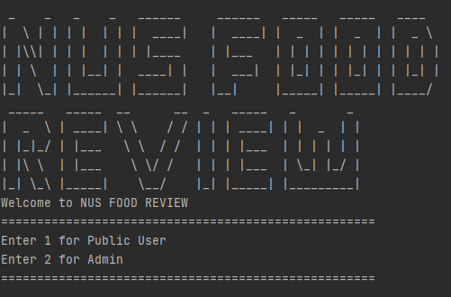
   
2. You can now choose between the mode you would like to enter. Entering a 1 will take you to the Public User mode where you
   won't be able to delete reviews/delete stores/delete canteens. The Admin mode is where you can get ultimate access to
   this application where you can edit and change this application to make it well suited for the target audience.
   
   ### Public User Mode
   
    1.  You can now Select from the list of canteens. For now, it's just The Deck.
        
        
        
    2.  You will now look at all the stores and eateries present within the chosen canteen.
        
        
        
    3. You can now Select the store you would like to go to by inputting its index.
       
       
       
    4. You can now input any command you like by typing out its keyword. You can also input 'help' to get a quick
       glimpse of all the commands and their uses.
       
       
       
    5. You can now continue to explore our application from here by inputting different commands and instructions.
       
    6. If you want to exit the application then just input 'exit' for the application to terminate.
       
       
    
   ### Admin User Mode
   
    1.  You will first be prompted with entering the password. The password has been mentioned on top.
        
        
        
    2. After successful verification, you will now have to enter the index of the task you would like to execute.
       
       
       
    3. You can enter the index of the command you would want to execute or if you made a mistake then you can enter
       'cancel' to go back.

       a.  
       
       
       
       b. 
       
       
       
    4. You can now continue to explore the other features that the admin mode has to offer.
       
    5. If you want to exit the application then just input the index of the 'Exit' which is 10 for the application to
       terminate.
       
       

# Features

### Help function: `help`
This Help command will display all the commands along with a small description explaining what those commands will do.

Usage Format: `help`

* There should be no arguments after `help`

Example of Usage : 

`help`

Expected outcome:

Step 1 :

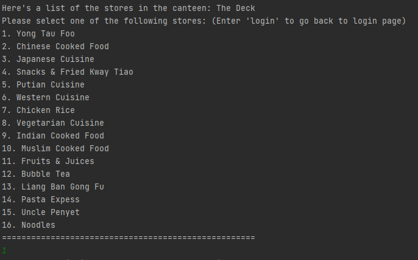

Step 2 : 

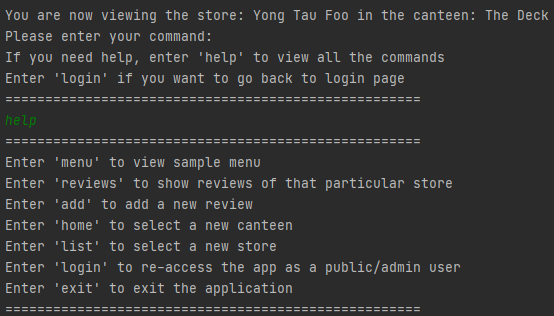

### Viewing the best dishes(menu) of a store: `menu`
This command will make the user view the best dishes of current store that the user is viewing, along with their prices.

Usage Format: `menu`

* There should be no arguments after `menu`

Example of usage: 

`menu`

Expected Outcome:

Step 1 : 

Step 2 :

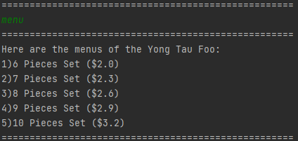

### Reading reviews of a store: `reviews`
This command will display all the reviews of the chosen store in the form of a list

Usage Format: `reviews`

* There should be no arguments after `reviews`

Example of usage: 

`reviews`

Expected Outcome:

Step 1 :

Step 2 :

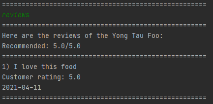

### Adding reviews of a store: `add `
This command will enable the user to add reviews and ratings to the store, the user has currently chosen.

Usage Format: `add`

* There should be no arguments after `add`

Example of usage: 

`add`

Expected Outcome:

Step 1 :

Step 2 :

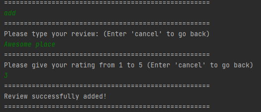

### To Select a New Canteen: `home`
This command allows the User to re-enter which canteen and store they wish to look at. 
This command will take them back to the first page where they get to select the canteens.

Usage Format: `home`

* There should be no arguments after `home`

Example of usage: 

`home`

Expected Outcome:

Step 1 :

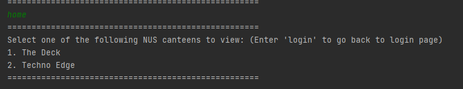

### Select new store to view: `list`
This command will allow the user to re-enter another store they wish to look at in their current canteen.

Usage Format: `list`

* There should be no arguments after `list`

Example of usage: 

`list`

Expected Outcome :

Step 1 :

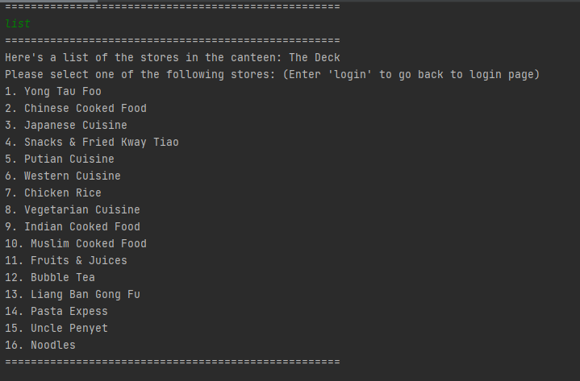

### To exit the application: `exit`
This command will terminate the application, and you will exit the application.

Usage Format: `exit`

* There should be no arguments after `exit`

Example of usage: 

`exit`

Expected Outcome:

Step 1 :

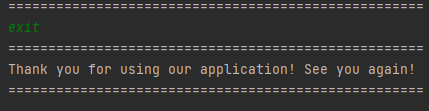

## Admin Functions: `admin`

Password for the admin is "Password".

Admin has the following functions:
1. View canteens
2. Add canteen
3. Add store in canteen
4. Add Menu
5. Delete canteen
6. Delete store in canteen
7. Delete reviews
8. Delete menu
9. View stores in a canteen

0. Exit

### To view the canteens in the application: `View canteens`
This command displays all the canteens in the system. You will have to enter the index of the command you would like to 
execute. In this case it is 1 as view canteens is the first task on the list.

Usage Format: `1`

* There should be no arguments after `1`

Example of usage: 

`1`

Expected Outcome : 

Step 1 :

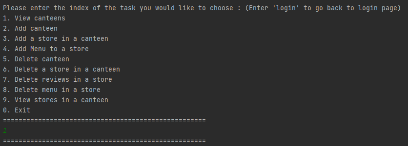

Step 2 :

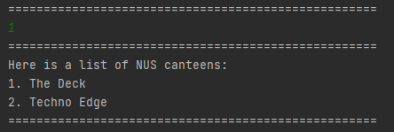

### To add new canteens to the application: `Add canteen`
This command allows the admin to add new canteens to the application. You will have to enter the index of this command 
in order to execute it.

Usage Format : `2`

* There should be no arguments after `2`

Example of usage: 

`2`

Expected Outcome:

Step 1 : 

Step 2 :

### To add new stores to a canteen: `add store`
This command will allow the admin to add new stores to the chosen canteen. You will have to enter the index of this 
command in order to execute it.

Usage Format : `3`

* There should be no arguments after `3`

Example of usage: 

`3`

Expected Outcome:

Step 1 : 

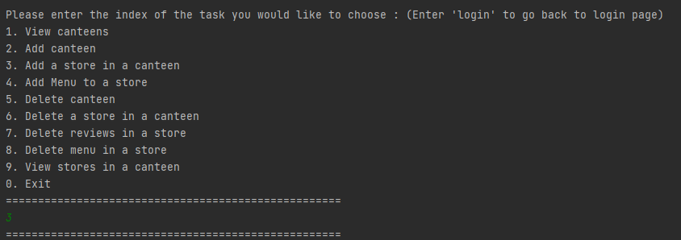

Step 2 :

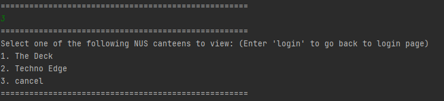

Step 3 : 

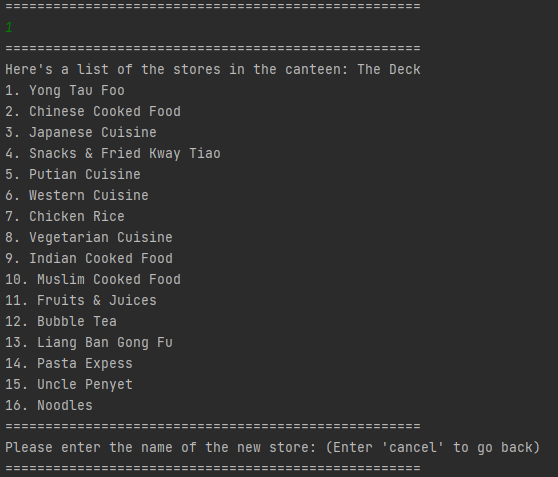

### To add new dishes/ To update the menu of a store: `add menu`
This command will allow the admin to add a new dishes along with their prices under the chosen store. You will have to 
enter the index of this command in order to execute it.

Usage Format : `4`

* There should be no arguments after `4`

Example of Usage : 

`4`

Expected Outcome:

Step 1 :

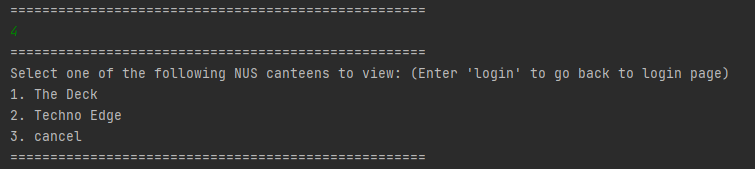

Step 2 :

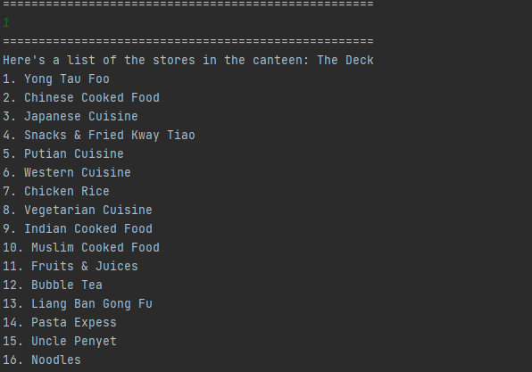

Step 3 :

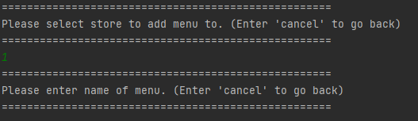

### To Delete a Canteen: `delete canteen`
This command allows the admin to delete an entire canteen itself. You will have to enter the index of this command in 
order to execute it.

Usage Format : `5`

*There should be no arguments after `5`

Example of Usage : 

`5`

Expected Outcome: 

Step 1 :

Step 2 : 

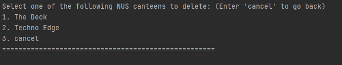

### To delete stores in a canteen: `delete store`
This command allows the admin to delete a specified store, which is chosen by its index in the list, in the chosen 
canteen. In order for you to execute this delete store command, you will have to enter its index.

Usage Format: `6`

*There should be no arguments after `6`

Example Usage : 

`6`

Expected Outcome: 

Step 1:

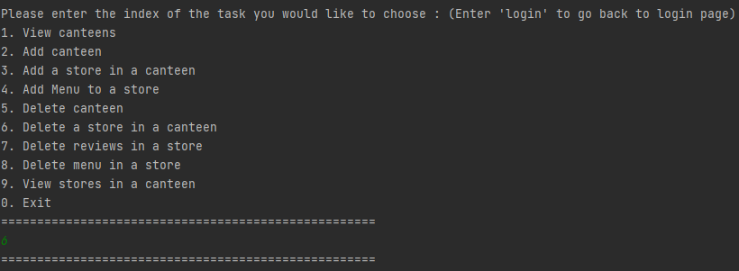

Step 2:

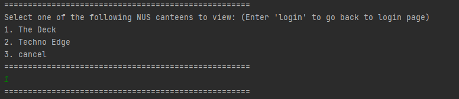

Step 3:

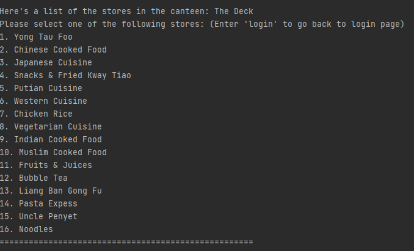

### To Delete a review of a store: `delete review`
This comamnd will let the admin delete reviews of any store. This command has been implemenetd to remove offensive 
reviews. You will have to enter the index of this comand in order to execute it.

Usage Format : `7`

*There should be no arguments after `7`

Example Usage : 

`7`

Expected Outcome:

Step 1 :

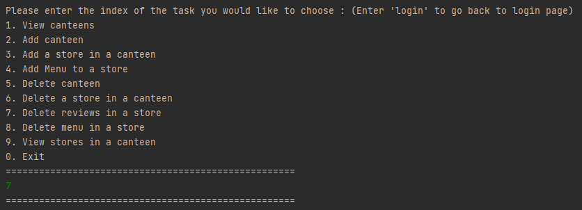

Step 2 :

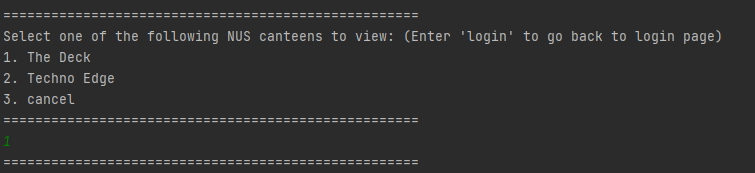

Step 3 : 

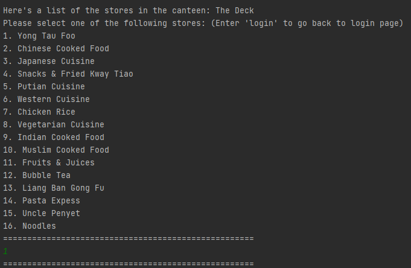

Step 4 :

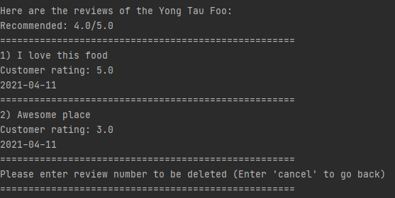

### To Delete the menu of a store : `delete menu`
This command will let the admin to delete the dishes/menu of the chosen store. You will have to enter the index of this 
command in order to execute it.

Usage Format : `8`

*There should be no arguments after `8`

Example Usage : 

`8`

Expected Outcome:

Step 1 :

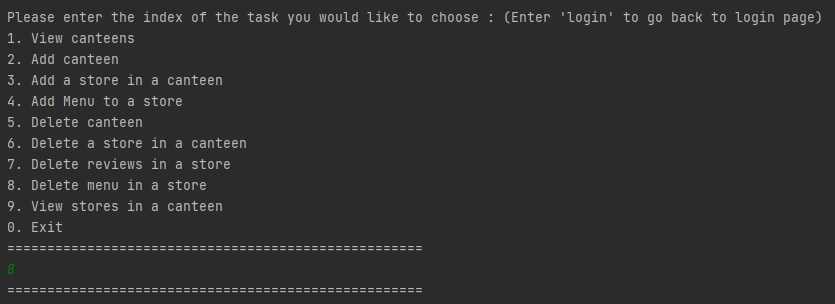

Step 2 :

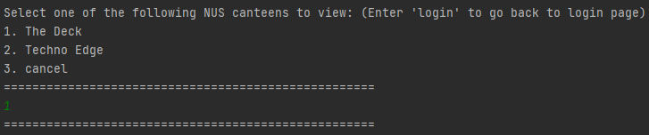

Step 3 :

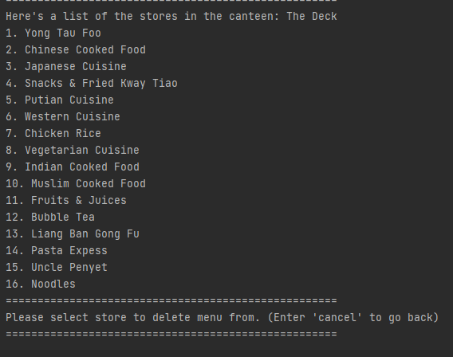

### To view all the stores of a canteen : `View stores in a canteen`
This command will let the admin list all the stores of the specified canteen. You will have to enter the index of this 
command in order to execute it.

Usage Format : `9`

*There should be no arguments after `9`

Example Usage : 

`9`

Expected Outcome :

Step 1 : 

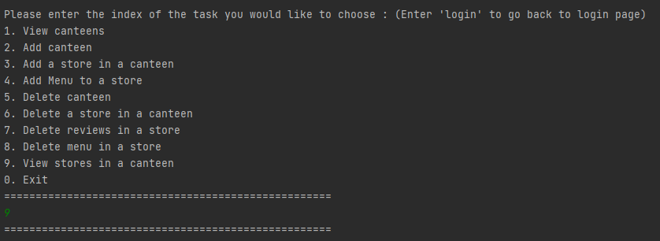

Step 2 :

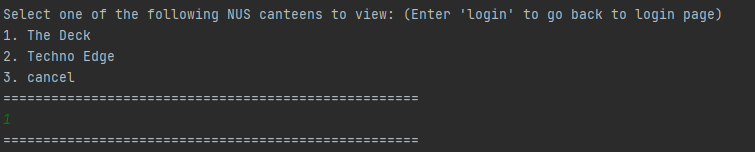

Step 3 :

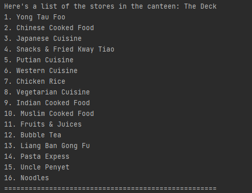

### To Exit the application : `Exit`
This command will let you exit the application by terminating it. You will have to enter the index of this command in 
order to execute it.

Usage Format : `0`

*There should be no arguments after `0`

Example Usage : 

`0`

Expected Outcome :

Step 1 :

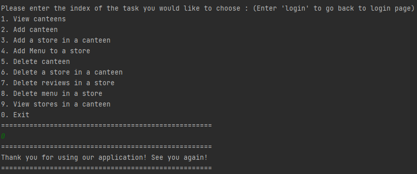

## FAQ

**Q1**: What is the Password for the Admin?

**A1**: Password

**Q2**: Will I have to manually save all the data?

**A2**: No, you don't have to. The data is automatically saved.

**Q3**: Can I access and edit the data file?

**A3**: Yes, You have access to the data file and Yes, you can edit the data file as well. But it is highly recommeded not to do so as the data in the text file is formatted and invalid formats will result in errors.

## Command Summary
### Public User Mode

| Description      | Commands |
| ----------- | ----------- |
| Add Review     | `add`      |
| Read Reviews   | `reviews`       |
| View list of stores in canteen    | `list`      |
| Goes back to main selection   | `home`     |
| Exit from application  | `exit`     |
| View menu of store | `menu`     |
| Lists the descriptions of all the commands | `help`     |

### Admin User Mode

| Description      | Commands |
| ----------- | ----------- |
| view canteens    | `1`      |
|  add canteen | `2`       |
| add store    | `3`      |
| add menu  | `4`     |
| delete canteen  | `5`     |
| delete store | `6`     |
| delete review | `7`     |
| delete menu | `8`     |
| view stores | `9`     |
| Exit application | `0`     |