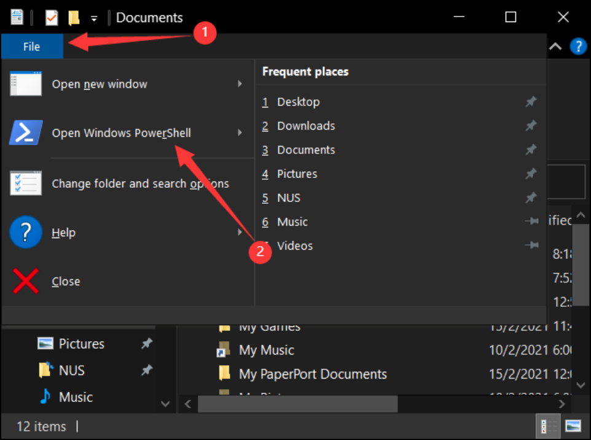

# Patient Manager User Guide

Patient Manager is a _Command Line Interface_ (CLI) application for **_general practitioners_** (GP)
who work in government polyclinics to manage their patient list. This includes a recording/retrieval of
past record of visit, scheduling of the next appointment, and some other features listed below.
With the Patient Manager, GPs will be able to reduce paperwork and have a more efficient way
to organize the records of their patients.

<!-- TODO: Explain How to use this guide -->

---

## Table of Contents

<!-- TODO: Description -->
* [User Guide Information](#user-guide-information)
* [Quick Start](#quick-start)
* [About Command Input](#about-command-input)
  * [Spacing](#spacing)
  * [Order of Arguments](#order-of-arguments)
* [Features](#features)
  * [Print a help message: `help`](#print-a-help-message-help)
  * [Adding a patient: `add`](#adding-a-patient-add)
  * [Deleting a patient or a patient's consultation details: `delete`](#deleting-a-patient-or-a-patients-consultation-details-delete)
  * [Listing all patients: `list`](#listing-all-patients-list)
  * [Loading a patient's medical records: `load`](#loading-a-patients-medical-records-load)
  * [Displaying the current loaded patient: `current`](#displaying-the-current-loaded-patient-current)
  * [Recording a patient's consultation details: `record`](#recording-a-patients-consultation-details-record)
  * [Retrieving a patient's consultation details: `retrieve`](#retrieving-a-patients-consultation-details-retrieve)
  * [Exiting the program: `exit`](#exiting-the-program-exit)
* [Frequently Asked Questions](#frequently-asked-questions)
* [Command Summary](#command-summary)

---
## User Guide Information

This user guide explains how our application works and acts as a guide on how to use our application. It
also explains how inputs are registered and the correct ways of inputting information. Finally, the user guide also
includes a summary of all the commands and instructions on how to use each command.

The user guide includes symbols such as:

❗ The exclamation mark highlights important things to take note of.

---
## Quick Start

1. Ensure that you have Java 11 installed on your local computer. If you do not have the correct version
   of Java installed, `Java 11` can be downloaded from
   [here](https://docs.aws.amazon.com/corretto/latest/corretto-11-ug/downloads-list.html). \
   You can check the version of Java installed on your local computer by entering `java -version` into
   your console of choice.

1. Obtain a copy of the latest version of the Patient Manager (tp.jar) from
   [here](https://github.com/AY2021S2-CS2113T-W09-4/tp/releases) and place it in an empty folder.

1. Open a terminal/command line (cmd)/powershell. A Windows 10 OS' screenshot is here:\
   \
   

1. Execute `java -jar tp.jar` to start Patient Manager.

1. Once the welcome message appears, simply type in a command (e.g. [`help`](#print-a-help-message-help)) and hit 
   `ENTER` at the end.

1. Refer to the [Features section](#features) below for more detailed explanations and usage of the available commands.

---

## About Command Input

<!-- TODO: Too Technical -->
### Spacing

Due to the design of our command parser, we are able to understand your input for any number of spaces between words 
(even before the command itself). So all these commands are actually understandable and will be treated the same:
```
record 01/05/2021 /s coughing, fever
record   01/05/2021  /s       coughing, fever
record 01/05/2021  /s   coughing,       fever
      record 01/05/2021 /s coughing, fever
```

❗ This is important: treating all these four the same means any number of spaces in between words will only be
considered as **ONE**. Take a look at the third input. Despite there are multiple spaces between `coughing,` and 
`fever`, it will go into the database as `coughing, fever` - same as every other lines do.

### Order of Arguments

Words or characters starts with `/` mark the beginning of an argument. 
An argument block continues until the other one is found.
For example, `record 01/05/2021 /s coughing, fever /d flu` has two argument blocks - `/s coughing, fever` and `/d flu`.
The sequence of these two arguments blocks would not affect the result of the command. These two are equivalent:
```
record 01/05/2021 /s coughing, fever /d flu
record 01/05/2021 /d flu /s coughing, fever
```

However, we would still suggest you to input it using the sequence given in the following section. 
This can prevent you from getting confused about the meaning of each argument.

## Features

> ❗ Notes about the command format:
> - Words in `UPPER_CASE` are parameters supplied by the user.\
e.g. in `add IC_NUMBER`, `IC_NUMBER` is a parameter that has to be specified.\
(sample command: `add S1234567D`)
> 
> 
> - Parameters in square brackets are optional.\
e.g. for the `record [DATE] [/s SYMPTOM] [/d DIAGNOSIS] [/p PRESCRIPTION]` command,
both `record 26/03/2021 /s coughing` and `record /s fever /p panadol` are valid commands.
>
>
> - Parameters with `...` allow multiple parameters (including zero) to be specified.\
e.g. for `help [OPTIONAL_COMMAND]...` both `help` and `help add delete` are valid commands.
>
>
> - Parameters can be given in any order.\
e.g. if a command specifies `/s SYMPTOMS /p PRESCTIPTION` as its parameters,
`/p PRESCTIPTION /s SYMPTOMS` is also acceptable.
>
>
> - If a parameter is expected only once in the command, but you specify it multiple times, only the last occurrence of
the parameter will be taken.\
e.g. if you specify `/s coughing /s fever`, only `/s fever` will be taken.
>
>
> - Extraneous parameters for commands that do not take in parameters (such as `list` and `exit`) will be ignored.\
e.g. if the command given is `list 123`, it will be interpreted as `list`.
>
>
> - Dates must be specified in the format `dd/MM/yyyy`, for example, `05/03/2021`. All dates given must be valid,
according to the rules of the [Gregorian Calendar](https://en.wikipedia.org/wiki/Gregorian_calendar).

<!-- TODO: Order | explain why help command is the 1st -->
### Print a help message: `help`

If you need help at any point in time, you may use the `help` command. \
This prints out the help message with a brief explanation of the available commands. If one or more
commands are provided as arguments, the info messages for the indicated commands will be printed.

Usage: `help [OPTIONAL_COMMAND]...`

Example of usage:

```
help list load exit
```

Expected output:

```
----------------------------------------------------------------------
Show the list of all patients
Usage: list

Select a specified patient to add and retrieve records
Command prefix: load
Arguments(s): IC number
Usage: load IC_NUMBER
Example: load S1234567D

Exit the program
Usage: exit
----------------------------------------------------------------------
```

### Adding a patient: `add`

Adds a patient to the list by entering their IC number so that consultation details for the patient can be recorded.
<!-- So that ..., This means that ... -->

Usage: `add IC_NUMBER`

Example of usage:

```
add S1234567D
```

Expected output:

```
----------------------------------------------------------------------
Patient S1234567D has been added!
----------------------------------------------------------------------
```

### Deleting a patient or a patient's consultation details: `delete`

Deletes a patient from the list or deletes a patient's consultation details for a specific date.
The command to delete a record requires that a patient has been loaded with the
[`load`](#loading-a-patients-medical-records-load) command.
If no patient has been loaded, Patient Manager will print an error message.

Usage: `delete [/p IC_NUMBER]`

Example of usage:

```
delete /p S1234567D
```

Usage: `delete [/r DATE]`

Example of usage:
```
delete /r 26/03/2021
```

### Listing all patients: `list`

Shows a list of all patients.

Usage: `list`

Example output:

```
----------------------------------------------------------------------
List of patients (in alphanumeric order):
1. S1234567D
2. S7654321B
----------------------------------------------------------------------
```

### Loading a patient's medical records: `load`

Finds the patient whose IC number matches the given search query and loads their medical records.
If none of the patients' IC numbers match the search query, it will print an error message.

Usage: `load IC_NUMBER`

Example of usage:

```
load S1234567D
```

Expected output:

```
----------------------------------------------------------------------
Patient S1234567D's data has been found and loaded.
----------------------------------------------------------------------
```

### Displaying the current loaded patient: `current`

Displays the patient that has been loaded through the [`load`](#loading-a-patients-medical-records-load) command.
If no patient has been loaded, it will inform the user that there is no loaded patient.

Usage: `current`

Example output:

```
----------------------------------------------------------------------
The currently loaded patient's ID is S1234567D.
----------------------------------------------------------------------
```

### Recording a patient's consultation details: `record`

Adds a patient's consultation details to the patient's records.
This command requires that a patient has been loaded with the
[`load`](#loading-a-patients-medical-records-load) command.
If no patient has been loaded, Patient Manager will print an error message.

An optional `DATE` argument may be provided to modify previous visit records,
or to create a new record with the specified date. If the `DATE` parameter is
not specified, Patient Manager will execute the command with the current system date.

Usage: `record [DATE] [/s SYMPTOM] [/d DIAGNOSIS] [/p PRESCRIPTION]`

Example of usage:

```
record 26/03/2021 /s fever and slight cough
```

Expected output:

```
----------------------------------------------------------------------
Added new record to patient S1234567D:
Symptom: fever and slight cough
----------------------------------------------------------------------
```

### Retrieving a patient's consultation details: `retrieve`

Retrieves all consultation details of a patient.
This command requires that a patient has been loaded with the
[`load`](#loading-a-patients-medical-records-load) command.
If no patient has been loaded, Patient Manager will print an
error message.

Usage: `retrieve`

Example output:

```
----------------------------------------------------------------------
Here are S1234567D's records:
30/03/2021:
Symptoms:
	head pain, dizziness
Diagnoses:
	heat stroke
Prescriptions:
	cooling packs, medicine

31/03/2021:
Symptoms:
	fainting
Diagnoses:
	severe heat stroke
Prescriptions:
	referral to hospital

----------------------------------------------------------------------
```

### Exiting the program: `exit`

Exits the program

Usage: `exit`

---

## Frequently Asked Questions

**Q**: Can I transfer the data to a different device? \
**A**: Yes, simply copy the `pm` folder that is found in the same folder as `tp.jar` from the original device
and place it in the folder `tp.jar` is found in on the new device.

**Q**: Will I have to manually save? \
**A**: No, the data is saved automatically after every command that modifies the data.

**Q**: Can I edit the data file? \
**A**: Patient Manager data is saved as a text file. While it is possible to edit the data file, it is not
recommended to do so as invalid formats in the data file will result in errors.

---

## Command Summary

Listed below are all currently implemented commands in alphabetical order.\
Click on the commands to navigate to specific feature details.

| Command                                                                 | Usage                              |
|-------------------------------------------------------------------------|------------------------------------|
| [add](#adding-a-patient-add)                                            | `add IC_NUMBER`                    |
| [current](#displaying-the-current-loaded-patient-current)               | `current`                          |
| [delete](#deleting-a-patient-or-a-patients-consultation-details-delete) | `delete [/p IC_NUMBER]  [/r DATE]` |
| [exit](#exiting-the-program-exit)                                       | `exit`                             |
| [help](#print-a-help-message-help)                                      | `help [OPTIONAL_ARGUMENTS]...`     |
| [list](#listing-all-patients-list)                                      | `list`                             |
| [load](#loading-a-patients-medical-records-load)                        | `load IC_NUMBER`                   |
| [record](#recording-a-patients-consultation-details-record)             | `record [DATE] [/s SYMPTOM] [/d DIAGNOSIS] [/p PRESCRIPTION]`|
| [retrieve](#retrieving-a-patients-consultation-details-retrieve)        | `retrieve`                         |