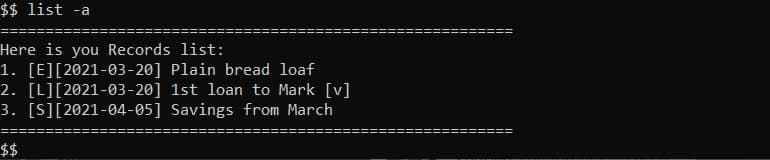
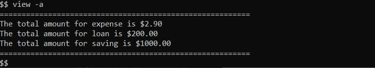

# Finux User Guide
By: `Jonah Tham`, `Gerard Tan`, `Lee Han Yong Andy`, `Mark Low`, `Tan Tze Xern`

Since: `March 2021`

---

# Table of Contents

---

1. [Introduction](#1-introduction)
1. [Quick Start](#2-quick-start)\
   2.1 [Understanding the guide](#21-understanding-the-guide)\
   2.2 [Explanation for Command formats](#22-explanation-for-command-formats)\
   2.3 [Explanation for Date and Date formats](#23-explanation-for-date-and-date-formats)\
   2.4 [Explanation for Expense, Loan, and Saving output formats](#24-explanation-for-expense-loan-and-saving-record-output-formats)
1. [Features](#3-features)\
   3.1 [Add a record: `add`](#31-add-a-record-add)\
   &nbsp;&nbsp;&nbsp;&nbsp;&nbsp;3.1.1 [Add an expense record](#311-add-an-expense-record)\
   &nbsp;&nbsp;&nbsp;&nbsp;&nbsp;3.1.2 [Add an loan record](#312-add-a-loan-record)\
   &nbsp;&nbsp;&nbsp;&nbsp;&nbsp;3.1.3 [Add an saving record](#313-add-a-saving-record)\
   3.2 [List the records details: `list`](#32-list-the-records-details-list)\
   &nbsp;&nbsp;&nbsp;&nbsp;&nbsp;3.2.1 [List all expense records](#321-list-all-expense-records)\
   &nbsp;&nbsp;&nbsp;&nbsp;&nbsp;3.2.2 [List all loan records](#322-list-all-loan-records)\
   &nbsp;&nbsp;&nbsp;&nbsp;&nbsp;3.2.3 [List all saving records](#323-list-all-saving-records)\
   &nbsp;&nbsp;&nbsp;&nbsp;&nbsp;3.2.4 [List all records](#324-list-all-records)\
   3.3 [View category total amount: `view`](#33-view-category-total-amount-view)\
   &nbsp;&nbsp;&nbsp;&nbsp;&nbsp;3.3.1 [View total expenses](#331-view-total-expenses)\
   &nbsp;&nbsp;&nbsp;&nbsp;&nbsp;3.3.2 [View total unreturned loans](#332-view-total-unreturned-loans)\
   &nbsp;&nbsp;&nbsp;&nbsp;&nbsp;3.3.3 [View total savings](#333-view-total-savings)\
   &nbsp;&nbsp;&nbsp;&nbsp;&nbsp;3.3.4 [View total amount in every category](#334-view-total-amount-in-every-category)\
   3.4 [Mark a loan as return: `return`](#34-mark-a-loan-as-returned-return)\
   3.5 [Remove a record: `remove`](#35-remove-a-record-remove)\
   3.6 [Check a person credit score: `creditscore`](#36-check-a-persons-credit-score-creditscore)\
   3.7 [Exit the program: `exit`](#37-exit-the-program-exit)\
   3.8 [Help function: `help`](#38-help-function-help)\
   3.9 [Records Storage](#39-records-storage)\
   &nbsp;&nbsp;&nbsp;&nbsp;&nbsp;3.9.1 [Saving Data](#391-saving-data)\
   &nbsp;&nbsp;&nbsp;&nbsp;&nbsp;3.9.2 [Loading Data](#392-loading-data)
1. [Frequently Asked Questions](#4-frequently-asked-questions)
1. [Command Summary](#5-command-summary)

## 1. Introduction

---

Finux is a Command-Line Interface (CLI) application that allows you to record your expenses, savings and loans all in
one consolidated platform. With these information made readily available at your fingertips, it will allow you to 
better adjust your expenditure or work harder towards your savings goal. Finux also includes a way for you to keep
track of the loans you have made to your friends, or the tabs for the dinners you have paid for first. 

As the Finux application is inspired entirely by the *Nix operating systems, and if you are familiar with the CLI
command interface, you will definitely enjoy the benefits of the application. You will also be able to speed up your
financial management and planning with the Finux application as compared to the traditional finance management 
applications in the market.

## 2. Quick Start

---

1. Ensure you have Java `11` or above installed in your Computer.
2. Download the latest `finux.jar` from [here](https://github.com/AY2021S2-CS2113T-W09-1/tp/releases/tag/v2.0).
3. Copy the `finux.jar` file to the folder you want to use as the *home folder* of Finux.
4. For Windows users, pull up your **Command Prompt**.\
   For Mac users, pull up your **Terminal**.\
   Navigate to the directory containing the `finux.jar` file.\
   i.e. `cd FILEPATH`, `FILEPATH` is the absolute address to the home folder of Finux.
5. Run the `finux.jar` file by executing the command `java -jar finux.jar`.

---

### 2.1 Understanding the guide
Now that you are here, congratulations on taking the first step to embark on your finance management journey! But before you proceed, there are a few tips and tricks that you should know in order to better understand our guide.

Throughout the guide, you will come across various symbols, each has a different meaning:

> 💡: The light bulb will precede information that may be important when using the app.

> ❗: The exclamation will precede warnings for commands and inputs that may hinder your use of the app.

> 📝: The notepad will precede information that may improve the flexibility of using the app. 

---

### 2.2 Explanation for Command formats

Commands in Finux follow these argument orders (depending on the command):
> * `CMD -OPT <FIELD> [-OPT <FIELD>...]`
> * `CMD -OPT`
> * `CMD { -OPT_1 ... | -OPT_2 ... | ... } ...`
> * `CMD <FIELD>`
> * `CMD [<FIELD>]`
> * `CMD`

Argument types and notation:
> * `CMD` - a valid command.
> * `-OPT` - an option, a letter preceded by a dash. E.g. "-i".
> * `<FIELD>` - an area where data is required.
> * `[...]` - optional argument(s).
> * `{ ... | ... | ... }` - mutually exclusive arguments, e.g. `{ -e | -l | -s }` means that `view -e -s` has a conflict with options `-e` and `-s`.

---

❗ **Commands and options are case-sensitive**
> * E.g. `exit` will work, whereas `Exit`, `EXIT` or other variations will not be recognised.
> * E.g. `view -s` will work, but using `-S` will not be recognised as a valid option.

❗ **All options are single letter and followed by 1 space at the front and back**
> * E.g. `_-a_` would be a valid option format after replacing `_` with space at the front and back.  
> * E.g. `add -e Plain bread loaf -a 10` will work, whereas `add -e Plain bread loaf -a10` will not be
    recognized as valid option due to missing space in between ` -a` and `10`.

---

### 2.3 Explanation for Date and Date formats

Date input is required when you specify the option `-d`.
You are required to enter a date that follows a valid Date format.
Finux supports multiple Date formats, for ease of use:
> * `DDMMYYYY`
> * `D.M.YYYY`
> * `D-M-YYYY`
> * `D/M/YYYY`
> * `YYYY.M.D`
> * `YYYY-M-D`
> * `YYYY/M/D`
>
> 📝 `today` keyword specifies today's date, replacing the need for you to type in the actual date for date inputs.

---

### 2.4 Explanation for Expense, Loan, and Saving record output formats

In general, the output format used by Finux in displaying an expense, loan and saving record is as follows:

`[<record_type_symbol>][<issue_date>] <description> [<return_status>]`

> * record_type_symbol
>    * A one character symbol denoting the type of the record. 
>    * 'E' for expense record, 'L' for loan record and 'S' for saving record.
> * issue_date
>    * Date of the record.
> * description
>    * Description of the record.
> * return_status
>    * This field is only applicable to loan records.
>    * A one character symbol denoting the return status of the loan record.
>    * 'v' for returned loan record and ' ' for unreturned loan record.

For example, let's say you bought a plain loaf of bread on 3rd March 2021. The output format of this *expense* record 
will be:

`[E][2021-03-20] Plain bread loaf`

Another example is suppose you made a loan to Mark on 20th March 2021. The output format of this *unreturned loan* 
record will be:

`[L][2021-03-20] 1st loan to Mark [ ]`

After Mark returns this loan to you, the output format of this *returned loan* record will be:

`[L][2021-03-20] 1st loan to Mark [v]`

For the `add` and `list` commands, each displayed record will be preceded with a number, referred to as the *index* of
the record with respect to the combined list of expense, loan, and saving records. Let's say you have added the records
shown above to Finux one after another, then doing a `list -l` operation will display the above loan record to you as
follows:

`2. [L][2021-03-20] 1st loan to Mark [v]`

This means that the loan you have made to Mark on 20th March 2021 has been returned and this loan is the second record 
added to Finux.

## 3. Features

---

### 3.1 Add a record: `add`

---

> 📝 For the `add` command, there is no strict ordering for options.\
> i.e. options `-a` can come before/after option `-d`.

#### 3.1.1 Add an expense record

Suppose you bought a plain loaf of bread for $2.90 on 3rd March 2021, you would want to enter
your `expense` as the example shown below.

Format: `add -e <description> -a <amount> -d <date>`

Example: `add -e Plain bread loaf -a 2.90 -d 20.3.2021`

Output:

#### 3.1.2 Add a loan record

It is the 20th of March 2021, and your friend Mark borrows a large sum of $200 from you . You will
have to enter the following into Finux to record this `loan`.

You may want to add a _description_ of the `loan`, in this scenario, it will be `1st loan to Mark`
and to include his _name_ as to keep track of Mark's `loan`.

Format: `add -l <description> -a <amount> -d <date> -p <person>`

Example: `add -l 1st loan to Mark -a 200 -d 20.3.2021 -p Mark`

Output:

#### 3.1.3 Add a saving record

Lastly, you may have saved a sum of money over the past month of March and you recorded your `saving`
on the 5th of April.

Format: `add -s <description> -a <amount> -d <date>`

Example: `add -s Savings from March -a 1000 -d 05/04/2021`

Output:

> 💡 Do note that for an `expense`, you will have to use `-e` as the option. This follows for `loan` with `-l` and
> `saving` with `-s`.

### 3.2 List the records details: `list`

---

#### 3.2.1 List all expense records

You may want to list all your saved expense records in Finux. By entering the `list` command
along with the `expense` option `-e`, Finux will display all your saved expenses.

Format: `list -e`

Output:

#### 3.2.2 List all loan records

Likewise with listing your saved expenses, Finux is also able to list all saved loans. You will have
to use the `loan` option `-l` in this scenario.

Format: `list -l`

Output:

#### 3.2.3 List all saving records

Furthermore, all your saved savings can also be listed with the `saving` option `-s`. 

Format: `list -s`

Output:

#### 3.2.4 List all records

Lastly, you can list all of your records with the `all` option `-a`.

Format: `list -a`

Output:

### 3.3 View category total amount: `view`

---

#### 3.3.1 View total expenses

At this point, you may also want to `view` your total expenses incurred till now. 
So instead of listing as explained above, you would have to use the `view` command instead.

Format: `view -e`

Output:

#### 3.3.2 View total unreturned loans

You can also view your total **unreturned** loan using `view` and the option `-l`.

> 📝 The total amount shown only includes the unreturned loans

Format: `view -l`

Output:

#### 3.3.3 View total savings

Your total savings can also be calculated using `view` and the option `-s`.

Format: `view -s`

Output:

#### 3.3.4 View total amount in every category

To see the amount of each category (`expense`, `loan` and `saving`) in a summarized format,
you can use `view` and the option `-a`.

Format: `view -a`

Output:

### 3.4 Mark a loan as returned: `return`

---

Let's say Mark returns the loan he borrowed on 20th March 2021, and his `loan` record is the second record in the 
combined list of expense, loan and saving records.
Then to mark this loan as *returned*, the `index_of_loan` to be included in this case is `2` and the `return_date` is 
the date of return which is `28/03/21`.

Format: `return -i <index_of_loan> -d <return_date>`
* `<index_of_loan>` refers to the index number shown on the [displayed list of loans](#322-list-all-loan-records).
* `<return_date>` refers to the date on which the borrower has returned the loan.

Example: `return -i 2 -d 28/03/2021`\
This example shows that you have entered a command that translates to the following:\
"The second entry(presumably a loan) on the record list is returned on 28/03/2021."

Output:

### 3.5 Remove a record: `remove`

---

In a scenario that you realised that the `expense` record of Plain bread loaf added on 20th March 2021 was wrong,
you can `remove` the record by entering the `remove` command with the _index_ of the `expense`, this is case, it would
be the first record in the list.

Format: `remove -i <index>`
* `<index>` refers to the index number shown on the record list.
* `<index>` must be a **positive integer** 1,2,3...
* `<index>` must be referring to an existing record.

Example: `remove -i 1`\
This example shows that you have entered a command that translates to the following:\
"Remove the first record on the list."

Output:

> 💡 To find the index of a record, you can simply `list` the record type (`-e`, `-l`, `-s`) and the number that
> precedes the record is the index.

### 3.6 Check a person's credit score: `creditscore`

---

Let's say that Mark wants to borrow money from you again, but you will want to know his "credit-worthiness" 
(`creditScore`) before lending him money again, you can simply enter his _name_ after the `creditScore` command.

Format: `creditscore <person>`

> - `<person>` refers to existing borrower in the loan list
> - `<person>` is case-insensitive, e.g. `jason` is the same as `Jason`

Format: `creditscore <person>`

* `<person>` refers to any person including those in the list and not in the list.
* `<person>` is case-insensitive, e.g. `jason` is the same as `Jason`

Example: `creditscore mark`\
This example shows that you have entered a command that translates to the following:\
"Show Mark's credit score."

Output:

### 3.7 Exit the program: `exit`

---

You can exit the application by typing the `exit` command.

Format: `exit`

Output:

### 3.8 Help function: `help`

---

If you do not know how to use any of the features in Finux, and would like to know their specifications, simply type
`help` followed by the command name of the available features listed below:

* `add`: view the help section for `add` command.
* `list`: view the help section for `list` command.
* `view`: view the help section for `view` command.
* `return`: view the help section for `return` command.
* `remove`: view the help section for `remove` command.
* `creditscore`: view the help section for `creditscore` command.
* `exit`: view the help section for `exit` command.
* `all`: view entire help section.

💡 Just typing `help` will allow you to view the entire help section.
 
Each help section is divided into three parts:
* `NAME` will show you the feature name and its brief description.
* `SYNOPSIS` will show you the format to follow.  
* `DESCRIPTION` will explain the usage of any arguments or options.
* 📝 The `exit` section will only show the `NAME` and `SYNOPSIS` as no argument is needed.

Format: `help <FEATURE>`

Example: `help remove`

Output:

### 3.9 Records storage

---

#### 3.9.1 Saving Data

* All your records are automatically saved into `finux.txt` after the following commands: `add`, `remove`, `return`.
* Records will **NOT** be saved after the following commands: `help`, `list`, `view`, `creditscore`, `exit`.

> ❗ Do ensure that permissions are given for Finux to write into the folder it is in,
> Finux will exit upon unsuccessful file creation.

#### 3.9.2 Loading Data

* Finux will automatically load your data from `finux.txt` when it finds the text
  file in the same home folder as mentioned in the [Quick Start](#2-quick-start).   

* Expected output for new file creation:  

  

* Expected output if successful load:  
  

* Expected output if not successfully loaded:  
  
  
> ❗ Do **NOT** modify the contents of the `finux.txt` save file.

## 4. Frequently Asked Questions

---

**Q1**: How can I transfer my saved tasks information to another computer?
> Run Finux on the other computer and overwrite the empty `finux.txt` created, with the `finux.txt` that
> contains the data of your previous Finux usage.

**Q2**: Does the `view -l` shows the total loan amount?  
> No. `view -l` only shows the total amount of unreturned loans.

**Q3**: What happens if Finux crashes unexpectedly?  
> All records are saved upon addition, deletion, or returned. Hence chances of data losses are minimized.

**Q4**: Finux keeps having a `bad init` error message, but it is my first time launching Finux.  
> Do check and ensure that Finux has the proper write permissions in the directory.

## 5. Command Summary

---

| Feature                                | Command                                                  | Example                                              |
| -------------------------------------- | -------------------------------------------------------- |------------------------------------------------------|
| Add an expense record                  | `add -e <description> -a <amount> -d <date>`             | `add -e Plain bread loaf -a 2.90 -d 20.3.2021`       |
| Add a loan record                      | `add -l <description> -a <amount> -d <date> -p <person>` | `add -l 1st loan to Mark -a 200 -d 20.3.2021 -p Mark`|
| Add a saving record                    | `add -s <description> -a <amount> -d <date>`             | `add -s Savings from March -a 1000 -d 05/04/2021`    |
| List all expense records               | `list -e`                                                | -                                                    |
| List all loan records                  | `list -l`                                                | -                                                    |
| List all saving records                | `list -s`                                                | -                                                    |
| List all records                       | `list -a`                                                | -                                                    |
| View total expense                     | `view -e`                                                | -                                                    |
| View total unreturned loans            | `view -l`                                                | -                                                    |
| View total savings                     | `view -s`                                                | -                                                    |
| Mark a loan as returned                | `return -i <index_of_loan> -d <return_date>`             | `return -i 2 -d 28/03/2021`                          |
| Remove a record (expense/savings/loan) | `remove -i <index>`                                      | `remove -i 1`                                        |
| Check a person's credit score          | `creditscore <person>`                                   | `creditscore mark`                                   |
| Exit the application                   | `exit`                                                   | -                                                    |
| Help (selected command)                | `help <feature>`                                         | `help remove`                                        |
| Help (all commands)                    | `help`                                                   | -                                                    |

