# Finux User Guide
By: `Jonah Tham`, `Gerard Tan`, `Lee Han Yong Andy`, `Mark Low`, `Tan Tze Xern`

Since: `March 2021`

- [Finux User Guide](#finux-user-guide)
    * [1. Introduction](#1-introduction)
    * [2. Quick Start](#2-quick-start)
    * [3. Features](#3-features)
        + [3.1 Add a record: `add`](#31-add-a-record-add)
        + [3.2 List the records details: `list`](#32-list-the-records-details-list)
        + [3.3 View category total amount: `view`](#33-view-category-total-amount-view)
        + [3.4 Set a loan as return: `return`](#34-mark-a-loan-as-returned-return)
        + [3.5 Remove a record: `remove`](#35-remove-a-record-remove)
        + [3.6 Check a person credit score: `creditscore`](#36-check-a-persons-credit-score-creditscore)
        + [3.7 Exit the program: `exit`](#37-exit-the-program-exit)
        + [3.8 Help function: `help`](#38-help-function-help)
        + [3.9 Records Storage](#39-records-storage)
    * [4. Frequently Asked Question (FAQ)](#4-faq)
    * [5. Command Summary](#5-command-summary)


## 1. Introduction

Finux is a CLI Style application that allows the user to make better financial
decisions based on the information recorded in the application. If you are familiar
with the CLI command interface, you will enjoy the benefits of speeding up your
financial management with Finux rather than using the traditional management system.


## 2. Quick Start

1. Ensure you have Java `11` or above installed in your Computer.
2. Download the latest `finux.jar` from [here](https://github.com/AY2021S2-CS2113T-W09-1/tp/releases/tag/v1.0).
3. Copy the file to the folder you want to use as the *home folder* of Finux.
4. For Windows users, pull up your **Command Prompt**.\
   For Mac users, pull up your **Terminal**.\
   Navigate to the directory containing the `finux.jar` file.\
   i.e. `cd FILEPATH`, `FILEPATH` is the absolute address to the home folder of Finux.
5. Run the `finux.jar` file by executing the command `java -jar finux.jar`.


## 3. Features
> ❗ **CAUTION:** Insert any warning.

> 💡 **Explanation for Command formats:**
>> Commands in Finux follow these argument orders (depending on the command):
>> * `CMD -OPT <FIELD> [-OPT <FIELD>...]`
>> * `CMD -OPT`
>> * `CMD { -OPT_1 ... | -OPT_2 ... | ... } ...`
>> * `CMD <FIELD>`
>> * `CMD [<FIELD>]`
>> * `CMD`
>>
>> Argument types and notation:\
>> `CMD` - a valid command.\
>> `-OPT` - an option, a letter preceded by a dash. E.g. "-i".\
>> `<FIELD>` - an area where data is required.\
>> `[...]` - optional argument(s).\
>> `{ ... | ... | ... }` - mutually exclusive arguments.
>>
> ❗ **Commands and options are case-sensitive:**\
> E.g. `exit` will work, whereas `Exit`, `EXIT` or other variations
> will not be recognised.\
> E.g. `view -s` will work, but using `-S` will not be recognised as
> a valid option.

> 💡 **Date and Date formats:**
>> Finux supports multiple Date formats, for ease of use:
>> * `DDMMYYYY`
>> * `D.M.YYYY`
>> * `D-M-YYYY`
>> * `D/M/YYYY`
>> * `YYYY.M.D`
>> * `YYYY-M-D`
>> * `YYYY/M/D`
>>
>> 📝 `today` keyword specifies today's date, replacing the need to type in the actual date for date inputs.

### 3.1 Add a record: `add`
> For the `add` command, there is no strict ordering for options.\
> i.e. options `-a` can come before/after option `-d`.
#### 3.1.1 Add an expense record

This operation will add an expense record to the list.

Format: `add -e <description> -a <amount> -d <date>`

Examples: `add -e Plain bread loaf -a 2.90 -d 20.3.2021`

Output:

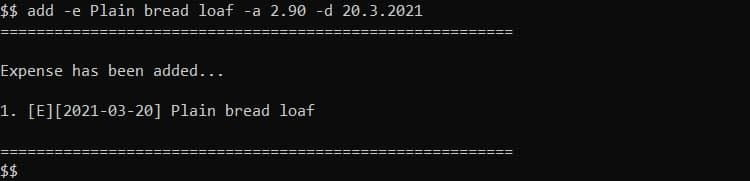

#### 3.1.2 Add a loan record

This operation will add a loan record to the list.

Format: `add -l <description> -a <amount> -d <date> -p <person>`

Examples: `add -l 1st loan to Mark -a 200 -d 20.3.2021 -p Mark`

Output:

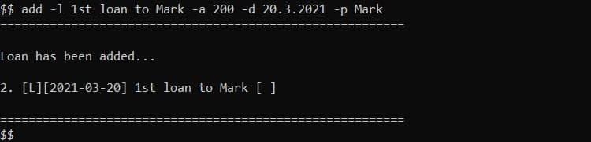

#### 3.1.3 Add a saving record

This operation will add a saving record to the list.

Format: `add -s <description> -a <amount> -d <date>`

Examples: `add -s Savings from March -a 1000 -d 05/04/2021`

Output:

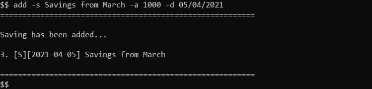

### 3.2 List the records details: `list`

#### 3.2.1 List all expense records

This operation will list all expense records in the list.

Format: `list -e`

Output:

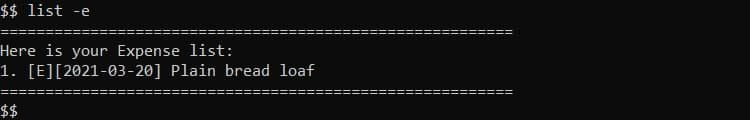

#### 3.2.2 List all loan records

This operation will list all loan records in the list.

Format: `list -l`

Output:

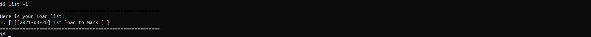

#### 3.2.3 List all saving records

This operation will list all saving records in the list.

Format: `list -s`

Output:

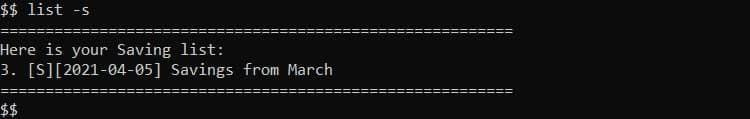

### 3.3 View category total amount: `view`

This operation will view the total amount of chosen record type.

Format: `view <OPTION>`

> Available Options:
>* `-e`: view the total amount of expenditure.
>* `-l`: view the total amount of unreturned loans.
>* `-s`: view the total amount of saving.

Examples: `view -e`, `view -l`

Output:

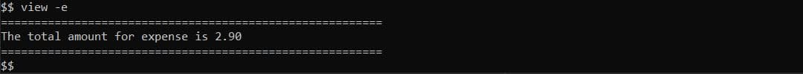

### 3.4 Mark a loan as returned: `return`

This operation will mark a loan record as returned by the loanee.

Format: `return -i <index_of_loan> -d <date>`

Examples: `return -i 3 -d 28/03/2021`

Output:

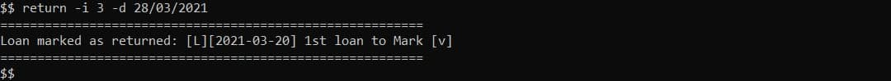

### 3.5 Remove a record: `remove`

This operation will remove a record from the record list.

Format: `remove -i <index>`
> - The `<index>` refers to the index number shown on the record list
> - `<index>` must be a **positive integer** 1,2,3...
> - `<index>` must be referring to an existing record

Examples: `remove -i 1`, `remove -i 2`

Output:

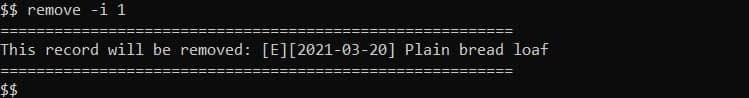

### 3.6 Check a person's credit score: `creditscore`

This operation will check the credit score of a person.

Format: `creditscore <person>`

> - `<person>` refers to existing loanees in the loan list
> - `<person>` is case-insensitive, e.g. `jason` is the same as `Jason`

Examples: `creditscore jason`, `creditscore mark`

Output:

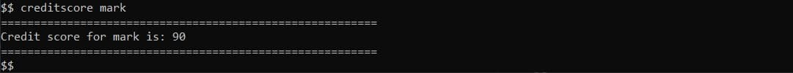

### 3.7 Exit the program: `exit`

This operation exit the program.

Format: `exit`

### 3.8 Help function: `help`

This operation lists the help page for the application.

Format: `help <FEATURE>`

> Available Features:
>* `add`: view the help page for `add` command.
>* `list`: view the help page for `list` command.
>* `view`: view the help page for `view` command.
>* `return`: view the help page for `return` command.
>* `remove`: view the help page for `remove` command.
>* `creditscore`: view the help page for `creditscore` command.
>* `exit`: view the help page for `exit` command.
>* `all`: view entire help page.
>* 💡 **Tip**: Just type `help` and you can view the entire help page.

Examples: `help exit`, `help list`

Output:

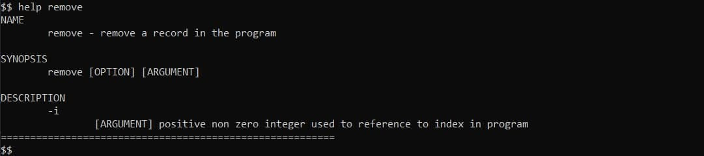

### 3.9 Records storage

#### 3.9.1 Automatically saving all records into a file.

* All records are automatically saved after the following commands: `add`, `remove`, `return`.
* Records will **NOT** be saved after the following commands: `help`, `list`, `view`, `creditscore`.

> ❗ **WARNING:** Do ensure that permissions are given for FINUX to write into the folder it is in,
> FINUX will exit upon unsuccessful file creation.

#### 3.9.2 Automatically loading data from an existing file into FINUX.

* FINUX will automatically load the data from "finux.txt" when it finds the text
  file in the same directory. <br><br>

* Expected output for new file creation:
  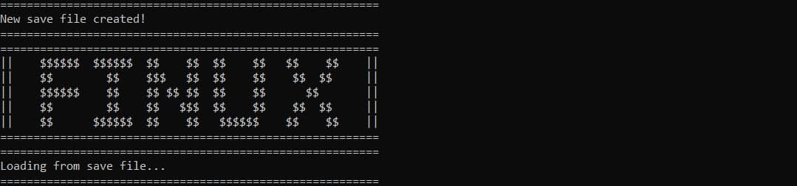

* Expected output if successful load:
  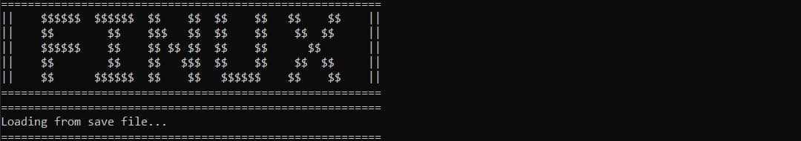

* Expected output if not successfully loaded:
  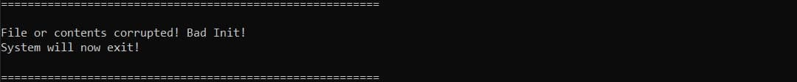

#### 3.9.3 Editing the saved file directly
* The FINUX team encourages more tech-proficient users to edit the save directly.

> 💡 **NOTE:** Any minor mistakes in the syntax will lead to the termination of FINUX.
> The team highly suggests that users only make minor changes like
> spelling errors instead of inserting new Records into the save file.

## 4. FAQ

**Q1**: How can I transfer my saved tasks information to another computer?
> Run Finux on the other computer and overwrite the empty `finux.txt` created, with the `finux.txt` that
> contains the data of your previous Finux usage.

**Q2**: Does the `view -l` shows the total loan amount? <br>
> No. `view -l` only shows the total amount of unreturned loans.

**Q3**: What happens if FINUX crashes unexpectedly? <br>
> All records are saved upon addition, deletion or returned, so no worries!

**Q4**: FINUX keeps having a `bad init` error message, but it is my first time launching FINUX. <br>
> Do check and ensure that FINUX has the proper write permissions in the directory.

## 5. Command Summary

| Feature                                | Command                                                  | Example                                              |
| -------------------------------------- | -------------------------------------------------------- |------------------------------------------------------|
| Add an expense record                  | `add -e <description> -a <amount> -d <date>`             | `add -e Plain bread loaf -a 2.90 -d 20.3.2021`       |
| Add a loan record                      | `add -l <description> -a <amount> -d <date> -p <person>` | `add -l 1st loan to Mark -a 200 -d 20.3.2021 -p Mark`|
| Add a saving record                    | `add -s <description> -a <amount> -d <date>`             | `add -s Savings from March -a 1000 -d 05/04/2021`    |
| List all expense records               | `list -e`                                                | -                                                    |
| List all loan records                  | `list -l`                                                | -                                                    |
| List all saving records                | `list -s`                                                | -                                                    |
| View total expenditure                 | `view -e`                                                | -                                                    |
| View total amount of unreturned loans  | `view -l`                                                | -                                                    |
| View total savings amount              | `view -s`                                                | -                                                    |
| Mark a loan as returned                | `return -i <loan_index> -d <return_date>`                | `return -i 3 -d 28/03/2021`                          |
| Remove a record (expense/savings/loan) | `remove -i <index>`                                      | `remove -i 1`, `remove -i 2`                         |
| Check a person's credit score          | `creditscore <person>`                                   | `creditscore jason`, `creditscore mark`              |
| Exit the application                   | `exit`                                                   | -                                                    |
| Help (selected command)                | `help <feature>`                                         | `help exit`, `help list`                             |
| Help (all commands)                    | `help`                                                   | -                                                    |

#### _List of command formats_
```
list { -e | -s | -l }

add { -e | -s | -l } <description> -a <amount> -d <date> [-p <person>]

creditscore <person>

return -i <loan_index> -d <return_date>

remove -i <index>

view { -e | -s | -l }

help [<feature>]

exit
```
