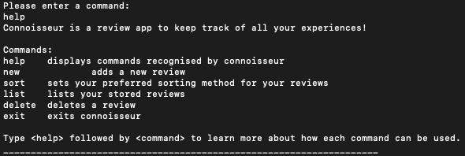
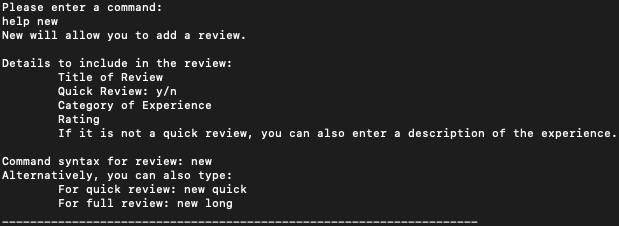
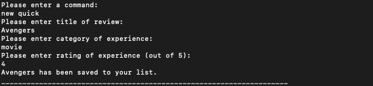
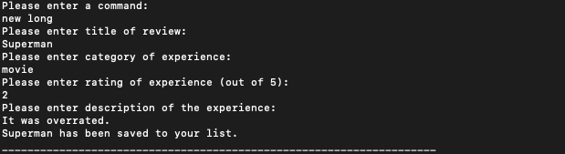
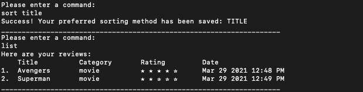

# Connoisseur User Guide

## Introduction

Connoisseur is a desktop app for managing and storing personal reviews that students would like to keep. It is a
revolutionary app that not only provides an organised user friendly database for its users, but provides customisable
categories to enhance the user experience. Through its intuitive command line interface, students would be able to store
and share their recommendations easily.

## Table of Contents

1. [Quick start](#Quick-Start)
2. [Review Mode](#Review-Mode)
    * [Viewing Help](#Viewing-help)
    * [Adding a Review](#Adding-a-review)
    * [Listing Reviews](#Listing-reviews)
    * [Sorting Reviews](#Sorting-reviews)
    * [Viewing a Review](#Viewing-a-review)
    * [Deleting a Review](#Deleting-a-review)
3. [Recommendation Mode](#Recommendation-Mode)
    * 
4. [FAQ](#FAQ)
5. [Command Summary](#Command-Summary)

## Quick Start

1. Ensure that you have Java 11 or above installed.
2. Down the latest version of `Connoisseur` from [here](https://github.com/AY2021S2-CS2113T-F08-3/tp/releases).
3. Copy the file to the folder you want to use as the _home folder_ for Connoisseur
4. Open a new terminal and navigate to the folder you just copied into. 
5. In your terminal, type `java -jar Connoisseur.jar` and press enter. This should start Connoisseur. 
6. Type in commands and press Enter to execute it. 
    Refer to the [Command summary](#command-summary) for a list of recognised commands. 
7. You should notice a new _data folder_ created in the _home folder_ you have chosen in step 3. The data for connoisseur is saved in `connoisseur.json` in the _data folder_. 

## Review Mode
Connoisseur has 2 modes, the first is the review mode, where you can add your own reviews of experiences. The review mode can be accessed from anywhere using the `review` command. 

### Viewing Help
View help on commands recognised by Connoisseur. You can specify a command to get detailed help on it. 

Command: `help [command_name]`

`[command_name]`: optional argument specifying command on which help is needed. 

### Adding a Review
Add a new review. Choice of quick review or long review. 

Command: `add [quick | long]`, `new [quick | long]`

`[quick | long]` : optional argument to specify quick or long review. 

### Listing Reviews
List your current reviews. You can specify a one-off sorting method by which to sort the reviews. 

Command: `list [sorting_method]`

`[sorting_method]` : temporary sort method by which to sort the reviews. Leaving this blank would allow Connoisseur to use the saved sort method. Currently supported methods are: 
* `title`
* `category`
* `rating`
* `earliest`
* `latest`

### Sorting Reviews
Change the saved sorting method. 

Command: `sort <sorting_method>`

`<sorting_method>` : sort method to be used. Default sorting method is `latest`. Refer above for a list of recognised sorting methods. 

### Viewing a Review
View details of a review. 

Command: `view <title_of_review>`

`<title_of_review>` : title of review that you want to view. 

### Deleting a Review
Delete a review that you no longer need. 

Command: `delete <title_of_review>`

`<title_of_review>` : title of review that you want to delete. 

## Recommendation Mode

#### Adding a Review

#### Listing reviews
### Recommendation Mode

#### Adding a todo: `todo`

Adds a new item to the list of todo items.

Format: `todo n/TODO_NAME d/DEADLINE`

* The `DEADLINE` can be in a natural language format.
* The `TODO_NAME` cannot contain punctuation.

Example of usage:

`todo n/Write the rest of the User Guide d/next week`

`todo n/Refactor the User Guide to remove passive voice d/13/04/2020`

## FAQ

**Q**: How do I transfer my data to another computer?

**A**: {your answer here}

## Command Summary

{Give a 'cheat sheet' of commands here}

* Add todo `todo n/TODO_NAME d/DEADLINE`
