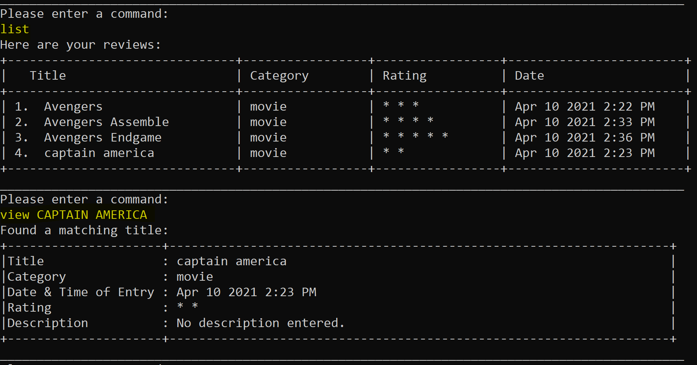
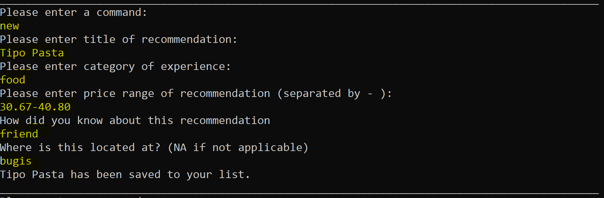

# Connoisseur User Guide

## Table of Contents

1. [Introduction](#1-introduction)
2. [About this Guide](#2-about-this-guide)

   2.1 [What is in Connoisseur](#21-what-is-in-connoisseur)

   2.2 [How to use this Guide](#22-how-to-use-this-guide)

3. [Quick start](#3-quick-start)
4. [Features](#4-features)

   4.1 [Review Mode](#41-review-mode)

   &nbsp;&nbsp;&nbsp;&nbsp;&nbsp;&nbsp;4.1.1 [Add a Review](#411-adding-a-review)

   &nbsp;&nbsp;&nbsp;&nbsp;&nbsp;&nbsp;4.1.2 [List Reviews](#412-list-reviews)

   &nbsp;&nbsp;&nbsp;&nbsp;&nbsp;&nbsp;4.1.3 [Sort Reviews](#413-sort-reviews)

   &nbsp;&nbsp;&nbsp;&nbsp;&nbsp;&nbsp;4.1.4 [View a Review](#414-view-a-review)

   &nbsp;&nbsp;&nbsp;&nbsp;&nbsp;&nbsp;4.1.5 [Edit a Review](#415-edit-a-review)

   &nbsp;&nbsp;&nbsp;&nbsp;&nbsp;&nbsp;4.1.6 [Delete a Review](#416-delete-a-review)

   4.2 [Recommendation Mode](#52-recommendation-mode)

   &nbsp;&nbsp;&nbsp;&nbsp;&nbsp;&nbsp;4.2.1 [Add a Recommendation](#421-adding-a-recommendation)

   &nbsp;&nbsp;&nbsp;&nbsp;&nbsp;&nbsp;4.2.2 [List Recommendation](#422-list-recommendation)

   &nbsp;&nbsp;&nbsp;&nbsp;&nbsp;&nbsp;4.2.3 [Edit a Recommendation](#423-edit-a-recommendation)

   &nbsp;&nbsp;&nbsp;&nbsp;&nbsp;&nbsp;4.2.4 [Delete a Recommendation](#424-delete-a-recommendation)

   &nbsp;&nbsp;&nbsp;&nbsp;&nbsp;&nbsp;4.2.5 [Review a Recommendation](#425-review-a-recommendation)

   4.3 [View Help](#43-view-help)

   4.4 [Exit & Save Connoisseur](#44-exit-&-save-connoisseur)
5. [Command Summary](#5.-Command-Summary)
6. [FAQ](#6.-FAQ)

## 1. Introduction

Welcome to the user guide for our application, Connoisseur!
With over 4.6 thousand restaurants in Singapore, endless number of entertainment options and never-ending list of
streaming shows and movies, to watch many of us are left deciding for a long time on what is worthwhile spending our
limited leisure time on. Fret-not!

Connoisseur is a desktop application for managing and storing personal reviews on experiences and recommendations to try
next, that you would like to keep. It is a revolutionary app that not only provides an organised user-friendly database,
but provides customisable categories to enhance your experience. Through its intuitive command line interface, you will
be able to store and access your reviews & recommendation easily.

## 2. About this Guide

This guide gives you an overview of the features in Connoisseur and shows you how to get started using Connoisseur.
Choose a link in the [Feature](#Table-of-Contents) section to get a step-by-step instruction, and understand how to use
Connoisseur.

### 2.1 What is in Connoisseur

In our Review mode, you can add a review about an experience, rate it out of 5 stars, delete or edit a review, view the
entire list of your reviews or one particular review. You can also sort the list from the highest to lowest rating, by
category, title and date of entry.

For our Recommendation mode, you can have a list of things you would like to try, the location and the price range of
the experience! Already tried out the experience? Nice! You can now move it to your review list in the review mode and
record your thoughts on how good or bad the experience was!

### 2.2 How to use this Guide

The following formats are used in this document:

* Words in UPPER CASE in square bracket [USER INPUT] are the fields to be supplied by the user. e.g.
  in `list [SORTING METHOD]`
  SORTING METHOD is the field input by the user and examples of valid commands are:`list rating`,`list title` etc.
* Word in lower case are given commands.   e.g. in `new [quick | long]` the user can input either the command
  `new quick`or `new long`

## 3. Quick Start

If you are tired of lengthy and problematic installation processes, Connoisseur is perfect for you. The setup is minimal
and can be completed in a few simple steps. Follow the instructions below to try it out!

1. Ensure that you have Java 11 or above installed. The latest version of Java can be found
   [here](https://java.com/en/download/)
2. Download the latest version of Connoisseur from [here](https://github.com/AY2021S2-CS2113T-F08-3/tp/releases). To do
   so, look for the file connoisseur.jar and click on it. Please refer to Figure 1 if you require assistance with
   locating the file. Figure 1 shows how to download version 2.1 of Connoisseur. Connoisseur.jar has been highlighted in
   red for your convenience.   
   
   Figure 1. How to download Connoisseur

3. Copy the file to the folder you want to use as the _home folder_ for Connoisseur
   
   
Figure 2. Copying connoisseur.jar into a folder

4. Open terminal and navigate to the directory of the folder you just copied into.
5. In your terminal, type `java -jar Connoisseur.jar` and press enter. This should start Connoisseur.
   
   
Figure 3. Starting Connoisseur

6. You may now use Connoisseur by typing in commands and pressing Enter to execute it. Refer to
   the [Command summary](#5.-command-summary) for a list of recognised commands.
7. You should notice a new _data folder_ created in the _home folder_ you have chosen in step 3. The data for
   Connoisseur is saved in `connoisseur.json` in the _data folder_.

## 4. Features

This section covers all the commands that you can type into the Command Box of Connoisseur when it prompts you -
`Please enter a command: `

The commands are categorised into the two modes offered by Connoisseur, Review and Recommendation mode. If it is the
first time that you are using the command, we recommend that you refer
to [How to use the Guide]((#2.2-How-to-use-the-Guide)) to better interpret the format of the commands.

### 4.1 Review Mode

Connoisseur is in Review mode by default. In this mode you can maintain a list of reviews of experiences of any
category. The review mode can be accessed using the `review` command as shown in the figure below.

Figure 4. Entering 'Review' mode

#### 4.1.1 Adding a Review

This feature allows you to add a new review. There is a choice of quick review or long review.

Command: `add [quick | long]`, `new [quick | long]` 
`[quick | long]` : optional arguments to specify quick or long review.

If quick review is specified, Connoisseur will then prompt you to enter the title, category and rating of the review, as
shows in _Figure 5_. 

Figure 5. Adding a quick review 

If long review is specified, there is an additional prompt to input description of the experience as shown in _Figure 6_

Figure 6. Adding a long review 

If you do not specify `[quick | long ]` and simply input the command: `add` or `new`, Connoisseur will ask you to
specify if you would like to input a quick review. Input the command: `y` for quick review or `n` for long review
instead, as shown in _Figure 7_. 

Figure 7. Adding a quick or long review 

&#10071; Ensure the rating is an integer whole number from 0 to 5. Otherwise, Connoisseur will display error message and 
adding the review will fail. You can try again.  

&#10071; Ensure the title of the review added is unique and does not already exist in the list. If you attempt to add a 
pre-existing review title, Connoisseur will prompt you of the existence of duplicate in the list. Adding the review will 
fail. You can try again.

#### 4.1.2 List Reviews

This feature allows you to view a list of all your reviews. You can specify a one-off sorting method by which to sort
the reviews.

Command: `list [SORTING METHOD]`

`[SORTING METHOD]` : (optional argument) temporary sort method by which to sort the reviews. Leaving this blank would
allow Connoisseur to use the saved _sort method_ as shown in Figure 8. Currently, supported methods are:

* `title`
* `category`
* `rating`
* `earliest`
* `latest`

Figure 8. Listing Reviews 

#### 4.1.3 Sort Reviews

This feature allows you to change the saved sorting method as shows in Figure 8.

Command: `sort [SORTING METHOD]`

`[SORTING METHOD]` : sort method to be used. Default sorting method is `latest`. Refer [above](#4.1.2-List-Reviews) for
a list of recognised sorting methods.

Figure 9. Changing Sorting method to title

&#10071; Ensure you do not enter a sorting method that does not exist. Otherwise Connoisseur will warn you that with 
an invalid sorting method message. 

#### 4.1.4 View a Review

This feature allows you to view all the details of the specified review as shown in Figure 9.

Command: `view [TITLE_OF_REVIEW]`

`[TITLE_OF_REVIEW]` : title of review that you want to view.

Figure 10. Viewing a Review 

&#10071; Ensure the title of the review you want to view already exists in your lists of reviews. Otherwise, Connoisseur will 
prompt you saying that no such review exits.

#### 4.1.5 Edit a Review

This feature allows you to make edits to the Title / Category / Rating / Description of the review in your list.  

Command : `edit [TITLE_OF_REVIEW] `

`[TITLE_OF_REVIEW]` : title of review that you want to edit.

&#10071; Ensure the title of the review you want to edit already exists in your lists of reviews. Otherwise, Connoisseur will
prompt you saying that no such review exits.

As shown in Figure 11 below, Connoisseur will prompt you asking whether you would like to make changes to Title /
Category / Rating / Description. Input either `Title`,`Category`, `Rating` or `Description`.

If you would like to continue to make edits to the review, input `y`. Otherwise, input `n`.

Before exiting the _edit_ feature, you have the option to update the date of entry to reflect the date and timing in
which the edit was made. Input `y` if you would like to do so. Otherwise, input`n`.

Figure 11. Editing a Review 

&#10071; If at any point an invalid command is typed, the edit will fail and you will have to try again.

#### 4.1.6 Delete a Review

This feature allows you to delete a review from your list as shown in Figure 12.

Command: `delete [TITLE_OF_REVIEW]`

`[TITLE_OF_REVIEW]` : title of review that you want to delete.

Figure 12. Deleting a Review 

&#10071; Ensure the title of the review you want to delete already exists in your lists of reviews. Otherwise, Connoisseur will
prompt you saying that no such review exits.

### 4.2 Recommendation Mode

Connoisseur is in Review mode by default. The Recommendation mode can be accessed using the `reco` command when
Connoisseur prompts - `Please enter a command:` as shown in Figure 13. In this mode you can maintain a list of
recommendation of experiences you would like to try in the future. To go back to Review mode, you can use the `review`
command.

Figure 13. Recommendation Mode

#### 4.2.1 Adding a Recommendation

This feature allows you to add a new recommendation.

Command: `add ` or `new `

Connoisseur will then prompt you to enter the title, category, price range of recommendation, recommended by and where
it is located at as shown in Figure 14.

Figure 14. Adding a Recommendation

&#10071;Price range should be entered separated by -. Otherwise, adding a recommendation will fail and you need to try again.

#### 4.2.2 List Recommendation

This feature allows you to view a list of all your recommendations as shown in Figure 15.

Command: `list`

Figure 15. Viewing Recommendations

#### 4.2.3 Edit a Recommendation

This feature allows you to make edits to the Title/ Category/ Price range/ Location/ RecBy of the recommendation in your
list.

Command : `edit [TITLE_OF_RECOMMENDATION] `

`[TITLE_OF_RECOMMENDATION]` : title of recommendation that you want to edit.

&#10071;Ensure the title of the recommendation you want to edit already exists in your lists of reviews. Otherwise, Connoisseur will
prompt you saying that no such recommendation exits.

As shown in Figure 16 below, Connoisseur will prompt you asking whether you would like to make changes to Title/
Category/ Price range/ Location/ RecBy. Input either `Title`,`Category`, `Price range`,`Location` or `RecBy` .

If you would like to continue to make edits to the recommendation, input `y`. Otherwise, input `n`.

Figure 16. Editing Recommendations

#### 4.2.4 Delete a Recommendation

This feature allows you to delete a recommendation from your list as shown in Figure 17.

Command: `delete [TITLE_OF_RECOMMENDATION]`

`[TITLE_OF_RECOMMENDATION]` : title of recommendation that you want to delete.

Figure 17. Deleting a Recommendation

&#10071;Ensure the title of the review you want to delete already exists in your lists of recommendations. Otherwise, Connoisseur will
prompt you saying that no such recommendation exits.

#### 4.2.5 Review a Recommendation

This feature allows you to review an item in the recommendation list once you have tried it and transfer it to the
review list.

Command: `done [TITLE_OF_RECOMMENDATION]`

As shown in Figure 18, Connoisseur will prompt you to rate the experience out of 5. You can also add in a description by
inputting `y` or `n` otherwise. Figure 17 shows that the title 'Universal Studio' has been successfully transferred from
recommendation to review list.

Figure 18. Reviewing a Recommendation

### 4.3 View Help

command: `help[COMMAND_NAME]` eg. `help reco` `help list` etc.

If you encounter any issues using Connoisseur simply key in `help` for a generic help message as show in Figure 19.

Figure 19. Generic Help message

If you want help with a specific command simple key in `help` followed by the `[COMMAND_NAME]` as show in Figure 20.

Figure 20. Help message for commands

### 4.4 Exit & Save Connoisseur

This feature allows you to exit Connoisseur and all you review and recommendation list will be stored as
`connoisseur.json` in the _data folder_ as shown in Figure 21.

command: `exit` or `bye`

 Figure 21. Exiting Connoisseur

## 5. Command Summary

|Action | Command | Examples |
| ----- |--------|---------|
|Enter Review Mode|`review`|`review`|
|Add a Review|`add [QUICK/LONG]` `new[QUICK/LONG]`|`add` `new ` `add quick` `new long`|
|List Reviews|`list [SORTING_METHOD]`|`list`  `list title`|
|View Current Sorting Method|`sort`| `sort`|
|Change Sorting Method|`sort [SORTING_METHOD]`| `sort title`|
|View a Review|`view [TITLE_OF_REVIEW]`|`view Captain America`|
|Edit a Review|`edit [TITLE_OF_REVIEW]`|`edit Armageddon`|
|Delete a Review|`delete [TITLE_OF_REVIEW]`|`delete Armageddon 2`|
|Enter Recommendation Mode|`reco`|`reco`|
|Add a Recommendation|`add` `new`|`add`  `new`|
|List Recommendations|`list`|`list`|
|Edit a Recommendation|`edit [TITLE_OF_RECOMMENDATION]`|`edit Tipo Pasta`|
|Delete a Recommendation|`delete [TITLE_OF_RECOMMENDATION]`|`delete Armageddon 3`|
|Review a Recommendation|`done [TITLE_OF_RECOMMENDATION]`| `done Universal Studio`|
|Help for General usage|`help`|`help`|
|Help for a Specific function|`help [COMMAND_NAME]`|`help reco` `help list`|
|Exit & Save|`exit` `bye`|`exit` `bye`|

## 6. FAQ

//TODO
**Q**: How do I transfer my data to another computer?

**A**: Simply move the jar file and data/connoisseur.json into the same directory.