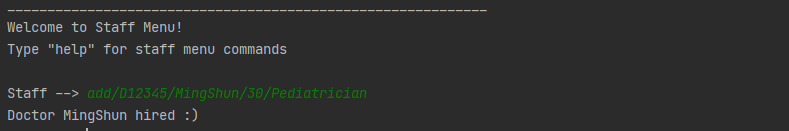

# HealthVault User Guide
	
## Opening Words
Welcome to HealthVault User Guide!						 

The purpose of this User Guide is to assist you in the usage of the application. You will be able to utilize all the features of the HealthVault application to create the most efficient healthcare environment!

## Content Page
1. [Introduction](#1-introduction)
1. [Installation Guide](#2-installation-guide)
1. [How to use this guide](#3-how-to-use-the-guide)
	1. [Technical terms](#31-technical-terms)
	1. [Symbols & Icons](#32-symbols--icons)
1. [Start Menu](#4-start-menu)
1. [Features](#5-features)
	1. [Staff](#51-staff)
	2. [Patient](#52-patient)
	3. [Doctor's Appointment](#53-doctor-appointment)
	4. [Nurse Schedule](#54-nurse-schedule)
	5. [Inventory](#55-inventory)
1. [FAQ](#6-faq)
1. [Command Summary](#7-command-summary)

## 1. Introduction

HealthVault is a desktop app for managing doctor, nurse and patient information, optimised for use through the command line interface. This app is for the head nurse of a hospital, if the user can type fast, it is better than a traditional GUI app.

In this application there are 5 main features that are provided for the user. Each feature can be accessed by accessing its specific menu. For example, the Patient details can be accessed by accessing the Patient menu. Table 1 describes the details in each of the features.


<br/><br/>
## 2. Installation Guide

1. Ensure system has Java 11

2. Download the latest JAR file from this [website](https://github.com/AY2021S2-CS2113T-F08-2/tp/releases)

3. Open the command window 
   - Click the search icon in the bottom left side of the screen 
   - Type ‘command prompt’ in the search bar
   - Select the application called ‘Command Prompt’

<a name="section2.4">4.</a> `cd` into the folder containing the JAR file
   - Locate the file path of the JAR file that you have downloaded
   - For example:  (C:\Users\JohnDoe\Downloads), where JohnDoe is the user’s name
   - Then, run the following command: `cd [File Path]`
   - Example: `cd C:\Users\JohnDoe\Downloads`
   - Run the following command: `java -jar jar [JAR file name]`
  
<br/><br/>

## 3. How to use the guide

### 3.1 Technical Terms

**Command Line Interface** - Accessing the functionalities of a computer program in the form of lines of text.

**Graphical User Interface** - Allows users to interact with the functionalities of a computer program through graphical icons and audio indicators, instead of text-based user interfaces, typed command labels or text navigation.

**Case Sensitive** - Differentiating between capital and lower-case letters.

**User Input** - Any information or data sent to a computer by the user using the application.


### 3.2 Symbols & Icons

**[]** - Square brackets for compulsory user inputs.

**<>** - Optional inputs.


:information_source:  All instances of commands and code will be highlighted in grey and will have a different font.

### 3.3 Interpreting help commands


This is an example of a typical help command in the application.


The **Commands** column gives the command that allows you to accomplish a certain action with the relevant features. 
For example, the `add` command allows you to add a new staff and their relevant details into the database.

The **Description** column gives you an explaination on the usage and purpose of the command.

The **Format** column gives the appropriate format for you to use the command.
For example, the `add` format requires specific details regarding the staff that will be added into the database.
The '-' in the format column specifies that the command can be used alone without any additional details.

The detailed explaination of each command will be explained in the subsequent sections.


<br/><br/>

## 4. Start Menu

The Start Menu is the first menu you will encounter after you run the application as stated in [section 2.4](#section2.4). 

Here is an example of how the welcome screen of HealthVault will look like.


The Start Menu allows you to access various Menus in the application based on the feature that you would like to access.

For example, the Staff Menu allows you to access the Staff feature within the database. 

The welcome screen of HealthVault presents you with the basic commands as well as its description of its functionalities. 

Input any command to access the respective features and input the `exit` command to quit the application.

<br/><br/>

## 5. Features 

### 5.1 Staff

The functions in Staff menu allow you, the head nurse, to access and modify the details of each staff in the hospital. 
(Note for Staff ID: D/N = Doctor/Nurse)

This is an example of the welcome screen for Staff Menu.


<br/><br/>

#### Adding a new staff: `add`
Adds a new doctor or nurse to the respective staff lists.

Format: `add/[Staff ID]/[Name]/[Age]/[Specialisation]` 

Example of usage:<br/>
Adding a Pediatrician MingShun with Staff ID of D12345 of age 30
```
Staff --> add/D12345/MingShun/30/Pediatrician
```
Expected Outcome:
```
------------------------------------------------------------------------------
Staff --> add/D12345/MingShun/30/Pediatrician
Mingshun has been hired :)
------------------------------------------------------------------------------
```

Example Screenshot:


<br/><br/>
 
#### Deleting a staff: `delete`
Deletes a staff from the staff list.

Format: `delete/[Staff ID]`

Example of usage:
```
Staff --> delete/D12345
```
Expected Outcome:
```
------------------------------------------------------------------------------
Staff --> delete/D12345
D12345 has been fired :(
------------------------------------------------------------------------------
```
Example Screenshot:

<br/><br/>

#### Listing all doctors or nurses: `list`
Lists either all doctors or all nurses.

Format: `list/<doctors/nurses>`

**Note: <> implies that the inputs are optional**


Example of usage(doctors):
```
Staff --> list/doctors
```
Expected Outcome(doctors):
```
------------------------------------------------------------------------------
ID         | Name       | Age   | Specialisation      
____________________________________________________________
D12345     | MingShun   | 30    | Pediatrician        
D67890     | Alexander  | 31    | Heart Surgeon   
------------------------------------------------------------------------------
```

Example Screenshot:


Example of usage (nurses):
```
Staff --> list/nurses
```
Expected Outcome(nurses):
```
ID         | Name       | Age   | Specialisation      
____________________________________________________________
N13579     | Sarrah     | 29    | Oncology            
N24680     | JiaEn      | 28    | Pain Management  
```
Example Screenshot:


Example of usage (no input):
```
Staff --> list
```
Expected Outcome (doctors):
```
------------------------------------------------------------------------------
ID         | Name       | Age   | Specialisation      
____________________________________________________________
D12345     | MingShun   | 30    | Pediatrician        
D67890     | Alexander  | 31    | Heart Surgeon       
N13579     | Sarrah     | 29    | Oncology            
N24680     | JiaEn      | 28    | Pain Management    
------------------------------------------------------------------------------
```

Example Screenshot:


<br/><br/>

#### Returning to Start Menu: `return`
#### Help: `help`

### 5.2 Patient

The functions in the Patient menu allow you, the head nurse, to add, view, find, and delete patients in the patient list.
(Note: Make sure that the inputted user ID starts with a P and has at least 5 digits in the number following! Eg. P12345, P54321)

#### Adding a new patient: `add`
Adds a patient to the patient list.

Format: `add/[Patient ID]/[Name]/[Age]/[Gender]/[Illness]/[Drugs needed]`

Example of usage:
```
Patient --> add/P55555/Sam/40/Male/Fever/Paracetamol
```
Expected Outcome:
```
------------------------------------------------------------------------------
Patient --> add/P55555/Sam/40/Male/Fever/Paracetamol
Sam is a patient here!
------------------------------------------------------------------------------
```

#### Deleting a patient: `delete`
Deletes a patient from the patient list.

Format: `delete/[Patient ID]`

Example of usage:
```
Patient --> delete/P55555
```
Expected Outcome:
```
------------------------------------------------------------------------------
Patient --> delete/P55555
Sam is cured:)
------------------------------------------------------------------------------
```

#### Listing all patients: `list`
Lists all patients in the patient list.

Format: `list`

Example of usage:
```
Staff --> list
```
Expected Outcome:
```
------------------------------------------------------------------------------
Staff --> list
1. P55555, Sam, 40, Male, Fever, Paracetamol
2. P11111, James, 20, Male, Flu, Penicillin 
------------------------------------------------------------------------------
```

#### Finding a patient: `find`
Finds for a patient from the patient list.

Format: `find/[Patient ID]`

Example of usage:
```
Patient --> find/P55555
```
Expected Outcome:
```
------------------------------------------------------------------------------
Patient --> find/P55555
P55555, Sam, 40, Male, Fever, Paracetamol
------------------------------------------------------------------------------
```

#### Returning to Start Menu: `return`
#### Help: `help`

### 5.3 Doctor's Appointment

The functions in the Doctor's Appointment menu allow you, the head nurse, to add, view, and delete appointments made with a specific doctor.

#### Adding an appointment: `add`
Adds a new doctor's appointment to the list of appointments.
(Note: The Appointment ID is auto-generated at the point of adding)

Format: `add/[Doctor ID]/[Appointment ID]/[Patient’s Name]/[Gender]/[DDMMYYYY]`

Example of usage:
```
Appointments --> add/D12345/A12345/Alex/M/21012021
```
Expected Outcome:
```
------------------------------------------------------------------------------
Appointments --> add/D12345/A12345/Alex/M/21012021
Alex scheduled for an appointment on 21/01/2021!
------------------------------------------------------------------------------
```

#### Deleting an appointment: `delete`
Deletes an appointment from the list of appointments.

Format: `delete/[Appointment ID]`

Example of usage:
```
Appointments --> delete/A369
```
Expected Outcome:
```
------------------------------------------------------------------------------
Appointments --> delete/A369
Alex has attended the appointment!
------------------------------------------------------------------------------
```

#### Listing appointments: `list`
Lists all of the appointments of a specific doctor.

Format: `list/[Doctor ID]`

Example of usage:
```
Appointments --> list/D12345
```

Expected Outcome:
```
------------------------------------------------------------------------------
Appointments --> list/D12345
21/01/2021
Alex
ID: A369
------------------------------------------------------------------------------
```

#### Returning to Start Menu: `return`
#### Help: `help`

### 5.4 Nurse Schedule

The functions in the Nurse Schedule menu allow you, the head nurse, to add, view, and delete schedules of your nurses.

#### Adding a new schedule: `add`
Adds a new schedule to the list of nurse schedules.
(Note for ID: N/P = Nurse/Patient)

Format: `add/[Nurse ID]/[Patiend ID]/[Date (DDMMYYYY)]`

Example of usage:
```
NSchedule --> add N1 P1 30012020
```
Expected Outcome:
```
------------------------------------------------------------------------------
NSchedule --> add N1 P1 30012020
Trip to P1 on 30012020 added!
------------------------------------------------------------------------------
```

#### Deleting a schedule: `delete`
Deletes a schedule from the list of nurse schedules.

Format: `delete/[Nurse ID]/[Date (DDMMYYYY)]`

Example of usage:
```
NSchedule --> delete N1 30012020
```
Expected Outcome:
```
------------------------------------------------------------------------------
NSchedule --> delete N1 30012020
Trip to P1 on 30/01/2020 has been cancelled!
------------------------------------------------------------------------------
```

#### Listing schedules: `list`
List either all schedules or specified Nurse ID's schedule.

Format: `list/[Nurse ID/all]`

Example of usage(Nurse ID):
```
NSchedule --> list/N2
```
Expected Outcome(Nurse ID):
```
------------------------------------------------------------------------------
NSchedule --> list/N2
N2
	31/01/2020 P2
------------------------------------------------------------------------------
```
Example of usage(all):

```
NSchedule --> list/all
```
Expected Outcome(all):
```
------------------------------------------------------------------------------
NSchedule --> list/all
N1
	30/01/2020 P1
N2
	31/01/2020 P2
------------------------------------------------------------------------------
```

#### Returning to Start Menu: `return`
#### Help: `help'

### ??Adding a todo: `todo`??
Adds a new item to the list of todo items.

Format: `todo n/TODO_NAME d/DEADLINE`

* The `DEADLINE` can be in a natural language format.
* The `TODO_NAME` cannot contain punctuation.  

Example of usage: 

`todo n/Write the rest of the User Guide d/next week`

`todo n/Refactor the User Guide to remove passive voice d/13/04/2020`

### 5.5 Inventory

The functions in the Inventory menu allow you, the head nurse, to add, view, and delete drugs existing in your inventory.
(Note for price: Make sure that the inputted price is valid! Eg. 3.00, 3)

#### Adding a drug: `add`
Adds a drug to the drug inventory.

Format: `add/[Name]/[Price]/[Quantity]`

Example of usage:
```
Inventory --> add/paracetamol/$3/90
```
Expected Outcome:
```
------------------------------------------------------------------------------
Inventory --> add/paracetamol/3/90
Added 90 paracetamol to inventory!
------------------------------------------------------------------------------
```

#### Deleting a drug: `delete`
Deletes a drug from the inventory list.

Format: `delete/[Name]`

Example of usage:
```
Inventory --> delete/paracetamol
```
Expected Outcome:
```
------------------------------------------------------------------------------
Inventory --> delete/paracetamol
Deleted paracetamol to inventory!
------------------------------------------------------------------------------
```

#### Listing drugs: `list`
Lists all the drugs in the inventory.

Format: `list`

Example of usage:
```
Inventory --> list
```
Expected Outcome:
```
------------------------------------------------------------------------------
Inventory --> list
Current Inventory:
90 $3 Paracetamol
30 $4 Ibuprofen
10 $100 Marijuana
------------------------------------------------------------------------------
```

#### Returning to Start Menu: `return`
#### Help: `help`

<br/><br/>

## 6. FAQ

**Q**: How do I transfer my data to another computer? 

**A**: {your answer here}

<br/><br/>

## 7. Command Summary

| Command             | Example                                                                                                    |
|---------------------|------------------------------------------------------------------------------------------------------------|
| **Start Menu**      |                                                                                                            |
| staff               | `staff`                                                                                                    |
| patient             | `patient`                                                                                                  |
| appointments        | `appointments`                                                                                             |
| schedules           | `schedules`                                                                                                |
| inventory           | `inventory`                                                                                                |
| help                | `help`                                                                                                     |
| **Staff**           |                                                                                                            |
| add                 | `add/[Staff ID]/[Name]/[Age]/[Specialisation]`<br/><br/>`add/D12345/A12345/Alex/M 21012021`                |
| delete              | `delete/[Staff ID]`<br/><br/>`delete/D12345`                                                               |
| list                | `list`                                                                                                     |
| help                | `help`                                                                                                     |
| return              | `return`                                                                                                   |
| **Patient**         |                                                                                                            |
| add                 | `add/[Patient ID]/[Name] [Age]/[Gender]/[Illness]/[Drugs needed]`<br/><br/>`add/P55555/Sam/40/Male Fever/Paracetamol`   |
| delete              | `delete/[Patient ID]`<br/><br/>`delete/P55555`                                                                          |
| find                | `find/[Patient ID]`<br/><br/>`find/P55555`                                                                              |
| list                | `list`                                                                                                     |
| help                | `help`                                                                                                     |
| return              | `return`                                                                                                   |
| **Doctor Appointments** |                                                                                                        |
| add                 | `add/[Doctor ID]/[Appointment ID]/[Patient’s Name]/[Gender]/[DDMMYYYY]`<br/><br/>`add/D12345/Mingshun/ Pediatrician`    |
| delete              | `delete/[Appointment ID]`<br/><br/>`delete/A369`                                                                        |
| list                | `list`                                                                                                     |
| help                | `help`                                                                                                     |
| return              | `return`                                                                                                   |
| **Nurse Schedules** |                                                                                                            |
| add                 | `add/[Nurse ID]/[Patient ID]/[DDMMYYYY]`<br/><br/>`add/N12345/P56789/30012020`                             |
| delete              | `delete/[Nurse ID]/[DDMMYYYY]`<br/><br/>`delete/N12345/30012020`                                           |
| list                | `list/[Nurse ID/all]`<br/><br/>`list/N12345/list/all`                                                      |
| help                | `help`                                                                                                     |
| return              | `return`                                                                                                   |
| **Drugs Inventory** |                                                                                                            |
| add                 | `add/[Name]/[Price]/[Quantity]`<br/><br/>`add/paracetamol/$3/90`                                           |
| delete              | `delete/[Name]`<br/><br/>`delete/paracetamol`                                                              |
| list                | `list`                                                                                                     |
| help                | `help`                                                                                                     |
| return              | `return`                                                                                                   |
