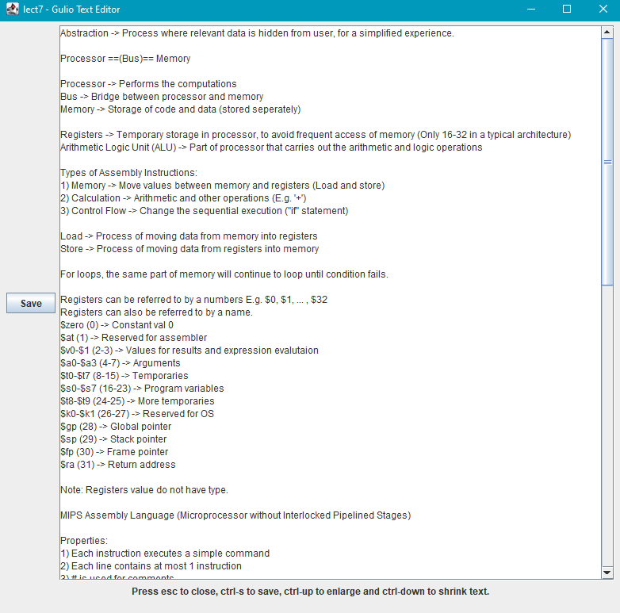

[<== Back to Home](README.md)

<!--@@author ivanchongzhien-->
# User guide

**GULIO (Get Ur Life In Order)**  is a desktop app that provides a single consolidated and personalised workspace for NUS SoC students to organize their modules. GULIO is optimized for use via a Command Line Interface (CLI) which SoC students will be familiar with typing in, instead of a Graphical User Interface (GUI).

If you are having difficulties managing your schedule, lesson links and notes, GULIO is the app for you. With the ability to store lesson details, tasks, notes and more, GULIO is a one-stop solution for all your university scheduling needs.

This guide is written for users like you, for reference when there is a particular feature that you are unsure of how to use. It provides all the necessary information required for you to fully utilize GULIO's capabilities.

&nbsp;

----

# Table of Contents

* [How to Use This Guide](#how-to-use-this-guide)
* [Quick Start](#quick-start)
* [Features](#features)
    * [Overview](#overview)
    * [Dashboard Commands](#dashboard-commands)
        * [Listing all dashboard commands : `help`](#listing-all-dashboard-commands--help)
        * [Exiting the program : `exit`](#exiting-the-program--exit)
        * [Opening a module : `open`](#opening-a-module--open)
        * [Adding a module : `add`](#adding-a-module--add)
        * [Deleting a module : `del`](#deleting-a-module--del)
        * [Listing all modules : `mods`](#listing-all-modules--mods)
    * [Module Commands](#module-commands)
        * [Listing all module commands : `help`](#listing-all-module-commands--help)
        * [Closing a module : `close`](#closing-a-module--close)
        * [Showing module information : `info`](#showing-module-information--info)
        * [Adding a lesson : `add lsn`](#adding-a-lesson--add-lsn)
        * [Deleting a lesson : `del lsn`](#deleting-a-lesson--del-lsn)
        * [Editing a lesson : `edit lsn`](#editing-a-lesson--edit-lsn)
        * [Opening lesson link : `link`](#opening-lesson-link--link)
        * [Listing all teaching staff : `tch`](#listing-all-teaching-staff--tch)
        * [Listing all lessons : `lsn`](#listing-all-lessons--lsn)
        * [Adding a task : `add task`](#adding-a-task--add-task)
        * [Deleting a task : `del task`](#deleting-a-task--del-task)
        * [Editing a task : `edit task`](#editing-a-task--edit-task)
        * [Marking task as done : `mark`](#marking-task-as-done--mark)
        * [Marking task as undone : `unmark`](#marking-task-as-undone--unmark)
        * [Listing all tasks : `task`](#listing-all-tasks--task)
        * [Adding a cheat-sheet : `add cs`](#adding-a-cheat-sheet--add-cs)
        * [Deleting a cheat-sheet : `del cs`](#deleting-a-cheat-sheet--del-cs)
        * [Editing a cheat-sheet : `edit cs`](#editing-a-cheat-sheet--edit-cs)
        * [Listing all cheat-sheets : `cs`](#listing-all-cheat-sheets--cs)
    * [Data & Storage](#data--storage)
        * [Automatic Saving](#automatic-saving)
        * [Manual Editing Outside GULIO](#manual-editing-outside-of-gulio)
    * [Text Editor](#text-editor)
* [FAQ](#faq)
* [Command Summary](#command-summary)

&nbsp;

----

# How to Use This Guide

#### Icons used in this guide:

💡 - indicates a tip that may be useful to you. 
⚠ - indicates a warning that you should take note of.

#### Commands will be presented in the following format:

> ### Command function : *keyword*
>
> Summary of actions involved.
>
> **Format:** 
> `command format`
>
> **Example:** (if any) 
> <table>
>   <tr>
>     <td><i>Step number</i></td>
>     <td><pre><i>Label</i> >> <b style="color: forestgreen">What you input</b> <i>What you will get.</i></pre></td>
>   </tr>
> </table>
>
> **Result** - _Outcome of command_ (if any)

&nbsp;

----

# Quick Start

Download the latest version of GULIO from [here](https://github.com/AY2021S2-CS2113T-W09-3/tp/releases).

### Requirements:

Java 11 and above 

> 💡 Verify this by running the command “java --version” in command prompt (for Windows users) or Terminal (for Mac and Linux users).

### Steps:

1. Move the `GULIO.jar` file to your preferred directory.
1. Open command prompt (for Windows users) or Terminal (for Mac and Linux users),
1. Navigate to the directory of your GULIO.jar file.
1. Run the command “java -jar gulio.jar” to start GULIO.
    > 💡 The file name is not case-sensitive, so both `gulio.jar` and `GULIO.jar` works.

&nbsp;

     
    Figure 1 - Example of Opening GULIO in Command Prompt

&nbsp;

[🡅 Back to Table of Contents](#table-of-contents)

----

# Features

## Overview

GULIO has a 2-layer system, consisting of the dashboard layer, and the module layer. In both layers, you have access to a different set of commands. 

     
    Figure 2 - Visualisation of GULIO’s 2-layer system

On start up, you will be on the dashboard layer where you have an overview of all your modules. You have access to module management commands like adding, deleting or opening a particular module.

> 💡 Please refer to the section [Dashboard Commands](#dashboard-commands) for information regarding commands at the dashboard layer. 

Opening a module puts you on the module layer where you can interact with data within the module.

> 💡 Please refer to the section [Module Commands](#module-commands) for information regarding commands at the module layer.

To identify which layer you are on, simply check the tag beside your input.

* “GULIO” indicates that you are at the dashboard layer.
* A module code (e.g. “CS2113T”) indicates that you are within that module.

<table>
    <tr>
        <td>
            

                 
                Figure 3a - Dashboard Layer
            

        </td>
        <td>
            

                 
                Figure 3b - Module Layer
            

        </td>
    </tr>
</table>

Each module can store two types of data: lesson and task. Lessons refer to your lectures, labs and tutorials, which are all recurring events. Meanwhile, tasks are used to store one-time events, like your homework, quizzes and any other activities with a deadline.

<!--@@author isaharon-->

### Fields in a lesson:

| Field | Description |
| --- | --- |
| Lesson type | Lecture, lab or tutorial. |
| Day & time | Information on when the lesson happens. |
| Link | Online meeting link for the lesson. |
| Teaching staff name | Name of the lesson's teacher. |
| Teaching staff email | Email of the lesson's teacher. |

### Fields in a task:

| Field | Description |
| --- | --- |
| Task name | A short title for the task. |
| Deadline | Deadline of task in DD-MM-YYYY format. |
| Remarks | Additional information on the task. |
| Graded status | True or false, whether the task is graded. |
| Done status | True or false, whether the task is done. |

Additionally, you can store your lecture notes in GULIO using the cheat-sheet feature. Cheat-sheets are stored as text files and GULIO has a built-in text editor that can be used to edit them. Cheat-sheets are unformatted so that users can focus on writing the content. 

&nbsp;

[🡅 Back to Table of Contents](#table-of-contents)

----

## Dashboard Commands
These are commands used on the dashboard layer, when no modules have been selected. Commands here deal with the creation of modules, as well as accessing modules.

&nbsp;

### Listing all dashboard commands : _help_

Use this command to view all commands accessible from the dashboard layer.

**Format:** 
`help`

&nbsp;

### Exiting the program : _exit_

Use this command to exit GULIO.

**Format:** 
`exit`

&nbsp;

### Opening a module : _open_

Use this command to open an existing module.

**Format:** 
`open <module code>`

**Example:**

<table>
    <tr>
        <td style="text-align: center">Step #1</td>
        <td><pre>GULIO >> <b style="color: forestgreen">open CS2113T</b>  Opening CS2113T.  &lt;Overview for CS2113T&gt; Lecture - Friday 4pm - 6pm Tutorial - Wednesday 9am - 10am  Undone tasks: 1. iP increments 2. Weekly exercises</pre></td>
    </tr>
</table>

**Result** - GULIO moves from dashboard to module layer, and the module CS2113T is loaded.

> 💡 Module name is auto-converted to uppercase, hence is not case-sensitive.

&nbsp;

### Adding a module : _add_

Use this command to add a new module with the specified name.

**Format:** 
`add <module code>`

**Example:**

<table>
    <tr>
        <td style="text-align: center">Step #1</td>
        <td><pre>GULIO >> <b style="color: forestgreen">add CS2113T</b>  Added CS2113T to the module list.</pre></td>
    </tr>
</table>

**Result** - A new module called CS2113T is added.

> 💡 Module name is auto-converted to uppercase, hence is not case-sensitive.

&nbsp;

### Deleting a module : _del_

Use this command to delete existing modules. 

Upon entering the command, GULIO will show the list of current modules. Then, specify the indices corresponding to the modules you would like to delete.

**Format:** 
`del`

**Example:**

<table>
    <tr>
        <td style="text-align: center">Step #1</td>
        <td><pre>GULIO >> <b style="color: forestgreen">del</b>  Which modules would you like to delete? 1. CS2107 2. CS2113T 3. CS2101  Please enter the indices of the modules you would like to delete. Separate indices with a blank space.</pre></td>
    </tr>
<tr>
        <td style="text-align: center">Step #2</td>
        <td><pre><b style="color: forestgreen">1 3</b> Removed CS2107 from the module list. Removed CS2101 from the module list.</pre></td>
    </tr>

</table>

**Result** - Modules CS2107 and CS2101 are removed from the module list.

> 💡 Separate indices with a space. Invalid indices will be ignored.

&nbsp;

### Listing all modules : _mods_

Use this command to view all existing modules.

**Format:** 
`mods`

**Example:**

<table>
    <tr>
        <td style="text-align: center">Step #1</td>
        <td><pre>GULIO >> <b style="color: forestgreen">mods</b>  Modules in your list: 1. CS2101 2. CS2113T</pre></td>
    </tr>
</table>

&nbsp;

[🡅 Back to Table of Contents](#table-of-contents)

----

## Module Commands

These are commands used on the module layer, when a module has been selected. Commands here deal with modifying the data corresponding to the specified module.

&nbsp;

### Listing all module commands : _help_

Use this command to view all commands accessible from the module layer.

**Format:** 
`help`

&nbsp;

### Closing a module : _close_

Use this command to close the current module and go back to the dashboard layer.

**Format:** 
`close`

&nbsp;

<!--@@author 8kdesign-->

### Showing module information : _info_

Use this command to get a summary of the module, including lessons and undone tasks.

**Format:** 
`info`

**Example:**

<table>
    <tr>
        <td style="text-align: center">Step #1</td>
        <td><pre>CS2113T >> <b style="color: forestgreen">info</b>  &lt;Overview for CS2113T&gt; Lecture - Friday 4pm - 6pm Tutorial - Wednesday 9am - 10am  Undone tasks: 1. iP increments - 22 Feb 2021 (Overdue by 32 days)</pre></td>
    </tr>
</table>

**Result** - Prints overview of module, including lessons and undone tasks.

&nbsp;

### Adding a lesson : _add lsn_

Use this command to add a new lesson to the module. 

Choose from one of the three lesson types: `lecture`,`lab` or `tutorial`. Follow one of the following formats to include additional information with the lesson.

**Format:** 
`add lsn <lesson type>` 
`add lsn <lesson type> ;; <day & time>` 
`add lsn <lesson type> ;; <day & time> ;; <link>` 
`add lsn <lesson type> ;; <day & time> ;; <link> ;; <teaching staff name>` 
`add lsn <lesson type> ;; <day & time> ;; <link> ;; <teaching staff name> ;; <email>`

**Example:**

<table>
    <tr>
        <td style="text-align: center">Step #1</td>
        <td><pre>CS2113T >> <b style="color: forestgreen">add lsn tutorial ;; Wednesday 9am - 10am ;; https://zoom.us/</b>  Added Tutorial to lesson list.</pre></td>
    </tr>
</table>

**Result** - Adds “Tutorial” to the module's list of lessons, with specified details.

> ⚠ Only accepts 3 lesson types: `Lecture`, `Lab` and `Tutorial`. Lesson type is auto-capitalised when displayed, hence input for the field is not case-sensitive.
 
> 💡 To skip an input, leave a blank in between the field separators. For example, 
> 
> `add lsn tutorial ;; ;; ;; Prof Akshay ;; akshay@email.com` 
> 
> will add “Tutorial” to the module's list of lessons with only the given teaching staff name and email. The fields “day & time” and “link” were skipped.
> 
> Note: “lesson type” cannot be skipped.

&nbsp;

### Deleting a lesson : _del lsn_

Use this command to delete lessons from the module. 

Upon entering the command, GULIO will show the list of lessons in the module. Then, specify the indices corresponding to the lessons you would like to delete.

**Format:** 
`del lsn`

**Example:**

<table>
    <tr>
        <td style="text-align: center">Step #1</td>
        <td><pre>CS2113T >> <b style="color: forestgreen">del lsn</b>  Which lessons would you like to delete? 1. Lecture (Teaching staff name: Prof Isa) 2. Tutorial (Wednesday 9am - 10am)  Please enter the indices of the lessons you would like to delete. Separate indices with a blank space.</pre></td>
    </tr>
    <tr>
        <td style="text-align: center">Step #2</td>
        <td><pre><b style="color: forestgreen">1 2</b> Removed Lecture. Removed Tutorial.</pre></td>
    </tr>
</table>

**Result** - The lessons “Lecture” and “Tutorial” are removed from the list of lessons.

> 💡 Separate indices with a space. Invalid indices will be ignored.

&nbsp;

### Editing a lesson : _edit lsn_

Use this command to edit a lesson in the module.

Upon entering the command, GULIO will show the list of lessons in the module. Select the lesson you would like to edit by entering its index. Then, you will see a list of fields you can edit. Specify the indices of the fields you would like to edit. Finally, for each field you have selected, enter a new value.

**Format:** 
`edit lsn`

**Example:**

<table>
    <tr>
        <td style="text-align: center">Step #1</td>
        <td><pre>CS2113T >> <b style="color: forestgreen">edit lsn</b>  Which lessons would you like to edit? 1. Lecture - Wed 10am &nbsp;&nbsp;&nbsp;&nbsp;www.zoom.com  &nbsp;&nbsp;&nbsp;&nbsp;Prof Isa &nbsp;&nbsp;&nbsp;&nbsp;isa@gmail.com</pre></td>
    </tr>
    <tr>
        <td style="text-align: center">Step #2</td>
        <td><pre><b style="color: forestgreen">1</b>  Editing: LECTURE Which fields would you like to edit? 1. Time and day 2. Lesson link 3. Teaching staff name 4. Teaching staff email  Separate indices with a blank space.</pre></td>
    </tr>
    <tr>
        <td style="text-align: center">Step #3</td>
        <td><pre><b style="color: forestgreen">1</b>  Enter new time and day:</pre></td>
    </tr>
    <tr>
        <td style="text-align: center">Step #4</td>
        <td><pre><b style="color: forestgreen">Thursday 9am</b> Updated time and day.</pre></td>
    </tr>
</table>

**Result** - Edits time and day of "Lecture".

> 💡 While only one lesson can be edited at a time, you can edit multiple fields simultaneously. As such, separate multiple indices with a space. Invalid indices will be ignored.

&nbsp;

### Opening lesson link : _link_

Use this command to open your lesson links.

Upon entering the command, GULIO will show the list of lessons in the module. Then, specify the indices corresponding to the lessons whose links you would like to open.

**Format:** 
`link`

**Example:**

<table>
    <tr>
        <td style="text-align: center">Step #1</td>
        <td><pre>CS2113T >> <b style="color: forestgreen">link</b>  Which lesson’s link would you like to open? 1. Lecture 2. Tutorial</pre></td>
    </tr>
    <tr>
        <td style="text-align: center">Step #2</td>
        <td><pre><b style="color: forestgreen">1</b> Opening lecture link in browser.</pre></td>
    </tr>
</table>

**Result** - Opens the Zoom link used for lectures in a browser.

> 💡 Multiple links can be opened at once. As such, separate indices with a space. Invalid indices will be ignored.

> ⚠ Web protocol must be included in lesson link for security purposes. Links without protocol (e.g. no https nor http at the start) will be deemed invalid.

&nbsp;

### Listing all teaching staff : _tch_

Use this command to view all teaching staff in the module.

**Format:** 
`tch`

**Example:**

<table>
    <tr>
        <td style="text-align: center">Step #1</td>
        <td><pre>CS2113T >> <b style="color: forestgreen">tch</b>  Teaching staff for CS2113T: 1. Prof Akshay - profakshay@email.com 2. Cheng Xianhao - cxh@email.com</pre></td>
    </tr>
</table>

&nbsp;

### Listing all lessons : _lsn_

Use this command to view all lessons in the module.

**Format:** 
`lsn`

**Example:**

<table>
    <tr>
        <td style="text-align: center">Step #1</td>
        <td><pre>CS2113T >> <b style="color: forestgreen">lsn</b>  Lessons for CS2113T: 1. Lecture - Friday 4pm - 6pm &nbsp;&nbsp;&nbsp;&nbsp;https://nus-sg.zoom.us/j/def  &nbsp;&nbsp;&nbsp;&nbsp;Prof Akshay &nbsp;&nbsp;&nbsp;&nbsp;profakshay@email.com 2. Tutorial - Wednesday 9am - 10am &nbsp;&nbsp;&nbsp;&nbsp;https://nus-sg.zoom.us/j/abc  &nbsp;&nbsp;&nbsp;&nbsp;meeting - Wednesday 2pm - 4pm</pre></td>
    </tr>
</table>

&nbsp;

### Adding a task : _add task_

Use this command to add a new task to the module. 

Follow one of the two formats below.

**Format:** 
`add task <task name> ;; <deadline>` 
`add task <task name> ;; <deadline> ;; <remarks>`

**Example:**

<table>
    <tr>
        <td style="text-align: center">Step #1</td>
        <td><pre>CS2113T >> <b style="color: forestgreen">add task iP submission ;; 3-3-2021 ;; Attach JAR</b>  Is this task graded? (Y / N)</pre></td>
    </tr>
    <tr>
        <td style="text-align: center">Step #2</td>
        <td><pre><b style="color: forestgreen">Y</b> Added iP submission to task list.</pre></td>
    </tr>
</table>

**Result** - Adds “iP submission” to the module’s  list of tasks, with the specified details.

> 💡 Deadline has to be in the DD-MM-YYYY format.
> 
> Note: a task should minimally have a "task name" and "deadline", so only the "remarks" field can be skipped.

> 💡 When asked if the task is graded, both "y" and "Y" will work. Response is not case-sensitive for the user's convenience.

&nbsp;

<!--@@author aliciatay-zls-->

### Deleting a task : _del task_

Use this command to delete tasks from the module. 

Upon entering the command, GULIO will show the list of tasks in the module. Then, specify the indices corresponding to the tasks you would like to delete.

**Format:** 
`del task`

**Example:**

<table>
    <tr>
        <td style="text-align: center">Step #1</td>
        <td><pre>CS2113T >> <b style="color: forestgreen">del task</b>  Which tasks would you like to delete? 1. weekly exercise 2. watch video snippets 3. iP submission  Please enter the indices of the tasks you would like to delete. Separate indices with a blank space.</pre></td>
    </tr>
    <tr>
        <td style="text-align: center">Step #2</td>
        <td><pre><b style="color: forestgreen">1 3</b> Removed weekly exercise. Removed iP submission.</pre></td>
    </tr>
</table>

**Result** - The tasks “weekly exercise” and “iP submission” are removed from the list of tasks.

> 💡 Separate indices with a space. Invalid indices will be ignored.

&nbsp;

### Editing a task : _edit task_

Use this command to edit a task in the module. 

Upon entering the command, GULIO will show the list of tasks in the module. Select the task you would like to edit by entering its index. Then, you will see a list of fields you can edit. Specify the indices of the fields you would like to edit. Finally, for each field you have selected, enter a new value.

**Format:** 
`edit task`

**Example:**

<table>
    <tr>
        <td style="text-align: center">Step #1</td>
        <td><pre>CS2113T >> <b style="color: forestgreen">edit task</b>  Which task would you like to edit? 1. weekly exercise - 23 Feb 2021 &nbsp;&nbsp;&nbsp;&nbsp;Do before 2359. &nbsp;&nbsp;&nbsp;&nbsp;Graded 2. lecture quiz - 26 Feb 2021 &nbsp;&nbsp;&nbsp;&nbsp;Complete before next lecture. &nbsp;&nbsp;&nbsp;&nbsp;Not graded</pre></td>
    </tr>
    <tr>
        <td style="text-align: center">Step #2</td>
        <td><pre><b style="color: forestgreen">2</b>  Editing: lecture quiz Which fields? 1. Description 2. Deadline 3. Remarks 4. Graded/not graded  Separate indices with a blank space.</pre></td>
    </tr>
    <tr>
        <td style="text-align: center">Step #3</td>
        <td><pre><b style="color: forestgreen">2</b>  New deadline:</pre></td>
    </tr>
    <tr>
        <td style="text-align: center">Step #4</td>
        <td><pre><b style="color: forestgreen">2-3-2021</b> Updated deadline.</pre></td>
    </tr>
</table>

**Result** - Edits the deadline for the task “lecture quiz”.

> 💡 While only one task can be edited at a time, you can edit multiple fields simultaneously. As such, separate multiple indices with a space. Invalid indices will be ignored.

&nbsp;

### Marking task as done : _mark_

Use this command to mark tasks as done.

Upon entering the command, GULIO will show the list of tasks in the module that are undone. Then, specify the indices corresponding to the tasks you would like to mark as done.

**Format:** 
`mark`

**Example:**

<table>
    <tr>
        <td style="text-align: center">Step #1</td>
        <td><pre>CS2113T >> <b style="color: forestgreen">mark</b>  Which undone tasks have you completed? 1. weekly exercise 2. lecture quiz 3. read up notes  Please enter the indices of the tasks you would like to mark as done. Separate indices with a blank space.</pre></td>
    </tr>
    <tr>
        <td style="text-align: center">Step #2</td>
        <td><pre><b style="color: forestgreen">1 2</b> Marked weekly exercise as done. Marked lecture quiz as done.</pre></td>
    </tr>
</table>

**Result** - The tasks “weekly exercise” and “lecture quiz” are marked as done.

> 💡 Separate indices with a space. Invalid indices will be ignored.

&nbsp;

### Marking task as undone : _unmark_

Use this command to mark tasks as undone.

Upon entering the command, GULIO will show the list of tasks in the module that are done. Then, specify the indices corresponding to the tasks you would like to mark as undone.

**Format:** 
`unmark`

**Example:**

<table>
    <tr>
        <td style="text-align: center">Step #1</td>
        <td><pre>CS2113T >> <b style="color: forestgreen">unmark</b>  Which done tasks have you completed? 1. watch video snippets 2. iP submission  Please enter the indices of the tasks you would like to mark as done. Separate indices with a blank space.</pre></td>
    </tr>
    <tr>
        <td style="text-align: center">Step #2</td>
        <td><pre><b style="color: forestgreen">1</b> Marked watch video snippets as undone.</pre></td>
    </tr>
</table>

**Result** - The task “watch video snippets” is marked as undone.

> 💡 Separate indices with a space. Invalid indices will be ignored.

&nbsp;

### Listing all tasks : _task_

Use this command to view all the tasks in the module.

Done and undone tasks are separated. Undone tasks are sorted by earliest deadline.

**Format:** 
`task`

**Example:**

<table>
    <tr>
        <td style="text-align: center">Step #1</td>
        <td><pre>CS2113T >> <b style="color: forestgreen">task</b>  Tasks for CS2113T:  [Undone] You have completed all your tasks.  [Done] 1.  iP increments - 22 Feb 2021</pre></td>
    </tr>
</table>

&nbsp;

### Adding a cheat-sheet : _add cs_

Use this command to add a new cheat-sheet to the module and open it in the text editor.

**Format:** 
`add cs <cheat-sheet name>`

**Example:**

<table>
    <tr>
        <td style="text-align: center">Step #1</td>
        <td><pre>CS2113T >> <b style="color: forestgreen">add cs lecture notes</b>  lecture notes has been added to your Cheatsheet folder.</pre></td>
    </tr>
</table>

**Result** - Adds new cheat-sheet “lecture notes” and opens it in the text editor.

> ⚠ Please do not include any file extension in the cheat-sheet name.

&nbsp;

### Deleting a cheat-sheet : _del cs_

Use this command to delete the specified cheat-sheet from the module.

**Format:** 
`del cs <cheat-sheet name>`

**Example:**

<table>
    <tr>
        <td style="text-align: center">Step #1</td>
        <td><pre>CS2113T >> <b style="color: forestgreen">del cs lecture notes</b>  lecture notes has been deleted!</pre></td>
    </tr>
</table>

**Result** - Deletes cheat-sheet “lecture notes”.

> ⚠ Please do not include any file extension in the cheat-sheet name.

&nbsp;

### Editing a cheat-sheet : _edit cs_

Use this command to open and edit the specified cheat-sheet in the text editor.

**Format:** 
`edit cs <cheat-sheet name>`

**Example:**

<table>
    <tr>
        <td style="text-align: center">Step #1</td>
        <td><pre>CS2113T >> <b style="color: forestgreen">edit cs lecture notes</b>  Opened lecture notes.</pre></td>
    </tr>
</table>

**Result** - Opens cheat-sheet “lecture notes” in text editor.

> ⚠ Please do not include any file extension in the cheat-sheet name.

&nbsp;

<!--@@author H-horizon-->

### Listing all cheat-sheets : _cs_

Use this command to view the list of cheat-sheets you have for the module.

**Format:** 
`cs`

**Example:**

<table>
    <tr>
        <td style="text-align: center">Step #1</td>
        <td><pre>CS2113T >> <b style="color: forestgreen">cs</b>  Here is your list of cheat-sheets:  1. lecture notes</pre></td>
    </tr>
</table>

&nbsp;

[🡅 Back to Table of Contents](#table-of-contents)

----

# Data & Storage

### Automatic Saving

Data for each module is stored in their respective module’s text file, located in a folder called `Data` created in the same directory as the `GULIO.jar` file. When moving this folder, please ensure that it is placed in the same directory as your `GULIO.jar` file. After every modification, changes are automatically saved to the file. 

### Manual Editing Outside of GULIO

Files can be modified outside of the program. Invalid inputs will not be loaded when the program is run and will be removed from the file. To ensure that your data loads properly, please follow the format stated in the data files strictly.

#### Format for Lessons:

1. `lesson | <type> | <Day & Time>`
1. `lesson | <type> | <Day & Time> | <Link>`
1. `lesson | <type> | <Day & Time> | <Link> | <Teaching Staff Name>`
1. `lesson | <type> | <Day & Time> | <Link> | <Teaching Staff Name> | <Teaching Staff Email>`

> ⚠ Only accepts 3 lesson types: “Lecture”, “Lab” and “Tutorial”.

#### Format for Tasks:

1. `task | <description> | <deadline> | <is done> | <is graded>`
1. `task | <description> | <deadline> | <is done> | <is graded> | <remarks>`

> ⚠ For `<is done>` and `<is graded>`, use ‘T’ for true and ‘F’ for false.

&nbsp;

[🡅 Back to Table of Contents](#table-of-contents)

----

# Text Editor

GULIO comes with a built-in text-editor that allows you to edit cheat sheets directly. This text editor can be accessed via the add and edit cheat sheet commands. Cheat-sheets are stored in the `Cheatsheet` directory within their respective module directories as `.txt` files.

     
    Figure 4 - GULIO Text Editor

In the text editor, you can type in your notes in the text field. When done, remember to save any changes via the `ctrl-s` shortcut. To close the text editor, simply press the escape key on your keyboard. Using `ctrl-up` and `ctrl-down`, you can enlarge or shrink text respectively.

| Shortcuts | Actions |
| --- | --- |
| `ctrl-s` | Save cheat-sheet. | 
| `ctrl-up` | Enlarge text. |
| `ctrl-down` | Shrink text. |
| `esc` | Exit test editor |

> ⚠ Do not include file extension (e.g. ”.txt”) when creating or editing the cheat-sheet.

&nbsp;

[🡅 Back to Table of Contents](#table-of-contents)

----

# FAQ

Here are some frequently asked questions that you may have regarding GULIO.

**Q:** How do I open GULIO? 
**A:** Please refer to the steps [here](#quick-start).

**Q:** Why am I unable to open cheat-sheet in Windows Subsystem for Linux (WSL)? 
**A:** GULIO's cheat-sheet feature requires the usage of GUI, which is not available on WSL.

**Q:** Where can I find the data files for GULIO? 
**A:** Data used by GULIO are stored in the `Data` directory, which is created in the same location that the `GULIO.jar` file is in. 

**Q:** Where can I submit any feedback or issues regarding GULIO? 
**A:** You can create an issue [here](https://github.com/AY2021S2-CS2113T-W09-3/tp/issues). Thank you very much.

&nbsp;

[🡅 Back to Table of Contents](#table-of-contents)

----

# Command Summary

### Dashboard Commands Summary

| Keyword | Format |
| --- | --- |
| help | `help` |
| exit | `exit` |
| open | `open <module code>`|
| add | `add <module code>` |
| delete | `del` |
| modules | `mods` |

### Module Commands Summary

| Keyword | Format |
| --- | --- |
| help | `help` |
| close | `close` |
| info | `info` | 
| add lesson | `add lsn <lesson type> ;; <day & time> ;; <link> ;; <teaching staff name> ;; <email>` |
| delete lesson | `del lsn` |
| edit lesson | `edit lsn` |
| link | `link` |
| teacher | `tch` |
| lessons | `lsn` |
| add task | `add task <task name> ;; <deadline> ;; <remarks>` |
| delete task | `del task` |
| edit task | `edit task` |
| mark | `mark` |
| unmark | `unmark` |
| tasks | `task` |
| add cheat-sheet | `add cs <cheat-sheet name>` |
| delete cheat-sheet | `del cs <cheat-sheet name>` |
| edit cheat-sheet | `edit cs <cheat-sheet name>` |
| cheat-sheets | `cs` |

&nbsp;

[🡅 Back to Table of Contents](#table-of-contents)

----
