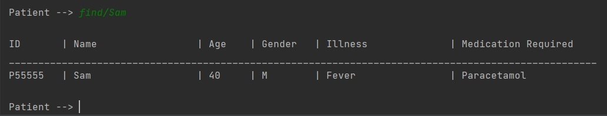
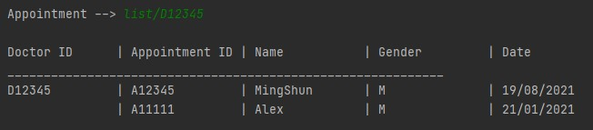

# HealthVault User Guide

<p align="center">

</p>

## Opening Words

Welcome to HealthVault application's User Guide!

The purpose of this User Guide is to assist you in the usage of the application. You will be able to utilize all the features of the HealthVault application to create the most efficient healthcare environment!

## Content Page
1. [Introduction](#1-introduction)
    1. [What is HealthVault?](#11-what-is-healthvault)
    2. [About the User Guide](#12-about-the-user-guide)
2. [How to use this guide](#2-how-to-use-the-guide)
    1. [Technical terms](#21-technical-terms)
    2. [Symbols & Icons](#22-symbols--icons)
3. [Getting Started](#3-getting-started)
    1. [Introduction to Command Line Interface (CLI)](#31-introduction-to-command-line-interface-cli)
    2. [Installation Guide](#-32-installation-guide)
4. [Start Menu](#4-start-menu)
    1. [Interpreting help commands](#41-interpreting-help-commands)
5. [Features](#5-features)
    1. [Staff](#51-staff)
    2. [Patient](#52-patient)
    3. [Doctor's Appointment](#53-doctors-appointment)
    4. [Schedules for Nurses](#54-schedules-for-nurses)
    5. [Inventory](#55-inventory)
6. [FAQ](#6-faq)
7. [Command Summary](#7-command-summary)

## 1. Introduction

### 1.1 What is HealthVault?

To save a life is the top priority of any healthcare worker.
In such a precarious situation, every second matters and nurses cannot afford to waste time when they need to store or view critical information.

Introducing HealthVault, a hospital information recording system made for nurses. HealthVault is a desktop app for managing doctor, nurse, patient and inventory information, optimised for use through the command line interface. If the user can type fast, HealthVault brings both convenience and speed for nurses to view and store critical information.


In this application there are 5 main features that are provided for the user.
* **Staff:** Keeps record of and allows you to access staff information.
* **Patient:** Keeps record of and allows you to access patient information.
* **Doctor Appointments:** Keeps record of and allows you to create and view Doctor Appointments.
* **Nurse Schedules:** Keeps record of and allows you to create and view Nurse Schedules.
* **Inventory:** Keeps record of and allows you to view your current hospital inventory of supplies.

Each feature can be accessed by accessing its specific menu. For example, the Patient details can be accessed by accessing the Patient Menu from the Start Menu.

### 1.2 About the User Guide

This user guide helps you to understand how to use the HealthVault application by introducing the various commands and interfaces to you.
Various helpful screenshots from the application also help to guide you through the application.

This user guide will cover the following:
* How to set up the application
* How to use Command Line Interface (CLI)
* Helpful tips on how to use the guide
* How to use each of the features
* Frequently asked questions


<br/><br/>

## 2. How to use the guide

### 2.1 Technical Terms

&nbsp;&nbsp;&nbsp;&nbsp;&nbsp;&nbsp;&nbsp;&nbsp; **Command Line Interface** - Accessing the functionalities of a computer program in the form of lines of text.

&nbsp;&nbsp;&nbsp;&nbsp;&nbsp;&nbsp;&nbsp;&nbsp; **Graphical User Interface** - Allows users to interact with the functionalities of a computer program through graphical icons.

&nbsp;&nbsp;&nbsp;&nbsp;&nbsp;&nbsp;&nbsp;&nbsp; and audio indicators, instead of text-based user interfaces, typed command labels or text navigation.

&nbsp;&nbsp;&nbsp;&nbsp;&nbsp;&nbsp;&nbsp;&nbsp; **Case Sensitive** - Differentiating between capital and lower-case letters.

&nbsp;&nbsp;&nbsp;&nbsp;&nbsp;&nbsp;&nbsp;&nbsp; **User Input** - Any information or data sent to a computer by the user using the application.

&nbsp;&nbsp;&nbsp;&nbsp;&nbsp;&nbsp;&nbsp;&nbsp; **Alphanumeric** - Consisting of only alphabets and numerals.

&nbsp;&nbsp;&nbsp;&nbsp;&nbsp;&nbsp;&nbsp;&nbsp; **Delimiter** - A character that separates different sections of a text or input.

&nbsp;&nbsp;&nbsp;&nbsp;&nbsp;&nbsp;&nbsp;&nbsp; **Illegal Characters** - A character that is neither an alphabet nor a number.

### 2.2 Symbols & Icons

&nbsp;&nbsp;&nbsp;&nbsp;&nbsp;&nbsp;&nbsp;&nbsp; **[ ]** - Square brackets for compulsory user inputs.

&nbsp;&nbsp;&nbsp;&nbsp;&nbsp;&nbsp;&nbsp;&nbsp; **<>** - Angled quotation marks for optional user inputs.


&nbsp;&nbsp;&nbsp;&nbsp;&nbsp;&nbsp;&nbsp;&nbsp; :information_source: This icon denotes an important piece of information to take note of.

&nbsp;&nbsp;&nbsp;&nbsp;&nbsp;&nbsp;&nbsp;&nbsp; :exclamation: Warning sign to inform user against doing certain actions.

<br/><br/>

## 3. Getting Started

### 3.1 Introduction to Command Line Interface (CLI)

HealthVault uses the Command Line Interface (CLI) to run, and it is the primary input method for interacting with HealthVault.

As CLI is not commonly used, this section hopes to orientate you with the CLI environment if you are new, and acts as a refresher for returning users.

CLI takes in a user input from the input marker as shown in the image included below. The red arrow points to where the users input will appear.


After keying in their input, the most common way to enter the response into the system is to press the <kbd>Enter</kbd> key for the command to be registered.


### <a name="section2"> 3.2 Installation Guide

1. Ensure the system has Java 11 installed.

2. Download the latest JAR file from this [website](https://github.com/AY2021S2-CS2113T-F08-2/tp/releases).

3. Open the command window.
    - Click the search icon in the bottom left side of the screen.
    - Type ‘command prompt’ in the search bar.
    - Select the application called ‘Command Prompt’.

4. `cd` into the folder containing the JAR file.
    - Locate the file path of the JAR file that you have downloaded.
    - For example:  (C:\Users\JohnDoe\Downloads), where JohnDoe is the user’s name.
    - Then, run the following command: `cd [File Path]`.
    - Example: `cd C:\Users\JohnDoe\Downloads`.
    - Run the following command: `java -jar [JAR file name]`.

:information_source: HealthVault is optimized for screen sizes with the following specifications: 1450px (width) x 600px (height).
Using smaller screen sizes and dimensions may result in a suboptimal viewing experience for various functionalities.
<br/><br/>

## 4. Start Menu

The Start Menu is the first menu you will encounter upon running the application after following the installation guide in [section 3](#section3).

Here is an example of how the welcome screen of HealthVault will look like.


The Start Menu allows you to access various Menus in the application based on the feature that you would like to access.

For example, the Staff Menu allows you to access the Staff feature within the database.

The welcome screen of HealthVault presents you with the basic commands and a description of their functionalities.

Input any command to access the respective features and input the `exit` command to quit the application.

### 4.1 Interpreting help commands

:information_source: All instances of commands and code will be highlighted in grey and will have a different font.

This is an example of a typical help command in the application.


The **Commands** column gives the command that allows you to accomplish a certain action with the relevant features.
For example, the `add` command allows you to add a new staff and their relevant details into the database.

The **Description** column gives you an explanation on the usage and purpose of the command.

The **Format** column gives the appropriate format for you to use the command.
For example, the `add` format requires specific details regarding the staff that will be added into the database.
The '-' in the format column specifies that the command can be used alone without any additional details.

The detailed explanation of each command will be explained in the subsequent sections.

<br/><br/>

## 5. Features

:exclamation: **WARNING: You are recommended not to edit any text files generated by HealthVault manually.**

### 5.1 Staff

The functions in Staff menu allow you, the nurse, to access and modify the details of each staff in the hospital.
(Note for Staff ID: D/N = Doctor/Nurse)

This is an example of the welcome screen for Staff Menu.


<br/><br/>

#### Adding a new staff: `add`
&nbsp;&nbsp;&nbsp;&nbsp;&nbsp;&nbsp;&nbsp;&nbsp; Adds a new doctor or nurse to the respective staff lists.

&nbsp;&nbsp;&nbsp;&nbsp;&nbsp;&nbsp;&nbsp;&nbsp; **Format**:

&nbsp;&nbsp;&nbsp;&nbsp;&nbsp;&nbsp;&nbsp;&nbsp;&nbsp;&nbsp;&nbsp;&nbsp;&nbsp;&nbsp;&nbsp;&nbsp; `add/[Staff ID]/[Name]/[Age]/[Specialisation]`

>:information_source: Important notes about the input format
>1. Make sure that the inputted user ID starts with an upper case D (for doctor ID) or upper case N (for nurse ID) and has **exactly** 5 digits in the number following!
>
> &nbsp;&nbsp;&nbsp;&nbsp;&nbsp;&nbsp;&nbsp; **Example**: `N12345`, `D54321`
>
>2. Any input field in HealthVault only accepts space and alphanumeric characters.
>3. The age field input should be a positive integer starting from 18 to inclusive of 150.
>4. Specialisation is able to take in integer values but not illegal characters.


&nbsp;&nbsp;&nbsp;&nbsp;&nbsp;&nbsp;&nbsp;&nbsp; **Example of usage**:<br/>

&nbsp;&nbsp;&nbsp;&nbsp;&nbsp;&nbsp;&nbsp;&nbsp;&nbsp;&nbsp;&nbsp;&nbsp;&nbsp;&nbsp;&nbsp;&nbsp; Adding a Pediatrician, Doctor MingShun with Staff ID of D12345 of age 30.

&nbsp;&nbsp;&nbsp;&nbsp;&nbsp;&nbsp;&nbsp;&nbsp;&nbsp;&nbsp;&nbsp;&nbsp;&nbsp;&nbsp;&nbsp;&nbsp; ``` Staff --> add/D12345/MingShun/30/Pediatrician```

&nbsp;&nbsp;&nbsp;&nbsp;&nbsp;&nbsp;&nbsp;&nbsp; **Expected Outcome**:

&nbsp;&nbsp;&nbsp;&nbsp;&nbsp;&nbsp;&nbsp;&nbsp; 

<br/><br/>

#### Deleting a staff: `delete`

&nbsp;&nbsp;&nbsp;&nbsp;&nbsp;&nbsp;&nbsp;&nbsp; Deletes a staff from the staff list.

&nbsp;&nbsp;&nbsp;&nbsp;&nbsp;&nbsp;&nbsp;&nbsp; **Format**:

&nbsp;&nbsp;&nbsp;&nbsp;&nbsp;&nbsp;&nbsp;&nbsp;&nbsp;&nbsp;&nbsp;&nbsp;&nbsp;&nbsp;&nbsp;&nbsp; `delete/[Staff ID]`

>:information_source: Important notes about the input format
>1. Make sure that the inputted user ID starts with an upper case D (for doctor ID) or upper case N (for nurse ID) and has **exactly** 5 digits in the number following!
>
> &nbsp;&nbsp;&nbsp;&nbsp;&nbsp;&nbsp;&nbsp; **Example**: `N12345`, `D54321`
>

&nbsp;&nbsp;&nbsp;&nbsp;&nbsp;&nbsp;&nbsp;&nbsp; **Example of usage**:

&nbsp;&nbsp;&nbsp;&nbsp;&nbsp;&nbsp;&nbsp;&nbsp;&nbsp;&nbsp;&nbsp;&nbsp;&nbsp;&nbsp;&nbsp;&nbsp; Deleting Staff with ID D12345.

&nbsp;&nbsp;&nbsp;&nbsp;&nbsp;&nbsp;&nbsp;&nbsp;&nbsp;&nbsp;&nbsp;&nbsp;&nbsp;&nbsp;&nbsp;&nbsp; ```Staff --> delete/D12345 ```

&nbsp;&nbsp;&nbsp;&nbsp;&nbsp;&nbsp;&nbsp;&nbsp; **Expected Outcome**:

&nbsp;&nbsp;&nbsp;&nbsp;&nbsp;&nbsp;&nbsp;&nbsp;

<br/><br/>

#### Listing all doctors or nurses: `list`
&nbsp;&nbsp;&nbsp;&nbsp;&nbsp;&nbsp;&nbsp;&nbsp; Lists either all doctors or all nurses.

&nbsp;&nbsp;&nbsp;&nbsp;&nbsp;&nbsp;&nbsp;&nbsp; **Format**:

&nbsp;&nbsp;&nbsp;&nbsp;&nbsp;&nbsp;&nbsp;&nbsp;&nbsp;&nbsp;&nbsp;&nbsp;&nbsp;&nbsp;&nbsp;&nbsp; `list/<doctors/nurses>`

>:information_source: Important notes about the input format
>1. <> implies that the inputs are optional.
>
> &nbsp;&nbsp;&nbsp;&nbsp;&nbsp;&nbsp;&nbsp; **Example**: `list`, `list/doctors`

&nbsp;&nbsp;&nbsp;&nbsp;&nbsp;&nbsp;&nbsp;&nbsp; **Example of usage (doctors)**:

&nbsp;&nbsp;&nbsp;&nbsp;&nbsp;&nbsp;&nbsp;&nbsp;&nbsp;&nbsp;&nbsp;&nbsp;&nbsp;&nbsp;&nbsp;&nbsp; List all Doctors Details.

&nbsp;&nbsp;&nbsp;&nbsp;&nbsp;&nbsp;&nbsp;&nbsp;&nbsp;&nbsp;&nbsp;&nbsp;&nbsp;&nbsp;&nbsp;&nbsp; ```Staff --> list/doctors ```

&nbsp;&nbsp;&nbsp;&nbsp;&nbsp;&nbsp;&nbsp;&nbsp; **Expected Outcome (doctors)**:

&nbsp;&nbsp;&nbsp;&nbsp;&nbsp;&nbsp;&nbsp;&nbsp;


&nbsp;&nbsp;&nbsp;&nbsp;&nbsp;&nbsp;&nbsp;&nbsp; **Example of usage (nurses)**:

&nbsp;&nbsp;&nbsp;&nbsp;&nbsp;&nbsp;&nbsp;&nbsp;&nbsp;&nbsp;&nbsp;&nbsp;&nbsp;&nbsp;&nbsp;&nbsp; List all Nurses Details.

&nbsp;&nbsp;&nbsp;&nbsp;&nbsp;&nbsp;&nbsp;&nbsp;&nbsp;&nbsp;&nbsp;&nbsp;&nbsp;&nbsp;&nbsp;&nbsp; ```Staff --> list/nurses ```

&nbsp;&nbsp;&nbsp;&nbsp;&nbsp;&nbsp;&nbsp;&nbsp; **Expected Outcome (nurses)**:

&nbsp;&nbsp;&nbsp;&nbsp;&nbsp;&nbsp;&nbsp;&nbsp;


&nbsp;&nbsp;&nbsp;&nbsp;&nbsp;&nbsp;&nbsp;&nbsp; **Example of usage (no input)**:

&nbsp;&nbsp;&nbsp;&nbsp;&nbsp;&nbsp;&nbsp;&nbsp;&nbsp;&nbsp;&nbsp;&nbsp;&nbsp;&nbsp;&nbsp;&nbsp; List all Staff Details.

&nbsp;&nbsp;&nbsp;&nbsp;&nbsp;&nbsp;&nbsp;&nbsp;&nbsp;&nbsp;&nbsp;&nbsp;&nbsp;&nbsp;&nbsp;&nbsp; ```Staff --> list```

&nbsp;&nbsp;&nbsp;&nbsp;&nbsp;&nbsp;&nbsp;&nbsp; **Expected Outcome(no input)**:

&nbsp;&nbsp;&nbsp;&nbsp;&nbsp;&nbsp;&nbsp;&nbsp;

<br/><br/>


#### Finding a staff: `find`
&nbsp;&nbsp;&nbsp;&nbsp;&nbsp;&nbsp;&nbsp;&nbsp; Find a staff from the staff list with a keyword.

&nbsp;&nbsp;&nbsp;&nbsp;&nbsp;&nbsp;&nbsp;&nbsp; **Format**:

&nbsp;&nbsp;&nbsp;&nbsp;&nbsp;&nbsp;&nbsp;&nbsp;&nbsp;&nbsp;&nbsp;&nbsp;&nbsp;&nbsp;&nbsp;&nbsp; `find/[keyword]`

>:information_source: Important notes about the input format
>1. Any keyword input will be searched through every field of Staff details. i.e. It can be used to search Staff ID, name, age and specialisation.
>
> &nbsp;&nbsp;&nbsp;&nbsp;&nbsp;&nbsp;&nbsp; **Example**: `find/19`, `find/D12345`

&nbsp;&nbsp;&nbsp;&nbsp;&nbsp;&nbsp;&nbsp;&nbsp; **Example of usage**:

&nbsp;&nbsp;&nbsp;&nbsp;&nbsp;&nbsp;&nbsp;&nbsp;&nbsp;&nbsp;&nbsp;&nbsp;&nbsp;&nbsp;&nbsp;&nbsp; Find all Staff with Oncology specialisation.

&nbsp;&nbsp;&nbsp;&nbsp;&nbsp;&nbsp;&nbsp;&nbsp;&nbsp;&nbsp;&nbsp;&nbsp;&nbsp;&nbsp;&nbsp;&nbsp; ```Staff --> find/Oncology```

&nbsp;&nbsp;&nbsp;&nbsp;&nbsp;&nbsp;&nbsp;&nbsp; **Expected Outcome**:

&nbsp;&nbsp;&nbsp;&nbsp;&nbsp;&nbsp;&nbsp;&nbsp; 
<br/><br/>

#### Returning to Start Menu: `return`

&nbsp;&nbsp;&nbsp;&nbsp;&nbsp;&nbsp;&nbsp;&nbsp; Return you to the Start Menu.

&nbsp;&nbsp;&nbsp;&nbsp;&nbsp;&nbsp;&nbsp;&nbsp; **Expected Outcome**:

&nbsp;&nbsp;&nbsp;&nbsp;&nbsp;&nbsp;&nbsp;&nbsp;

#### Help: `help`

&nbsp;&nbsp;&nbsp;&nbsp;&nbsp;&nbsp;&nbsp;&nbsp; Display the commands for the Staff Menu.

&nbsp;&nbsp;&nbsp;&nbsp;&nbsp;&nbsp;&nbsp;&nbsp; **Expected Outcome**:

&nbsp;&nbsp;&nbsp;&nbsp;&nbsp;&nbsp;&nbsp;&nbsp;

<br/><br/>
### 5.2 Patient

The functions in the Patient menu allow you, the nurse, to add, view, find, and delete patients in the patient list.

When you first enter the Patient menu, you will be greeted with the following welcome message.


<br/><br/>

#### Adding a new patient: `add`
&nbsp;&nbsp;&nbsp;&nbsp;&nbsp;&nbsp;&nbsp;&nbsp; Adds a new patient to the patient list.

&nbsp;&nbsp;&nbsp;&nbsp;&nbsp;&nbsp;&nbsp;&nbsp; **Format**:

&nbsp;&nbsp;&nbsp;&nbsp;&nbsp;&nbsp;&nbsp;&nbsp;&nbsp;&nbsp;&nbsp;&nbsp;&nbsp;&nbsp;&nbsp;&nbsp; `add/[Patient ID]/[Name]/[Age]/[Gender]/[Illness]/[Items needed]`

>:information_source: Important notes about the input format
>
>1. Make sure that the inputted user ID starts with an upper case P and has **exactly** 5 digits in the number following!
>
> &nbsp;&nbsp;&nbsp;&nbsp;&nbsp;&nbsp;&nbsp; **Example**: `P12345`, `P54321`
>
>2. Any input field in HealthVault only accepts space and alphanumeric characters.
>3. The gender field input is case-insensitive but should only be "M", "F" or "Others" or any other upper and lower case versions.
>4. The age field input should be a positive integer including 0, starting from 0 to inclusive of 150.

&nbsp;&nbsp;&nbsp;&nbsp;&nbsp;&nbsp;&nbsp;&nbsp; **Example of usage**:

&nbsp;&nbsp;&nbsp;&nbsp;&nbsp;&nbsp;&nbsp;&nbsp;&nbsp;&nbsp;&nbsp;&nbsp;&nbsp;&nbsp;&nbsp;&nbsp; Adding a Patient Sam (Age 40, Male who is having a fever and needs Paracetamol) with the Patient ID of P55555.

&nbsp;&nbsp;&nbsp;&nbsp;&nbsp;&nbsp;&nbsp;&nbsp;&nbsp;&nbsp;&nbsp;&nbsp;&nbsp;&nbsp;&nbsp;&nbsp; ``` Patient --> add/P55555/Sam/40/M/Fever/Paracetamol```

&nbsp;&nbsp;&nbsp;&nbsp;&nbsp;&nbsp;&nbsp;&nbsp; **Expected Outcome**:

&nbsp;&nbsp;&nbsp;&nbsp;&nbsp;&nbsp;&nbsp;&nbsp; 

<br/><br/>

#### Deleting a patient: `delete`
&nbsp;&nbsp;&nbsp;&nbsp;&nbsp;&nbsp;&nbsp;&nbsp; Deletes a patient from the patient list.

&nbsp;&nbsp;&nbsp;&nbsp;&nbsp;&nbsp;&nbsp;&nbsp; **Format**:

&nbsp;&nbsp;&nbsp;&nbsp;&nbsp;&nbsp;&nbsp;&nbsp;&nbsp;&nbsp;&nbsp;&nbsp;&nbsp;&nbsp;&nbsp;&nbsp; `delete/[Patient ID]`

>:information_source: Important notes about the input format
>
>1. Make sure that the inputted user ID starts with an upper case P and has **exactly** 5 digits in the number following!
>
> &nbsp;&nbsp;&nbsp;&nbsp;&nbsp;&nbsp;&nbsp; **Example**: `P12345`, `P54321`
>

&nbsp;&nbsp;&nbsp;&nbsp;&nbsp;&nbsp;&nbsp;&nbsp; **Example of usage**:

&nbsp;&nbsp;&nbsp;&nbsp;&nbsp;&nbsp;&nbsp;&nbsp;&nbsp;&nbsp;&nbsp;&nbsp;&nbsp;&nbsp;&nbsp;&nbsp; ```Patient --> delete/P55555```

&nbsp;&nbsp;&nbsp;&nbsp;&nbsp;&nbsp;&nbsp;&nbsp; **Expected Outcome**:

&nbsp;&nbsp;&nbsp;&nbsp;&nbsp;&nbsp;&nbsp;&nbsp; 

<br/><br/>

#### Listing all patients: `list`

&nbsp;&nbsp;&nbsp;&nbsp;&nbsp;&nbsp;&nbsp;&nbsp; Lists all patients in the patient list.

&nbsp;&nbsp;&nbsp;&nbsp;&nbsp;&nbsp;&nbsp;&nbsp; **Format**:

&nbsp;&nbsp;&nbsp;&nbsp;&nbsp;&nbsp;&nbsp;&nbsp;&nbsp;&nbsp;&nbsp;&nbsp;&nbsp;&nbsp;&nbsp;&nbsp; `list`

&nbsp;&nbsp;&nbsp;&nbsp;&nbsp;&nbsp;&nbsp;&nbsp; **Example of usage**:

&nbsp;&nbsp;&nbsp;&nbsp;&nbsp;&nbsp;&nbsp;&nbsp;&nbsp;&nbsp;&nbsp;&nbsp;&nbsp;&nbsp;&nbsp;&nbsp; ``` Patient --> list```

&nbsp;&nbsp;&nbsp;&nbsp;&nbsp;&nbsp;&nbsp;&nbsp; **Expected Outcome**:

&nbsp;&nbsp;&nbsp;&nbsp;&nbsp;&nbsp;&nbsp;&nbsp; 

<br/><br/>

#### Finding a patient: `find`
&nbsp;&nbsp;&nbsp;&nbsp;&nbsp;&nbsp;&nbsp;&nbsp; Finds a patient currently in the patient list.

&nbsp;&nbsp;&nbsp;&nbsp;&nbsp;&nbsp;&nbsp;&nbsp; **Format**:

&nbsp;&nbsp;&nbsp;&nbsp;&nbsp;&nbsp;&nbsp;&nbsp;&nbsp;&nbsp;&nbsp;&nbsp;&nbsp;&nbsp;&nbsp;&nbsp; `find/[Keyword/Phrase]`

>:information_source: Important notes about the input format
>1. Any keyword inputted will be searched through every field of Patient details. i.e. It can be used to search Patient ID, name, age, illness, medication required.
>
> &nbsp;&nbsp;&nbsp;&nbsp;&nbsp;&nbsp;&nbsp; **Example**: `find/19`, `find/P12345`
>
> The keyword input can be case-insensitive and still find matches in the database.
>
> &nbsp;&nbsp;&nbsp;&nbsp;&nbsp;&nbsp;&nbsp; **Example**: `find/john` is able to match with a name field "John" or "JOHN".

&nbsp;&nbsp;&nbsp;&nbsp;&nbsp;&nbsp;&nbsp;&nbsp; **Example of usage**:

&nbsp;&nbsp;&nbsp;&nbsp;&nbsp;&nbsp;&nbsp;&nbsp;&nbsp;&nbsp;&nbsp;&nbsp;&nbsp;&nbsp;&nbsp;&nbsp; Finding through inputting the ID.

&nbsp;&nbsp;&nbsp;&nbsp;&nbsp;&nbsp;&nbsp;&nbsp;&nbsp;&nbsp;&nbsp;&nbsp;&nbsp;&nbsp;&nbsp;&nbsp; ``` Patient --> find/P54321```

&nbsp;&nbsp;&nbsp;&nbsp;&nbsp;&nbsp;&nbsp;&nbsp; **Expected Outcome**:

&nbsp;&nbsp;&nbsp;&nbsp;&nbsp;&nbsp;&nbsp;&nbsp; 

&nbsp;&nbsp;&nbsp;&nbsp;&nbsp;&nbsp;&nbsp;&nbsp; **Example of usage**:

&nbsp;&nbsp;&nbsp;&nbsp;&nbsp;&nbsp;&nbsp;&nbsp;&nbsp;&nbsp;&nbsp;&nbsp;&nbsp;&nbsp;&nbsp;&nbsp; Finding through inputting the name.

&nbsp;&nbsp;&nbsp;&nbsp;&nbsp;&nbsp;&nbsp;&nbsp;&nbsp;&nbsp;&nbsp;&nbsp;&nbsp;&nbsp;&nbsp;&nbsp; ``` Patient --> find/Sam```

&nbsp;&nbsp;&nbsp;&nbsp;&nbsp;&nbsp;&nbsp;&nbsp; **Expected Outcome**:

&nbsp;&nbsp;&nbsp;&nbsp;&nbsp;&nbsp;&nbsp;&nbsp; 

<br/><br/>

#### Help: `help`

&nbsp;&nbsp;&nbsp;&nbsp;&nbsp;&nbsp;&nbsp;&nbsp; Display the commands for the Patient Menu.

&nbsp;&nbsp;&nbsp;&nbsp;&nbsp;&nbsp;&nbsp;&nbsp; **Expected Outcome**:

&nbsp;&nbsp;&nbsp;&nbsp;&nbsp;&nbsp;&nbsp;&nbsp; 

#### Returning to Start Menu: `return`

&nbsp;&nbsp;&nbsp;&nbsp;&nbsp;&nbsp;&nbsp;&nbsp; Return you to the Start Menu.

&nbsp;&nbsp;&nbsp;&nbsp;&nbsp;&nbsp;&nbsp;&nbsp; **Expected Outcome**:

&nbsp;&nbsp;&nbsp;&nbsp;&nbsp;&nbsp;&nbsp;&nbsp; 

<br/><br/>
### 5.3 Doctor's Appointment

The functions in the Doctors' Appointment menu allow you, the nurse, to add, view, and delete appointments made with a specific doctor.

This is an example of the welcome screen for Doctors' Appointment Menu.


<br/><br/>

#### Adding an appointment: `add`
&nbsp;&nbsp;&nbsp;&nbsp;&nbsp;&nbsp;&nbsp;&nbsp; Adds a new doctor's appointment to the list of appointments.

&nbsp;&nbsp;&nbsp;&nbsp;&nbsp;&nbsp;&nbsp;&nbsp; **Format**:

&nbsp;&nbsp;&nbsp;&nbsp;&nbsp;&nbsp;&nbsp;&nbsp;&nbsp;&nbsp;&nbsp;&nbsp;&nbsp;&nbsp;&nbsp;&nbsp; `add/[Doctor ID]/[Appointment ID]/[Patient’s Name]/[Gender]/[DDMMYYYY]`

>:information_source: Important notes about the input format
>1. Make sure that the inputted doctor/appointment ID starts with an upper case D/A and has **exactly** 5 digits in the number following!
>
> &nbsp;&nbsp;&nbsp;&nbsp;&nbsp;&nbsp;&nbsp; **Example**: `D12345`, `A54321`
>
>2. Any input fields in HealthVault only accepts space and alphanumeric characters.
>3. The gender field input should only be "M", "F".
>4. This function **allows** the adding of past appointments, **Example**: `add/D12345/A12345/Alex/M/21011998`.


&nbsp;&nbsp;&nbsp;&nbsp;&nbsp;&nbsp;&nbsp;&nbsp; **Example of usage**:<br/>

&nbsp;&nbsp;&nbsp;&nbsp;&nbsp;&nbsp;&nbsp;&nbsp;&nbsp;&nbsp;&nbsp;&nbsp;&nbsp;&nbsp;&nbsp;&nbsp; Adding an appointment for Alex, a male, with Doctor ID D12345 on 21/01/2021.

&nbsp;&nbsp;&nbsp;&nbsp;&nbsp;&nbsp;&nbsp;&nbsp;&nbsp;&nbsp;&nbsp;&nbsp;&nbsp;&nbsp;&nbsp;&nbsp; ``` Appointments --> add/D12345/A12345/Alex/M/21012021```

&nbsp;&nbsp;&nbsp;&nbsp;&nbsp;&nbsp;&nbsp;&nbsp; **Expected Outcome**:

&nbsp;&nbsp;&nbsp;&nbsp;&nbsp;&nbsp;&nbsp;&nbsp; 

<br/><br/>

#### Deleting an appointment: `delete`
&nbsp;&nbsp;&nbsp;&nbsp;&nbsp;&nbsp;&nbsp;&nbsp; Deletes an appointment from the list of appointments or deletes all appointments belonging to a doctor.

&nbsp;&nbsp;&nbsp;&nbsp;&nbsp;&nbsp;&nbsp;&nbsp; **Format**:

&nbsp;&nbsp;&nbsp;&nbsp;&nbsp;&nbsp;&nbsp;&nbsp;&nbsp;&nbsp;&nbsp;&nbsp;&nbsp;&nbsp;&nbsp;&nbsp; `delete/[DoctorID/ Appointment ID]`

>:information_source: Important notes about the input format
>1. Make sure that the inputted doctor/appointment ID starts with an upper case D/A and has **exactly** 5 digits in the number following!
>
> &nbsp;&nbsp;&nbsp;&nbsp;&nbsp;&nbsp;&nbsp; **Example**: `D12345`, `A54321`
>

&nbsp;&nbsp;&nbsp;&nbsp;&nbsp;&nbsp;&nbsp;&nbsp; **Example of usage (Doctor ID)**:<br/>

&nbsp;&nbsp;&nbsp;&nbsp;&nbsp;&nbsp;&nbsp;&nbsp;&nbsp;&nbsp;&nbsp;&nbsp;&nbsp;&nbsp;&nbsp;&nbsp; Deleting all Appointments for Doctor with ID D12345.

&nbsp;&nbsp;&nbsp;&nbsp;&nbsp;&nbsp;&nbsp;&nbsp;&nbsp;&nbsp;&nbsp;&nbsp;&nbsp;&nbsp;&nbsp;&nbsp; ``` Appointments --> delete/D12345```

&nbsp;&nbsp;&nbsp;&nbsp;&nbsp;&nbsp;&nbsp;&nbsp; **Expected Outcome**:

&nbsp;&nbsp;&nbsp;&nbsp;&nbsp;&nbsp;&nbsp;&nbsp; 

&nbsp;&nbsp;&nbsp;&nbsp;&nbsp;&nbsp;&nbsp;&nbsp; **Example of usage (Appointment ID)**:<br/>

&nbsp;&nbsp;&nbsp;&nbsp;&nbsp;&nbsp;&nbsp;&nbsp;&nbsp;&nbsp;&nbsp;&nbsp;&nbsp;&nbsp;&nbsp;&nbsp; Deleting the Appointment with ID A54321

&nbsp;&nbsp;&nbsp;&nbsp;&nbsp;&nbsp;&nbsp;&nbsp;&nbsp;&nbsp;&nbsp;&nbsp;&nbsp;&nbsp;&nbsp;&nbsp; ``` Appointments --> delete/A54321```

&nbsp;&nbsp;&nbsp;&nbsp;&nbsp;&nbsp;&nbsp;&nbsp; **Expected Outcome**:

&nbsp;&nbsp;&nbsp;&nbsp;&nbsp;&nbsp;&nbsp;&nbsp; 

<br/><br/>

#### Listing an appointment: `list`
&nbsp;&nbsp;&nbsp;&nbsp;&nbsp;&nbsp;&nbsp;&nbsp; Lists all the appointments of a specific doctor or list an individual appointment.

&nbsp;&nbsp;&nbsp;&nbsp;&nbsp;&nbsp;&nbsp;&nbsp; **Format**:

&nbsp;&nbsp;&nbsp;&nbsp;&nbsp;&nbsp;&nbsp;&nbsp;&nbsp;&nbsp;&nbsp;&nbsp;&nbsp;&nbsp;&nbsp;&nbsp; `list/[all/ DoctorID/ Appointment ID]`

>:information_source: Important notes about the input format
>1. Make sure the input `all` is lower caps.
>2. Make sure that the inputted doctor/appointment ID starts with an upper case D/A and has **exactly** 5 digits in the number following!
>
> &nbsp;&nbsp;&nbsp;&nbsp;&nbsp;&nbsp;&nbsp; **Example**: `D12345`, `A54321`
>

&nbsp;&nbsp;&nbsp;&nbsp;&nbsp;&nbsp;&nbsp;&nbsp; **Example of usage (All)**:<br/>

&nbsp;&nbsp;&nbsp;&nbsp;&nbsp;&nbsp;&nbsp;&nbsp;&nbsp;&nbsp;&nbsp;&nbsp;&nbsp;&nbsp;&nbsp;&nbsp; Listing all Appointments currently in the database.

&nbsp;&nbsp;&nbsp;&nbsp;&nbsp;&nbsp;&nbsp;&nbsp;&nbsp;&nbsp;&nbsp;&nbsp;&nbsp;&nbsp;&nbsp;&nbsp; ``` Appointments --> list/all```

&nbsp;&nbsp;&nbsp;&nbsp;&nbsp;&nbsp;&nbsp;&nbsp; **Expected Outcome**:

&nbsp;&nbsp;&nbsp;&nbsp;&nbsp;&nbsp;&nbsp;&nbsp; 

&nbsp;&nbsp;&nbsp;&nbsp;&nbsp;&nbsp;&nbsp;&nbsp; **Example of usage (Doctor ID)**:<br/>

&nbsp;&nbsp;&nbsp;&nbsp;&nbsp;&nbsp;&nbsp;&nbsp;&nbsp;&nbsp;&nbsp;&nbsp;&nbsp;&nbsp;&nbsp;&nbsp; Listing all Appointments for Doctor with ID D12345.

&nbsp;&nbsp;&nbsp;&nbsp;&nbsp;&nbsp;&nbsp;&nbsp;&nbsp;&nbsp;&nbsp;&nbsp;&nbsp;&nbsp;&nbsp;&nbsp; ``` Appointments --> list/D12345```

&nbsp;&nbsp;&nbsp;&nbsp;&nbsp;&nbsp;&nbsp;&nbsp; **Expected Outcome**:

&nbsp;&nbsp;&nbsp;&nbsp;&nbsp;&nbsp;&nbsp;&nbsp; 

&nbsp;&nbsp;&nbsp;&nbsp;&nbsp;&nbsp;&nbsp;&nbsp; **Example of usage (Appointment ID)**:<br/>

&nbsp;&nbsp;&nbsp;&nbsp;&nbsp;&nbsp;&nbsp;&nbsp;&nbsp;&nbsp;&nbsp;&nbsp;&nbsp;&nbsp;&nbsp;&nbsp; List the Appointment with ID A12345.

&nbsp;&nbsp;&nbsp;&nbsp;&nbsp;&nbsp;&nbsp;&nbsp;&nbsp;&nbsp;&nbsp;&nbsp;&nbsp;&nbsp;&nbsp;&nbsp; ``` Appointments --> list/A12345```

&nbsp;&nbsp;&nbsp;&nbsp;&nbsp;&nbsp;&nbsp;&nbsp; **Expected Outcome**:

&nbsp;&nbsp;&nbsp;&nbsp;&nbsp;&nbsp;&nbsp;&nbsp; 

<br/><br/>

#### Returns to Start Menu: `return`
&nbsp;&nbsp;&nbsp;&nbsp;&nbsp;&nbsp;&nbsp;&nbsp; Returning to the Main Menu from the Doctor Appointment's Menu.

&nbsp;&nbsp;&nbsp;&nbsp;&nbsp;&nbsp;&nbsp;&nbsp; **Expected Outcome**:

&nbsp;&nbsp;&nbsp;&nbsp;&nbsp;&nbsp;&nbsp;&nbsp; 


#### Help: `help`
&nbsp;&nbsp;&nbsp;&nbsp;&nbsp;&nbsp;&nbsp;&nbsp; Display the commands for the Doctor Appointment's Menu.

&nbsp;&nbsp;&nbsp;&nbsp;&nbsp;&nbsp;&nbsp;&nbsp; **Expected Outcome**:

&nbsp;&nbsp;&nbsp;&nbsp;&nbsp;&nbsp;&nbsp;&nbsp; 

<br/><br/>
### 5.4 Schedules for Nurses

The functions in the Nurse Schedule menu allow you, the nurse, to add, view, and delete schedules of your nurses.

This is an example of the welcome screen for the Nurse Schedule Menu.


#### Adding a new schedule: `add`

&nbsp;&nbsp;&nbsp;&nbsp;&nbsp;&nbsp;&nbsp;&nbsp; Adds a new schedule to the list of nurse schedules.

&nbsp;&nbsp;&nbsp;&nbsp;&nbsp;&nbsp;&nbsp;&nbsp; **Format**:

&nbsp;&nbsp;&nbsp;&nbsp;&nbsp;&nbsp;&nbsp;&nbsp;&nbsp;&nbsp;&nbsp;&nbsp;&nbsp;&nbsp;&nbsp;&nbsp;  `add/[Nurse ID]/[Patient ID]/[Date (DDMMYYYY)]`

>:information_source: Important notes about the input format
>1. Make sure Nurse ID exists in Staff and Patient ID exists in Patients before adding.
>2. Make sure that the inputted user ID starts with a N for Nurse, P for Patient and has **exactly** 5 digits in the number following!
>
> &nbsp;&nbsp;&nbsp;&nbsp;&nbsp;&nbsp;&nbsp; **Example**: `N12345`, `P54321`
>
>3. Any input fields in HealthVault only accepts space and alphanumeric characters.
>4. HealthVault currently only allows the adding of **1** schedule per patient per day.

&nbsp;&nbsp;&nbsp;&nbsp;&nbsp;&nbsp;&nbsp;&nbsp; **Example of usage**:<br/>

&nbsp;&nbsp;&nbsp;&nbsp;&nbsp;&nbsp;&nbsp;&nbsp;&nbsp;&nbsp;&nbsp;&nbsp;&nbsp;&nbsp;&nbsp;&nbsp; Adding a schedule for Nurse ID N12345 to visit P12345 on 30/01/2020.

&nbsp;&nbsp;&nbsp;&nbsp;&nbsp;&nbsp;&nbsp;&nbsp;&nbsp;&nbsp;&nbsp;&nbsp;&nbsp;&nbsp;&nbsp;&nbsp; ``` NSchedule --> add/N12345/P12345/30012020 ```

&nbsp;&nbsp;&nbsp;&nbsp;&nbsp;&nbsp;&nbsp;&nbsp; **Expected Outcome**:

&nbsp;&nbsp;&nbsp;&nbsp;&nbsp;&nbsp;&nbsp;&nbsp; 

<br/><br/>


#### Deleting a schedule: `delete`
&nbsp;&nbsp;&nbsp;&nbsp;&nbsp;&nbsp;&nbsp;&nbsp; Deletes a schedule from the list of nurse schedules.

&nbsp;&nbsp;&nbsp;&nbsp;&nbsp;&nbsp;&nbsp;&nbsp; **Format**:

&nbsp;&nbsp;&nbsp;&nbsp;&nbsp;&nbsp;&nbsp;&nbsp;&nbsp;&nbsp;&nbsp;&nbsp;&nbsp;&nbsp;&nbsp;&nbsp; `delete/[Nurse ID]/[Date (DDMMYYYY)]`

>:information_source: Important notes about the input format
>
>1. Make sure that the inputted user ID starts with a N for Nurse, P for Patient and has **exactly** 5 digits in the number following!
>
> &nbsp;&nbsp;&nbsp;&nbsp;&nbsp;&nbsp;&nbsp; **Example**: `N12345`, `P54321`
>
>2. HealthVault only accepts valid Date inputs.

&nbsp;&nbsp;&nbsp;&nbsp;&nbsp;&nbsp;&nbsp;&nbsp; **Example of usage**:

&nbsp;&nbsp;&nbsp;&nbsp;&nbsp;&nbsp;&nbsp;&nbsp;&nbsp;&nbsp;&nbsp;&nbsp;&nbsp;&nbsp;&nbsp;&nbsp; Deletes a schedule with the specified Nurse ID and Date.

&nbsp;&nbsp;&nbsp;&nbsp;&nbsp;&nbsp;&nbsp;&nbsp;&nbsp;&nbsp;&nbsp;&nbsp;&nbsp;&nbsp;&nbsp;&nbsp; ``` NSchedule --> delete/N12345/30012020 ```

&nbsp;&nbsp;&nbsp;&nbsp;&nbsp;&nbsp;&nbsp;&nbsp; **Expected Outcome**:

&nbsp;&nbsp;&nbsp;&nbsp;&nbsp;&nbsp;&nbsp;&nbsp; 

<br/><br/>

#### Listing schedules: `list`
&nbsp;&nbsp;&nbsp;&nbsp;&nbsp;&nbsp;&nbsp;&nbsp; List either all schedules or specified Nurse ID's schedule.

&nbsp;&nbsp;&nbsp;&nbsp;&nbsp;&nbsp;&nbsp;&nbsp; **Format**:

&nbsp;&nbsp;&nbsp;&nbsp;&nbsp;&nbsp;&nbsp;&nbsp;&nbsp;&nbsp;&nbsp;&nbsp;&nbsp;&nbsp;&nbsp;&nbsp; `list/[Nurse ID/all]`

>:information_source: Important notes about the input format
>
>1. Make sure that the inputted user ID starts with a N for Nurse, P for Patient and has **exactly** 5 digits in the number following!
>
>&nbsp;&nbsp;&nbsp;&nbsp;&nbsp;&nbsp;&nbsp; **Example**: `N12345`, `P54321`

&nbsp;&nbsp;&nbsp;&nbsp;&nbsp;&nbsp;&nbsp;&nbsp; **Example of usage(Nurse ID)**:

&nbsp;&nbsp;&nbsp;&nbsp;&nbsp;&nbsp;&nbsp;&nbsp;&nbsp;&nbsp;&nbsp;&nbsp;&nbsp;&nbsp;&nbsp;&nbsp; Listing all schedules of specified Nurse ID.

&nbsp;&nbsp;&nbsp;&nbsp;&nbsp;&nbsp;&nbsp;&nbsp;&nbsp;&nbsp;&nbsp;&nbsp;&nbsp;&nbsp;&nbsp;&nbsp; ``` NSchedule --> list/N12345 ```

&nbsp;&nbsp;&nbsp;&nbsp;&nbsp;&nbsp;&nbsp;&nbsp; **Expected Outcome(Nurse ID)**:

&nbsp;&nbsp;&nbsp;&nbsp;&nbsp;&nbsp;&nbsp;&nbsp; 

<br/>

&nbsp;&nbsp;&nbsp;&nbsp;&nbsp;&nbsp;&nbsp;&nbsp; **Example of usage(all)**:

&nbsp;&nbsp;&nbsp;&nbsp;&nbsp;&nbsp;&nbsp;&nbsp;&nbsp;&nbsp;&nbsp;&nbsp;&nbsp;&nbsp;&nbsp;&nbsp; Listing all schedules.

&nbsp;&nbsp;&nbsp;&nbsp;&nbsp;&nbsp;&nbsp;&nbsp;&nbsp;&nbsp;&nbsp;&nbsp;&nbsp;&nbsp;&nbsp;&nbsp; ``` NSchedule --> list/all ```

&nbsp;&nbsp;&nbsp;&nbsp;&nbsp;&nbsp;&nbsp;&nbsp; **Expected Outcome(all)**:

&nbsp;&nbsp;&nbsp;&nbsp;&nbsp;&nbsp;&nbsp;&nbsp; 

<br/><br/>

#### Returning to Start Menu: `return`

&nbsp;&nbsp;&nbsp;&nbsp;&nbsp;&nbsp;&nbsp;&nbsp; Returns to Start Menu.

&nbsp;&nbsp;&nbsp;&nbsp;&nbsp;&nbsp;&nbsp;&nbsp; **Expected Outcome**:

&nbsp;&nbsp;&nbsp;&nbsp;&nbsp;&nbsp;&nbsp;&nbsp; 

#### Help: `help`

&nbsp;&nbsp;&nbsp;&nbsp;&nbsp;&nbsp;&nbsp;&nbsp; Prints Nurse Schedule help message.

&nbsp;&nbsp;&nbsp;&nbsp;&nbsp;&nbsp;&nbsp;&nbsp; **Expected Outcome**:

&nbsp;&nbsp;&nbsp;&nbsp;&nbsp;&nbsp;&nbsp;&nbsp; 

<br/><br/>

### 5.5 Inventory

The functions in the Inventory menu allow you, the nurse, to add, view, and delete Inventory existing in your inventory.

This is an example of the welcome screen for the Inventory Menu.


#### Adding to Inventory: `add`

&nbsp;&nbsp;&nbsp;&nbsp;&nbsp;&nbsp;&nbsp;&nbsp; Adds a new item or increase the quantity of an existing item in the inventory.

&nbsp;&nbsp;&nbsp;&nbsp;&nbsp;&nbsp;&nbsp;&nbsp; **Format**:

&nbsp;&nbsp;&nbsp;&nbsp;&nbsp;&nbsp;&nbsp;&nbsp;&nbsp;&nbsp;&nbsp;&nbsp;&nbsp;&nbsp;&nbsp;&nbsp;  `add/[Name]/[Price]/[Quantity]`

>:information_source: Important notes about the input format
>
>1. Make sure that the inputted price is valid and does not have more than 2 decimal places!
>
> &nbsp;&nbsp;&nbsp;&nbsp;&nbsp;&nbsp;&nbsp; **Example**: `3`, `3.0`, `3.00`
>
>2. A valid price is any positive double including 0.00, starting from 0.00 and inlcuding 1000000.00
>
>3. A valid quantity is any positive interger including 0, starting from 0 and inlcuding 1000000
>
>4. Any input fields in HealthVault only accepts space and alphanumeric characters!
>
>5. Note that the examples for adding a new item and increasing the quantity of an existing item are related!
>
>6. Avoid using upper case letters!

&nbsp;&nbsp;&nbsp;&nbsp;&nbsp;&nbsp;&nbsp;&nbsp; **1. Example of usage(add a new item)**:

&nbsp;&nbsp;&nbsp;&nbsp;&nbsp;&nbsp;&nbsp;&nbsp;&nbsp;&nbsp;&nbsp;&nbsp;&nbsp;&nbsp;&nbsp;&nbsp; ```Inventory --> add/paracetamol/3/90```

&nbsp;&nbsp;&nbsp;&nbsp;&nbsp;&nbsp;&nbsp;&nbsp; **Expected Outcome**:

&nbsp;&nbsp;&nbsp;&nbsp;&nbsp;&nbsp;&nbsp;&nbsp; 

&nbsp;&nbsp;&nbsp;&nbsp;&nbsp;&nbsp;&nbsp;&nbsp; **List example**:

```
ItemName        | Price      | Quantity
------------------------------------------------------------
paracetamol     | 3.00       | 90
```

&nbsp;&nbsp;&nbsp;&nbsp;&nbsp;&nbsp;&nbsp;&nbsp; **1. Example of usage(increases quantity of existing item)**:

&nbsp;&nbsp;&nbsp;&nbsp;&nbsp;&nbsp;&nbsp;&nbsp;&nbsp;&nbsp;&nbsp;&nbsp;&nbsp;&nbsp;&nbsp;&nbsp; ```Inventory --> add/paracetamol/3/50```

&nbsp;&nbsp;&nbsp;&nbsp;&nbsp;&nbsp;&nbsp;&nbsp; **Expected Outcome**:

&nbsp;&nbsp;&nbsp;&nbsp;&nbsp;&nbsp;&nbsp;&nbsp; 

&nbsp;&nbsp;&nbsp;&nbsp;&nbsp;&nbsp;&nbsp;&nbsp; **List example**:

```
ItemName        | Price      | Quantity
------------------------------------------------------------
paracetamol     | 3.00       | 140
```

<br/><br/>

#### Deleting an item: `delete`
&nbsp;&nbsp;&nbsp;&nbsp;&nbsp;&nbsp;&nbsp;&nbsp; Decreases the quantity of an existing item in the inventory list.

>:information_source: Important notes about the format
>1. Note that the example from add(increasing quantity of existing item) feature is used for this feature's example!
>
>2. Avoid using uppercase letters
>
>3. The clauses for a valid quantity follow that from the add command.

&nbsp;&nbsp;&nbsp;&nbsp;&nbsp;&nbsp;&nbsp;&nbsp; **Format**:

&nbsp;&nbsp;&nbsp;&nbsp;&nbsp;&nbsp;&nbsp;&nbsp;&nbsp;&nbsp;&nbsp;&nbsp;&nbsp;&nbsp;&nbsp;&nbsp;  `delete/[Name]/[Quantity]`

&nbsp;&nbsp;&nbsp;&nbsp;&nbsp;&nbsp;&nbsp;&nbsp; **Example of usage**:

&nbsp;&nbsp;&nbsp;&nbsp;&nbsp;&nbsp;&nbsp;&nbsp;&nbsp;&nbsp;&nbsp;&nbsp;&nbsp;&nbsp;&nbsp;&nbsp; ```Inventory --> delete/paracetamol/20```

&nbsp;&nbsp;&nbsp;&nbsp;&nbsp;&nbsp;&nbsp;&nbsp; **Expected Outcome**:

&nbsp;&nbsp;&nbsp;&nbsp;&nbsp;&nbsp;&nbsp;&nbsp; 

&nbsp;&nbsp;&nbsp;&nbsp;&nbsp;&nbsp;&nbsp;&nbsp; **List example**:

```
ItemName        | Price      | Quantity
------------------------------------------------------------
paracetamol     | 3.00       | 120   
```

<br/><br/>

#### Listing Inventory: `list`
&nbsp;&nbsp;&nbsp;&nbsp;&nbsp;&nbsp;&nbsp;&nbsp; Lists all the item in the inventory.

&nbsp;&nbsp;&nbsp;&nbsp;&nbsp;&nbsp;&nbsp;&nbsp; **Format**:

&nbsp;&nbsp;&nbsp;&nbsp;&nbsp;&nbsp;&nbsp;&nbsp;&nbsp;&nbsp;&nbsp;&nbsp;&nbsp;&nbsp;&nbsp;&nbsp;  `list`

&nbsp;&nbsp;&nbsp;&nbsp;&nbsp;&nbsp;&nbsp;&nbsp; **Example of usage**:

&nbsp;&nbsp;&nbsp;&nbsp;&nbsp;&nbsp;&nbsp;&nbsp;&nbsp;&nbsp;&nbsp;&nbsp;&nbsp;&nbsp;&nbsp;&nbsp; ```Inventory --> list```

&nbsp;&nbsp;&nbsp;&nbsp;&nbsp;&nbsp;&nbsp;&nbsp; **Expected Outcome**:

&nbsp;&nbsp;&nbsp;&nbsp;&nbsp;&nbsp;&nbsp;&nbsp; 

<br/><br/>

#### Returning to Start Menu: `return`

&nbsp;&nbsp;&nbsp;&nbsp;&nbsp;&nbsp;&nbsp;&nbsp; Returns to Start Menu.

&nbsp;&nbsp;&nbsp;&nbsp;&nbsp;&nbsp;&nbsp;&nbsp; **Expected Outcome**:

&nbsp;&nbsp;&nbsp;&nbsp;&nbsp;&nbsp;&nbsp;&nbsp; 


#### Help: `help`

&nbsp;&nbsp;&nbsp;&nbsp;&nbsp;&nbsp;&nbsp;&nbsp; Prints Inventory help message.

&nbsp;&nbsp;&nbsp;&nbsp;&nbsp;&nbsp;&nbsp;&nbsp; **Expected Outcome**:

&nbsp;&nbsp;&nbsp;&nbsp;&nbsp;&nbsp;&nbsp;&nbsp; 

<br/><br/>

## 6. FAQ

**Q**: How do I transfer my data to another computer?

**A**: Navigate to where the TP jar file is located and identify the data folder. Simply copy this data folder and transfer it via thumb drive or other means to your other computer. When setting up the jar file in a new folder in your other computer, move the data folder into the new folder in which you have set up the jar before starting the application. You're now good to go to start accessing the data on your new computer!


**Q**: Why is HealthVault telling me there is a Corrupted File?

**A**: Corrupted Files are a result of editing the text file manually and causing impermissible inputs into the data fields. As a result HealthVault is unable to process and retrieve the data.


**Q**: What do I do when HealthVault tells me there is a Corrupted File?

**A**: First, exit the HealthVault application. Then locate the relevant .txt file that is corrupted. Either delete the .txt file, or edit the .txt file so that it matches the required input fields that is accepted by HealthVault. Finally, relaunch the HealthVault application.


<br/><br/>

## 7. Command Summary

| Command             | Example                                                                                                    |
|---------------------|------------------------------------------------------------------------------------------------------------|
| **Start Menu**      |                                                                                                            |
| staff               | `staff`                                                                                                    |
| patient             | `patient`                                                                                                  |
| appointments        | `appointments`                                                                                             |
| schedules           | `schedules`                                                                                                |
| inventory           | `inventory`                                                                                                |
| help                | `help`                                                                                                     |
| exit                | `exit`                                                                                                     |
| **Staff**           |                                                                                                            |
| add                 | `add/[Staff ID]/[Name]/[Age]/[Specialisation]`<br/><br/>`add/D12345/Alex/30/Pediatrician`                  |
| delete              | `delete/[Staff ID]`<br/><br/>`delete/D12345`                                                               |
| find		          | `find/[keyword]`<br/><br/>`find/D12345` 								                                   |
| list                | `list`                                                                                                     |
| help                | `help`                                                                                                     |
| return              | `return`                                                                                                   |
| **Patient**         |                                                                                                            |
| add                 | `add/[Patient ID]/[Name]/[Age]/[Gender]/[Illness]/[Items needed]`<br/><br/>`add/P55555/Sam/40/Male/Fever/Paracetamol`   |
| delete              | `delete/[Patient ID]`<br/><br/>`delete/P55555`                                                             |
| find                | `find/[keyword]`<br/><br/>`find/P55555`                                                                    |
| list                | `list`                                                                                                     |
| help                | `help`                                                                                                     |
| return              | `return`                                                                                                   |
| **Doctor Appointments** |                                                                                                        |
| add                 | `add/[Doctor ID]/[Appointment ID]/[Patient’s Name]/[Gender]/[DDMMYYYY]`<br/><br/>`add/D12345/A12345/Mingshun/M/19082021`    |
| delete              | `delete/[Doctor ID/Appointment ID]` <br/><br/>`delete/D12345`<br/><br/>`delete/A12345`                      |
| list                | `list/[all/Doctor ID/Appointment ID]` <br/><br/>`list/all`<br/><br/>`list/D12345`<br/><br/>`list/A12345`			     	   |
| help                | `help`                                                                                                     |
| return              | `return`                                                                                                   |
| **Nurse Schedules** |                                                                                                            |
| add                 | `add/[Nurse ID]/[Patient ID]/[DDMMYYYY]`<br/><br/>`add/N12345/P56789/30012020`                             |
| delete              | `delete/[Nurse ID]/[DDMMYYYY]`<br/><br/>`delete/N12345/30012020`                                           |
| list                | `list/[Nurse ID/all]`<br/><br/>`list/N12345`<br/><br/>`list/all`                                                      |
| help                | `help`                                                                                                     |
| return              | `return`                                                                                                   |
| **Inventory** |                                                                                                            |
| add                 | `add/[Name]/[Price]/[Quantity]`<br/><br/>`add/paracetamol/3/90`                                           |
| delete              | `delete/[Name]/[Quantity]`<br/><br/>`delete/paracetamol/20`                                                              |
| list                | `list`                                                                                                     |
| help                | `help`                                                                                                     |
| return              | `return`                                                                                                   |
