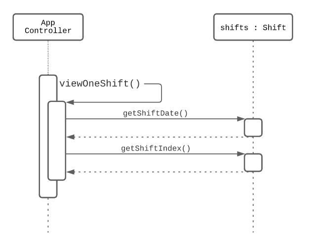

#NUS FOOD REVIEW
# User Guide
## Introduction

NUS FOOD REVIEW is a Command Line Interface (CLI) application for all NUS students especially, NUS Freshmen who come in 
lost not knowing where to eat. This application displays the menus, reviews and, ratings of all the eateries in NUS. 
Users are also able to add reviews and ratings as well.

This application has two modes. The first being the normal user mode which is for all the users and students of NUS. 
The Second mode would be the admin mode where,  the admin has special permissions and privileges where he/she can edit 
and delete the reviews, canteens, menus, and stores.

Moreover, NUSFOODREVIEW has a storage file that allows the saving and loading of data. This allows all parameters of 
the data to be stored and read whenever is needed.

#Table of Contents

## Quick Start

1. Ensure that you have Java 11 or above installed.
2. Download the latest version of `nusfoodreviews.jar` from [here](https://github.com/AY2021S2-CS2113-T10-4/tp/releases).
3. Copy the `nusfoodreviews.jar` file to an empty folder.
4. For Windows users, open up **Command Prompt**.
5. Enter java -jar nusfoodreviews.jar
   
   For Mac users, open up **Terminal**.
   
   Navigate to the directory containing the `nusfoodreviews.jar` file.
6. You can Refer to the Features Section of this User Guide to get a better understanding of the available commands and 
   their usage.

## Brief Explanation

The User Guide acts as a guide on how to run our application. It also showcases how our application works.
Moreover, It explains the correct way of inputting every command and also provides a brief summary about the commands.

Our application is quite easy to use, it is mostly viewing or adding reviews to different stores of a canteen.


## ! Very important
Password for Admin is `Password`.

## Basic Outline Instructions
1. When you first run the code, you will first see our welcome page. The red lines of code are for our logging purposes

2. You can now choose between the mode you would like to enter. Entering a 1 will take you to the Public User mode where you
   won't be able to delete reviews/delete stores/delete canteens. The Admin mode is where you can get ultimate access to
   this application where you can edit and change this application to make it well suited for the target audience.
   ### Public User Mode
   1.  You can now Select from the list of canteens. For now, it's just The Deck.
      
    2.  You will now look at all the stores and eateries present within the chosen canteen. 
   
     3. You can now Select the store you would like to go to by inputting its index.
   
     4. You can now input any command you like by typing out its keyword. You can also input 'help' to get a quick 
   glimpse of all the commands and their uses.
        
     5. You can now continue to explore our application from here by inputting different commands and instructions. 
   6. If you want to exit the application then just input 'exit' for the application to terminate.
   
   ### Admin User Mode
   1.  You will first be prompted with entering the password. The password has been mentioned on top.
   
   2. After successful verification, you will now have to enter the index of the task you would like to execute.
   
   3. You can enter the index of the command you would want to execute or if you made a mistake then you can enter
   'cancel' to go back.
      
      a.  
      b. 
   4. You can now continue to explore the other features that the admin mode has to offer.
   5. If you want to exit the application then just input the index of the 'Exit' which is 10 for the application to 
   terminate.
      
      
   
   

   
   
        
   
               
   
   
   

## Features

### Help function: `help`
Display commands that users can enter

Format: `help`

* There should be no arguments after `help`

Expected outcome:
```text
Enter 'menu' to view sample menu
Enter 'reviews' to show reviews of that particular store
Enter 'add' to add a new review
Enter 'home' to select a new canteen
Enter 'list' to select a new store
Enter 'exit' to exit the application
```

### Viewing the highlight menu of a store: `menu`
View the highlight menu items of current store that the user is viewing, along with their prices.

Format: `menu`

* There should be no arguments after `menu`

Example of usage:

`menu`

### Reading reviews of a store: `reviews`
Display reviews of the current store the user is viewing.

Format: `reviews`

* There should be no arguments after `reviews`

Example of usage:

`reviews`

### Adding reviews of a store: `add `
Adding reviews of the current store the user is viewing.

Format: `add`

* There should be no arguments after `add`

Example of usage:

`reviews`

### Select a new canteen to view: `home`
Allows the user to re-enter which canteen and store they wish to look at.
The application will prompt the user for the canteen and store by
1. Displaying a list of canteens
2. Wait for user canteen selection by index
3. Displaying a list of stores in the chosen canteen
4. Wait for user store selection by index

Format: `home`

* There should be no arguments after `home`

Example of usage:

`home`

### Select new store to view: `list`
Allows the user to re-enter which store they wish to look at in their current canteen.
The application will prompt the user for the store by
1. Displaying a list of stores in the current canteen
2. Wait for user store selection by index

Format: `list`

* There should be no arguments after `list`

Example of usage:

`list`

### Exiting the application: `exit`
Exit from the application

Format: `exit`

* There should be no arguments after `exit`

Example of usage:

`exit`

## Admin Functions: `admin`

Password for admin is "Password".

Admin has the following functions:
1. View canteens
2. Add canteen
3. Add store in canteen
4. Add Menu
5. Delete canteen
6. Delete store in canteen
7. Delete reviews
8. Delete menu
9. Exit

### View canteens: `view canteens`
This function displays all the canteens in the system.

### Add canteens: `add canteen`
This function allows admin to add a new canteen to the application.

### Add store in canteen: `add store`
This function allows admin to add a new store to the chosen canteen.

### Add menu in store: `add menu`
This function allows admin to add a new menu to the chosen store.

### Delete Canteen: `delete canteen`
This function allows admin to delete a chosen canteen.

### Delete store in canteen: `delete store`
This function allows admin to delete a store in the chosen canteen.

### Delete review: `delete review`
This function allows admin to delete a review in a chosen store.

### Delete menu: `delete menu`
This function allows admin to delete a menu in a chosen store.

## FAQ

**Q**: 

**A**: 

## Command Summary

{Give a 'cheat sheet' of commands here}

* Add review `add`
* Read reviews `reviews`
* View list of stores in canteen `list`
* Goes back to main selection `home`
* Exit from application `exit`
* View menu of store `menu`
