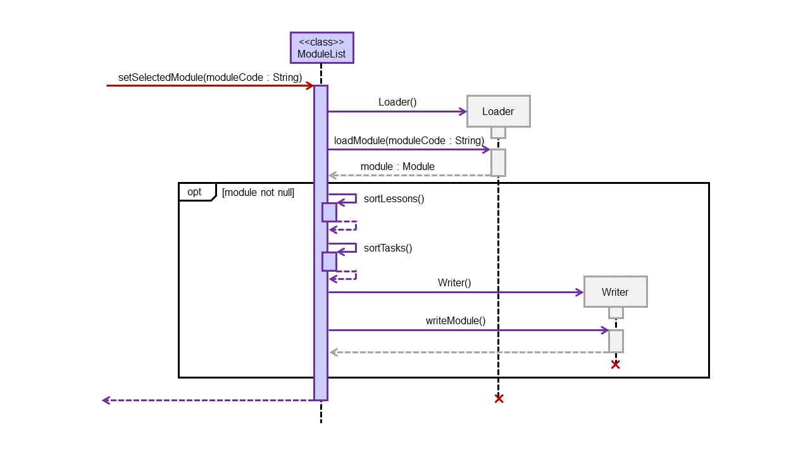

# Chong Wen Hao - Project Portfolio Page

## Overview

GULIO is a module planner designed for efficiency when used by someone that can type fast. It is capable of storing lessons and tasks for individual modules, as well as lesson notes via cheat-sheets. 

## Summary of Contributions

[Click here to view code contribution.](https://nus-cs2113-ay2021s2.github.io/tp-dashboard/?search=CS2113T-W09-3&sort=groupTitle&sortWithin=title&since=&timeframe=commit&mergegroup=&groupSelect=groupByRepos&breakdown=false&tabOpen=true&tabType=authorship&tabAuthor=8kdesign&tabRepo=AY2021S2-CS2113T-W09-3%2Ftp%5Bmaster%5D&authorshipIsMergeGroup=false&authorshipFileTypes=docs~functional-code~test-code~other)

### Enchancements Contributed:

1. Implemented storage system, excluding cheat-sheets. 
   > I implemented the Writer, Loader and ModuleList class. The storage system in our project is designed to be editable even from the outside, on top of just being readable. I even included instructions that the user can follow in the file, if they want to edit the data file in an external text editor tool. To ensure that the storage system would work reliably even as the other team members change their parts, I implemented my own code to split up and read the data.
1. Implemented shortcut listener for text editor.
   > To ensure that the text-editor is usable without a mouse, we needed a way to allow users to interact with it via the keyboard. Using KeyListener, I implemented shortcuts such as "esc" to close, "crtrl-s" to save and "ctrl-up/down" to adjust text size. The shortcuts would call methods that Hemrish created in the TextEditor class. It took some reading, but overall this part was relatively easy.
1. Cleaned up code for most components. 
   > The first time we merged our parts, there were a lot of inconsistencies and duplicates. Hence, I decided to tidy everything up. This includes shifting of constants and messages to their respective classes, removing of duplicate methods, renaming of variables for greater consistency, etc... It was time consuming, but it made the code a lot more cohesive and easier to read.
1. Displaying and sorting of undone  tasks by days remaining.
   > I added the ability to count the number of days remaining for the list "task" and "info" commands, and made use of that to sort the undone tasks in order of urgency.

### Contributions to Documentation:

1. Added many of the command information.
   > I created the draft for most of the commands in the command section (for the commands we originally had), which the team edits whenever they make some changes. As such, I am responsible for how the commands are presented. For the "Example" part of each command, I had to change all the tables' format multiple times, which took quite a bit of time.
1. Added data & storage section.
   > As the one responsible for the storage, I did the part explaining to the user  how the storage system of GULIO works and what they can do with it.
1. Converted user guide from Google Docs into Markdown.
   > The team originally worked on the user guide on a Google Docs file. I converted it to markdown before we split it up and pushed our respective portions. It was tedious, but not difficult.  
   > We decided to split it up equally (not according to lines we wrote) as we believe everyone contributed equally and across almost every part, so it would be difficult to assign each part to a member.

### Contributions to Developer Guide:

1. Created the architecture diagram, as well as sequence diagrams for storage.
   > I was assigned to do the architecture diagram for the design section. In the design section, I also did the part relating to storage. For the implementation section, I did the part on loading and storing of data, including the sequence diagrams in it.
1. Added instruction for manual testing.
   > I did the section on manual testing.
1. Converted developer guide from Google Docs into Markdown.
   > Like the user guide, we did the developer guide on Google Docs. I converted it into markdown before splitting it up with the other group members. Again, this was tedious, but a brainless task.

### Contribution to Team-Based Tasks:

1. Did the release for V1.0.
   > Together with the team, I created release V1.0 in our team repository. 
1. Fixed minor bugs for some components.
   > I helped to fix bugs in various components of the project. Examples include [fixing the formatting of data printed out by the various list commands](https://github.com/AY2021S2-CS2113T-W09-3/tp/pull/74/files), as well as [getting focus for the text editor](https://github.com/AY2021S2-CS2113T-W09-3/tp/pull/130/files).  
1. Maintained issue tracker.
   > I created some issues and added labels to them.

### Review/mentoring contributions:

1. Reviewed pull requests. 
   > Examples: 
   > 1. https://github.com/AY2021S2-CS2113T-W09-3/tp/pull/129
   > 1. https://github.com/AY2021S2-CS2113T-W09-3/tp/pull/125
   > 1. https://github.com/AY2021S2-CS2113T-W09-3/tp/pull/95
   > 1. https://github.com/AY2021S2-CS2113T-W09-3/tp/pull/92
   > 1. https://github.com/AY2021S2-CS2113T-W09-3/tp/pull/81
   > 1. https://github.com/AY2021S2-CS2113T-W09-3/tp/pull/43
1. Helped resolve some issues with cheat-sheets.
   > I gave suggestions on how to improve the text editor features (e.g. removal of text customization) and provided help to Hemrish whenever he faced difficulties regarding the text editor. (Which was how I ended up doing the shortcuts.) 

### Contributions Beyond the Team
1. Identified bugs during dry run PE. Click [here](https://github.com/8kdesign/ped/issues) to view.
1. Answered a few question on the forum.
   > Examples:
   > 1. https://github.com/nus-cs2113-AY2021S2/forum/issues/2
   > 1. https://github.com/nus-cs2113-AY2021S2/forum/issues/11

## [Optional] Contributions to User Guide

Example of parts that I wrote:

> # Data & Storage
>
> ### Automatic Saving
>
> Data for each module is stored in their respective module’s text file, located in a folder called “Data” created in the same directory as the GULIO.jar file. When moving this folder, please ensure that it is placed in the same directory as your GULIO.jar file. After every modification, changes are automatically saved to the file.
>
> ### Manual Editing Outside of GULIO
> 
> Files can be modified outside of the program. Invalid inputs will not be loaded when the program is run and will be removed from the file. To ensure that your data loads properly, please follow the format stated in the data files strictly.
> 
> #### Format for Lessons:
>
> 1. `lesson | <type> | <Day & Time>`
> 1. `lesson | <type> | <Day & Time> | <Link>`
> 1. `lesson | <type> | <Day & Time> | <Link> | <Teaching Staff Name>`
> 1. `lesson | <type> | <Day & Time> | <Link> | <Teaching Staff Name> | <Teaching Staff Email>`
> 
> > ⚠ Only accepts 3 lesson types: “lecture”, “lab” and “tutorial”.
> 
> #### Format for Tasks:
> 
> 1. `task | <description> | <deadline> | <is done> | <is graded>`
> 1. `task | <description> | <deadline> | <is done> | <is graded> | <remarks>`
> 
> > ⚠ For `<is done>` and `<is graded>`, use ‘T’ for true and ‘F’ for false.

## [Optional] Contributions to Developer Guide

Example of parts that I wrote:

> ### Loading & Storing of Data
> 
> This section covers how the _Storage_ component works, from the loading of all module codes to the loading of individual module and creation of data files.
> 
> #### Saving of Data
> 
> The `Writer` class is responsible for writing any changes to the module’s data file, as well as creating the file itself. Interaction with the `Writer` class is done through the `ModuleList` class, whose methods are called by the other components of the app.
> 
> 

>     
>    Figure 11 - writeModule() Sequence Diagram
> 

> 
> Whenever some data in a module changes, the command that made those changes would call the method `writeModule()` in `ModuleList` to update the change in the data file. This method would then call a method of the same name in the `Writer` class, which overwrites the existing data in the file with the new data.
> 
> Due to how much data needs to be written each time, we decided to split the data file by module. That way, we only need to overwrite the module's data when changes are made.
> 
> #### Loading of Data
> 
> The `Loader` class is responsible for identifying all the modules currently added, as well as loading the data file of the selected class. Methods in the `Loader` class are accessed by the other components via the `ModuleList` class.
> 
> 

>     
>    Figure 12 - loadModuleCodes() Sequence Diagram
> 

> 
> To identify modules in the “Data” directory, Duke would call `loadModuleCodes()` method in the `ModuleList`. This method would then call the `getModules()` method in `Loader`, which returns a list of module codes. For each of the identified module code, `ModuleList` would call its own `insertModule()` method to add it to the module list.
> 
> 

>     
>    Figure 13 - setSelectedModule() Sequence Diagram
> 

>
> When a module is selected via the `setSelectedModule()` method, the specified module code would be searched for in the module list. If it is inside, `loadModule()` method in the `Loader` would be called. This method reads the module’s data file for data and adds them into a new instance of `Module` class. This `Module` is then returned to `ModuleList` and set as the selected module.
>
> If the `Loader` failed to load the file, null would be returned. If null is not returned, `ModuleList` would sort the data and then use `Writer` to override the existing file. This is done to remove invalid entries that were initially in the file.
