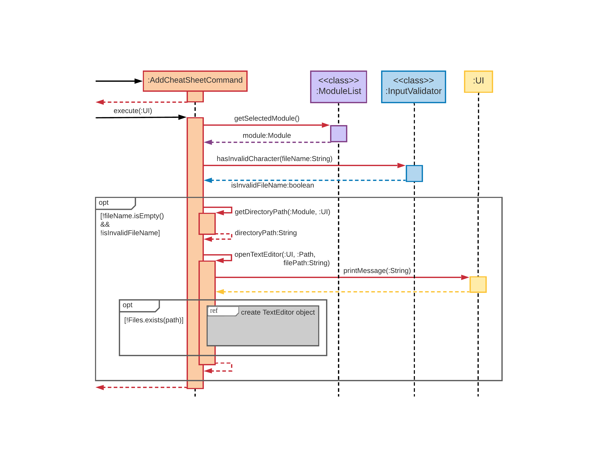
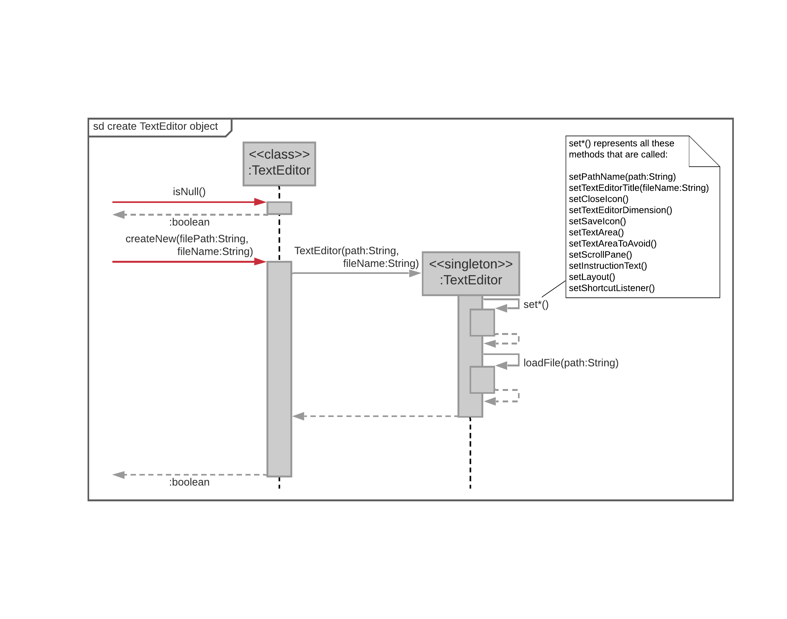
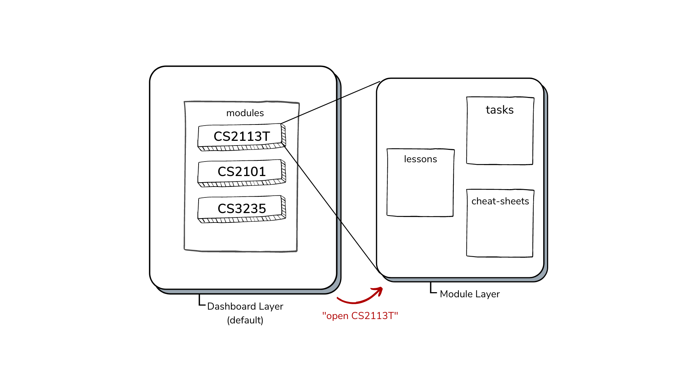

[<== Back to About Us](../AboutUs.md)

# Alicia Tay - Project Portfolio Page

## Overview

GULIO is a university module manager designed for efficiency when used by fast typists. It is capable of storing lessons and tasks for individual modules and lesson notes via cheat-sheets.

## Summary of Contributions

Click **[here](https://nus-cs2113-ay2021s2.github.io/tp-dashboard/?search=&sort=groupTitle&sortWithin=title&since=&timeframe=commit&mergegroup=&groupSelect=groupByRepos&breakdown=false&tabOpen=true&tabType=authorship&tabAuthor=aliciatay-zls&tabRepo=AY2021S2-CS2113T-W09-3%2Ftp%5Bmaster%5D&authorshipIsMergeGroup=false&authorshipFileTypes=docs~functional-code~test-code)** to view code contribution.

### Enhancements Implemented

1. Implemented and maintained the task commands.
    * `AddTaskCommand`, `DeleteTaskCommand`, `ListTasksCommand`, `MarkAsDoneCommand`, `MarkAsUndoneCommand`: I implemented these classes very differently from the iP. Mainly, I kept looking for ways to do more SLAP, application of DRY principle, SoC, and less coupling, to all the code I wrote this time around. Figuring out what constitutes as a duplicate task also took me a while.
    * `EditTaskCommand`: Invoking this command involves multiple rounds of prompting and checking input, which had to be handled carefully and displayed in a standardised way with the other commands.
1. Wrote basic JUnit tests for the 6 commands.
   * Wrote `AddTaskCommandTest` with Isa's help.
1. Implemented the `Task` class with Wen Hao and some general methods in `UI`.
1. General code cleanup.
    * Helped to standardise printing across commands.
    * Improved printing for some commands (e.g. printing task list, differentiated same lesson types when printing for `DeleteLessonCommand`).
    * Removed duplicate/similar constants across all classes.
    * Refactored code.

### Contributions to Documentation

1. Visualisation of GULIO's 2-layer system (Figure 2 in UG, Figure 1 in DG).
1. Worked with Wen Hao on the "How to Use This Guide", "Overview" sections.
1. "Editing a task : `edit task`" section.
1. General editing, proof-reading, organisation of the UG.
   * Both on Google Docs and multiple rounds in Markdown.

### Contributions to Developer Guide

1. Set up skeleton of the DG at the start.
1. "Adding of Cheat-Sheet" section.
   * 2 sequence diagrams and their write-ups.
   * Done twice due to changes in the code (bug fixes, enhancements) after V2.0/V2.1.
1. All sections under "Appendix: Requirements".
1. "Design Considerations", "UI Component" sections.
1. General editing, proof-reading of the DG.
   * Both on Google Docs and multiple rounds in Markdown.

### Contributions to Team-Based Tasks

1. Fixed and identified minor bugs in some components.
1. Maintained issue tracker.
1. Wrote the README.md.
1. Tidied up AboutUs.md, added GULIO banner for Github Pages.

### Review/Mentoring Contributions

1. Code enhancements.
   * [Suggestion to Ivan implemented, to remove loop for EditLessonCommand and EditTaskCommand. Worked together to standardise printing.](https://github.com/AY2021S2-CS2113T-W09-3/tp/pull/161)
1. Provide checks for PRs with many LOC changed.
   * [Wenhao's code cleanup.](https://github.com/AY2021S2-CS2113T-W09-3/tp/pull/47)
   * https://github.com/AY2021S2-CS2113T-W09-3/tp/pull/45
1. Gave suggestions to rename methods/classes to follow coding standards.
   * https://github.com/AY2021S2-CS2113T-W09-3/tp/pull/218
   * https://github.com/AY2021S2-CS2113T-W09-3/tp/pull/22
1. Gave feedback for teammates' class diagrams offline/in [Google Docs](https://docs.google.com/document/d/1fzG0QCIz7RxnNNVTO4eB7D0EsAKdZy7OJcZ0gHMRZ84/edit#heading=h.c6ibq4vl5nbr).

### Contributions Beyond the Project Team
1. [Suggestions for improvements in PE-D implemented by the team](https://github.com/aliciatay-zls/ped/issues)

## [Optional] Contributions to Developer Guide

Some examples:

> ### Adding of Cheat-Sheet
>
> The `AddCheatSheetCommand` class enables the creation, addition and saving of a ".txt" file to the current module’s “Cheatsheet” directory (see Figure 5). Upon creating a new instance of it and calling the `execute()` method on it, the GULIO Text Editor application will also be automatically started.
>
> An invocation of the `add cheat-sheet` command involves the following interactions:
>
> 

>      
>     Figure 10a - AddCheatSheetCommand Invocation Sequence Diagram
> 

>
> When `AddCheatSheetCommand` is executed, it gets the currently selected module by calling the `getSelectedModule()` method in `ModuleList`. It then checks if the file name given by the user is invalid. If no, `AddCheatSheetCommand` proceeds to call the `getDirectoryPath()` method in itself to obtain the directory where the cheat-sheet would be saved to. It then calls the `openTextEditor()` method itself, which will interact with the `TextEditor` class, which is a Singleton class, in the following way:
>
> 

>      
>     Figure 10b - Opening the Text Editor
> 

>
> The `openTextEditor()` method will first check if the single instance of `TextEditor` is `null`. If it is, then there is no GULIO Text Editor window currently opened and `openTextEditor()` proceeds to call the `createNew()` method of `TextEditor`. This initialises the single instance of `TextEditor` by calling the class constructor, which sets up, loads from previous data (if any) and opens the Text Editor for the user. The user can now start typing into the Text Editor.
>
> ## Appendix: Requirements
>
> ### Product Scope
>
> #### Target user profile:
>
> 1. Needs a consolidated and personalisable workspace to organize their university modules
> 1. Prefers desktop apps over other types
> 1. Can type fast
> 1. Is comfortable using CLI apps
> 1. Is familiar with command-line shell environment
>
> #### Value proposition:
>
> Efficiently view and update regularly-needed information on modules and deadlines using a single keyboard.
>
> ### User Stories
>
> > 💡 Priority levels: 
> > `1`: High (Must have) 
> > `2`: Medium (Good to have) 
> > `3`: Low (Unlikely to have)
>
> | Priority | As a/an ... | I want to ... | So that I can ... |
> | --- | --- | --- | --- |
> | 1 | new user | see available commands | refer to the help page when I forget how to use the app |
> | 1 | NUS student | add a module | store useful information by module that I can easily refer to |
> | 1 | NUS student faced with e-learning | add a lesson | consolidate regularly-needed information such as Zoom links by tutorial/lecture, for quick access before the lesson |
> | 1 | busy NUS student | add a task | keep track of assignments and deadlines for a module in an organised to-do list |
> | 1 | NUS student | get an overview of the module / lesson / task list | filter out specific information with a single command |
> | 2 | NUS student | delete a module | store the information only temporarily, e.g. for the semester/term |
> | 2 | NUS SoC student | open a module’s cheat sheet(s) | I have a handy list of tools for the module, tests and exams at my disposal |
> | 2 | NUS SoC student with many team projects | View a module’s project team information and contact details | keep track of the various teams I am in and communicate more efficiently with my teammates |
> | 3 | busy NUS student | sort tasks by graded and done status | know which tasks are of highest priority |
>
> _Note: some are features to be implemented in future._
>
> ### Non-Functional Requirements
>
> 1. Text editor will only work on OS with GUI support.
> 1. All other features will work on any mainstream OS.
> 1. It should work for students taking up to 10 modules.
> 1. Each module should be able to store 100 tasks without issues.
> 1. Every command should respond within 10s of input on a typical modern computer.
>
> ### Glossary
>
> * Mainstream OS: Windows, Linux, Unix, OS-X
> * CLI: Command-Line Interface
> * GUI: Graphical User Interface
> * Module: A university module

## [Optional] Contributions to User Guide

Some examples:
>
> 

>      
>     Figure 2 - Visualisation of GULIO’s 2-layer system
> 

>
> &nbsp;
>
> > ⚠ Only accepts 3 lesson types: `Lecture`, `Lab` and `Tutorial`. Lesson type is auto-capitalised when displayed, hence input for the field is not case-sensitive.
>
> > 💡 To skip an input, leave a blank in between the field separators. For example,
> >
> > `add lsn tutorial ;; ;; ;; Prof Akshay ;; akshay@email.com`
> >
> > will add “Tutorial” to the module's list of lessons with only the given teaching staff name and email. The fields “day & time” and “link” were skipped.
> >
> > Note: “lesson type” cannot be skipped.
