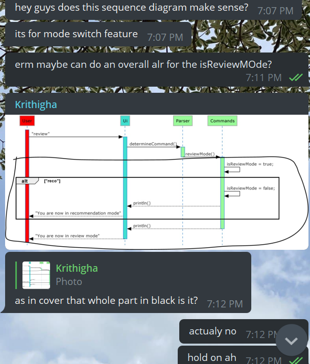

# Emily Tock Jiaxin - Project Portfolio Page

## Overview of Project: Connoiseur

Connoisseur is a desktop application for managing and storing personal reviews on experiences and recommendations to try
next, that you would like to keep. It is a revolutionary app that not only provides an organised user-friendly database,
but provides customisable categories to enhance your experience. Through its intuitive command line interface, you will
be able to store and access your reviews & recommendation easily.

## Summary of Contributions

Given below is a brief summary of my contributions to the project, including coding, documentation and other
contributions throughout the development of Connoisseur.

### Code contributed:

The code contributed by me can be found in
this [link](https://nus-cs2113-ay2021s2.github.io/tp-dashboard/?search=&sort=groupTitle&sortWithin=title&since=&timeframe=commit&mergegroup=&groupSelect=groupByRepos&breakdown=false&tabOpen=true&tabType=authorship&tabAuthor=EmilyTJX&tabRepo=AY2021S2-CS2113T-F08-3%2Ftp%5Bmaster%5D&authorshipIsMergeGroup=false&authorshipFileTypes=docs~functional-code~test-code~other)

### Enhancements implemented:

* Add test code for `CommandsTest`, `deleteReview`.
* Used regex to parse parameters input by user
* Customised UI messages to fit respective functions.
* Re-organised code in commands.
* Implemented main bulk of RecommendationsList and Recommendations.
* Implemented inital stages of Storage Class.

### Contributions to documentation

* User Guide
    * Transferred first draft from Google Docs to MD.
    * Ensure that links in the documentation is working.
    * Ensure that Figures are in running order and labelled correctly.
    * Ensure flow of sections to fit users.
    * Documented the Command-Summary.
    * Edited the UG to fit formatting for functions and labelling standards.

* Developer Guide
    * Created first draft and provided a template for the team to follow.
    * Created first draft of Architecture Diagrams and UMLs
    * Transferred first draft from Google Docs to MD.
    * Ensure that links in the documentation is working
    * Add in user stories from previous drafts.
    * Documented implementation for `Recommendation` Features
    * Edited the DG to fit formatting for functions and labelling standards.

### Contributions to team-based tasks :

* Reviewed teammates PRs, approved and merged PRs:
  [PR#67](https://github.com/AY2021S2-CS2113T-F08-3/tp/pull/67),
  [PR#68](https://github.com/AY2021S2-CS2113T-F08-3/tp/pull/68),
  [PR#69](https://github.com/AY2021S2-CS2113T-F08-3/tp/pull/69),
  [PR#77](https://github.com/AY2021S2-CS2113T-F08-3/tp/pull/77),
  [PR#83](https://github.com/AY2021S2-CS2113T-F08-3/tp/pull/83),
  [PR#121](https://github.com/AY2021S2-CS2113T-F08-3/tp/pull/121),
  [PR#123](https://github.com/AY2021S2-CS2113T-F08-3/tp/pull/123),
  [PR#125](https://github.com/AY2021S2-CS2113T-F08-3/tp/pull/125)
  *Update milestones and issue tracker

* Other instance of helping was done through Telegram Group Chat, to clarify conflicts in ideation and how we want
  functions of Connoisseur run.
  
  Example of Telegram Chats of helping each other.

* Took notes during team meetings and consults with TAs or Profs, to keep track of tasks to be done.

### Contributions beyond the project team:

* Reported several bugs to the team which was assigned to me during the dry run Practical Exam. Can be
  found [here](https://github.com/EmilyTJX/ped/tree/main/files).
* Gave feedback to documentations of other teams.