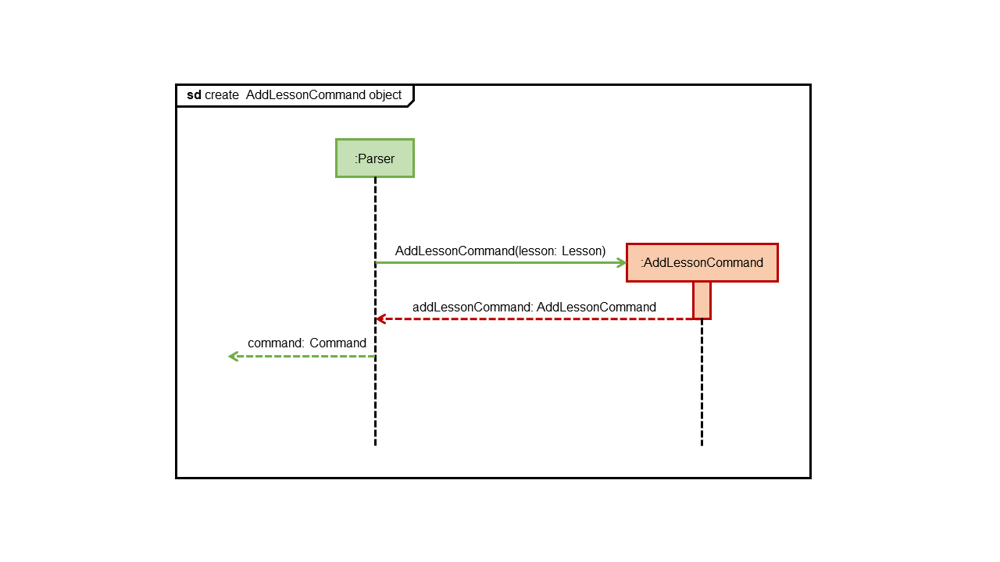
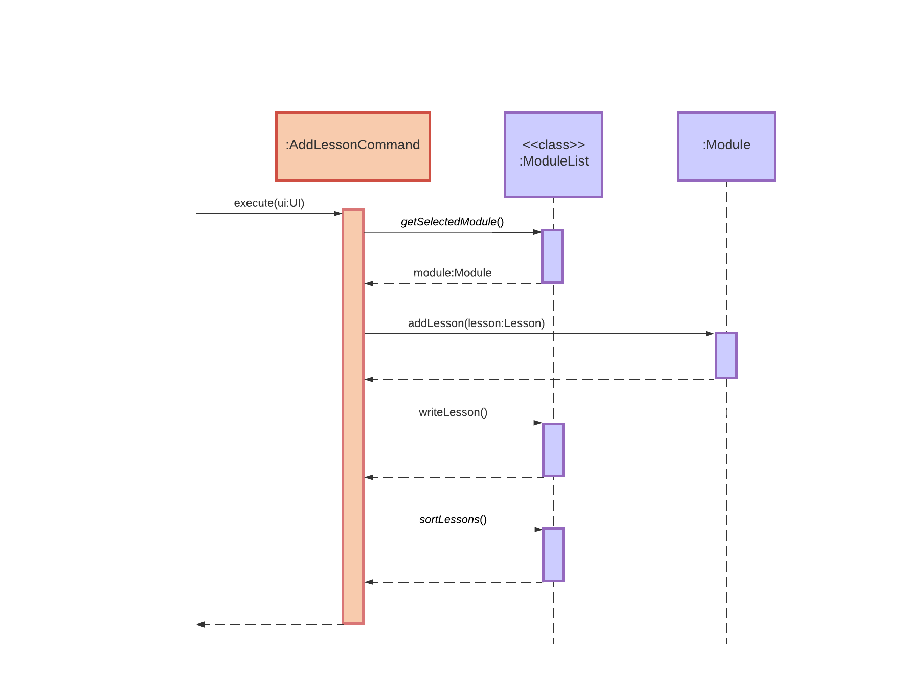

[<== Back to About Us](../AboutUs.md)

# Hemrish Bundhoo - Project Portfolio Page

## Overview

GULIO is a module planner designed for efficiency when used by someone that can type fast. It is capable of storing lessons and tasks for individual modules, as well as lesson notes via cheat-sheets.

## Summary of Contributions

[Click here to view code contribution.](https://nus-cs2113-ay2021s2.github.io/tp-dashboard/?search=CS2113T-W09-3&sort=groupTitle&sortWithin=title&since=&timeframe=commit&mergegroup=&groupSelect=groupByRepos&breakdown=false&tabOpen=true&tabType=authorship&tabAuthor=H-horizon&tabRepo=AY2021S2-CS2113T-W09-3%2Ftp%5Bmaster%5D&authorshipIsMergeGroup=false&authorshipFileTypes=docs~functional-code~test-code)

### Enchancements Contributed:

1. Implemented commands involved in manipulating Lesson objects, excluding edit lesson. 
   > I implemented AddLessonCommand, DeleteLessonCommand and ListLessonsCommand to add, remove and view lesson objects.
1. Implemented OpenLessonListCommand.
   > I implemented this class that allows the user to open the link, inputted when creating a lesson, in a web browser. The issue I had to resolve was that the default command to open a link in a browser was platform dependent. 
1. Implemented ViewTeachingStaffCommand
   > I implemented the command needed to view the tutor's name and email address for a particular lesson.
1. Implemented ModuleInfoCommand
   > I implemented this command to print a summary about a module. The overview consists mainly of the lessons and tasks for that particular module.   
1. Implemented commands involved in manipulating Cheat-sheet files. 
   > I implemented AddCheatSheetCommand, DeleteCheatSheetCommand, EditCheatSheetCommand and ListCheatSheetCommand to add, remove, edit and view Cheat-sheet files of a particular module.
1. Implemented TextEditor.
   > I implemented the TextEditor class to allow the user to input and edit cheat-sheets. The initial version of text editor had a colour button, a font style dropbox, a font size input box and a save icon. For version 2.0, we decided remove the colour option after experiencing some undefined behaviours when editCheatSheetCommand was called. WenHao then implemented some shortcuts functionality to allow the user to continuously use the keyword. We then scraped-off the font size input box as it was no longer required. For version 2.1, we decided to remove the font style as we didn't deem it a necessary feature. A problem I faced when implementing the editor was that if the editor was used multiple times for one Gulio Session, it didn't flush data from previous files after they were closed. I then had to append the text area to null each time the text editor was invoked.
### Contributions to Documentation:

1. Documented Lesson and Cheat-sheet commands
   > For each command I implemented, I added a brief description, the command format, a sample input and the expected output.
1. Added text editor section.
   > As the one responsible for the text editor, I did the part explaining to the user how GULIO's text editor works and what he/she can do with it. WenHao added the information about the shortcuts available.
### Contributions to Developer Guide:
1. Text Editor component in Design section.
   >I wrote the description for the text editor component under Design in the DG as I was the one who implemented it in our codebase.
1.  Class diagram for the Model component in Design section.
   > I collaborated with Ivan to help him draw the class diagram for the Model component.
1. Add lesson command class in Implementation section.
   > I worked with Ivan on describing the implementation of the add lesson command under the Implementation section.
   > I drew two of the sequence diagrams for this implementation.
   
### Contribution to Team-Based Tasks:

1. Fixed minor bugs for some components.
   > Fixed minor bugs in our codebase.
1. Maintained issue tracker.
   > Maintained issue tracker by adding issues found during discussion with the appropriate labels.

### Review/mentoring contributions:
1. Full list of PRs approved or commented on by me can be found [here](https://github.com/AY2021S2-CS2113T-W09-3/tp/pulls?q=is%3Apr+reviewed-by%3AH-horizon+is%3Aclosed+).

1. Example of reviews where I communicated with teammates on Github:
    1. [Communication with Wen Hao regarding my PR](https://github.com/AY2021S2-CS2113T-W09-3/tp/pull/129)
    1. [Recommend some test cases to Ivan to test his implementation](https://github.com/AY2021S2-CS2113T-W09-3/tp/pull/92)
    1. [Review on Wen Hao's PR to use singleton class](https://github.com/AY2021S2-CS2113T-W09-3/tp/pull/123)

### Contributions Beyond the Team
1. [Sharing useful information in the forum](https://github.com/nus-cs2113-AY2021S2/forum/issues/26#issuecomment-770166991)
1. [Bugs reported in other team's products during dry-run](https://github.com/H-horizon/ped)

### Contributions to the Developer Guide (Extracts)

Extract of contributions:

### Editor component

**API**: `TextEditor.java`

The _Editor_ component is responsible for opening the text editor to add or edit cheat-sheets/notes. It consists of two classes:

#### Text Editor

* Sets up the text editor
* Loads existing file from Cheatsheet directory within a module for the edit cheat-sheet command
* Flushes out the text from the editor when a different or new file is opened.
* Adjusts the font size of the text within the editor
* Detects mouse input to change font style and save the text
* Saves the text from the text editor into a file

#### ShortcutListener

* Detects keyboard input for shortcuts

&nbsp;

     
    Figure 8 - AddLessonCommand Constructor Sequence Diagram

The newly created `Lesson` object is then passed to a new `AddLessonCommand` object as an argument.

     
    Figure 9 - execute() AddLessonCommand Sequence Diagram

`AddLessonCommand` then adds the `Lesson` object to the lesson list of a module. The lessons in the list are sorted by their lesson types each time a new lesson is added. `AddLessonCommand` also calls the `writeLesson()` method of `ModuleList` to update the change locally.

&nbsp;

## Contributions to the User Guide (Extracts)
Extract of contributions:

### Showing module information : _info_

Displays a summary of lessons and undone tasks for the module.

**Format:** 
`info`

**Example:**

| Step | When You Enter This: | You Get This: |
| --- | --- | --- |
| 1 | info | \<Overview for CS2113T> Lecture - Friday 4pm - 6pm Tutorial - Wednesday 9am - 10am  Undone tasks: 1. iP increments - 22 Feb 2021 (Overdue by 32 days) |

**Result** - Prints overview of module, including lesson and undone tasks.

### Adding a lesson : _add lsn_

Adds a new lesson with specified lesson type and information to the current module.

**Format:** 
`add lsn <lesson type>` 
`add lsn <lesson type> ;; <day & time>` 
`add lsn <lesson type> ;; <day & time> ;; <link>` 
`add lsn <lesson type> ;; <day & time> ;; <link> ;; <teaching staff name>` 
`add lsn <lesson type> ;; <day & time> ;; <link> ;; <teaching staff name> ;; <email>`

**Example:**

| Step | When You Enter This: | You Get This: |
| --- | --- | --- |
| 1 | add lsn tutorial ;; Wednesday 9 am - 10am ;; https://nus-sg.zoom.us/j/abc | Added tutorial to lesson list. |

**Result** - Adds “tutorial” to the module's list of lessons, with specified details.

> ⚠ Only accepts 3 lesson types: “lecture”, “lab” and “tutorial”.

> 💡 To skip an input, leave a blank in between the field separators. For example,
>
> `add lesson tutorial ;; ;; ;; Prof Akshay ;; akshay@email.com`
>
> will add “tutorial” to the module's list of lessons with only the given teaching staff name and email. The fields “day & time” and “link” were skipped.
>
> Note: “lesson type” cannot be skipped.

### Deleting a lesson : _del lsn_

Lists all lessons for the module and asks the user for indices of lessons to delete. Then, deletes lessons corresponding to the indices specified.

**Format:** 
`del lsn`

**Example:**

| Step | When You Enter This: | You Get This: |
| --- | --- | --- |
| 1 | del lsn |  Which lessons would you like to delete? 1. lecture 2. tutorial  Please enter the indices of the lessons you would like to delete. Separate indices with a blank space. |
| 2 | 1 2 | Removed lecture. Removed tutorial. |

**Result** - The lessons “lecture” and “tutorial” are removed from the list of lessons.

> 💡 Separate indices with a space. Invalid indices will be ignored.

### Opening lesson link : _link_

Lists all lessons in the module and asks the user for the indices of lesson links to open.
Then, opens the links of the lessons specified.

**Format:** 
`link`

**Example:**

| Step | When You Enter This: | You Get This: |
| --- | --- | --- |
| 1 | link | Which lesson’s link would you like to open? 1. lecture 2. tutorial |
| 2 | 1 | Opening lecture link in browser. |

**Result** - Opens the Zoom link used for lectures in a browser.

> 💡 Multiple links can be opened at once. As such, separate indices with a space. Invalid indices will be ignored.

### Listing all teaching staff : _tch_

Lists all teaching staff for the module.

**Format:** 
`tch`

**Example:**

| Step | When You Enter This: | You Get This: |
| --- | --- | --- |
| 1 | tch | Teaching staff for CS2113T: 1. Prof Akshay - profakshay@email.com 2. Cheng Xianhao - cxh@email.com |

### Listing all lessons : _lsn_

Lists all lessons for the module.

**Format:** 
`lsn`

**Example:**

| Step | When You Enter This: | You Get This: |
| --- | --- | --- |
| 1 | lsn | Lessons for CS2113T: 1. lecture - Friday 4pm - 6pm &nbsp;&nbsp;&nbsp;&nbsp;https://nus-sg.zoom.us/j/def  &nbsp;&nbsp;&nbsp;&nbsp;Prof Akshay &nbsp;&nbsp;&nbsp;&nbsp;profakshay@email.com 2. tutorial - Wednesday 9am - 10am &nbsp;&nbsp;&nbsp;&nbsp;https://nus-sg.zoom.us/j/abc  &nbsp;&nbsp;&nbsp;&nbsp;meeting - Wednesday 2pm - 4pm |

### Adding a cheat-sheet : _add cs_

Adds a new cheat-sheet with specified name to the module.

**Format:** 
`add cs <cheat-sheet name>`

**Example:**

| Step | When You Enter This: | You Get This: |
| --- | --- | --- |
| 1 | add cs lecture notes | lecture notes has been added to your Cheatsheet folder. |

**Result** - Adds new cheat-sheet “lecture notes” and opens it in the text editor.

> ⚠ Please do not include any file extension in the cheat-sheet name.

### Deleting a cheat-sheet : _del cs_

Deletes the specified cheat-sheet from the module.

**Format:** 
`del cs <cheat-sheet name>`

**Example:**

| Step | When You Enter This: | You Get This: |
| --- | --- | --- |
| 1 | del cs lecture notes | lecture notes has been deleted! |

**Result** - Deletes cheat-sheet “lecture notes”.

> ⚠ Please do not include any file extension in the cheat-sheet name.

### Editing a cheat-sheet : _edit cs_

Opens the specified cheat-sheet in the text editor.

**Format:** 
`edit cs <cheat-sheet name>`

**Example:**

| Step | When You Enter This: | You Get This: |
| --- | --- | --- |
| 1 | edit cs lecture notes | Opened lecture notes. |

**Result** - Opens cheat-sheet “lecture notes” in text editor.

> ⚠ Please do not include any file extension in the cheat-sheet name.

<!--@@author H-horizon-->

### Listing all cheat-sheets : _cs_

Lists all cheat-sheets for the module.

**Format:** 
`cs`

**Example:**

| Step | When You Enter This: | You Get This: |
| --- | --- | --- |
| 1 | cs | Here is your list of cheat-sheets:  1. lecture notes |

&nbsp;

# Text Editor

GULIO comes with a built-in text-editor that allows you to edit cheat sheets directly. This text editor can be accessed via the add and edit cheat sheet commands. Cheat-sheets are stored in the “Cheatsheet” directory within their respective module directories as “.txt” files.

In the text editor, you can type in your notes in the text field. When done, remember to save any changes via the “ctrl-s” shortcut. To close the text editor, simply press the escape key on your keyboard. Using “ctrl-up” and “ctrl-down”, you can enlarge or shrink text respectively.

