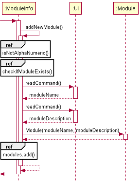

# Ravikumar Nikhila - Project Portfolio Page

## Overview
UniTracker is a one-stop university tracker designed and created to help NUS students keep track of all the resources needed for their modules.
It also includes helpful features such as a CAP simulator and a task manager. The user can interact with it using a Command Line Interface (CLI).
UniTracker was created with Java, and has about 7 kLOC.  

## Summary of Contributions

### Code contributed
For the RepoSense report of my tP Code Dashboard - [Click Here](https://nus-cs2113-ay2021s2.github.io/tp-dashboard/?search=AY2021S2-CS2113T-F08-4%2Ftp%5Bmaster%5D&sort=groupTitle&sortWithin=title&timeframe=commit&mergegroup=&groupSelect=groupByRepos&breakdown=true&checkedFileTypes=docs~functional-code~test-code~other&since=2021-03-05&tabOpen=true&tabType=authorship&zFR=false&tabAuthor=nivikcivik&tabRepo=AY2021S2-CS2113T-F08-4%2Ftp%5Bmaster%5D&authorshipIsMergeGroup=false&authorshipFileTypes=docs~functional-code~test-code)
  
### Enhancements implemented  

For our product, I have implemented the following:
1. **Main Menu**: skeleton code for others to integrate their features in
1. **`ModuleInfo` Menu**: skeleton code
1. **`Storage` methods for `ModuleInfo`**:
    1. `loadAllFiles()` method: Loads all Files
    1. `saveAllFiles()` method: Saves all Files
    1. `loadModuleInfoFile()` method: Loads `ModuleInfo` files (if existing) from computer **OR** Creates new `ModuleInfo` files 
    1. `downloadModules()` method: Loads all `ModuleInfo` files (if existing)
    1. `modulesFileSaver()` method: Stores all `ModuleInfo` data into files
1. **Features implemented under `ModuleInfo` Menu**:
    1. `addNewModule()` method: Adds new Module
         1. `checkIfModuleExists()` method: Checks if module to be added already exists
         1. `isAlphaNumeric()` and `moduleNameIsAlphaNumeric()` methods: checks if module name is alphanumeric
    1. `viewAModule()` method (except `printModuleTaskList()` method)
    1. `viewAllModules()` method: Prints the list of Modules from `modules` ArrayList
    1.  `checkAndRemoveDelimiter()`: Removes the " ~~ " restricted character.
    1. `deleteModule()` method: Deletes a module
         1. `testDeleteModule()`, 
         1. `readModuleNumberToBeDeleted()`
         1. `printDeletedModuleMessage()` 
    1. `addReview()` method: Adds a review to a module
         1. `printAlreadyAddedReviewMessage()`, 
         1. `readReview()` 
         1. `printReviewAddedMessage()`
    1. `viewAllReviews()` method: Prints all reviews for all modules
    1. `deleteReview()` method: Deletes a review of a selected module
         1. `printDeletedReviewMessage()`

### Contributions to User Guide

For the user guide, I have included instructions on how to use the features I have implemented.  
Here are my implementations and the links to the following sections of our User Guide:
1. [Add a Module](https://ay2021s2-cs2113t-f08-4.github.io/tp/UserGuide.html#311-add-a-module)
1. [View a Module](https://ay2021s2-cs2113t-f08-4.github.io/tp/UserGuide.html#312-view-a-module)
1. [View All Modules](https://ay2021s2-cs2113t-f08-4.github.io/tp/UserGuide.html#313-view-all-modules)
1. [Delete a Module](https://ay2021s2-cs2113t-f08-4.github.io/tp/UserGuide.html#314-delete-a-module)
1. [Add a Review](https://ay2021s2-cs2113t-f08-4.github.io/tp/UserGuide.html#318-add-a-review)
1. [View All Reviews](https://ay2021s2-cs2113t-f08-4.github.io/tp/UserGuide.html#319-view-all-reviews)
1. [Delete a Review](https://ay2021s2-cs2113t-f08-4.github.io/tp/UserGuide.html#3110-delete-a-review)
1. To improve navigability: I included hyperlinks to content page and command summary for all sections.
1. Vetting of user guide in general (Links of PRs given below in [Contribution to team-based tasks](#contributions-to-team-based-tasks))

### Contributions to Developer Guide

For the developer guide, I have included instructions on how I implemented the features I was assigned.  
Here are my implementations and the links to the following sections of our Developer Guide:  
1. [Add a Module](https://ay2021s2-cs2113t-f08-4.github.io/tp/DeveloperGuide.html#401-add-new-module)
1. [View a Module](https://ay2021s2-cs2113t-f08-4.github.io/tp/DeveloperGuide.html#402-view-a-module)
1. [View All Modules](https://ay2021s2-cs2113t-f08-4.github.io/tp/DeveloperGuide.html#403-view-all-modules)
1. [Delete a Module](https://ay2021s2-cs2113t-f08-4.github.io/tp/DeveloperGuide.html#404-delete-a-module)
1. [Add a Review](https://ay2021s2-cs2113t-f08-4.github.io/tp/DeveloperGuide.html#407-add-new-review)
1. [View All Reviews](https://ay2021s2-cs2113t-f08-4.github.io/tp/DeveloperGuide.html#408-view-all-reviews)
1. [Delete a Review](https://ay2021s2-cs2113t-f08-4.github.io/tp/DeveloperGuide.html#409-delete-a-review)
1. [Instructions for manual testing](https://ay2021s2-cs2113t-f08-4.github.io/tp/DeveloperGuide.html#9-instructions-for-manual-testing)

The following are the diagrams I have added:  

  
*Figure 1* Add New Module (Click [here](https://ay2021s2-cs2113t-f08-4.github.io/tp/DeveloperGuide.html#401-add-new-module) for link to this section of DG)  

  
*Figure 2* Add New Review (Click [here](https://ay2021s2-cs2113t-f08-4.github.io/tp/DeveloperGuide.html#405-add-new-review) for link to this section of DG)  

### Contributions to team-based tasks

For the team-based tasks, the following were the tasks I have carried out:
1. Created and Updated the agenda for each week, and the schedule for the project with key deadlines in our shared document (Google Docs reference: Click [here](https://docs.google.com/document/d/1OS9hzySKeTXJS7QB2QJ9jiAo_eLP2mwfdxYvAhlCgbg/edit?usp=sharing) to view)
1. Maintained the issue tracker: Assigning and resolving issues regularly
1. Updated user/developer guides that are not specific to a feature: General proof-reading, updating table of contents, etc.  
    1. PRs: [#77](https://github.com/AY2021S2-CS2113T-F08-4/tp/pull/77) ,[#163](https://github.com/AY2021S2-CS2113T-F08-4/tp/pull/163), [#179](https://github.com/AY2021S2-CS2113T-F08-4/tp/pull/179), [#197](https://github.com/AY2021S2-CS2113T-F08-4/tp/pull/197), [#208](https://github.com/AY2021S2-CS2113T-F08-4/tp/pull/208), [#323](https://github.com/AY2021S2-CS2113T-F08-4/tp/pull/323)

### Review/mentoring contributions

1. Reviewed another team's Developer Guide: click [here](https://github.com/nus-cs2113-AY2021S2/tp/pull/30) for link
1. Reported bugs for another team's product and user guide: click [here](https://github.com/AY2021S2-CS2113-F10-1/tp/releases) for product release and [here](https://ay2021s2-cs2113-f10-1.github.io/tp/UserGuide.html) for user guide.  
